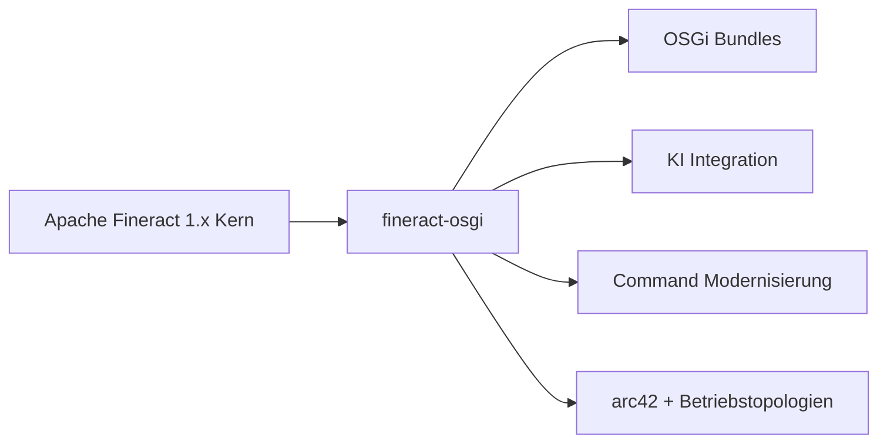

# 1. Introduction and Goals

Dieses Kapitel führt in die Architekturdokumentation von **fineract-osgi** ein: Anlass, Ziele, Stakeholder und wie die übrigen arc42-Kapitel zu lesen sind.

---

## 1.1 Anlass und Kurzbeschreibung

**fineract-osgi** ist ein modularer Arbeitsstrang/Fork auf Basis von **Apache Fineract 1.x** – einer headless Core-Banking-Plattform für inklusive Finanzdienstleistungen (Microfinance, SACCOs, Credit Unions, kleine Banken).

Gegenüber dem klassischen Fineract-Monolithen setzt fineract-osgi zwei strategische Akzente:

1. **OSGi-Laufzeitmodularität** (Eclipse Equinox) – Features als Bundles dynamisch laden und optional halten  
2. **KI-gestützte Erweiterbarkeit** – externe Inferenz (Referenz: xAI Grok API) statt ML im Kern  

Der fachliche Kern (Loans, Savings, Accounting, Clients, COB, Multi-Tenancy, CQRS) bleibt erhalten und wird schrittweise modernisiert (u. a. `fineract-command`).

---

## 1.2 Zweck dieser Dokumentation

| Zweck | Beschreibung |
|-------|--------------|
| **Orientierung** | Gemeinsames Bild für Entwicklung, Architektur und Betrieb |
| **Entscheidungen festhalten** | ADRs und Trade-offs nachvollziehbar machen → [08](08_design_decisions.md) |
| **Qualität steuern** | Szenarien und SLOs als Maßstab → [07](07_quality_attributes.md) |
| **Onboarding** | Schneller Einstieg in Module, Runtime und Deployment |
| **Agenten / Reviews** | Repo-lokale, versionierte Architekturquelle (vgl. `AGENTS.md`) |

**Nicht-Zweck**: Ersatz für OpenAPI-Spezifikation, Betriebs-Runbooks einzelner Kunden oder UI-Handbücher.

---

## 1.3 Architekturziele (Top-Level)

Abgeleitet aus den Qualitätszielen in [Kapitel 7](07_quality_attributes.md):

| # | Ziel | Messbarer Fokus |
|---|------|-----------------|
| 1 | **Korrekte Buchungen** | Keine stillen Doppelwrites; Audit & Idempotenz |
| 2 | **Sichere Mandantentrennung** | Tenant-Isolation, AuthN/Z |
| 3 | **Betriebssicherer COB** | Partitionierte Jobs, Recovery |
| 4 | **Erweiterbar ohne Core-Fork** | OSGi-Bundles, Events, KI-Provider |
| 5 | **Wartbare Modernisierung** | Parallele Command-Stacks, Hexagon + DDD + Clean Code; Event-sourced Writes (Ziel) |
| 6 | **Skalierbare Topologien** | Read/Write/Batch-Modes, Container/K8s |
| 7 | **Stabile Integrationen** | Headless REST, Rückwärtskompatibilität |

---

## 1.4 Stakeholder

| Stakeholder | Interesse | Erwartet von der Architektur |
|-------------|-----------|------------------------------|
| **Entwicklungs-Teams** | Features, Refactoring, Tests | Klare Modulgrenzen, Command-Migration, OSGi-Verträge |
| **Architektur / PMC-artig** | langfristige Richtung | ADRs, Qualitätsziele, Scope |
| **Betreiber / DevOps** | Deploy, HA, Observability | Modes, Compose/K8s, Ports, Secrets → [05](05_deployment_view.md) |
| **Integratoren / BaaS** | stabile API | OpenAPI, Idempotenz, Events |
| **Fachseite (MFI/SACCO)** | Kredit-/Sparprozesse | Zuverlässige Domain, COB, optional Scoring |
| **Security** | Threat Model, Isolation | Filter, Permissions, kein Public Console → [`SECURITY.md`](../../SECURITY.md) |
| **Compliance / Audit** | Nachvollziehbarkeit | Command Audit, Maker-Checker |
| **KI-/Data-Teams** | Modelle ohne Core-Kopplung | Bundle + externe API, Datenminimierung |

---

## 1.5 Qualitätsziele (Priorisierte Kurzfassung)

| Prio | Qualität | Ein-Satz-Ziel |
|:----:|----------|---------------|
| 1 | Korrektheit & Integrität | Salden und Commands stimmen, Retries sind sicher |
| 2 | Security & Isolation | Nur autorisierte, tenant-korrekte Zugriffe |
| 3 | Reliability | API und COB überleben Teilausfälle |
| 4 | Scalability | Last über Nodes/Worker/Tenants wächst |
| 5 | Maintainability | Änderungen lokal und reviewbar |
| 6 | Extensibility | KI/Regeln als Bundle, nicht als Fork |
| 7 | Performance | Write-Latenz und COB-Fenster planbar |
| 8 | Operability | Messbar, deploybar, diagnoseierbar |
| 9 | Compatibility | Clients brechen nicht bei interner Modernisierung |

Details und Szenarien: [07 Quality Attributes](07_quality_attributes.md).

---

## 1.6 Randbedingungen

### Organisatorisch

- Weiterentwicklung auf Basis des Fineract-Ökosystems (Java, Gradle, Spring).  
- Dokumentation und Code im **selben Repository** (`docs/arc42/`).  
- Upstream-Drift muss bewusst gemanagt werden ([ADR-001](decisions/ADR-001-fork-fineract-osgi-statt-pure-upstream.md)).

### Technisch

| Randbedingung | Implikation |
|---------------|-------------|
| JVM / Spring Boot | Kein Greenfield-Rewrite |
| Multi-Tenancy | Context und DB-Routing Pflicht |
| CQRS Writes | Zentrale Command-Pipeline |
| Headless | Keine First-Class-UI im Scope |
| DB relational | Double-Entry / JDBC; PostgreSQL first |
| Container-fähig | 12-Factor-nahe Config über Env |

### Konventionen

- Englische Code- und API-Bezeichner; Doku gemischt DE/EN wie in diesem Satz.  
- Mermaid-Diagramme in Markdown.  
- Begriffe: [09 Glossary](09_glossary.md).

---

## 1.7 Aufbau der Dokumentation

| Kap. | Inhalt | Frage |
|------|--------|-------|
| [01](01_introduction.md) | Ziele, Stakeholder | *Warum und für wen?* |
| [02](02_context_and_scope.md) | Kontext, Schnittstellen, Scope | *Womit kommuniziert das System?* |
| [03](03_building_block_view.md) | Statische Zerlegung | *Aus welchen Bausteinen?* |
| [04](04_runtime_view.md) | Dynamik | *Wie laufen Szenarien ab?* |
| [05](05_deployment_view.md) | Betrieb | *Wo läuft es?* |
| [06](06_crosscutting_concepts.md) | Querschnitt | *Welche wiederkehrenden Lösungen?* |
| [07](07_quality_attributes.md) | NFRs | *Wie gut muss es sein?* |
| [08](08_design_decisions.md) | ADRs | *Warum so und nicht anders?* |
| [09](09_glossary.md) | Begriffe | *Was bedeutet X?* |
| [10](10_domain_context_map.md) | Domain Context Map (DDD) | *Welche Bounded Contexts und U/D-Beziehungen?* |
| [11](11_aggregate_canvas.md) | Aggregate Canvas | *Welche Invarianten, Commands und Events pro Root?* |
| [12](12_event_catalog.md) | Event-Katalog | *Welche Business Events gibt es und wie mappen sie auf ES?* |
| [13](13_archunit_bounded_context_rules.md) | ArchUnit BC Rules | *Welche Domain-Abhängigkeiten sind verboten?* |

Ergänzend im Repo:

- [`docs/gherkin/`](../gherkin/README.md) – verhaltensnahe Anforderungen (BDD), an Kapitel/ADRs/Quality-IDs getaggt  
- `SECURITY.md` – Threat Model  
- `fineract-command/README.md` – Command-Modernisierung im Detail  
- `osgi/` – Equinox-Scaffold  

### Verwandte Gherkin-Features

Einstieg und Mapping: [gherkin/README.md](../gherkin/README.md). Domain-Beispiele: [client_create](../gherkin/features/client/client_create.feature), [loan_creation](../gherkin/features/loan/loan_creation.feature).  

---

## 1.8 Lesepfade

| Rolle | Empfohlene Reihenfolge |
|-------|------------------------|
| **Neu im Projekt** | 01 → 02 → 03 → 09 → 04 |
| **Domain / DDD** | 10 → 11 → 12 → 13 → 08 ADR-019/020 → 03 → 06.15 |
| **Backend-Dev Feature** | 03 → 04 → 06 → 08 (ADR-004) → 10 (Context) |
| **OSGi / KI Extension** | 03 → 04.3/4.4/4.7 → 06.7/6.8 → 08 ADR-002/005/006 |
| **DevOps** | 05 → 06.9–6.11 → 07.5–7.7/7.11 → 09 Ports/Env |
| **Security Review** | 02 → 06.2–6.3 → 07.4 → 08 ADR-013 → `SECURITY.md` |
| **Architektur-Entscheidung** | 07 → 08 → betroffene Runtime/Deployment-Abschnitte |

---

## 1.9 Abgrenzung zu Apache Fineract Upstream

| Aspekt | Upstream Fineract | fineract-osgi |
|--------|-------------------|---------------|
| Fachkern | Loans, Savings, … | übernommen |
| Build-Module | Gradle multi-module | übernommen + OSGi-Pfade |
| Laufzeit-Plugins | begrenzt | **OSGi Bundles** als Ziel |
| KI | nicht strategisch im Core | **externe KI** über Bundle |
| Doku-Fokus | diverse Guides | **arc42** unter `docs/arc42/` |
| DB-Empfehlung Doku | multi | **PostgreSQL first** (ADR-009) |

fineract-osgi ist **kein** Ersatz der Apache-Community, sondern eine Architekturlinie mit klaren Zusatzzielen.

---

## 1.10 Erfolgsdefinition (Architektur)

Die Architektur gilt als auf Kurs, wenn:

1. Write-Pfade auditierbar und idempotent bleiben,  
2. optionale Bundles den Core nicht hart koppeln,  
3. COB über Manager/Worker skalierbar ist,  
4. REST-Clients bei Command-Migration stabil bleiben,  
5. Betrieb über Modes, Health und Metrics beherrschbar ist,  
6. ADRs und arc42 bei wesentlichen Änderungen mitgezogen werden.

---

## 1.11 Offene Punkte auf Dokument-Ebene

- Verbindliche Prod-SLOs pro Kundensegment ([07.17](07_quality_attributes.md))  
- Finales Image-Layout Equinox embedded vs. Sidecar ([05.15](05_deployment_view.md))  
- Upstream-Sync-Policy und Beitragspfad zurück ([08.18](08_design_decisions.md))  
- Kapitel 01–03 mit Gherkin-Features in `docs/gherkin/` verknüpfen  

---

*Weiter*: [02 Context and Scope](02_context_and_scope.md) · *Übersicht*: [README](README.md)
