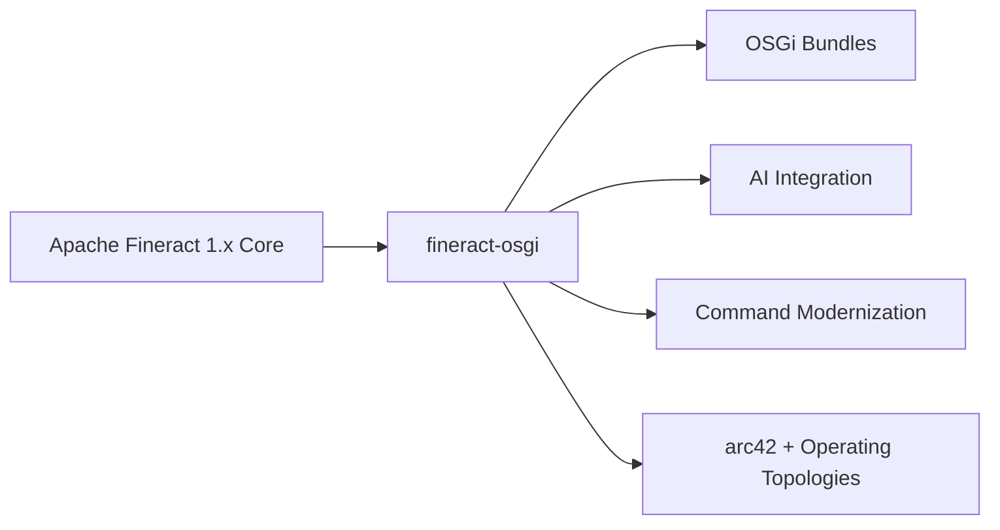

# 1. Introduction and Goals

This chapter introduces the architecture documentation for **fineract-osgi**: motivation, goals, stakeholders, and how to read the remaining arc42 chapters.

---

## 1.1 Motivation and Brief Description

**fineract-osgi** is a modular workstream/fork based on **Apache Fineract 1.x** – a headless core banking platform for inclusive financial services (microfinance, SACCOs, credit unions, small banks).

Compared with the classic Fineract monolith, fineract-osgi emphasizes two strategic directions:

1. **OSGi runtime modularity** (Eclipse Equinox) – load features as bundles dynamically and keep them optional  
2. **AI-supported extensibility** – external inference (reference: xAI Grok API) instead of ML in the core  

The domain core (loans, savings, accounting, clients, COB, multi-tenancy, CQRS) is retained and modernized step by step (including `fineract-command`).

---

## 1.2 Purpose of This Documentation

| Purpose | Description |
|---------|-------------|
| **Orientation** | Shared picture for development, architecture, and operations |
| **Record decisions** | Make ADRs and trade-offs traceable → [08](08_design_decisions.md) |
| **Steer quality** | Scenarios and SLOs as the yardstick → [07](07_quality_attributes.md) |
| **Onboarding** | Faster entry into modules, runtime, and deployment |
| **Agents / reviews** | Repo-local, versioned architecture source (cf. `AGENTS.md`) |

**Non-purpose**: Replacement for OpenAPI specification, customer-specific operations runbooks, or UI manuals.

---

## 1.3 Architecture Goals (Top Level)

Derived from the quality goals in [Chapter 7](07_quality_attributes.md):

| # | Goal | Measurable Focus |
|---|------|------------------|
| 1 | **Correct postings** | No silent double-writes; audit & idempotency |
| 2 | **Secure tenant isolation** | Tenant isolation, AuthN/Z |
| 3 | **Operationally safe COB** | Partitioned jobs, recovery |
| 4 | **Extensible without core fork** | OSGi bundles, events, AI providers |
| 5 | **Maintainable modernization** | Parallel command stacks, hexagon + DDD + clean code; event-sourced writes (target) |
| 6 | **Scalable topologies** | Read/write/batch modes, container/K8s |
| 7 | **Stable integrations** | Headless REST, backward compatibility |

---

## 1.4 Stakeholders

| Stakeholder | Interest | Expects from the Architecture |
|-------------|----------|-------------------------------|
| **Development teams** | Features, refactoring, tests | Clear module boundaries, command migration, OSGi contracts |
| **Architecture / PMC-like** | Long-term direction | ADRs, quality goals, scope |
| **Operators / DevOps** | Deploy, HA, observability | Modes, Compose/K8s, ports, secrets → [05](05_deployment_view.md) |
| **Integrators / BaaS** | Stable API | OpenAPI, idempotency, events |
| **Business side (MFI/SACCO)** | Loan/savings processes | Reliable domain, COB, optional scoring |
| **Security** | Threat model, isolation | Filters, permissions, no public console → [`SECURITY.md`](../../SECURITY.md) |
| **Compliance / audit** | Traceability | Command audit, maker-checker |
| **AI / data teams** | Models without core coupling | Bundle + external API, data minimization |

---

## 1.5 Quality Goals (Prioritized Summary)

| Prio | Quality | One-Sentence Goal |
|:----:|---------|-------------------|
| 1 | Correctness & integrity | Balances and commands are right; retries are safe |
| 2 | Security & isolation | Only authorized, tenant-correct access |
| 3 | Reliability | API and COB survive partial failures |
| 4 | Scalability | Load grows across nodes/workers/tenants |
| 5 | Maintainability | Changes are local and reviewable |
| 6 | Extensibility | AI/rules as bundles, not as a fork |
| 7 | Performance | Write latency and COB windows are predictable |
| 8 | Operability | Measurable, deployable, diagnosable |
| 9 | Compatibility | Clients do not break during internal modernization |

Details and scenarios: [07 Quality Attributes](07_quality_attributes.md).

---

## 1.6 Constraints

### Organizational

- Continued development based on the Fineract ecosystem (Java, Gradle, Spring).  
- Documentation and code in the **same repository** (`docs/arc42/`).  
- Upstream drift must be managed deliberately ([ADR-001](decisions/ADR-001-fork-fineract-osgi-statt-pure-upstream.md)).

### Technical

| Constraint | Implication |
|------------|-------------|
| JVM / Spring Boot | No greenfield rewrite |
| Multi-tenancy | Context and DB routing required |
| CQRS writes | Central command pipeline |
| Headless | No first-class UI in scope |
| Relational DB | Double-entry / JDBC; PostgreSQL first |
| Container-capable | 12-factor-like config via env |

### Conventions

- English code and API identifiers; documentation in English with established technical terms.  
- Mermaid diagrams in Markdown.  
- Terms: [09 Glossary](09_glossary.md).

---

## 1.7 Structure of the Documentation

| Ch. | Content | Question |
|-----|---------|----------|
| [01](01_introduction.md) | Goals, stakeholders | *Why and for whom?* |
| [02](02_context_and_scope.md) | Context, interfaces, scope | *What does the system communicate with?* |
| [03](03_building_block_view.md) | Static decomposition | *Which building blocks?* |
| [04](04_runtime_view.md) | Dynamics | *How do scenarios run?* |
| [05](05_deployment_view.md) | Operations | *Where does it run?* |
| [06](06_crosscutting_concepts.md) | Cross-cutting | *Which recurring solutions?* |
| [07](07_quality_attributes.md) | NFRs | *How good must it be?* |
| [08](08_design_decisions.md) | ADRs | *Why this way and not another?* |
| [09](09_glossary.md) | Terms | *What does X mean?* |
| [10](10_domain_context_map.md) | Domain context map (DDD) | *Which bounded contexts and U/D relationships?* |
| [11](11_aggregate_canvas.md) | Aggregate canvas | *Which invariants, commands, and events per root?* |
| [12](12_event_catalog.md) | Event catalog | *Which business events exist and how do they map to ES?* |
| [13](13_archunit_bounded_context_rules.md) | ArchUnit BC rules | *Which domain dependencies are forbidden?* |
| [14](14_module_api_boundaries.md) | Module API boundaries | *How do Gradle modules communicate?* |

Additionally in the repository:

- [`docs/gherkin/`](../gherkin/README.md) – behavior-oriented requirements (BDD), tagged to chapters/ADRs/quality IDs  
- `SECURITY.md` – threat model  
- `fineract-command-core/README.md` – command modernization in detail  
- `osgi/` – Equinox scaffold  

### Related Gherkin Features

Entry and mapping: [gherkin/README.md](../gherkin/README.md). Domain examples: [client_create](../gherkin/features/client/client_create.feature), [loan_creation](../gherkin/features/loan/loan_creation.feature).  

---

## 1.8 Reading Paths

| Role | Recommended Order |
|------|-------------------|
| **New to the project** | 01 → 02 → 03 → 09 → 04 |
| **Domain / DDD** | 10 → 11 → 12 → 13 → 14 → 08 ADR-019/020/021 → 03 → 06.15 |
| **Backend feature dev** | 03 → 04 → 06 → 08 (ADR-004) → 10 (context) |
| **OSGi / AI extension** | 03 → 04.3/4.4/4.7 → 06.7/6.8 → 08 ADR-002/005/006 |
| **DevOps** | 05 → 06.9–6.11 → 07.5–7.7/7.11 → 09 ports/env |
| **Security review** | 02 → 06.2–6.3 → 07.4 → 08 ADR-013 → `SECURITY.md` |
| **Architecture decision** | 07 → 08 → affected runtime/deployment sections |

---

## 1.9 Distinction from Apache Fineract Upstream

| Aspect | Upstream Fineract | fineract-osgi |
|--------|-------------------|---------------|
| Domain core | Loans, savings, … | adopted |
| Build modules | Gradle multi-module | adopted + OSGi paths |
| Runtime plugins | limited | **OSGi bundles** as the target |
| AI | not strategic in the core | **external AI** via bundle |
| Documentation focus | various guides | **arc42** under `docs/arc42/` |
| DB recommendation (docs) | multi | **PostgreSQL first** (ADR-009) |

fineract-osgi is **not** a replacement for the Apache community, but an architecture line with clear additional goals.

---

## 1.10 Success Definition (Architecture)

The architecture is on track when:

1. Write paths remain auditable and idempotent,  
2. optional bundles do not hard-couple the core,  
3. COB is scalable via manager/worker,  
4. REST clients stay stable during command migration,  
5. operations are controllable via modes, health, and metrics,  
6. ADRs and arc42 are kept in step with material changes.

---

## 1.11 Open Points at Document Level

- Binding production SLOs per customer segment ([07.17](07_quality_attributes.md))  
- Final image layout: Equinox embedded vs. sidecar ([05.15](05_deployment_view.md))  
- Upstream sync policy and contribution path back ([08.18](08_design_decisions.md))  
- Link chapters 01–03 with Gherkin features in `docs/gherkin/`  

---

*Next*: [02 Context and Scope](02_context_and_scope.md) · *Overview*: [README](README.md)
