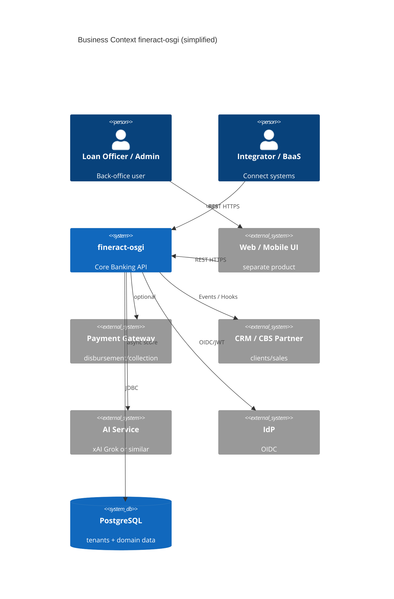
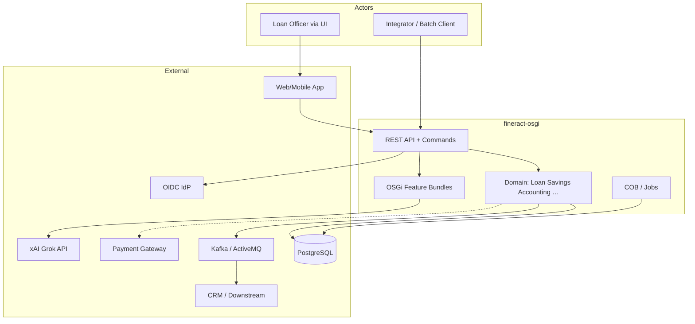
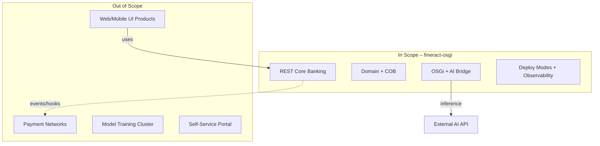

# 2. Architecture Constraints & Context and Scope

This chapter situates **fineract-osgi** in its business and technical world: who communicates with what, what is in scope, and which external constraints apply.

---

## 2.1 Business Context

### Mission

Provide a **multi-tenant core banking API** for institutions of financial inclusion: management of clients, loans, savings deposits, accounting, and periodic day-end processing (COB).

### Typical User Organizations

| Segment | Examples | Typical Load |
|---------|----------|--------------|
| Microfinance Institutions (MFI) | Group lending, individual loans | medium, strongly COB-driven |
| SACCOs / Cooperatives | Savings and credit cooperatives | medium |
| Credit unions / small banks | Branch network, officer workstations | higher, more integrations |
| BaaS / platform providers | Many tenants on one platform | high, multi-tenant ops |

### Core Business Capabilities

- **Client / Party** – clients and groups  
- **Loan Lifecycle** – application, approval, disbursement, repayment, reschedule, …  
- **Savings / Deposits** – accounts, interest, transactions  
- **Accounting** – journal, GL, period close  
- **Products & Charges** – product definitions, fees  
- **Organisation** – offices, staff, branch/teller (where active)  
- **Reporting / MIX** – analytics and regulatory formats  
- **Batch / COB** – close of business and related jobs  

Differentiation of fineract-osgi: the same capabilities, **modularly extensible** (OSGi) and **AI-enrichable** (external scores/hints).

> Note: If the renderer does not support C4 Mermaid, the following block diagram is canonical.

---

## 2.2 Technical Context

### Inputs

| Channel | Content | Protocol |
|---------|---------|----------|
| **REST API** | Commands & queries (portfolio, accounting, admin) | HTTPS :8443 |
| **Auth** | Credentials, JWT/OIDC, optional 2FA | Header / token |
| **Tenant header** | Tenant selection | e.g. tenant ID header |
| **Batch trigger** | Scheduler, manual, catch-up | internal / job API |
| **Messaging** | Job partitions, events (when distributed) | Kafka / JMS |
| **OSGi console** | Bundle admin (ops) | :2501 (secured) |

### Outputs

| Channel | Content |
|---------|---------|
| **REST responses** | Resource IDs, status, query data |
| **Command audit** | `m_portfolio_command_source` and related |
| **Journal / ledger** | Accounting entries |
| **Business / external events** | e.g. LoanCreated to downstream |
| **Hooks** | Configurable HTTP callbacks |
| **Reports** | Report module / exports |
| **Metrics / traces / logs** | Operational signals |
| **AI enrichment** | Scores/notes on the business case (optional) |

### Neighboring Systems

| System | Direction | Coupling | Note |
|--------|-----------|----------|------|
| **PostgreSQL** (primary) | App → DB | strong | Domain source of truth |
| **MySQL/MariaDB** | alternative | strong | Upstream compatibility |
| **Kafka / ActiveMQ** | bidirectional | medium | Distributed jobs & events |
| **OIDC IdP** | App → IdP | medium | Production auth |
| **xAI Grok / AI** | Bundle → API | weak/optional | async, fail-open default |
| **Payment gateway** | App ↔ external | weak | often via integration/hook |
| **CRM / data lake** | Events → external | weak | consumer-side |
| **Web/mobile UI** | UI → API | weak | out of scope as a product |
| **Reverse proxy / WAF** | Client → proxy → API | operational | recommended before prod |

### Node Roles in the Technical Context

Outwardly, fineract-osgi often appears as “one API,” but internally as:

- **Write nodes** – commands  
- **Read nodes** – queries/reports  
- **Batch manager / worker** – COB and jobs  

→ [05 Deployment View](05_deployment_view.md)

---

## 2.3 Interface Overview

### External Interface: REST

| Property | Value |
|----------|-------|
| Base | `/fineract-provider/api/v1/...` |
| Style | Resources + command-oriented writes (CQRS) |
| Contract | OpenAPI; clients: `fineract-client` |
| Security | Basic / OAuth2-OIDC / 2FA; permissions |
| Idempotency | Idempotency key for writes recommended |
| Compatibility | stable during internal command migration ([ADR-004](decisions/ADR-004-cqrs-und-command-pipeline-beibehalten-modernisieren.md)) |

### Internal Interfaces (Logical)

| Interface | From → To | Contract |
|-----------|-----------|----------|
| Resource → Command | REST → legacy/new pipeline | CommandWrapper / Command&lt;REQ&gt; |
| Handler → Domain | Command → WritePlatformService | DTO / domain API |
| Domain → Persistence | Services → JDBC/JPA | Transactions, tenant DS |
| Domain → Events | Services → publisher | Business event types |
| Core → OSGi | Spring bridge → registry | Optional service interfaces |
| OSGi → AI | Bundle → HTTPS | Provider-specific, timeout-bound |
| Manager → Worker | Message handler | Job payload on Kafka/JMS/Spring |

---

## 2.4 Scope

### In Scope

| Area | Concrete |
|------|----------|
| **Domain core** | Loan, Savings, Client, Accounting, Charges, Tax, Rates, Reports (Fineract modules) |
| **Multi-tenancy** | Tenant resolution, separate domain DBs, business date |
| **CQRS / Commands** | Legacy + stepwise `fineract-command` |
| **COB / Jobs** | Partitioning, manager/worker, COB filters |
| **Security** | AuthN/Z, OIDC, 2FA, audit, maker-checker |
| **OSGi modularity** | Equinox, bundles, optional services |
| **AI integration** | External scoring/analysis via bundle |
| **Operating topologies** | Compose, K8s examples, modes, observability |
| **Documentation** | arc42, glossary, references to Gherkin/Security |

### Out of Scope

| Area | Rationale |
|------|-----------|
| **First-class UI** | Separate products (web app, community app) |
| **Self-service end-customer portal** | Different threat model / product |
| **Payment rails (SWIFT/RTGS)** | Downstream responsibility |
| **Blockchain / crypto ledger** | Not part of the accounting model |
| **Training/hosting of ML models in the core** | ADR-005: external AI |
| **Volumetric DDoS defense** | Proxy/cloud |
| **Physical DB host security** | Infrastructure |
| **Institution-specific mobile apps** | Integrators |
| **Fully replacing upstream governance** | Fork line, not an Apache replacement |

### Scope Diagram

---

## 2.5 Assumptions

1. Clients are **back-office** or trusted integrators, not anonymous internet end-customers directly.  
2. A **reverse proxy/WAF** with TLS stands in front of production.  
3. Each tenant has a reachable domain database; registry in `fineract_tenants`.  
4. COB windows and SLOs are calibrated per deployment (guidelines in ch. 7).  
5. OSGi features are **optional**; core processes run without them.  
6. AI results are **decision support**, unless explicitly configured as a policy gate.  
7. Cluster nodes of a role share the **same bundle version**.  

---

## 2.6 External Constraints & Compliance Approach

| Topic | Stance |
|-------|--------|
| **Data protection / PII** | Minimization in AI payloads; no secrets in logs |
| **Auditability** | Commands and critical changes are traceable |
| **Multi-tenant isolation** | Hard requirement, not optional |
| **Secrets** | Env/K8s/Vault – do not hardcode in the image |
| **License** | Apache-2.0 ecosystem; review bundle licenses separately |
| **Regulation** | Architecture supports controls; certification is a customer/deploy concern |

Threat model baseline: [`SECURITY.md`](../../SECURITY.md).

---

## 2.7 Context Mapping to Runtime Scenarios

| Business Trigger | Runtime Scenario | Chapter |
|------------------|------------------|---------|
| Officer creates a loan | Loan Creation | [04.2](04_runtime_view.md) |
| Integrator sends a write | Command Processing | [04.3](04_runtime_view.md) |
| Ops enables scoring | OSGi + AI | [04.4](04_runtime_view.md), [04.7](04_runtime_view.md) |
| Day-end processing | COB | [04.6](04_runtime_view.md) |
| Many institutions | Multi-Tenant Request | [04.5](04_runtime_view.md) |

---

## 2.8 Responsibility Boundaries

| Responsibility | fineract-osgi | External |
|----------------|:-------------:|:--------:|
| Domain invariants loans/savings/GL | ✓ | |
| API contract & idempotency | ✓ | Client must send keys |
| UI/UX | | ✓ |
| IdP operations | | ✓ (except dev basic auth) |
| AI model quality | | ✓ vendor/team |
| DB backup/HA | Config help | ✓ infrastructure |
| Customer bundle content | Contracts/extension points | ✓ implementation |
| Network DDoS | | ✓ proxy/cloud |

---

## 2.9 Open Context Questions

- Which external-event semantics (at-least-once vs. outbox) become product standard?  
- Which AI use cases are “enrichment only” vs. “policy gate”?  
- Standardize tenant provisioning API/process?  
- Official support matrix of PostgreSQL versions for fineract-osgi?

---

## 2.10 Related Gherkin Features

| Behavior | Feature |
|----------|---------|
| Create client | [client/client_create.feature](../gherkin/features/client/client_create.feature) |
| Open savings account | [savings/savings_account_open.feature](../gherkin/features/savings/savings_account_open.feature) |
| Create loan | [loan/loan_creation.feature](../gherkin/features/loan/loan_creation.feature) |
| Full mapping | [gherkin/README.md](../gherkin/README.md) |

---

*Next*: [03 Building Block View](03_building_block_view.md) · *Back*: [01 Introduction](01_introduction.md)
