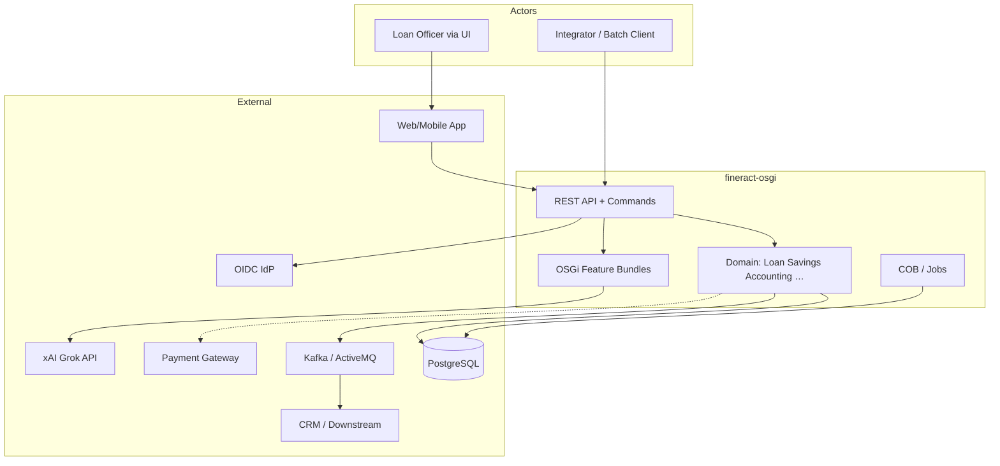
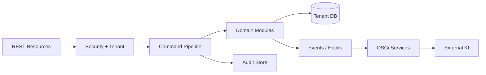
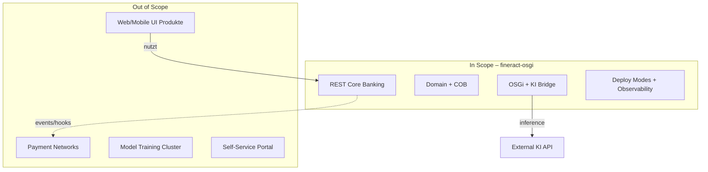

# 2. Architecture Constraints & Context and Scope

Dieses Kapitel verortet **fineract-osgi** in Fach- und Technikwelt: wer kommuniziert womit, was liegt im Scope, und welche äußeren Zwänge gelten.

---

## 2.1 Fachlicher Kontext (Business Context)

### Mission

Bereitstellung einer **mandantenfähigen Core-Banking-API** für Institute der finanziellen Inklusion: Verwaltung von Kunden, Krediten, Spareinlagen, Buchhaltung und periodischem Tagesgeschäft (COB).

### Typische Nutzerorganisationen

| Segment | Beispiele | Typische Last |
|---------|-----------|---------------|
| Microfinance Institutions (MFI) | Kreditgruppen, Individual Loans | mittel, stark COB-getrieben |
| SACCOs / Cooperatives | Spar- und Kreditgenossenschaften | mittel |
| Credit Unions / kleine Banken | Filialnetz, Officer-Arbeitsplätze | höher, mehr Integrationen |
| BaaS / Platform Provider | viele Tenants auf einer Plattform | hoch, Multi-Tenant-Ops |

### Fachliche Kernfähigkeiten

- **Client / Party** – Kunden und Gruppen  
- **Loan Lifecycle** – Antrag, Genehmigung, Auszahlung, Tilgung, Reschedule, …  
- **Savings / Deposits** – Konten, Zinsen, Transaktionen  
- **Accounting** – Journal, GL, Abschlüsse  
- **Products & Charges** – Produktdefinitionen, Gebühren  
- **Organisation** – Offices, Staff, Branch/Teller (wo aktiv)  
- **Reporting / MIX** – Auswertungen und regulatorische Formate  
- **Batch / COB** – Close of Business und verwandte Jobs  

Differenzierung fineract-osgi: dieselben Fähigkeiten **modular erweiterbar** (OSGi) und **KI-anreicherbar** (externe Scores/Hinweise).

> Hinweis: Falls der Renderer kein C4-Mermaid unterstützt, gilt das nachfolgende Blockdiagramm als kanonisch.

---

## 2.2 Technischer Kontext (Technical Context)

### Eingaben (Input)

| Kanal | Inhalt | Protokoll |
|-------|--------|-----------|
| **REST API** | Commands & Queries (Portfolio, Accounting, Admin) | HTTPS :8443 |
| **Auth** | Credentials, JWT/OIDC, optional 2FA | Header / Token |
| **Tenant-Header** | Mandantenwahl | z. B. Tenant-ID-Header |
| **Batch Trigger** | Scheduler, manuell, Catch-up | intern / Job API |
| **Messaging** | Job-Partitionen, Events (wenn verteilt) | Kafka / JMS |
| **OSGi Console** | Bundle-Admin (Ops) | :2501 (abgesichert) |

### Ausgaben (Output)

| Kanal | Inhalt |
|-------|--------|
| **REST Responses** | Ressourcen-IDs, Status, Query-Daten |
| **Command Audit** | `m_portfolio_command_source` u. a. |
| **Journal / Ledger** | Accounting-Buchungen |
| **Business / External Events** | z. B. LoanCreated an Downstream |
| **Hooks** | konfigurierbare HTTP-Callbacks |
| **Reports** | Report-Modul / Exporte |
| **Metrics / Traces / Logs** | Betriebssignale |
| **KI Enrichment** | Scores/Notes am Geschäftsvorfall (optional) |

### Nachbarsysteme

| System | Richtung | Kopplung | Bemerkung |
|--------|----------|----------|-----------|
| **PostgreSQL** (primär) | App → DB | stark | Fachliche Source of Truth |
| **MySQL/MariaDB** | alternativ | stark | Upstream-Kompatibilität |
| **Kafka / ActiveMQ** | bidirektional | mittel | verteilte Jobs & Events |
| **OIDC IdP** | App → IdP | mittel | Production Auth |
| **xAI Grok / KI** | Bundle → API | schwach/optional | async, Fail-Open default |
| **Payment Gateway** | App ↔ extern | schwach | oft über Integration/Hook |
| **CRM / Data Lake** | Events → extern | schwach | Consumer-seitig |
| **Web/Mobile UI** | UI → API | schwach | out of scope als Produkt |
| **Reverse Proxy / WAF** | Client → Proxy → API | betrieblich | empfohlen vor Prod |

### Node-Rollen im technischen Kontext

fineract-osgi erscheint nach außen oft als „eine API“, intern aber als:

- **Write Nodes** – Commands  
- **Read Nodes** – Queries/Reports  
- **Batch Manager / Worker** – COB und Jobs  

→ [05 Deployment View](05_deployment_view.md)

---

## 2.3 Schnittstellenübersicht

### Externe Schnittstelle: REST

| Eigenschaft | Wert |
|-------------|------|
| Basis | `/fineract-provider/api/v1/...` |
| Stil | Ressourcen + command-orientierte Writes (CQRS) |
| Vertrag | OpenAPI; Clients: `fineract-client` |
| Sicherheit | Basic / OAuth2-OIDC / 2FA; Permissions |
| Idempotenz | Idempotency-Key für Writes empfohlen |
| Kompatibilität | stabil während interner Command-Migration ([ADR-004](08_design_decisions.md)) |

### Interne Schnittstellen (logisch)

| Schnittstelle | Von → Nach | Vertrag |
|---------------|------------|---------|
| Resource → Command | REST → Legacy/Neu Pipeline | CommandWrapper / Command&lt;REQ&gt; |
| Handler → Domain | Command → WritePlatformService | DTO / Domain API |
| Domain → Persistence | Services → JDBC/JPA | Transaktionen, Tenant-DS |
| Domain → Events | Services → Publisher | Business Event Typen |
| Core → OSGi | Spring Bridge → Registry | optionale Service-Interfaces |
| OSGi → KI | Bundle → HTTPS | Provider-spezifisch, timeoutbehaftet |
| Manager → Worker | Message Handler | Job-Payload auf Kafka/JMS/Spring |

---

## 2.4 Scope

### In Scope

| Bereich | Konkret |
|---------|---------|
| **Fachkern** | Loan, Savings, Client, Accounting, Charges, Tax, Rates, Reports (Fineract-Module) |
| **Multi-Tenancy** | Tenant-Resolution, getrennte Fach-DBs, Business Date |
| **CQRS / Commands** | Legacy + schrittweise `fineract-command` |
| **COB / Jobs** | Partitionierung, Manager/Worker, COB-Filter |
| **Security** | AuthN/Z, OIDC, 2FA, Audit, Maker-Checker |
| **OSGi Modularität** | Equinox, Bundles, optionale Services |
| **KI-Integration** | externes Scoring/Analyse über Bundle |
| **Betriebstopologien** | Compose, K8s-Beispiele, Modes, Observability |
| **Dokumentation** | arc42, Glossar, Verweise auf Gherkin/Security |

### Out of Scope

| Bereich | Begründung |
|---------|------------|
| **First-Class UI** | separate Produkte (Web App, Community App) |
| **Self-Service Endkunden-Portal** | anderes Threat Model / Produkt |
| **Payment Rails (SWIFT/RTGS)** | Downstream-Verantwortung |
| **Blockchain / Krypto-Ledger** | nicht Teil des Accounting-Modells |
| **Training/Hosting von ML-Modellen im Core** | ADR-005: externe KI |
| **Volumetric DDoS-Abwehr** | Proxy/Cloud |
| **Physische DB-Host-Sicherheit** | Infrastruktur |
| **Instituts-spezifische Mobile Apps** | Integratoren |
| **Vollständige Upstream-Governance ersetzen** | Fork-Linie, kein Apache-Ersatz |

### Scope-Diagramm

---

## 2.5 Annahmen

1. Clients sind **Back-Office** oder vertrauenswürdige Integratoren, keine anonymen Internet-Endkunden direkt.  
2. Vor Produktion steht ein **Reverse Proxy/WAF** mit TLS.  
3. Pro Tenant existiert eine erreichbare Fachdatenbank; Registry in `fineract_tenants`.  
4. COB-Fenster und SLOs werden pro Deployment kalibriert (Richtwerte in Kap. 7).  
5. OSGi-Features sind **optional**; Kernprozesse laufen ohne sie.  
6. KI-Ergebnisse sind **Entscheidungshilfen**, sofern nicht explizit als Policy Gate konfiguriert.  
7. Cluster-Nodes einer Rolle teilen **dieselbe Bundle-Version**.  

---

## 2.6 Externe Randbedingungen & Compliance-Ansatz

| Thema | Haltung |
|-------|---------|
| **Datenschutz / PII** | Minimierung in KI-Payloads; keine Secrets in Logs |
| **Auditierbarkeit** | Commands und kritische Änderungen nachvollziehbar |
| **Multi-Tenant Isolation** | harte Anforderung, nicht optional |
| **Secrets** | Env/K8s/Vault – nicht im Image hardcoden |
| **Lizenz** | Apache-2.0-Ökosystem; Bundle-Lizenzen separat prüfen |
| **Regulierung** | Architektur unterstützt Controls; Zertifizierung ist Kunden-/Deploy-Sache |

Threat Model-Basis: [`SECURITY.md`](../../SECURITY.md).

---

## 2.7 Kontext-Mapping zu Runtime-Szenarien

| Fachlicher Anlass | Runtime-Szenario | Kapitel |
|-------------------|------------------|---------|
| Officer legt Kredit an | Loan Creation | [04.2](04_runtime_view.md) |
| Integrator sendet Write | Command Processing | [04.3](04_runtime_view.md) |
| Ops aktiviert Scoring | OSGi + KI | [04.4](04_runtime_view.md), [04.7](04_runtime_view.md) |
| Tagesabschluss | COB | [04.6](04_runtime_view.md) |
| Viele Institute | Multi-Tenant Request | [04.5](04_runtime_view.md) |

---

## 2.8 Abgrenzung der Verantwortung

| Verantwortung | fineract-osgi | Extern |
|---------------|:-------------:|:------:|
| Fachliche Invarianten Loans/Savings/GL | ✓ | |
| API-Vertrag & Idempotenz | ✓ | Client muss Keys senden |
| UI/UX | | ✓ |
| IdP-Betrieb | | ✓ (außer Dev-Basic-Auth) |
| KI-Modellgüte | | ✓ Vendor/Team |
| DB-Backup/HA | Konfig-Hilfe | ✓ Infrastruktur |
| Bundle-Inhalt Kunde | Verträge/Extension Points | ✓ Implementierung |
| Netzwerk-DDoS | | ✓ Proxy/Cloud |

---

## 2.9 Offene Kontextfragen

- Welche External-Event-Semantik (at-least-once vs. Outbox) wird Produktstandard?  
- Welche KI-Use-Cases sind „nur Enrichment“ vs. „Policy Gate“?  
- Tenant-Provisioning-API/Prozess standardisieren?  
- Offizielle Support-Matrix PostgreSQL-Versionen für fineract-osgi?

---

## 2.10 Verwandte Gherkin-Features

| Verhalten | Feature |
|-----------|---------|
| Kunde anlegen | [client/client_create.feature](../gherkin/features/client/client_create.feature) |
| Sparkonto eröffnen | [savings/savings_account_open.feature](../gherkin/features/savings/savings_account_open.feature) |
| Kredit anlegen | [loan/loan_creation.feature](../gherkin/features/loan/loan_creation.feature) |
| Mapping gesamt | [gherkin/README.md](../gherkin/README.md) |

---

*Weiter*: [03 Building Block View](03_building_block_view.md) · *Zurück*: [01 Introduction](01_introduction.md)
