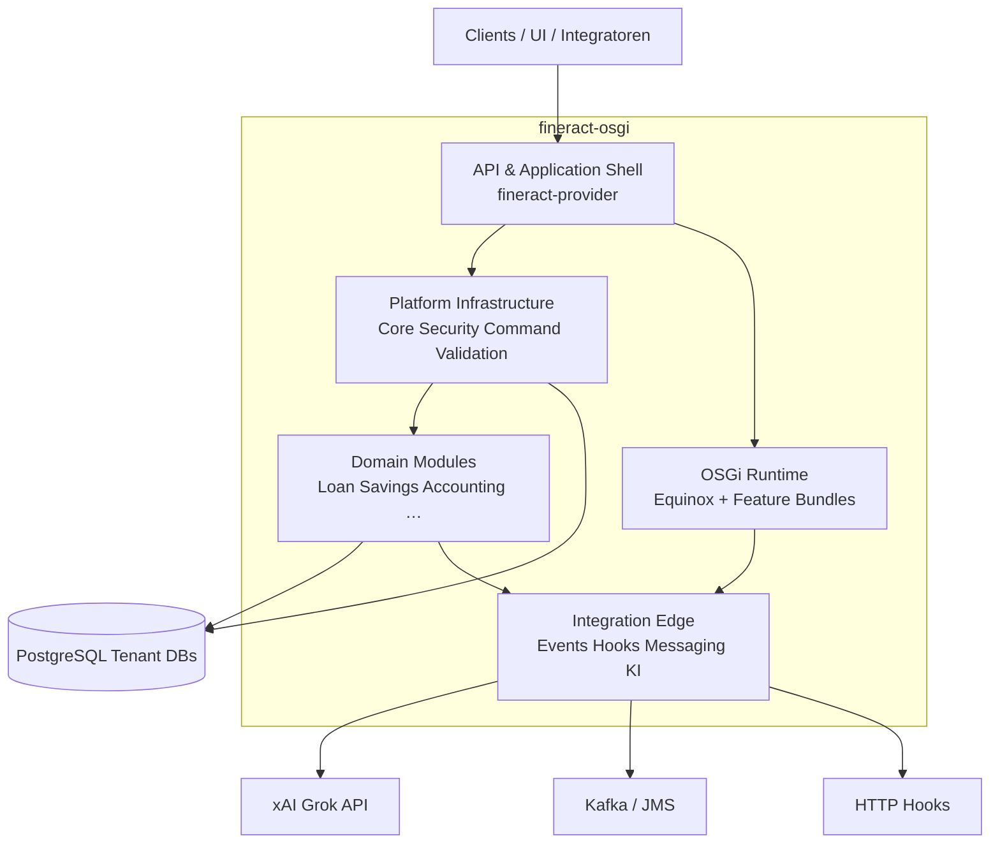
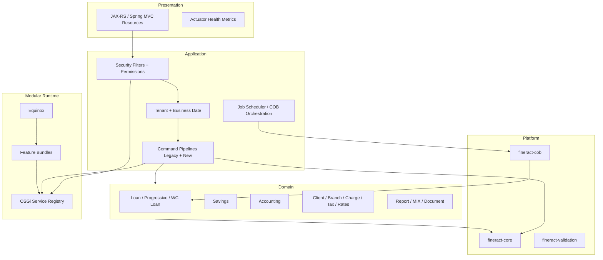
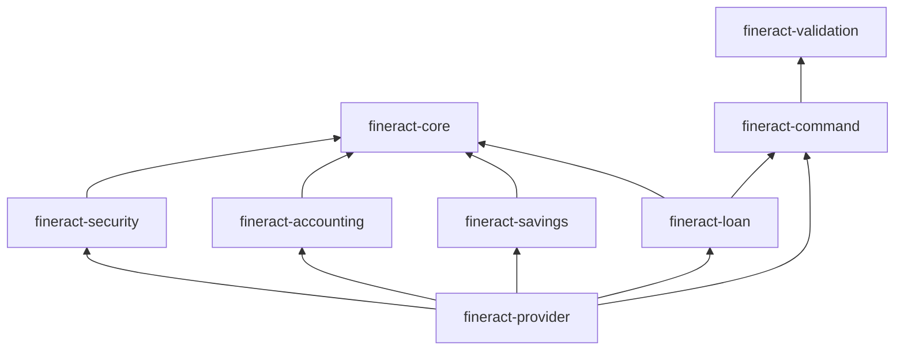
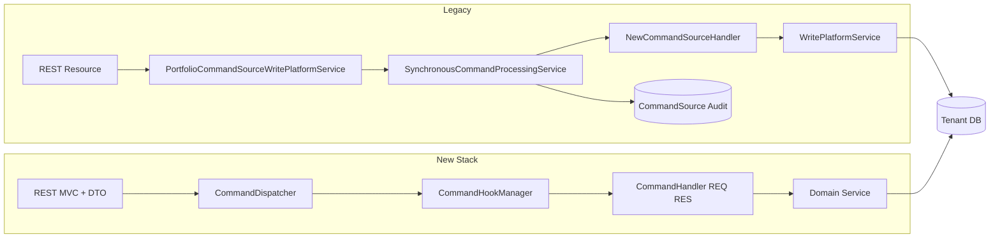
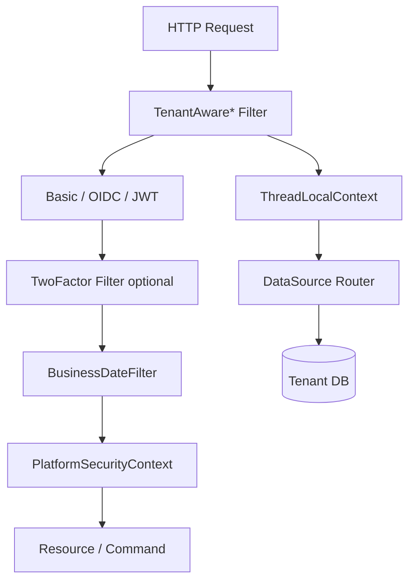
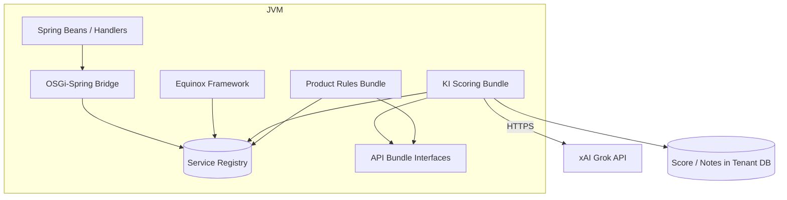
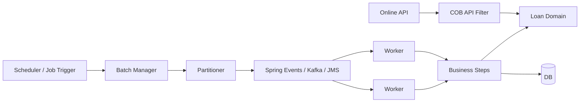

# 3. Building Block View

Die Building Block View beschreibt die **statische Zerlegung** von fineract-osgi: verantwortliche Bausteine, ihre Schnittstellen und Abhängigkeiten. Dynamik → [04 Runtime View](04_runtime_view.md); Verteilung → [05 Deployment View](05_deployment_view.md).

**Notation**

- **Level 1**: System im Groben  
- **Level 2**: logische / Gradle-Module und Laufzeit-Schichten  
- **Level 3**: ausgewählte Innenansichten (Command, Security, OSGi/KI)  

---

## 3.1 Level 1 – Gesamtsystem

### Level-1-Bausteine

| Baustein | Verantwortung | Typische Artefakte |
|----------|----------------|--------------------|
| **API & Application Shell** | Boot, REST, Actuator, Verdrahtung | `fineract-provider`, optional `fineract-war` |
| **Platform Infrastructure** | Tenant, Security, Commands, Config, Jobs-Infra | `fineract-core`, `fineract-security`, `fineract-command*`, `fineract-validation` |
| **Domain Modules** | Fachlogik Portfolio & Accounting | `fineract-loan`, `fineract-savings`, … |
| **OSGi Runtime** | Dynamische Modularität | `osgi/`, Equinox, Feature-JARs |
| **Integration Edge** | Events, Messaging, KI-Calls | Hooks, Kafka/JMS Producer, KI-Bundle |
| **Persistence** | Tenants-Registry + Tenant-Fachdaten | PostgreSQL (primary) |

### Externe Level-1-Nachbarn

| Nachbar | Beziehung |
|---------|-----------|
| Clients / Integratoren | HTTPS REST |
| IdP | OIDC/JWT |
| DB | JDBC |
| Message Broker | Jobs/Events (optional) |
| KI-API | HTTPS aus Bundle (optional) |
| UI-Produkte | nur als API-Konsumenten |

---

## 3.2 Level 2 – Schichten und Modulgruppen

### 3.2.1 Application Shell

| Modul | Rolle |
|-------|--------|
| **fineract-provider** | Hauptanwendung: startet Spring Boot, aggregiert Domain- und Infra-Module, exponiert API |
| **fineract-war** | optionales WAR-Packaging (nicht primärer Deploy-Pfad) |
| **fineract-db** | DB-nahe Ressourcen/Migrationen (je nach Layout) |

### 3.2.2 Platform / Infrastructure

| Modul | Rolle |
|-------|--------|
| **fineract-core** | Gemeinsame Infrastruktur: Legacy Commands, Config, ThreadLocal/Tenant-Hilfen, diverse Plattform-Services |
| **fineract-security** | AuthN/Z, Tenant-aware Filter, OIDC, 2FA, Login/User-Details APIs |
| **fineract-command** | Neuer typsicherer Command-Stack (Dispatcher, Handler-API, Hooks) |
| **fineract-command-async** | Asynchrone Dispatcher-Variante |
| **fineract-command-disruptor** | LMAX-Disruptor-Variante |
| **fineract-command-jdbc** / **-audit** | Persistenz-/Audit-Aspekte des neuen Stacks |
| **fineract-command-test** | Testunterstützung |
| **fineract-validation** | Validierungsbausteine |
| **fineract-cob** | COB-Komponenten und Business-Step-Integration |
| **fineract-avro-schemas** | Schema-Definitionen für Events/Messaging |

### 3.2.3 Domain Modules

| Modul | Fachverantwortung |
|-------|-------------------|
| **fineract-loan** | Klassischer Loan-Lifecycle, Produkte, Transaktionen |
| **fineract-progressive-loan** | Progressive Loan Schedule/Logik |
| **fineract-progressive-loan-embeddable-schedule-generator** | Einbettbarer Schedule-Generator |
| **fineract-working-capital-loan** | Working-Capital-Loan-Variante |
| **fineract-loan-origination** | Origination-nahe Erweiterungen |
| **fineract-savings** | Spareinlagen |
| **fineract-accounting** | Journal, GL, accounting rules |
| **fineract-charge** | Gebühren |
| **fineract-tax** | Steuern |
| **fineract-rates** | Zins-/Rate-Tabellen |
| **fineract-branch** | Branch/Teller-Aspekte |
| **fineract-investor** | Investor-/Secondary-Market-Aspekte (wo genutzt) |
| **fineract-document** | Dokumente/Anhänge |
| **fineract-report** | Reporting |
| **fineract-mix** | MIX/regulatorische Reportformate |

### 3.2.4 Clients, Tests, Doku

| Modul / Pfad | Rolle |
|--------------|--------|
| **fineract-client** / **fineract-client-feign** | API-Clients aus OpenAPI |
| **fineract-e2e-tests-*** / **integration-tests** | End-to-End- und Integrationstests |
| **fineract-doc** | Asciidoc/Antora-Projektdoku (Upstream-Stil) |
| **docs/arc42** | Diese Architektur-Doku |
| **docs/gherkin** | BDD-Features |
| **osgi/** | Equinox-Runtime-Scaffold |
| **config/docker**, **kubernetes/** | Betriebsblaupausen |

### 3.2.5 OSGi Feature-Bundles (Zielbild)

Noch nicht alle als feste Repo-Module finalisiert; logische Bausteine:

| Bundle (logisch) | Verantwortung |
|------------------|---------------|
| **core-bridge** | Spring ↔ OSGi Service Lookup |
| **api-contracts** | stabile Service-Interfaces (Validator, Scorer, …) |
| **ki-scoring** | Anbindung xAI Grok / CreditScoreProvider |
| **dynamic-product-config** | instituts-spezifische Produktregeln |
| **customer-extension-*** | kundenspezifisch, external build |

Prinzip: **Interfaces im Core/API-Bundle**, Implementierung austauschbar ([ADR-002](08_design_decisions.md)).

---

## 3.3 Level-2-Abhängigkeitsregeln

| Regel | Begründung |
|-------|------------|
| Domain hängt nicht von REST-Controllern ab | Ersetzbarkeit der Transport-Schicht |
| Domain kennt keine konkrete KI-API | nur optionale Interfaces |
| `fineract-command` ist unabhängig von Legacy-JSON-Helfern nutzbar | parallele Migration |
| Feature-Bundles hängen von API-Contracts ab, nicht umgekehrt | keine Zyklen |
| Worker-Nodes brauchen Domain+COB, nicht zwingend alle Admin-UIs | schlankere Rolle |

*(Vereinfacht; reale `build.gradle`-Kanten sind feiner.)*

---

## 3.4 Level 3 – Command-Subsystem

| Baustein | Verantwortung |
|----------|----------------|
| **PortfolioCommandSourceWritePlatformService** | Einstieg Legacy-Writes, Maker-Checker-Anbindung |
| **SynchronousCommandProcessingService** | Routing, Retry, Idempotenz, Audit-Status |
| **CommandHandlerProvider** | Findet Handler zu Action/Entity |
| **CommandDispatcher** | Neuer austauschbarer Ausführungskanal |
| **CommandHookManager** | Before/After/Error-Querschnitt |
| **CommandStore / Audit-Module** | Persistenz Command-Zustände (neu/alt) |
| **API-DTOs (data packages)** | Request/Response-Nutzlast; spezialisierte Typen **komponieren** Shared-Felder und bleiben für Gson flach ([ADR-015](08_design_decisions.md)) |
| **FineractGsonTypeAdapterRegistrar** | SPI in `fineract-core` – Module registrieren Gson-TypeAdapter (z. B. Flatten) via ServiceLoader |

Details Runtime: [04.3](04_runtime_view.md) · ADR: [08 ADR-004](08_design_decisions.md), [ADR-015](08_design_decisions.md)

---

## 3.5 Level 3 – Security- und Tenant-Subsystem

| Baustein | Modul | Verantwortung |
|----------|-------|----------------|
| Tenant-aware Filters | `fineract-security` | Mandant + Auth-Reihenfolge |
| OIDC/JWT Converter | `fineract-security` | Token → Fineract-Principal |
| TwoFactor* | `fineract-security` | 2FA |
| PlatformSecurityContext | core/security | Permission-Checks |
| ThreadLocalContextUtil | `fineract-core` | Context halten/clearen |
| Tenant datasource config | core + properties | Pools, RO-Connections |

→ [06.2](06_crosscutting_concepts.md), [06.3](06_crosscutting_concepts.md)

---

## 3.6 Level 3 – OSGi- und KI-Subsystem

| Baustein | Verantwortung |
|----------|----------------|
| **Equinox** | Bundle-Lifecycle, Console, Start-Level |
| **API Interfaces** | z. B. `CreditScoreProvider`, `ProductRuleExtension` |
| **KI Bundle** | Mapping, HTTP-Client, Timeout/Retry, Persistenz Enrichment |
| **Bridge** | optionales Lookup ohne harten Classpath-Zwang |
| **config.ini / bundles/** | Betriebs-Konfiguration und Deploy-Ordner |

→ [04.4](04_runtime_view.md), [04.7](04_runtime_view.md), [05.7](05_deployment_view.md)

---

## 3.7 Level 3 – COB- / Job-Subsystem

| Baustein | Verantwortung |
|----------|----------------|
| **Batch Manager** | Job starten, partitionieren, Fortschritt |
| **Worker** | Partition ausführen |
| **Business Steps** | fachliche COB-Schritte |
| **COB API Filter** | Online-Writes während COB schützen |
| **Message Handler** | Transport der Partitionen |

→ [04.6](04_runtime_view.md), [05.5](05_deployment_view.md)

---

## 3.8 Wichtige Datenbestände (logisch)

| Bestand | Inhalt | Zugriff |
|---------|--------|---------|
| **fineract_tenants** | Tenant-Metadaten, JDBC-Ziele | Platform beim Request-Start |
| **Tenant Schema/DB** | Clients, Loans, Savings, GL, Commands, … | Domain + Commands |
| **Command Audit** | Write-Historie, Idempotenz-Unterstützung | Command Pipeline |
| **Job / COB Metadata** | Laufstatus, Fehler | Batch-Subsystem |
| **Event Outbox** *(Ziel)* | zuverlässige External Events | Integration Edge |
| **OSGi Bundle Storage** | Feature-JARs | Equinox |
| **Logs / Metrics** | Betrieb | Observability-Stack |

---

## 3.9 Qualitätseigenschaften der Bausteine

| Baustein | Primäre Qualitätsbeiträge |
|----------|---------------------------|
| Command Pipelines | Korrektheit, Audit, Kompatibilität |
| Security/Tenant | Security, Isolation |
| Domain Loan/Savings/Accounting | Fachliche Korrektheit |
| COB/Worker | Reliability, Scalability, Performance (Batch) |
| OSGi + KI Bundles | Extensibility, Maintainability |
| provider + Modes | Deployability, Scalability |
| Observability in provider | Operability |

→ Mapping: [07](07_quality_attributes.md), [06.15](06_crosscutting_concepts.md)

---

## 3.10 Typische Änderungswege („wo ändere ich X?“)

| Änderung | Primäre Bausteine |
|----------|-------------------|
| Neues REST-Write-Feld (migriertes Modul) | Resource/DTO → `fineract-command` Handler → Domain |
| Neues REST-Write-Feld (Legacy) | Resource → JsonCommand Keys → Legacy Handler → Domain |
| Neue Permission | Security/Roles + Resource Checks |
| Neuer COB-Schritt | `fineract-cob` / Business Step + Job Config |
| KI-Scoring | OSGi API + KI-Bundle + Event Subscription |
| Institutsregel ohne Core-PR | Feature-Bundle gegen Extension Interface |
| Neue Node-Rolle im Cluster | Env Mode Flags + Deploy Manifest, kein Domain-Fork |
| Neuer Downstream-Consumer | External Events / Hook Config |

---

## 3.11 Offene Baustein-Arbeiten

- Finale Maven/Gradle-Koordinaten und Package-Exports der OSGi-API-Bundles  
- Explizite `core-bridge`-Implementierung Spring↔OSGi  
- Vereinheitlichung Event-Outbox als eigenes Modul  
- Building-Block-Diagramme aus realen `dependencies.gradle` generieren (CI-Check auf verbotene Kanten)  
- Level-3-Detail für Accounting und Savings analog Loan  

---

## 3.12 Verwandte Gherkin-Features

| Baustein-Fokus | Feature |
|----------------|---------|
| Loan + Commands | [loan/loan_creation.feature](../gherkin/features/loan/loan_creation.feature), [crosscutting/command_processing.feature](../gherkin/features/crosscutting/command_processing.feature) |
| Accounting | [accounting/loan_disbursement_journal.feature](../gherkin/features/accounting/loan_disbursement_journal.feature) |
| Savings / Client | [savings/…](../gherkin/features/savings/savings_account_open.feature), [client/…](../gherkin/features/client/client_create.feature) |
| OSGi / KI | [osgi/…](../gherkin/features/osgi/) |
| Mapping | [gherkin/README.md](../gherkin/README.md) |

---

*Weiter*: [04 Runtime View](04_runtime_view.md) · *Zurück*: [02 Context and Scope](02_context_and_scope.md)
