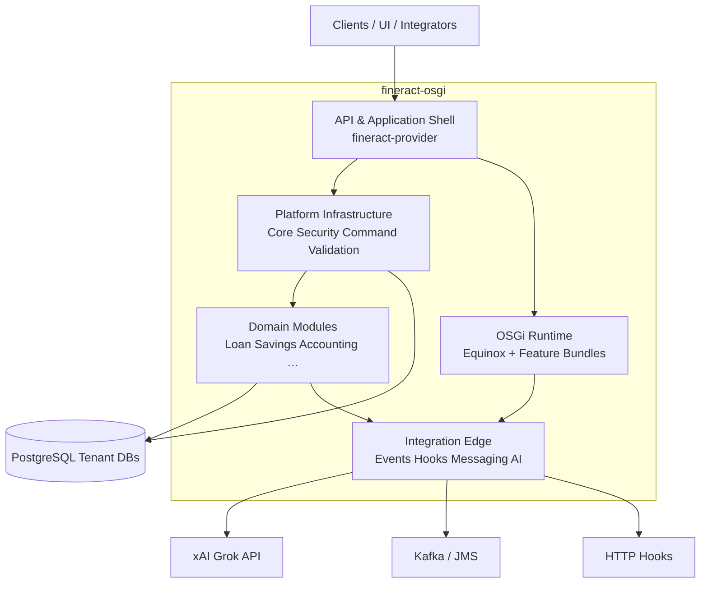
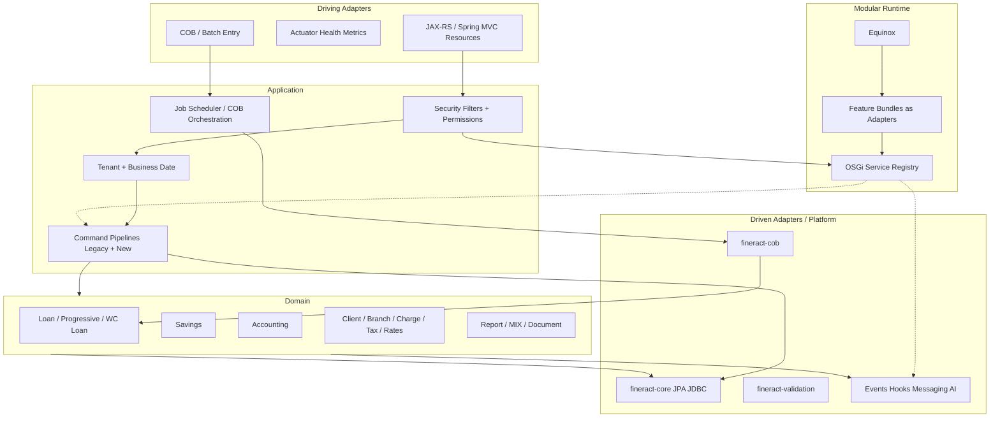
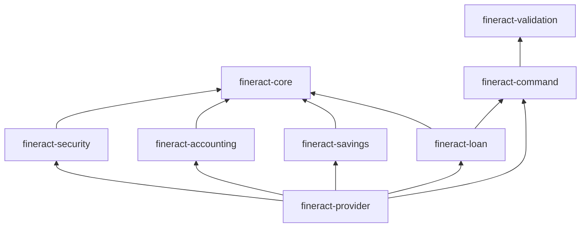
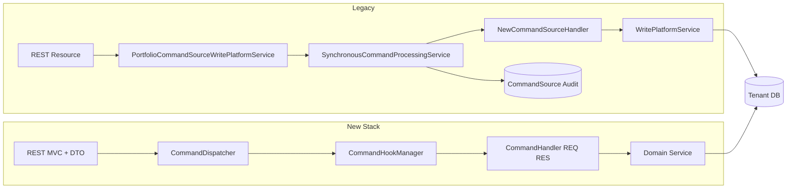
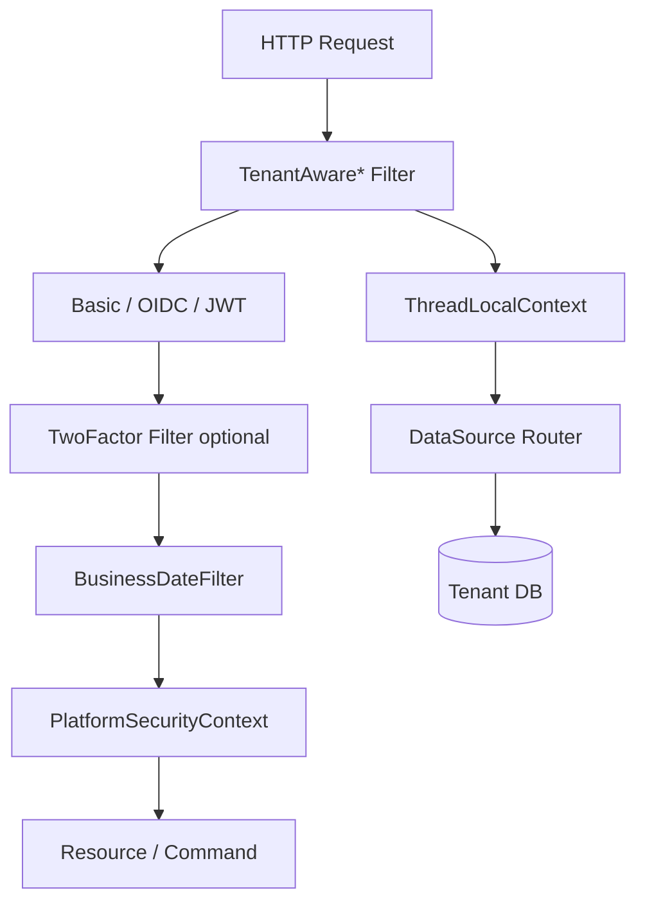
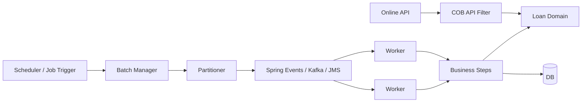

# 3. Building Block View

The Building Block View describes the **static decomposition** of fineract-osgi: responsible building blocks, their interfaces, and dependencies. Dynamics → [04 Runtime View](04_runtime_view.md); distribution → [05 Deployment View](05_deployment_view.md).

**Notation**

- **Level 1**: System at a glance  
- **Level 2**: Logical / Gradle modules and runtime layers  
- **Level 3**: Selected internal views (Command, Security, OSGi/AI)  

---

## 3.1 Level 1 – Overall System

### Level-1 Building Blocks

| Building Block | Responsibility | Typical Artifacts |
|----------------|----------------|-------------------|
| **API & Application Shell** | Boot, REST, Actuator, wiring | `fineract-provider`, optional `fineract-war` |
| **Platform Infrastructure** | Tenant, security, commands, config, jobs infra | `fineract-core`, `fineract-security`, `fineract-command*`, `fineract-validation` |
| **Domain Modules** | Portfolio & accounting domain logic (**bounded contexts**, [ADR-019](decisions/ADR-019-domain-driven-design.md), context map [10](10_domain_context_map.md)) | `fineract-loan`, `fineract-savings`, … |
| **OSGi Runtime** | Dynamic modularity | `osgi/`, Equinox, feature JARs |
| **Integration Edge** | Events, messaging, AI calls | Hooks, Kafka/JMS producer, AI bundle |
| **Persistence** | Tenants registry + tenant domain data | PostgreSQL (primary) |

### External Level-1 Neighbors

| Neighbor | Relationship |
|----------|--------------|
| Clients / integrators | HTTPS REST |
| IdP | OIDC/JWT |
| DB | JDBC |
| Message broker | Jobs/events (optional) |
| AI API | HTTPS from bundle (optional) |
| UI products | only as API consumers |

---

## 3.2 Level 2 – Layers, Module Groups, and Hexagon Mapping

fineract-osgi follows a **hexagonal guiding model** (ports & adapters, [ADR-017](decisions/ADR-017-hexagonale-architektur.md)): domain in the center, application/use cases around it, **driving** adapters (REST, jobs) and **driven** adapters (JPA, JDBC, events, AI) at the edge. Gradle modules remain the physical decomposition; the hexagon is the **logical** dependency view.

| Hexagon Ring | Building Blocks (Examples) |
|--------------|----------------------------|
| **Driving** | REST resources, Actuator, COB/batch entry, OSGi entry points |
| **Application** | Security/tenant filters, command pipelines, job orchestration |
| **Domain** | Loan, Savings, Accounting, Client, … (DDD aggregates; write events) |
| **Driven** | Event store (target), JPA/JDBC projectors & reads, validation, COB, hooks/messaging/AI |
| **Pluggable** | Equinox feature bundles behind service-registry ports |

### 3.2.1 Application Shell

| Module | Role |
|--------|------|
| **fineract-provider** | Main application: starts Spring Boot, aggregates domain and infra modules, exposes API |
| **fineract-war** | Optional WAR packaging (not the primary deploy path) |
| **fineract-db** | DB-related resources/migrations (depending on layout) |

### 3.2.2 Platform / Infrastructure

| Module | Role |
|--------|------|
| **fineract-core** | **Shared kernel** — tenant/context, Money, command/batch, platform exceptions, serialization, plus accepted hub / fund-style residual. Not a domain module and not a leftover backlog ([core slices standing rule](15_osgi_bundle_refactoring_fineract-core-slices.md#standing-rule-fineract-core-is-the-shared-kernel)) |
| **fineract-security** | AuthN/Z, tenant-aware filters, OIDC, 2FA, login/user-details APIs |
| **fineract-command** | New type-safe command stack (dispatcher, handler API, hooks) |
| **fineract-command-async** | Asynchronous dispatcher variant |
| **fineract-command-disruptor** | LMAX Disruptor variant |
| **fineract-command-jdbc** / **-audit** | Persistence/audit aspects of the new stack |
| **fineract-command-test** | Unit/white-box test fragment (host: command.impl) |
| **fineract-command-integrationtest** | Shared IT fixtures for command modules |
| **fineract-validation** | Validation building blocks |
| **fineract-cob** | COB components and business-step integration |
| **fineract-avro-schemas** | Schema definitions for events/messaging |

### 3.2.3 Domain Modules

Business bounded contexts, upstream/downstream, and migration order: **[10 Domain Context Map](10_domain_context_map.md)**. Gradle modules are the physical mapping – not 1:1 with every context.

**Module communication:** only via **`moduleapi`**, events, and shared kernel ([ADR-021](decisions/ADR-021-modul-kommunikation-nur-ueber-module-api.md), [14 Module API Boundaries](14_module_api_boundaries.md)) – not via foreign `domain`/`service` implementations.

| Module | Domain Responsibility |
|--------|----------------------|
| **fineract-loan** | Classic loan lifecycle, products, transactions |
| **fineract-progressive-loan** | Progressive loan schedule/logic |
| **fineract-progressive-loan-embeddable-schedule-generator** | Embeddable schedule generator |
| **fineract-working-capital-loan** | Working-capital loan variant |
| **fineract-loan-origination** | Origination-related extensions |
| **fineract-savings** | Savings deposits |
| **fineract-accounting** | Journal, GL, accounting rules |
| **fineract-charge** | Charges/fees |
| **fineract-tax** | Taxes |
| **fineract-rates** | Interest/rate tables |
| **fineract-branch** | Branch/teller aspects |
| **fineract-investor** | Investor/secondary-market aspects (where used) |
| **fineract-document** | Documents/attachments |
| **fineract-report** | Reporting |
| **fineract-mix** | MIX/regulatory report formats |

### 3.2.4 Clients, Tests, Documentation

| Module / Path | Role |
|---------------|------|
| **fineract-client** / **fineract-client-feign** | API clients from OpenAPI |
| **fineract-e2e-tests-*** / **integration-tests** | End-to-end and integration tests |
| **fineract-doc** | Asciidoc/Antora project docs (upstream style) |
| **docs/arc42** | This architecture documentation |
| **docs/gherkin** | BDD features |
| **osgi/** | Equinox runtime scaffold |
| **config/docker**, **kubernetes/** | Operations blueprints |

### 3.2.5 OSGi Feature Bundles (Target Picture)

Not all are finalized yet as fixed repository modules; logical building blocks:

| Bundle (Logical) | Responsibility |
|------------------|----------------|
| **core-bridge** | Spring ↔ OSGi service lookup |
| **api-contracts** | Stable service interfaces (validator, scorer, …) |
| **ki-scoring** | xAI Grok / CreditScoreProvider integration |
| **dynamic-product-config** | Institution-specific product rules |
| **customer-extension-*** | Customer-specific, external build |

Principle: **interfaces in the core/API bundle**, implementation replaceable ([ADR-002](decisions/ADR-002-osgi-equinox-fuer-laufzeitmodularitaet.md)).

---

## 3.3 Level-2 Dependency Rules

| Rule | Rationale |
|------|-----------|
| Domain does not depend on REST controllers | Replaceability of the transport layer |
| Domain does not know a concrete AI API | only optional interfaces |
| `fineract-command` is usable independently of legacy JSON helpers | parallel migration |
| Feature bundles depend on API contracts, not the reverse | no cycles |
| Worker nodes need domain+COB, not necessarily all admin UIs | leaner role |

*(Simplified; real `build.gradle` edges are finer.)*

---

## 3.4 Level 3 – Command Subsystem

| Building Block | Responsibility |
|----------------|----------------|
| **PortfolioCommandSourceWritePlatformService** | Entry for legacy writes, maker-checker integration |
| **SynchronousCommandProcessingService** | Routing, retry, idempotency, audit status |
| **CommandHandlerProvider** | Finds handlers for action/entity |
| **CommandDispatcher** | New replaceable execution channel |
| **CommandHookManager** | Before/after/error cross-cutting |
| **CommandStore / Audit modules** | Persistence of command states (new/legacy) |
| **API DTOs (data packages)** | Request/response payload; specialized types **compose** shared fields and stay flat for Gson ([ADR-015](decisions/ADR-015-api-dtos-composition-statt-vererbung.md)) |
| **FineractGsonTypeAdapterRegistrar** | SPI in `fineract-core` – modules register Gson type adapters (e.g. flatten) via ServiceLoader |

Runtime details: [04.3](04_runtime_view.md) · ADR: [ADR-004](decisions/ADR-004-cqrs-und-command-pipeline-beibehalten-modernisieren.md), [ADR-015](decisions/ADR-015-api-dtos-composition-statt-vererbung.md)

---

## 3.5 Level 3 – Security and Tenant Subsystem

| Building Block | Module | Responsibility |
|----------------|--------|----------------|
| Tenant-aware filters | `fineract-security` | Tenant + auth order |
| OIDC/JWT converter | `fineract-security` | Token → Fineract principal |
| TwoFactor* | `fineract-security` | 2FA |
| PlatformSecurityContext | core/security | Permission checks |
| ThreadLocalContextUtil | `fineract-core` | Hold/clear context |
| Tenant datasource config | core + properties | Pools, RO connections |

→ [06.2](06_crosscutting_concepts.md), [06.3](06_crosscutting_concepts.md)

---

## 3.6 Level 3 – OSGi and AI Subsystem

| Building Block | Responsibility |
|----------------|----------------|
| **Equinox** | Bundle lifecycle, console, start level |
| **API Interfaces** | e.g. `CreditScoreProvider`, `ProductRuleExtension` |
| **AI Bundle** | Mapping, HTTP client, timeout/retry, persistence enrichment |
| **Bridge** | Optional lookup without hard classpath coupling |
| **config.ini / bundles/** | Operations configuration and deploy folder |

→ [04.4](04_runtime_view.md), [04.7](04_runtime_view.md), [05.7](05_deployment_view.md)

---

## 3.7 Level 3 – COB / Job Subsystem

| Building Block | Responsibility |
|----------------|----------------|
| **Batch Manager** | Start jobs, partition, track progress |
| **Worker** | Execute partition |
| **Business Steps** | Domain COB steps |
| **COB API Filter** | Protect online writes during COB |
| **Message Handler** | Transport of partitions |

→ [04.6](04_runtime_view.md), [05.5](05_deployment_view.md)

---

## 3.8 Important Data Stores (Logical)

| Store | Content | Access |
|-------|---------|--------|
| **fineract_tenants** | Tenant metadata, JDBC targets | Platform at request start |
| **Tenant schema/DB** | Clients, loans, savings, GL, commands, … | Domain + commands |
| **Command audit** | Write history, idempotency support | Command pipeline |
| **Job / COB metadata** | Run status, errors | Batch subsystem |
| **Event outbox** *(target)* | Reliable external events | Integration edge |
| **OSGi bundle storage** | Feature JARs | Equinox |
| **Logs / metrics** | Operations | Observability stack |

---

## 3.9 Quality Properties of the Building Blocks

| Building Block | Primary Quality Contributions |
|----------------|-------------------------------|
| Command pipelines | Correctness, audit, compatibility |
| Security/Tenant | Security, isolation |
| Domain Loan/Savings/Accounting | Domain correctness |
| COB/Worker | Reliability, scalability, performance (batch) |
| OSGi + AI bundles | Extensibility, maintainability |
| provider + modes | Deployability, scalability |
| Observability in provider | Operability |

→ Mapping: [07](07_quality_attributes.md), [06.15](06_crosscutting_concepts.md)

---

## 3.10 Typical Change Paths (“Where do I change X?”)

| Change | Primary Building Blocks |
|--------|-------------------------|
| New REST write field (migrated module) | Resource/DTO → `fineract-command` handler → domain |
| New REST write field (legacy) | Resource → JsonCommand keys → legacy handler → domain |
| New permission | Security/roles + resource checks |
| New COB step | `fineract-cob` / business step + job config |
| AI scoring | OSGi API + AI bundle + event subscription |
| Institution rule without core PR | Feature bundle against extension interface |
| New node role in cluster | Env mode flags + deploy manifest, no domain fork |
| New downstream consumer | External events / hook config |

---

## 3.11 Open Building-Block Work

- Final Maven/Gradle coordinates and package exports of the OSGi API bundles  
- Explicit `core-bridge` implementation Spring↔OSGi  
- Unification of event outbox as its own module  
- Generate building-block diagrams from real `dependencies.gradle` (CI check for forbidden edges)  
- Level-3 detail for Accounting and Savings analogous to Loan  

---

## 3.12 Related Gherkin Features

| Building-Block Focus | Feature |
|----------------------|---------|
| Loan + Commands | [loan/loan_creation.feature](../gherkin/features/loan/loan_creation.feature), [crosscutting/command_processing.feature](../gherkin/features/crosscutting/command_processing.feature) |
| Accounting | [accounting/loan_disbursement_journal.feature](../gherkin/features/accounting/loan_disbursement_journal.feature) |
| Savings / Client | [savings/…](../gherkin/features/savings/savings_account_open.feature), [client/…](../gherkin/features/client/client_create.feature) |
| OSGi / AI | [osgi/…](../gherkin/features/osgi/) |
| Mapping | [gherkin/README.md](../gherkin/README.md) |

---

*Next*: [04 Runtime View](04_runtime_view.md) · *Back*: [02 Context and Scope](02_context_and_scope.md)
