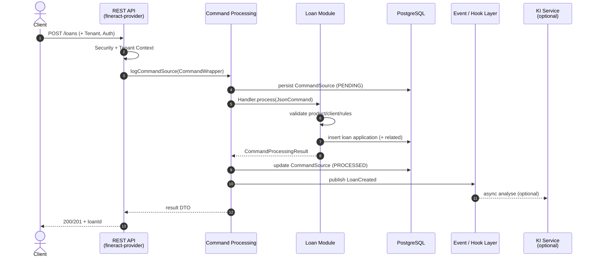
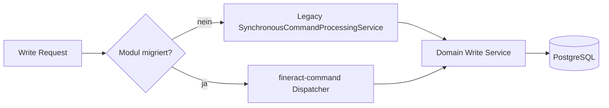
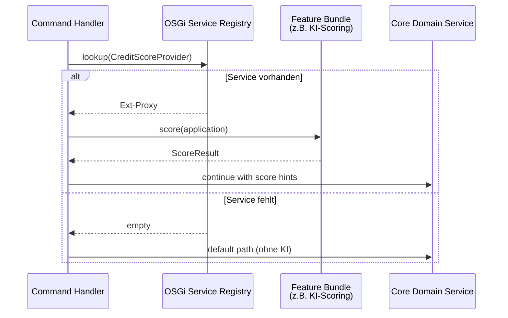
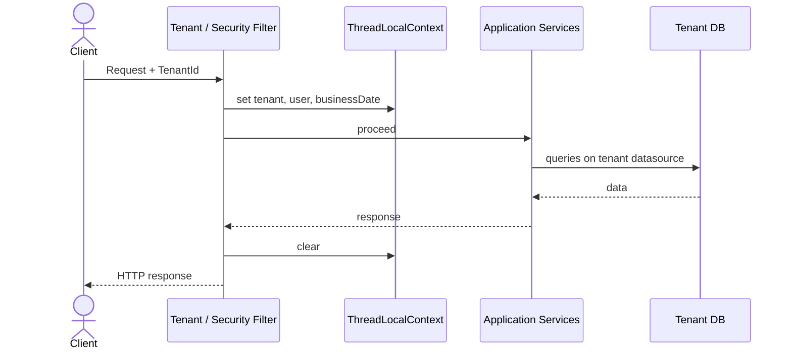
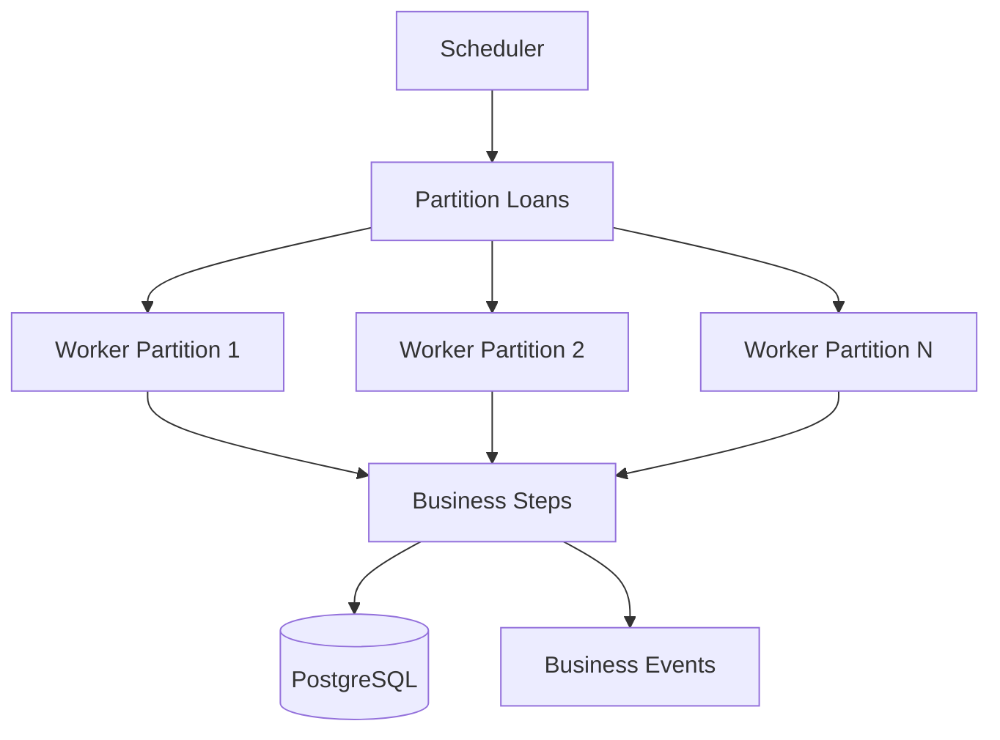

# 4. Runtime View

Die Runtime View beschreibt, wie die Bausteine aus [Kapitel 3](03_building_block_view.md) zur Laufzeit zusammenarbeiten. Im Fokus stehen typische, architekturprägende Szenarien – nicht jede API-Variante.

**Notation**: Abläufe als nummerierte Schritte und optional als Mermaid-Sequenzdiagramme. Beteiligte Bausteine sind in **fett** hervorgehoben.

---

## 4.1 Überblick der Szenarien

| # | Szenario | Zweck | Primäre Bausteine |
|---|----------|--------|-------------------|
| 1 | Loan Creation | Typischer Write-Pfad (CQRS) | REST API, Command Pipeline, Loan Module, DB, Events |
| 2 | Command Processing (Legacy & Neu) | Zentrale Schreibverarbeitung | `SynchronousCommandProcessingService`, `fineract-command` |
| 3 | OSGi Bundle Lifecycle | Dynamische Modularität | Equinox, Bundle Activator, OSGi Services |
| 4 | Multi-Tenant Request | Isolation pro Institut | Filter, Tenant Context, DataSource Routing |
| 5 | Close of Business (COB) | Batch-/Tagesabschluss | COB Jobs, Loan Business Steps, Scheduler |
| 6 | KI-gestützte Analyse (optional) | Externe Erweiterung | Event Hook, KI-Integration Layer, xAI Grok API |

---

## 4.2 Szenario 1: Loan Creation

Erstellung eines neuen Kreditantrags über die REST-API. Das Szenario zeigt den klassischen **Write-Pfad** von Fineract (CQRS) und die Erweiterbarkeit über Events/OSGi.

### Beteiligte Bausteine

- **Client** (Mobile App, Branch System, Integrator)
- **fineract-provider** (REST Resource, Security Filter)
- **Command Layer** (Command Wrapper → Handler)
- **Loan Module** (`fineract-loan` / Portfolio Services)
- **Accounting / Client** (Validierung von Verknüpfungen)
- **PostgreSQL** (Persistenz, Audit/`m_portfolio_command_source`)
- **Event / Hook Layer** (Business Events, optionale externe KI)

### Ablauf

1. **REST API Call**  
   Client sendet `POST /loans` (JSON) mit Tenant-Header und Authentifizierung.
2. **Security & Tenant Context**  
   Auth-Filter prüft Credentials/Token; Tenant-Filter setzt `ThreadLocalContext` (Tenant-ID, DataSource).
3. **Command Wrapper**  
   Die Resource baut einen `CommandWrapper` (Action: `CREATE`, Entity: `LOAN`) und übergibt ihn an  
   `PortfolioCommandSourceWritePlatformService.logCommandSource(...)`.
4. **Idempotency & Audit**  
   Optionaler Idempotency-Key wird aufgelöst; Command wird in `m_portfolio_command_source` vorgemerkt.
5. **Command Handler**  
   `SynchronousCommandProcessingService` findet den passenden `NewCommandSourceHandler`  
   (z. B. Submit/Create Loan Application Handler).
6. **Validation**  
   JSON-Schema-/Business-Validierung (Produkt, Client, Währung, Beträge, Datumsregeln).  
   Bei OSGi-Erweiterungen: zusätzliche Validatoren als OSGi Services (z. B. dynamische Produktregeln).
7. **Domain Logic & Persistence**  
   Loan-Application-Entity wird angelegt; verknüpfte Daten (Charges, Collaterals, Schedule-Vorbereitung)  
   werden in **PostgreSQL** in einer Transaktion geschrieben.
8. **Command Result & Audit-Abschluss**  
   `CommandProcessingResult` (Resource-ID, Changes) – ggf. als spezialisierter Subtyp mit **flach komponierten** Domain-Feldern – wird serialisiert; Command-Status → `PROCESSED`.  
   Zielbild ([ADR-020](decisions/ADR-020-event-sourcing-writes-pflicht.md)): zustandsändernde Commands **appenden Domain Events** in den Event Store; Projektionen aktualisieren Read Models / Journal.
9. **Event Publishing**  
   Domain-/Business Events (aus dem Stream bzw. nach Append) → Hooks / External Events.  
   Optional: asynchroner Consumer ruft **externe KI-Analyse** auf – ohne den Write-Pfad zu blockieren.
10. **HTTP Response**  
    Client erhält `200/201` mit Loan-ID und Status (Gson-Serialisierung; Wire-JSON bleibt flach, siehe [ADR-015](decisions/ADR-015-api-dtos-composition-statt-vererbung.md)).

### Sequenzdiagramm



### Fehler- und Sonderfälle

| Fall | Verhalten |
|------|-----------|
| Validierungsfehler | Exception → HTTP 400; Command ggf. als ERROR markiert |
| Fehlende Berechtigung | Security Context → HTTP 403 |
| Doppelter Idempotency-Key | Bereits verarbeitetes Ergebnis wird zurückgegeben (kein Doppel-Insert) |
| Maker-Checker aktiv | Command bleibt auf Approval warten; keine Domain-Persistenz bis Checker freigibt |
| KI-Service down | Write-Pfad bleibt erfolgreich; KI-Analyse wird geloggt/retried (best effort) |

---

## 4.3 Szenario 2: Command Processing (Legacy und neuer Stack)

Schreibende Operationen laufen über CQRS. fineract-osgi behält den **Legacy-Pfad** und baut parallel den **typsicheren Command-Stack** (`fineract-command`) aus.

Im **hexagonalen Leitbild** ([ADR-017](decisions/ADR-017-hexagonale-architektur.md)) sind REST/Batch **Driving Adapters**, Command Handler **Application**, Domain-Services **Domain**, JPA/JDBC/Events/KI **Driven Adapters**.  
**DDD** ([ADR-019](decisions/ADR-019-domain-driven-design.md)): der Handler orchestriert typisch **ein Aggregat** (z. B. Loan) pro Command; Nebenwirkungen (Accounting, Events) bewusst und nach Invarianten.  
**Event Sourcing** ([ADR-020](decisions/ADR-020-event-sourcing-writes-pflicht.md)): Create/Update/Delete des Aggregates appenden Domain Events (Write-SoT); Read Models und Journal sind Projektionen.

### 4.3.1 Legacy-Pfad (heutiger Default)

```
REST Resource
  → PortfolioCommandSourceWritePlatformService
    → SynchronousCommandProcessingService
      → CommandHandlerProvider / ApplicationContext
        → NewCommandSourceHandler
          → WritePlatformService (Domain)
```

Eigenschaften:

- Payload oft als **JSON-String** / `JsonCommand`
- Zentrale Idempotency- und Maker-Checker-Logik
- Starke Kopplung an Gson-Helfer und String-Keys
- Synchrone Ausführung im Request-Thread (Retry via Resilience4j möglich)
- Response-DTOs: wo sinnvoll **Composition statt Vererbung** (Shared-Felder flach in Spezialtypen; GET-only ohne CPR-Vererbung) – [ADR-015](decisions/ADR-015-api-dtos-composition-statt-vererbung.md), Crosscutting [6.13](06_crosscutting_concepts.md)

### 4.3.2 Neuer Command-Stack (`fineract-command`)

```
REST (Spring MVC, DTO)
  → CommandDispatcher (sync / async / disruptor)
    → CommandHookManager (before / after / error)
      → CommandHandler<REQ, RES>
        → Domain Service (ein Request-DTO)
```

Eigenschaften:

- **Typsichere** `Command<REQ>`-Payloads und Jakarta Validation
- Request-DTOs bevorzugt als **Composition** (Shared-Komponente + create/update-spezifische Felder), nicht als tiefe Vererbung
- Austauschbare Dispatcher: synchron, asynchron, LMAX Disruptor
- Hooks für Cross-Cutting (Username, Timestamp, Headers, Audit)
- Migration schrittweise pro Modul, REST-API bleibt rückwärtskompatibel

### Laufzeit-Entscheidung



Zielzustand: neue Features und OSGi-gebundene Handler bevorzugen den neuen Stack; Legacy bleibt bis zur vollständigen Migration.

---

## 4.4 Szenario 3: OSGi Bundle Lifecycle

fineract-osgi nutzt **Eclipse Equinox** als OSGi-Framework (siehe `osgi/` und `docs/arc42/osgi.gradle`). Zur Laufzeit können Feature-Bundles (z. B. KI-Scoring, Dynamic Product Config) installiert, gestartet und gestoppt werden, ohne den gesamten Core neu zu deployen.

### Ablauf: Bundle Start

1. **Framework Start**  
   Equinox startet (`start-equinox.sh` / Gradle-Task `equinoxStart`) mit `config.ini` und Console-Port.
2. **Bundle Installation**  
   JARs aus `osgi/bundles` (oder Remote-Repo) werden installiert; Start-Level gemäß Konfiguration.
3. **Activator / DS Components**  
   `BundleActivator.start()` oder Declarative Services registrieren Services im **OSGi Service Registry**.
4. **Service Binding**  
   Core oder andere Bundles binden optionale Services (z. B. `CreditScoreProvider`, `ProductRuleExtension`).
5. **Bereit**  
   REST/Command-Pfad kann die Erweiterung nutzen, sobald der Service `ACTIVE` und gebunden ist.

### Ablauf: Bundle Stop / Update

1. Unbind abhängiger Consumer (graceful: Requests ohne Extension fortsetzen oder 503 je nach Policy).
2. `Bundle.stop()` → Services deregistrieren.
3. Optional: Update auf neue Bundle-Version → Refresh → erneuter Start.

### Sequenzdiagramm (Service-Nutzung im Request)



**Designprinzip**: Erweiterungen sind **optional**. Fehlt ein Bundle, bleibt der Core-Banking-Pfad funktionsfähig (Degradation statt Hard-Fail).

---

## 4.5 Szenario 4: Multi-Tenant Request

Jeder HTTP-Request (und jeder Batch-Job) läuft im Kontext genau eines Tenants.

### Ablauf

1. Request trifft ein (Header z. B. `Fineract-Platform-TenantId` oder Subdomain/Routing-Regel).
2. **Tenant-Resolution-Filter** lädt Tenant-Metadaten (Name, Timezone, Connection).
3. **ThreadLocalContext** speichert Tenant, Business Date, Auth-User.
4. DataSource-/Connection-Routing wählt die Tenant-DB (oder Schema).
5. Business-Logik und Persistenz laufen ausschließlich in diesem Kontext.
6. Nach Response: Context wird cleared (kein Leak zwischen Threads / Virtual Threads).



Batch-Jobs (COB) setzen den Tenant-Context pro Job-Partition analog – parallelisierte Partitions dürfen Tenants nicht mischen.

---

## 4.6 Szenario 5: Close of Business (COB)

COB ist der periodische Batch-Lauf für Zinsen, Penalties, Statusübergänge und verwandte Tagesabschluss-Schritte.

### Ablauf (Loan COB, vereinfacht)

1. **Scheduler** triggert COB-Job (Cron / manuell / Catch-up).
2. **Partitioning**: offene Loans werden in Chunks aufgeteilt (Skalierung über Worker).
3. Pro Loan / Chunk:
   - Business Date prüfen
   - konfigurierte **Business Steps** sequentiell ausführen  
     (z. B. Accrual, Penalty, Delinquency)
   - Ergebnisse in DB committen
4. COB-Metadaten aktualisieren (letzter erfolgreicher Lauf, Fehlerliste).
5. Optional: Bulk Business Events für nachgelagerte Systeme.



### Interaktion mit Online-Traffic

- **COB API Filter** können Schreibzugriffe auf Loans blockieren oder verzögern, die gerade im COB sind (Konsistenz).
- Read-Nodes können COB-lastige Workloads entkoppeln (siehe Deployment View).

---

## 4.7 Szenario 6: KI-gestützte Analyse (optional)

Ziel: externe Intelligenz (z. B. **xAI Grok API**) an Fineract anbinden, ohne den monolithischen Core mit ML-Modellen zu belasten.

### Typischer Auslöser

- Nach Loan Creation / Approval (Event)
- Vor Disbursement (synchrone Policy-Prüfung, wenn konfiguriert)
- Manueller API-Call eines Officers („Score this application“)

### Ablauf (asynchron, empfohlen)

1. Domain Event `LoanApplicationSubmitted` wird publiziert.
2. **KI-Integration Bundle** (OSGi) empfängt Event über Hook/Consumer.
3. Mapping: Fineract-Domänendaten → anonymisiertes/feature-reduziertes Prompt-Payload.
4. HTTP-Call an externe KI-API (Timeout, Circuit Breaker).
5. Ergebnis wird als:
   - Note / Custom Data am Loan,
   - separates Scoring-Aggregat, oder
   - Audit-Log-Eintrag  
   persistiert.
6. UI/API kann Score lesen; Kernbuchungen bleiben davon entkoppelt.

### Synchrone Variante (Policy Gate)

Nur wenn konfiguriert (z. B. „reject if score &lt; threshold“):

```
Command Handler → OSGi CreditScoreProvider → KI API → allow/deny → continue/abort
```

Bei Timeout: konfigurierbare Fail-Open / Fail-Closed Policy (Default: Fail-Open für Verfügbarkeit, Fail-Closed für regulierte Produkte).

---

## 4.8 Querschnittliche Laufzeitaspekte

| Aspekt | Laufzeitverhalten |
|--------|-------------------|
| **Security** | Jeder Write prüft Permissions im `PlatformSecurityContext`; OAuth2/Basic je nach Deployment |
| **Audit** | Commands und Hook-Events erzeugen nachvollziehbare Spuren (`m_portfolio_command_source`, App-Logs) |
| **Transaktionen** | Domain-Writes in Spring-Transaktionen; Events oft transaction-bound (nach Commit) |
| **Idempotenz** | Write-APIs mit Idempotency-Key vermeiden Doppelbuchungen bei Retries |
| **Resilience** | Retry (Commands), Timeouts (externe KI), optionale Circuit Breaker |
| **Observability** | Structured Logging, Micrometer-Metriken, Equinox-Log (`osgi/logs`) |
| **Modi** | `fineract.mode.read/write/batch.*` steuern, welche Rollen ein Node übernimmt |

---

## 4.9 Laufzeit-Qualität und Constraints

- **Latenz Write-Pfad**: dominiert durch DB + Validierung; externe KI gehört nicht in den Default-Hot-Path.
- **Durchsatz COB**: horizontal über Partitionen/Worker; OSGi-Extensions in Business Steps müssen idempotent und schnell sein.
- **Hot Deploy**: Bundle-Updates dürfen laufende Transaktionen nicht korrumpieren; Consumer nutzen Service Tracker / optional bindings.
- **Konsistenz**: Tenant-Isolation und Command-Audit sind nicht verhandelbar; Feature-Flags steuern nur optionale Pfade.

---

## 4.10 Offene Punkte / nächste Iterationen

- Konkrete Bundle-Manifeste und Package-Exports für Loan-/KI-Extensions
- Endgültige Wahl der Event-Bridge (interne Spring Events vs. Kafka/ActiveMQ Outbox)
- Messwerte (SLOs) für Command-Latenz und COB-Dauer pro Tenant-Größe
- Detaillierte Maker-Checker-Sequenz als eigenes Unter-Szenario, falls Compliance es verlangt

---

## 4.11 Verwandte Gherkin-Features

| Runtime-Szenario | Tag | Feature |
|------------------|-----|---------|
| 4.2 Loan Creation | `@runtime-loan-creation` | [loan/loan_creation.feature](../gherkin/features/loan/loan_creation.feature) |
| 4.3 Command Processing | `@runtime-command-processing` | [crosscutting/command_processing.feature](../gherkin/features/crosscutting/command_processing.feature) |
| 4.4 OSGi Lifecycle | `@runtime-osgi-lifecycle` | [osgi/optional_bundle_degradation.feature](../gherkin/features/osgi/optional_bundle_degradation.feature) |
| 4.5 Multi-Tenant | `@runtime-multi-tenant` | [crosscutting/multi_tenant_isolation.feature](../gherkin/features/crosscutting/multi_tenant_isolation.feature) |
| 4.6 COB | `@runtime-cob` | [cob/close_of_business.feature](../gherkin/features/cob/close_of_business.feature) |
| 4.7 KI-Analyse | `@runtime-ki-analysis` | [osgi/ki_scoring_async.feature](../gherkin/features/osgi/ki_scoring_async.feature) |

Vollständiges Mapping: [gherkin/README.md](../gherkin/README.md).

---

*Weiter*: [05 Deployment View](05_deployment_view.md) · *Zurück*: [03 Building Block View](03_building_block_view.md)
