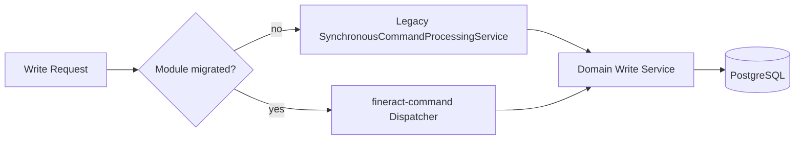
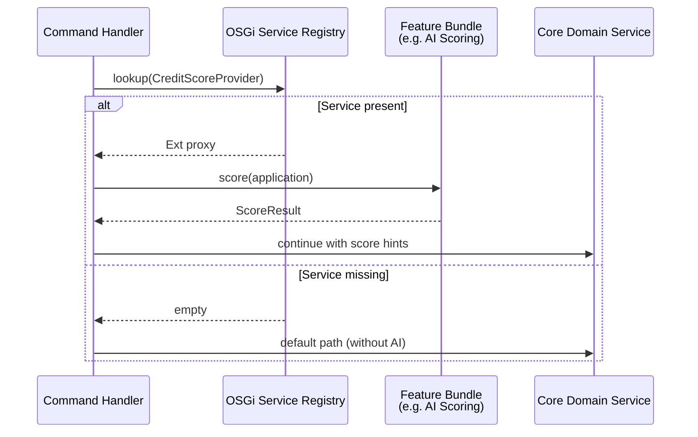
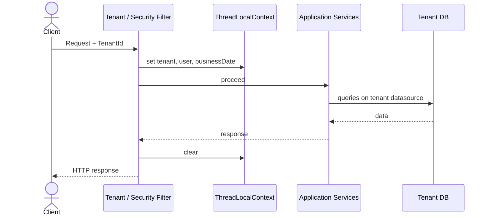
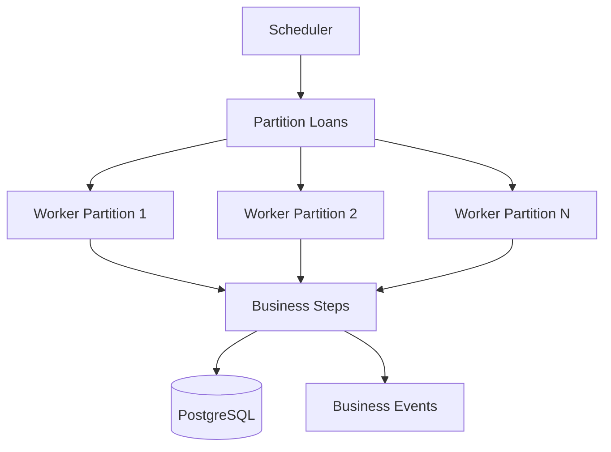

# 4. Runtime View

The Runtime View describes how the building blocks from [Chapter 3](03_building_block_view.md) collaborate at runtime. The focus is on typical, architecture-shaping scenarios – not every API variant.

**Notation**: Flows as numbered steps and optionally as Mermaid sequence diagrams. Participating building blocks are highlighted in **bold**.

---

## 4.1 Scenario Overview

| # | Scenario | Purpose | Primary Building Blocks |
|---|----------|---------|-------------------------|
| 1 | Loan Creation | Typical write path (CQRS) | REST API, Command Pipeline, Loan Module, DB, Events |
| 2 | Command Processing (Legacy & New) | Central write processing | `SynchronousCommandProcessingService`, `fineract-command` |
| 3 | OSGi Bundle Lifecycle | Dynamic modularity | Equinox, Bundle Activator, OSGi Services |
| 4 | Multi-Tenant Request | Isolation per institution | Filter, Tenant Context, DataSource Routing |
| 5 | Close of Business (COB) | Batch / day-end | COB Jobs, Loan Business Steps, Scheduler |
| 6 | AI-supported analysis (optional) | External extension | Event Hook, AI Integration Layer, xAI Grok API |

---

## 4.2 Scenario 1: Loan Creation

Creation of a new loan application via the REST API. The scenario shows the classic Fineract **write path** (CQRS) and extensibility via events/OSGi.

### Participating Building Blocks

- **Client** (mobile app, branch system, integrator)
- **fineract-provider** (REST resource, security filter)
- **Command Layer** (Command Wrapper → Handler)
- **Loan Module** (`fineract-loan` / portfolio services)
- **Accounting / Client** (validation of linkages)
- **PostgreSQL** (persistence, audit/`m_portfolio_command_source`)
- **Event / Hook Layer** (business events, optional external AI)

### Flow

1. **REST API Call**  
   Client sends `POST /loans` (JSON) with tenant header and authentication.
2. **Security & Tenant Context**  
   Auth filter checks credentials/token; tenant filter sets `ThreadLocalContext` (tenant ID, data source).
3. **Command Wrapper**  
   The resource builds a `CommandWrapper` (Action: `CREATE`, Entity: `LOAN`) and passes it to  
   `PortfolioCommandSourceWritePlatformService.logCommandSource(...)`.
4. **Idempotency & Audit**  
   Optional idempotency key is resolved; command is pre-recorded in `m_portfolio_command_source`.
5. **Command Handler**  
   `SynchronousCommandProcessingService` finds the matching `NewCommandSourceHandler`  
   (e.g. Submit/Create Loan Application Handler).
6. **Validation**  
   JSON schema/business validation (product, client, currency, amounts, date rules).  
   With OSGi extensions: additional validators as OSGi services (e.g. dynamic product rules).
7. **Domain Logic & Persistence**  
   Loan application entity is created; related data (charges, collaterals, schedule preparation)  
   is written to **PostgreSQL** in one transaction.
8. **Command Result & Audit Completion**  
   `CommandProcessingResult` (resource ID, changes) – possibly as a specialized subtype with **flatly composed** domain fields – is serialized; command status → `PROCESSED`.  
   Target picture ([ADR-020](decisions/ADR-020-event-sourcing-writes-pflicht.md)): state-changing commands **append domain events** to the event store; projections update read models / journal.
9. **Event Publishing**  
   Domain/business events (from the stream or after append) → hooks / external events.  
   Optional: async consumer invokes **external AI analysis** – without blocking the write path.
10. **HTTP Response**  
    Client receives `200/201` with loan ID and status (Gson serialization; wire JSON stays flat, see [ADR-015](decisions/ADR-015-api-dtos-composition-statt-vererbung.md)).

### Sequence Diagram


### Error and Special Cases

| Case | Behavior |
|------|----------|
| Validation error | Exception → HTTP 400; command may be marked ERROR |
| Missing permission | Security context → HTTP 403 |
| Duplicate idempotency key | Already processed result is returned (no double insert) |
| Maker-checker active | Command waits for approval; no domain persistence until checker releases |
| AI service down | Write path remains successful; AI analysis is logged/retried (best effort) |

---

## 4.3 Scenario 2: Command Processing (Legacy and New Stack)

Write operations run through CQRS. fineract-osgi retains the **legacy path** and expands the **type-safe command stack** (`fineract-command`) in parallel.

In the **hexagonal guiding model** ([ADR-017](decisions/ADR-017-hexagonale-architektur.md)), REST/batch are **driving adapters**, command handlers are **application**, domain services are **domain**, JPA/JDBC/events/AI are **driven adapters**.  
**DDD** ([ADR-019](decisions/ADR-019-domain-driven-design.md)): the handler typically orchestrates **one aggregate** (e.g. Loan) per command; side effects (accounting, events) deliberately and after invariants. Invariants/commands/events: [11 Aggregate Canvas](11_aggregate_canvas.md).  
**Event sourcing** ([ADR-020](decisions/ADR-020-event-sourcing-writes-pflicht.md)): create/update/delete of the aggregate append domain events (write SoT); read models and journal are projections.

### 4.3.1 Legacy Path (Current Default)

```
REST Resource
  → PortfolioCommandSourceWritePlatformService
    → SynchronousCommandProcessingService
      → CommandHandlerProvider / ApplicationContext
        → NewCommandSourceHandler
          → WritePlatformService (Domain)
```

Characteristics:

- Payload often as **JSON string** / `JsonCommand`
- Central idempotency and maker-checker logic
- Strong coupling to Gson helpers and string keys
- Synchronous execution on the request thread (retry via Resilience4j possible)
- Response DTOs: where sensible **composition instead of inheritance** (shared fields flat in specialized types; GET-only without CPR inheritance) – [ADR-015](decisions/ADR-015-api-dtos-composition-statt-vererbung.md), crosscutting [6.13](06_crosscutting_concepts.md)

### 4.3.2 New Command Stack (`fineract-command`)

```
REST (Spring MVC, DTO)
  → CommandDispatcher (sync / async / disruptor)
    → CommandHookManager (before / after / error)
      → CommandHandler<REQ, RES>
        → Domain Service (one request DTO)
```

Characteristics:

- **Type-safe** `Command<REQ>` payloads and Jakarta Validation
- Request DTOs preferably as **composition** (shared component + create/update-specific fields), not deep inheritance
- Replaceable dispatchers: synchronous, asynchronous, LMAX Disruptor
- Hooks for cross-cutting (username, timestamp, headers, audit)
- Stepwise migration per module; REST API remains backward compatible

### Runtime Decision



Target state: new features and OSGi-bound handlers prefer the new stack; legacy remains until full migration.

---

## 4.4 Scenario 3: OSGi Bundle Lifecycle

fineract-osgi uses **Eclipse Equinox** as the OSGi framework (see `osgi/` and root `osgi.gradle`). At runtime, feature bundles (e.g. AI scoring, dynamic product config) can be installed, started, and stopped without redeploying the entire core.

### Flow: Bundle Start

1. **Framework Start**  
   Equinox starts (`start-equinox.sh` / Gradle task `equinoxStart`) with `config.ini` and console port.
2. **Bundle Installation**  
   JARs from `osgi/bundles` (or remote repo) are installed; start level per configuration.
3. **Activator / DS Components**  
   `BundleActivator.start()` or Declarative Services register services in the **OSGi Service Registry**.
4. **Service Binding**  
   Core or other bundles bind optional services (e.g. `CreditScoreProvider`, `ProductRuleExtension`).
5. **Ready**  
   REST/command path can use the extension once the service is `ACTIVE` and bound.

### Flow: Bundle Stop / Update

1. Unbind dependent consumers (graceful: continue requests without extension, or 503 per policy).
2. `Bundle.stop()` → deregister services.
3. Optional: update to new bundle version → refresh → start again.

### Sequence Diagram (Service Use in Request)



**Design principle**: Extensions are **optional**. If a bundle is missing, the core banking path remains functional (degradation instead of hard fail).

---

## 4.5 Scenario 4: Multi-Tenant Request

Every HTTP request (and every batch job) runs in the context of exactly one tenant.

### Flow

1. Request arrives (header e.g. `Fineract-Platform-TenantId` or subdomain/routing rule).
2. **Tenant resolution filter** loads tenant metadata (name, timezone, connection).
3. **ThreadLocalContext** stores tenant, business date, auth user.
4. DataSource/connection routing selects the tenant DB (or schema).
5. Business logic and persistence run exclusively in this context.
6. After response: context is cleared (no leak across threads / virtual threads).



Batch jobs (COB) set the tenant context per job partition analogously – parallelized partitions must not mix tenants.

---

## 4.6 Scenario 5: Close of Business (COB)

COB is the periodic batch run for interest, penalties, status transitions, and related day-end steps.

### Flow (Loan COB, simplified)

1. **Scheduler** triggers COB job (cron / manual / catch-up).
2. **Partitioning**: open loans are split into chunks (scale via workers).
3. Per loan / chunk:
   - Check business date
   - Execute configured **business steps** sequentially  
     (e.g. accrual, penalty, delinquency)
   - Commit results to DB
4. Update COB metadata (last successful run, error list).
5. Optional: bulk business events for downstream systems.



### Interaction with Online Traffic

- **COB API filters** can block or delay write access to loans currently in COB (consistency).
- Read nodes can decouple COB-heavy workloads (see Deployment View).

---

## 4.7 Scenario 6: AI-Supported Analysis (Optional)

Goal: attach external intelligence (e.g. **xAI Grok API**) to Fineract without loading the monolithic core with ML models.

### Typical Trigger

- After loan creation / approval (event)
- Before disbursement (synchronous policy check, if configured)
- Manual API call by an officer (“Score this application”)

### Flow (Asynchronous, Recommended)

1. Domain event `LoanApplicationSubmitted` is published.
2. **AI integration bundle** (OSGi) receives the event via hook/consumer.
3. Mapping: Fineract domain data → anonymized/feature-reduced prompt payload.
4. HTTP call to external AI API (timeout, circuit breaker).
5. Result is persisted as:
   - note / custom data on the loan,
   - separate scoring aggregate, or
   - audit log entry.
6. UI/API can read the score; core postings remain decoupled from it.

### Synchronous Variant (Policy Gate)

Only if configured (e.g. “reject if score &lt; threshold”):

```
Command Handler → OSGi CreditScoreProvider → AI API → allow/deny → continue/abort
```

On timeout: configurable fail-open / fail-closed policy (default: fail-open for availability, fail-closed for regulated products).

---

## 4.8 Cross-Cutting Runtime Aspects

| Aspect | Runtime Behavior |
|--------|------------------|
| **Security** | Every write checks permissions in `PlatformSecurityContext`; OAuth2/Basic depending on deployment |
| **Audit** | Commands and hook events produce traceable trails (`m_portfolio_command_source`, app logs) |
| **Transactions** | Domain writes in Spring transactions; events often transaction-bound (after commit) |
| **Idempotency** | Write APIs with idempotency key avoid double postings on retries |
| **Resilience** | Retry (commands), timeouts (external AI), optional circuit breaker |
| **Observability** | Structured logging, Micrometer metrics, Equinox log (`osgi/logs`) |
| **Modes** | `fineract.mode.read/write/batch.*` control which roles a node assumes |

---

## 4.9 Runtime Quality and Constraints

- **Write-path latency**: dominated by DB + validation; external AI does not belong on the default hot path.
- **COB throughput**: horizontal via partitions/workers; OSGi extensions in business steps must be idempotent and fast.
- **Hot deploy**: bundle updates must not corrupt running transactions; consumers use service tracker / optional bindings.
- **Consistency**: tenant isolation and command audit are non-negotiable; feature flags control only optional paths.

---

## 4.10 Open Points / Next Iterations

- Concrete bundle manifests and package exports for loan/AI extensions (layout: [ADR-022](decisions/ADR-022-osgi-api-impl-test-bundles-services.md), stages: [15](15_osgi_bundle_refactoring.md); inter-bundle via **OSGi services**, not Karaf Features)
- Final choice of event bridge (internal Spring events vs. Kafka/ActiveMQ outbox)
- Metrics (SLOs) for command latency and COB duration per tenant size
- Detailed maker-checker sequence as its own sub-scenario if compliance requires it

---

## 4.11 Related Gherkin Features

| Runtime Scenario | Tag | Feature |
|------------------|-----|---------|
| 4.2 Loan Creation | `@runtime-loan-creation` | [loan/loan_creation.feature](../gherkin/features/loan/loan_creation.feature) |
| 4.3 Command Processing | `@runtime-command-processing` | [crosscutting/command_processing.feature](../gherkin/features/crosscutting/command_processing.feature) |
| 4.4 OSGi Lifecycle | `@runtime-osgi-lifecycle` | [osgi/optional_bundle_degradation.feature](../gherkin/features/osgi/optional_bundle_degradation.feature) |
| 4.5 Multi-Tenant | `@runtime-multi-tenant` | [crosscutting/multi_tenant_isolation.feature](../gherkin/features/crosscutting/multi_tenant_isolation.feature) |
| 4.6 COB | `@runtime-cob` | [cob/close_of_business.feature](../gherkin/features/cob/close_of_business.feature) |
| 4.7 AI Analysis | `@runtime-ki-analysis` | [osgi/ki_scoring_async.feature](../gherkin/features/osgi/ki_scoring_async.feature) |

Full mapping: [gherkin/README.md](../gherkin/README.md).

---

*Next*: [05 Deployment View](05_deployment_view.md) · *Back*: [03 Building Block View](03_building_block_view.md)
