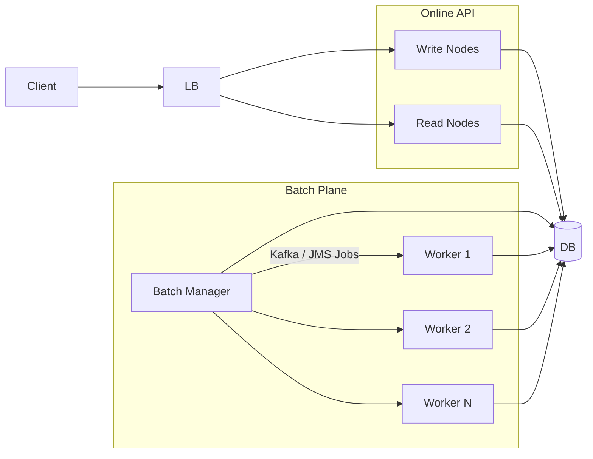
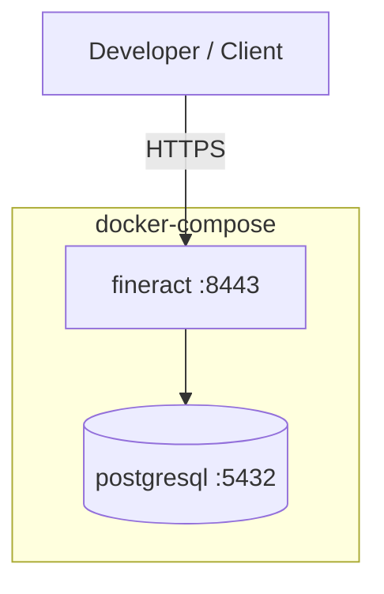
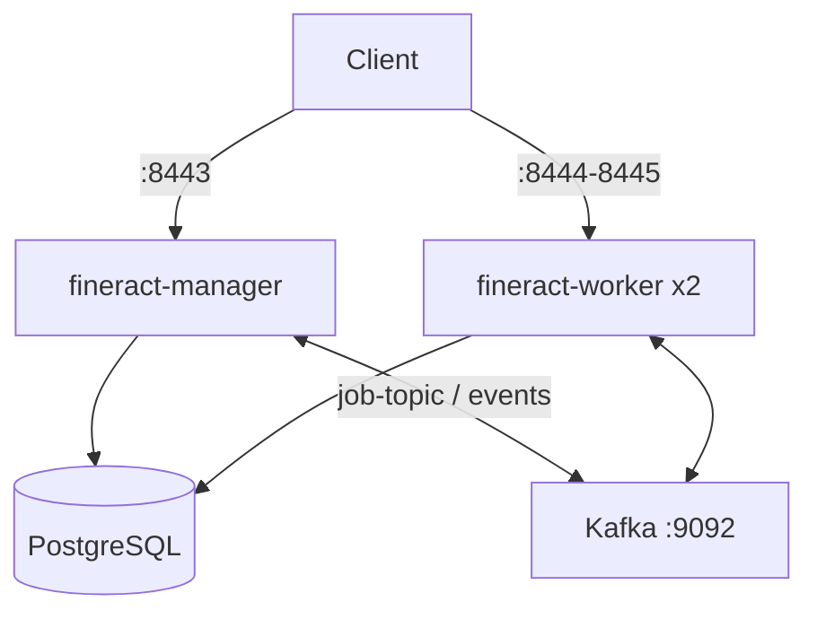
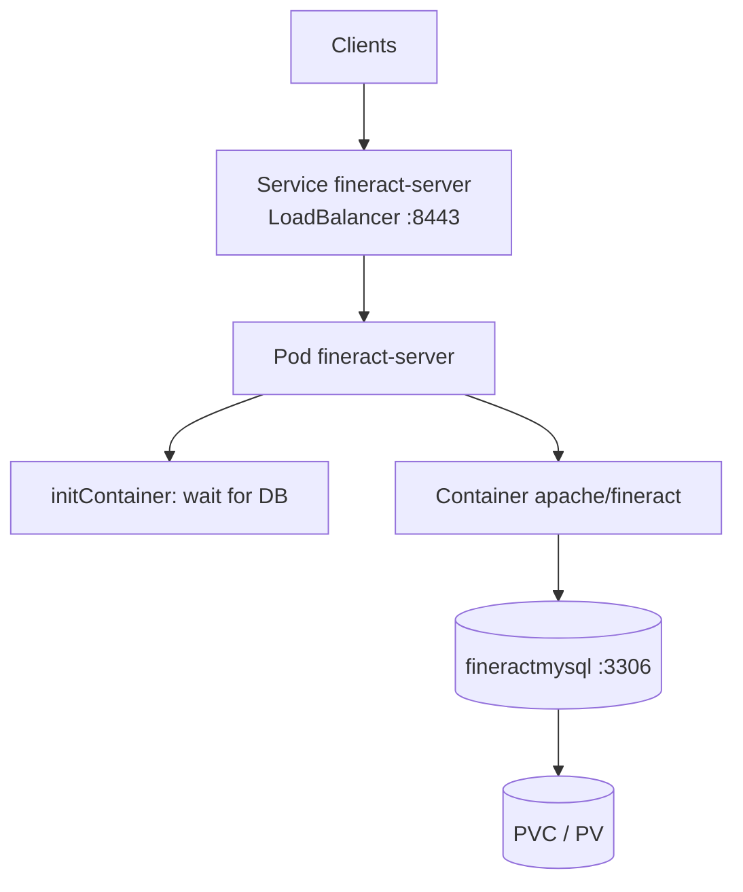
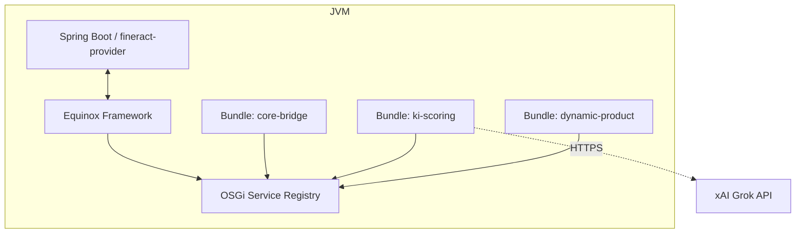
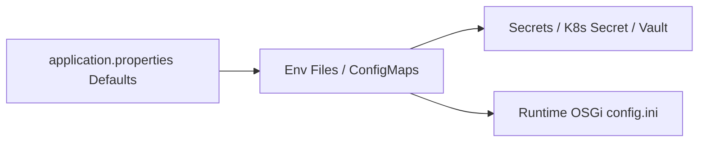
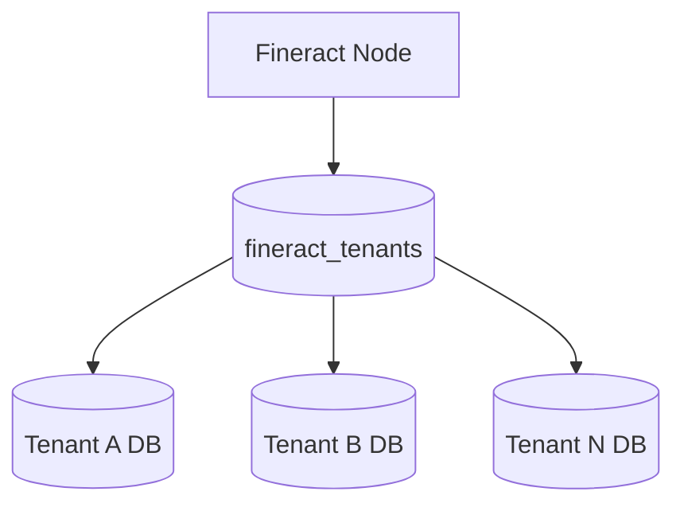

# 5. Deployment View

The Deployment View describes **where** and **how** the building blocks from [Chapter 3](03_building_block_view.md) are operated and which infrastructure they need at runtime ([Chapter 4](04_runtime_view.md)).

**Focus**: Infrastructure nodes, deployables, ports, configuration, and typical topologies – no product UI details.

**Note**: The shipped `docker/docker-compose*.yml` files and example manifests are primarily intended for **development and tests**. Production deployments need hardened secrets, TLS, backups, and capacity planning.

---

## 5.1 Overview of Deployment Layers

| Layer | Description | Typical Artifacts |
|-------|-------------|-------------------|
| **L1 – Infrastructure** | Hosts, cloud, cluster, network | VMs, Kubernetes nodes, load balancer |
| **L2 – Platform services** | DB, messaging, observability | PostgreSQL/MySQL/MariaDB, Kafka/ActiveMQ, Prometheus |
| **L3 – Application nodes** | Fineract processes with roles | Read / Write / Batch Manager / Batch Worker |
| **L4 – OSGi Runtime** | Dynamic modules in-process | Equinox + feature bundles |
| **L5 – External systems** | Optional, outside the cluster | xAI Grok API, payment gateways, IdP (OIDC) |


---

## 5.2 Infrastructure Nodes and Deployables

### 5.2.1 Application Deployable

| Property | Value |
|----------|-------|
| **Artifact** | Spring Boot fat JAR / container image (`fineract:latest` / `apache/fineract:latest`) |
| **Module** | `fineract-provider` (+ domain modules such as `fineract-loan`, `fineract-command`, …) |
| **Runtime** | JVM (G1GC recommended), HTTPS by default |
| **Main port** | **8443** (TLS) |
| **Health** | `/fineract-provider/actuator/health/liveness`, `.../readiness` |
| **Debug (optional)** | Port **5000** (JDWP, dev only) |

Container definition (excerpt from `config/docker/compose/fineract.yml`):

- Image: `fineract:latest`
- Volumes: Logback override, AWS credentials (optional), log directory
- Healthcheck: TCP/process on port 8443
- User: `FINERACT_USER` / `FINERACT_GROUP` (default `1000:1000`)

### 5.2.2 Database

| DB | Compose Service | Purpose |
|----|-----------------|---------|
| **PostgreSQL** (target for fineract-osgi) | `db` via `postgresql.yml` | Tenant metadata + tenant DBs |
| MySQL / MariaDB | alternative Compose files | Upstream compatibility, K8s example |

Important DB names (PostgreSQL example from `postgresql.env`):

- `fineract_tenants` – tenant registry / connection metadata
- `fineract_default` – default tenant schema/DB

Connection pool (HikariCP) via `FINERACT_HIKARI_*` (see `fineract-common.env`).

### 5.2.3 Messaging (Optional, for Multi-Node Batch)

| Broker | Compose | Use |
|--------|---------|-----|
| **Apache Kafka** | `docker/docker-compose-postgresql-kafka.yml` | Remote job messages + external events |
| **ActiveMQ** | `docker/docker-compose-postgresql-activemq.yml` | JMS-based job/event distribution |

Without a broker, manager and worker typically run **in the same process** (single node) with Spring events.

### 5.2.4 OSGi Framework (fineract-osgi)

| Property | Value |
|----------|-------|
| **Framework** | Eclipse Equinox (`org.eclipse.osgi`) |
| **Start** | `osgi/start-equinox.sh` or Gradle task `equinoxStart` |
| **Console** | Port **2501** (Equinox console) |
| **Config template** | `osgi/equinox/config.ini` |
| **Configuration area** | `osgi/config/` (`-configuration` must be this directory) |
| **Bundles** | `osgi/bundles/` (fill with `./gradlew osgiStageBundles`) |
| **Manifest check** | `./gradlew checkOsgiManifests` |
| **Logs** | `osgi/logs/equinox.log` |

Production target picture: Equinox **embedded** in the Fineract process (or as a dedicated sidecar only for bundle management in later iterations). Currently: workspace scaffold under `osgi/` and root `osgi.gradle`.

### 5.2.5 Observability Stack (Optional)

Under `config/docker/`:

| Component | Purpose | Env Switch |
|-----------|---------|------------|
| Prometheus | Metrics | `FINERACT_MANAGEMENT_PROMETHEUS_ENABLED` |
| Grafana | Dashboards | Compose `observability.yml` |
| Tempo / OTLP | Traces | `FINERACT_MANAGEMENT_OLTP_*` |
| CloudWatch | AWS metrics | `FINERACT_MANAGEMENT_CLOUDWATCH_*` |

---

## 5.3 Node Roles (Read / Write / Batch)

Fineract controls roles via mode flags (application properties / env):

| Flag | Env Variable | Meaning |
|------|--------------|---------|
| Read | `FINERACT_MODE_READ_ENABLED` | Read API (queries, reports) |
| Write | `FINERACT_MODE_WRITE_ENABLED` | Write commands (CQRS write path) |
| Batch Manager | `FINERACT_MODE_BATCH_MANAGER_ENABLED` | Plans/partitions jobs (e.g. COB) |
| Batch Worker | `FINERACT_MODE_BATCH_WORKER_ENABLED` | Executes job partitions |

Additionally:

- `FINERACT_NODE_ID` – unique node identifier (manager often `1`, workers `2+`)
- Worker: `FINERACT_LIQUIBASE_ENABLED=false` (schema migration only once, typically on the manager)

### Recommended Role Combinations

| Topology | Read | Write | Batch Manager | Batch Worker | Use |
|----------|:----:|:-----:|:-------------:|:------------:|-----|
| **All-in-One** | ✓ | ✓ | ✓ | ✓ | Dev, small institutions |
| **API + Batch separated** | ✓ | ✓ | – | – on API; manager+worker separate | Medium load |
| **Manager / Worker** | optional | optional | ✓ (1×) | ✓ (N×) | COB scaling |
| **Read-replica nodes** | ✓ | – | – | – | Report/read load |



Env templates in the repository:

- `config/docker/env/fineract-manager.env` – manager, COB chunk/partition sizes
- `config/docker/env/fineract-worker.env` – worker, Liquibase off

---

## 5.4 Deployment Scenario A: Docker Compose (Single Node)

**Purpose**: local smoke test, developer setup, demo.

**Reference files**:

- `docker/docker-compose.yml` / `docker/docker-compose-postgresql.yml`
- `config/docker/compose/fineract.yml`, `postgresql.yml`
- `config/docker/env/fineract.env`, `fineract-common.env`, `fineract-postgresql.env`

### Topology



### Services

| Service | Image / Source | Ports | Depends on |
|---------|----------------|-------|------------|
| `db` | `postgres:18.x` | 5432 | – |
| `fineract` | `fineract:latest` | 8443 (, 5000 debug) | `db` healthy |

### Start (Example)

```bash
# Build image (project-specific Gradle/Docker workflow)
docker compose -f docker/docker-compose-postgresql.yml up -d
```

### Characteristics

- All mode flags typically **true** (all-in-one)
- SSL active in the container (`FINERACT_SERVER_SSL_ENABLED=true`)
- Health: Compose waits for DB (`service_healthy`), Fineract healthcheck on 8443
- **Not** production-ready (clear comments in the Compose files)

### Variants in the Repository

| File | Focus |
|------|-------|
| `docker/docker-compose-postgresql.yml` | Standard PostgreSQL |
| `docker/docker-compose-mysql.yml` / `docker/docker-compose-mariadb.yml` | Alternative DBs |
| `docker/docker-compose-development.yml` | Dev-oriented configuration |
| `docker/docker-compose-oauth2-test.yml` | OAuth2/OIDC tests |
| `docker/docker-compose-twofactor-test.yml` | 2FA tests |
| `docker/docker-compose-web-app.yml` / `docker/docker-compose-community-app.yml` | UI alongside API |

---

## 5.5 Deployment Scenario B: Docker Compose Multi-Node (Manager + Worker)

**Purpose**: distributed COB / remote jobs, load distribution of the batch plane.

**Reference**: `docker/docker-compose-postgresql-kafka.yml` (analogous ActiveMQ variant).

### Topology



### Role Mapping

| Service | Node ID | Manager | Worker | Liquibase | Ports |
|---------|---------|:-------:|:------:|:---------:|-------|
| `fineract-manager` | 1 | ✓ | – | ✓ (default) | 8443 |
| `fineract-worker` (replicas 2) | 2 | – | ✓ | ✗ | 8444–8445 → 8443 |

### Messaging Configuration (Kafka Example)

From `kafka-client.env` / related env files:

- Remote job handler: Kafka enabled, topic e.g. `job-topic`
- External events: Kafka enabled, topic e.g. `external-events`
- Bootstrap: `kafka:9092`

### Start Order

1. `kafka` starts  
2. `db` healthy  
3. `fineract-manager` healthy (schema/migration, job orchestration)  
4. `fineract-worker` replicas start and consume partitions  

### Operating Rules

- **Exactly one** active batch manager per cluster (avoid split-brain).
- Scale workers horizontally; manager more vertically / HA active-passive.
- Shared DB must carry connection limits for `Manager + N×Worker + Online API`.
- COB tuning: `LOAN_COB_CHUNK_SIZE`, `LOAN_COB_PARTITION_SIZE`, `LOAN_COB_POLL_INTERVAL`.

---

## 5.6 Deployment Scenario C: Kubernetes

**Purpose**: cluster operations, service discovery, rolling/recreate deploys, secrets.

**Reference directory**: `kubernetes/`

| File | Content |
|------|---------|
| `fineract-server-deployment.yml` | Service (LoadBalancer :8443) + Deployment `fineract-server` |
| `fineractmysql-deployment.yml` | PV/PVC, MySQL Service + Deployment |
| `fineractmysql-configmap.yml` | DB init/config |
| `kubectl-startup.sh` / `kubectl-shutdown.sh` | Orchestration apply/wait/delete |

### Logical Topology



### Important K8s Aspects (Server Deployment)

| Aspect | Implementation in the Example |
|--------|-------------------------------|
| **Image** | `apache/fineract:latest` |
| **Resources** | Requests 200m CPU / 1Gi; Limits 1000m / 2Gi |
| **Liveness** | HTTPS GET `.../actuator/health/liveness` (initialDelay 90s) |
| **Readiness** | HTTPS GET `.../actuator/health/readiness` (initialDelay 60s) |
| **Strategy** | `Recreate` (simple example; production often RollingUpdate + PDB) |
| **Secrets** | `fineract-tenants-db-secret` (username/password) |
| **Init** | Busybox waits for MySQL port 3306 |

### Startup Script (Simplified Flow)

```bash
cd kubernetes
./kubectl-startup.sh
# 1) Create secret
# 2) ConfigMap + MySQL apply + wait ready
# 3) fineract-server apply + wait ready
```

### Production Extensions (Target Picture fineract-osgi)

- PostgreSQL as primary DB (StatefulSet or managed service)
- Separate deployments: `fineract-write`, `fineract-read`, `fineract-batch-manager`, `fineract-batch-worker`
- Ingress + cert-manager instead of bare LoadBalancer TLS in the pod
- HorizontalPodAutoscaler for read/worker
- NetworkPolicies (app → DB/MQ only)
- OSGi bundle volume or init container that places bundles in `osgi/bundles`

---

## 5.7 Deployment Scenario D: OSGi / Equinox Runtime

**Purpose**: dynamic modularity – load feature bundles (AI, product rules) at runtime.

### Process View



### Directory and Configuration Layout

```
osgi/
  start-equinox.sh          # Start script (-configuration config/)
  check-manifests.py        # BSN / Fragment-Host / Export-Package / api Import-Package guard
  equinox/
    config.ini              # Framework + Fineract mode template
    org.eclipse.osgi-*.jar  # Framework JAR (provide)
  bundles/                  # Staged api / impl / core JARs
  config/                   # Equinox configuration area
  logs/                     # equinox.log
```

### `config.ini` – Relevant Keys

| Key | Meaning |
|-----|---------|
| `osgi.noShutdown=true` | Framework stays active after start |
| `osgi.console.enable.builtin=true` | Equinox console |
| `osgi.bundles.defaultStartLevel=4` | Default start level for bundles |
| `osgi.startLevel=6` | Framework start level |
| `osgi.logfile=logs/equinox.log` | Framework log |
| `fineract.mode.*.enabled` | Roles analogous to application modes |

### Start

```bash
./gradlew osgiStageBundles   # optional: fill osgi/bundles + osgi/config/config.ini
./osgi/start-equinox.sh
# java -Xmx2g -XX:+UseG1GC \
#   -jar osgi/equinox/org.eclipse.osgi-*.jar \
#   -console 2501 -clean \
#   -configuration osgi/config
```

Gradle alternative (root `osgi.gradle`): task `equinoxStart` runs the same script.

### Deployment Rules for Bundles

1. Sign/verify bundle JARs (supply chain).
2. Deploy to `osgi/bundles` (ConfigMap/volume/object storage sync).
3. Choose start levels so core starts before extensions.
4. Optional services: missing bundle → core degrades, no total outage ([Runtime View 4.4](04_runtime_view.md)).
5. Rolling update: bundle stop → unbind → update → start; do not hard-abort running transactions.

---

## 5.8 Network, Ports, and Endpoints

| Port | Protocol | Service | Environment |
|------|----------|---------|-------------|
| **8443** | HTTPS | Fineract REST + Actuator | all app nodes |
| **5432** | TCP | PostgreSQL | DB |
| **3306** | TCP | MySQL/MariaDB | alternative DB / K8s example |
| **9092** | TCP | Kafka | multi-node jobs/events |
| **61616** | TCP | ActiveMQ | JMS alternative |
| **2501** | TCP | Equinox console | OSGi dev/ops (secure!) |
| **5000** | JDWP | Remote debug | development only |
| **4318** | HTTP | OTLP (Tempo) | observability |

Public API base (typical):

```
https://<host>:8443/fineract-provider/api/v1/...
```

Health (K8s probes):

```
https://<host>:8443/fineract-provider/actuator/health/liveness
https://<host>:8443/fineract-provider/actuator/health/readiness
```

---

## 5.9 Configuration and Secrets

### Layers



### Important Configuration Groups

| Group | Examples | Source in Repo |
|-------|----------|----------------|
| **Node / Mode** | `FINERACT_NODE_ID`, `FINERACT_MODE_*` | `fineract.env`, manager/worker env |
| **Datasource** | `FINERACT_HIKARI_*`, `FINERACT_DEFAULT_TENANTDB_*` | `fineract-postgresql.env`, common |
| **Pool** | Min idle, max pool, timeouts | `fineract-common.env` |
| **Messaging** | Kafka/JMS broker URLs, topics | `kafka-client.env`, `activemq.env` |
| **Security** | SSL, OAuth2, 2FA | compose test variants |
| **Observability** | Prometheus, OTLP, CloudWatch | `prometheus.env`, `oltp.env`, … |
| **COB** | Chunk/partition/poll | `fineract-manager.env` |

### Secrets Handling

| Environment | Recommendation |
|-------------|----------------|
| Docker Compose (dev) | Env files – **do not** commit prod passwords |
| Kubernetes | `Secret` (example: `fineract-tenants-db-secret`) |
| Production | External Secrets / Vault / Cloud KMS; rotation; least-privilege DB user |
| AI API | API keys only as secrets; never hardcode in bundle JAR |

---

## 5.10 Persistence and Multi-Tenancy in Deployment



Deployment implications:

- **Backup**: tenants DB + every tenant DB (consistent snapshots ideally close in time).
- **Connection limits**: `Hikari maximumPoolSize × node count × tenants` vs. DB `max_connections`.
- **Schema migration**: Liquibase primarily on manager/leading write node; workers without migration.
- **Storage**: K8s PV for DB; app nodes largely stateless (logs/temp separate).

---

## 5.11 Infrastructure for Runtime Scenarios

Mapping of the [Runtime View](04_runtime_view.md) to deployment:

| Runtime Scenario | Deployment Requirement |
|------------------|------------------------|
| Loan Creation (Write) | ≥1 write node, DB primary, TLS, auth |
| Command Processing | same write nodes; optional disruptor tuning per JVM |
| OSGi Bundle Lifecycle | Equinox in-process + bundle storage + console access (secured) |
| Multi-Tenant Request | correct tenant DB reachability; enough pool/connections |
| COB | Batch manager + N workers, messaging or co-located, observe COB filters |
| AI analysis | Egress to external API, timeouts, secrets, optional AI bundle |

---

## 5.12 Scaling and High Availability

| Layer | Horizontal | Vertical | HA Pattern |
|-------|------------|----------|------------|
| **Read nodes** | yes (stateless) | Heap/CPU | Load balancer, multiple replicas |
| **Write nodes** | limited (DB contention) | Heap/CPU | Session-free; idempotency helps on retries |
| **Batch Manager** | no (active 1) | yes | Active/passive, leader election (target) |
| **Batch Worker** | yes | yes | Competing consumers on job topic |
| **DB** | Read replicas for reports | IOPS/RAM | Managed HA, failover |
| **Kafka** | Broker cluster | – | Replication factor ≥ 3 in prod |
| **OSGi bundles** | identical set per node | – | same bundle versions cluster-wide |

### Capacity Rules of Thumb (Starting Point, Measure!)

- Write-node heap: 2–4 GiB small, 8+ GiB COB-heavy  
- Worker: CPU-bound on COB steps; try more replicas before more heap  
- DB: IOPS and connections are often the bottleneck, not the API pods  

---

## 5.13 Security Aspects in Deployment

| Topic | Measure |
|-------|---------|
| **Transport** | HTTPS 8443; internal mTLS optional (service mesh) |
| **Secrets** | no plaintext passwords in images/Git |
| **Equinox console** | Port 2501 not public; admin network / port-forward only |
| **JDWP 5000** | dev only; never expose in prod services |
| **Network policy** | App → DB/MQ/AI API; no broad egress |
| **Image supply chain** | pinned tags/digests, scanning, signed bundles |
| **AuthN/Z** | Basic/OAuth2/2FA per Compose/prod profile; do not allow tenant-header spoofing |

---

## 5.14 Deployment Quality and Constraints

- **Stateless app nodes** ease scaling; state lives in DB and messaging.
- **Role flags** must match the topology (no second active manager “by accident”).
- **OSGi** increases flexibility but requires bundle lifecycle discipline and version compatibility.
- **Observability** is part of deployment: without metrics/traces, COB and pool problems are hard to diagnose.
- Compose/example K8s setups are **blueprints**, not a finished bank production.

---

## 5.15 Open Points / Next Iterations

- Final image layout: embedded Equinox vs. separate bundle manager
- Helm chart for fineract-osgi (PostgreSQL, manager/worker, bundle PVC)
- Managed PostgreSQL + Kafka on cloud providers (reference architecture)
- Blue/green or canary for bundle and app releases
- Disaster-recovery runbook (RPO/RTO for tenant DBs)
- Hardening checklist (TLS certificates, secret rotation, console disable in prod)

---

## 5.16 Related Gherkin Features

| Deployment Topic | Feature |
|------------------|---------|
| Node modes Read/Write/Batch | [crosscutting/node_modes.feature](../gherkin/features/crosscutting/node_modes.feature) |
| Manager/Worker + COB | [cob/close_of_business.feature](../gherkin/features/cob/close_of_business.feature) |
| OSGi bundle operations | [osgi/optional_bundle_degradation.feature](../gherkin/features/osgi/optional_bundle_degradation.feature) |

Tags: `@arc42-05`, `@adr-007`, `@adr-012` — Mapping: [gherkin/README.md](../gherkin/README.md).

---

*Next*: [06 Crosscutting Concepts](06_crosscutting_concepts.md) · *Back*: [04 Runtime View](04_runtime_view.md)
