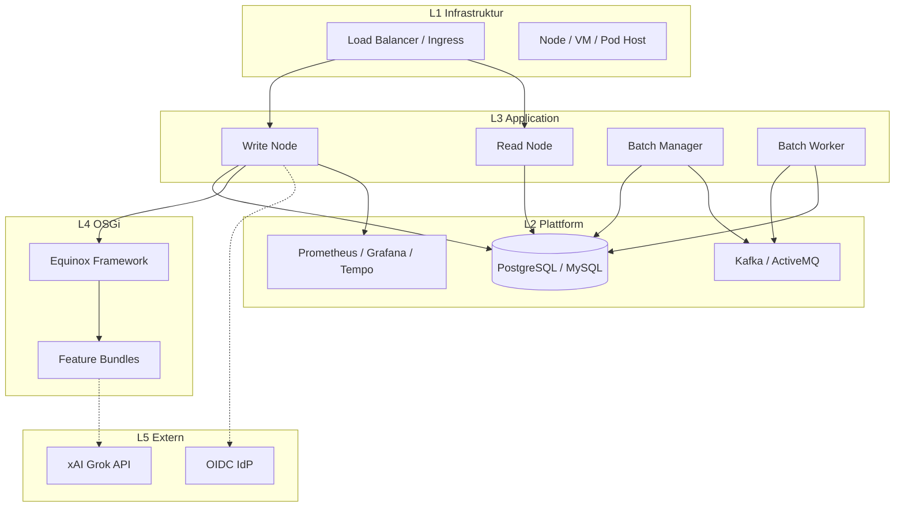
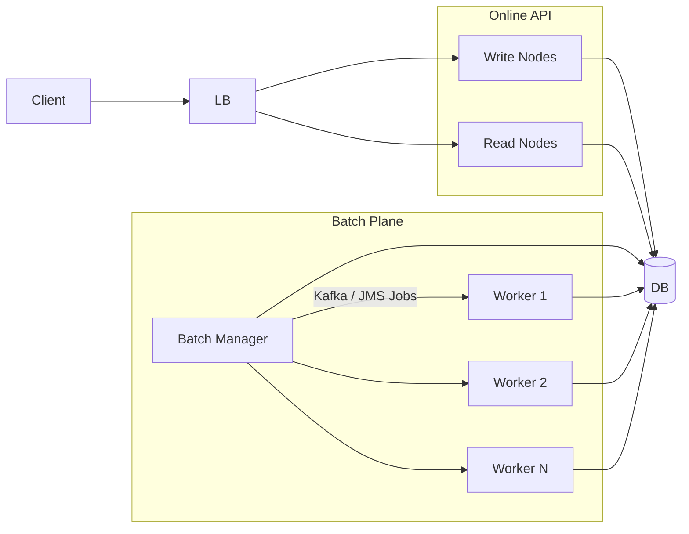
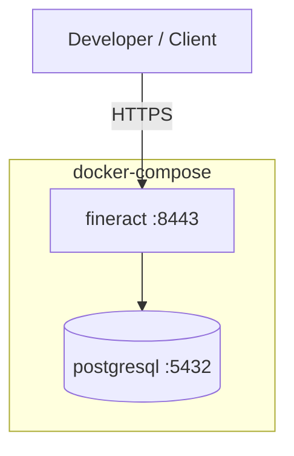
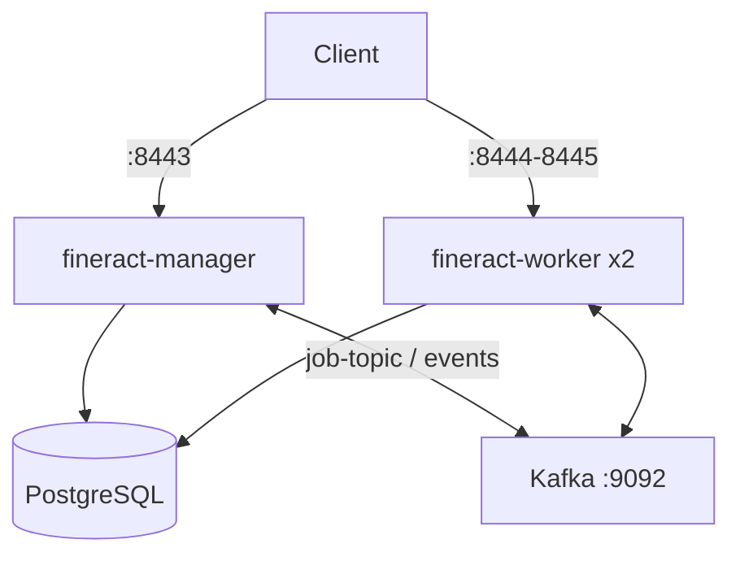
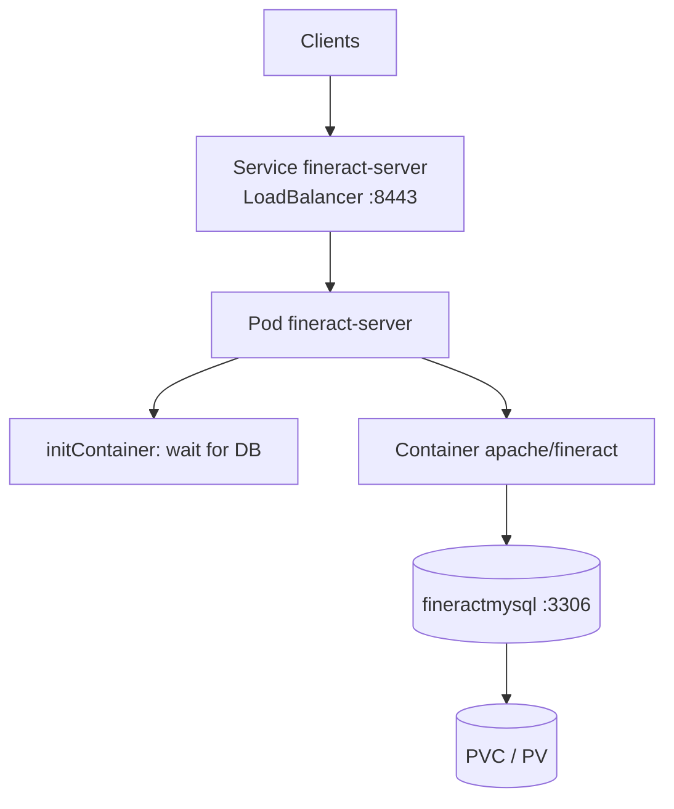
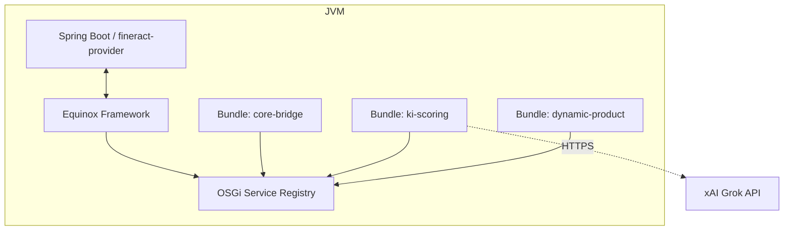
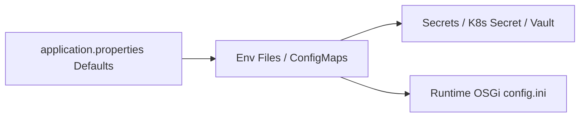
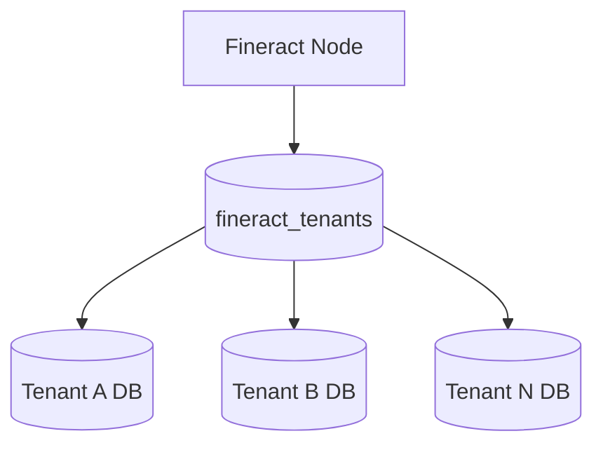

# 5. Deployment View

Die Deployment View beschreibt, **wo** und **wie** die Bausteine aus [Kapitel 3](03_building_block_view.md) betrieben werden und welche Infrastruktur sie zur Laufzeit ([Kapitel 4](04_runtime_view.md)) benötigen.

**Fokus**: Infrastrukturknoten, Deployables, Ports, Konfiguration und typische Topologien – keine Produkt-UI-Details.

**Hinweis**: Die mitgelieferten `docker-compose*.yml`-Dateien und Beispiel-Manifeste sind primär für **Entwicklung und Tests** gedacht. Produktions-Deployments brauchen gehärtete Secrets, TLS, Backups und Capacity-Planning.

---

## 5.1 Überblick der Deployment-Ebenen

| Ebene | Beschreibung | Typische Artefakte |
|-------|--------------|--------------------|
| **L1 – Infrastruktur** | Hosts, Cloud, Cluster, Netzwerk | VMs, Kubernetes Nodes, Load Balancer |
| **L2 – Plattformdienste** | DB, Messaging, Observability | PostgreSQL/MySQL/MariaDB, Kafka/ActiveMQ, Prometheus |
| **L3 – Application Nodes** | Fineract-Prozesse mit Rollen | Read / Write / Batch-Manager / Batch-Worker |
| **L4 – OSGi Runtime** | Dynamische Module im Prozess | Equinox + Feature-Bundles |
| **L5 – Externe Systeme** | Optional, außerhalb des Clusters | xAI Grok API, Payment Gateways, IdP (OIDC) |



---

## 5.2 Infrastrukturknoten und Deployables

### 5.2.1 Application Deployable

| Eigenschaft | Wert |
|-------------|------|
| **Artefakt** | Spring-Boot-Fat-JAR / Container-Image (`fineract:latest` / `apache/fineract:latest`) |
| **Modul** | `fineract-provider` (+ Domain-Module wie `fineract-loan`, `fineract-command`, …) |
| **Runtime** | JVM (G1GC empfohlen), HTTPS standardmäßig |
| **Hauptport** | **8443** (TLS) |
| **Health** | `/fineract-provider/actuator/health/liveness`, `.../readiness` |
| **Debug (optional)** | Port **5000** (JDWP, nur Dev) |

Container-Definition (Auszug aus `config/docker/compose/fineract.yml`):

- Image: `fineract:latest`
- Volumes: Logback-Override, AWS-Credentials (optional), Log-Verzeichnis
- Healthcheck: TCP/Prozess auf Port 8443
- User: `FINERACT_USER` / `FINERACT_GROUP` (Default `1000:1000`)

### 5.2.2 Datenbank

| DB | Compose-Service | Zweck |
|----|-----------------|--------|
| **PostgreSQL** (Ziel für fineract-osgi) | `db` via `postgresql.yml` | Tenant-Metadaten + Tenant-DBs |
| MySQL / MariaDB | alternative Compose-Dateien | Upstream-Kompatibilität, K8s-Beispiel |

Wichtige DB-Namen (PostgreSQL-Beispiel aus `postgresql.env`):

- `fineract_tenants` – Tenant-Registry / Connection-Metadaten
- `fineract_default` – Default-Tenant-Schema/DB

Connection Pool (HikariCP) über `FINERACT_HIKARI_*` (siehe `fineract-common.env`).

### 5.2.3 Messaging (optional, für Multi-Node Batch)

| Broker | Compose | Einsatz |
|--------|---------|---------|
| **Apache Kafka** | `docker-compose-postgresql-kafka.yml` | Remote Job Messages + External Events |
| **ActiveMQ** | `docker-compose-postgresql-activemq.yml` | JMS-basierte Job-/Event-Verteilung |

Ohne Broker laufen Manager und Worker typischerweise **im selben Prozess** (Single-Node) mit Spring Events.

### 5.2.4 OSGi Framework (fineract-osgi)

| Eigenschaft | Wert |
|-------------|------|
| **Framework** | Eclipse Equinox (`org.eclipse.osgi`) |
| **Start** | `osgi/start-equinox.sh` oder Gradle-Task `equinoxStart` |
| **Console** | Port **2501** (Equinox Console) |
| **Config** | `osgi/equinox/config.ini` |
| **Bundles** | `osgi/bundles/` |
| **Logs** | `osgi/logs/equinox.log` |

Zielbild Produktion: Equinox **eingebettet** im Fineract-Prozess (oder als dedizierter Sidecar nur für Bundle-Management in späteren Iterationen). Aktuell: Workspace-Scaffold unter `osgi/` und `docs/arc42/osgi.gradle`.

### 5.2.5 Observability-Stack (optional)

Unter `config/docker/`:

| Komponente | Zweck | Env-Schalter |
|------------|--------|--------------|
| Prometheus | Metriken | `FINERACT_MANAGEMENT_PROMETHEUS_ENABLED` |
| Grafana | Dashboards | Compose `observability.yml` |
| Tempo / OTLP | Traces | `FINERACT_MANAGEMENT_OLTP_*` |
| CloudWatch | AWS-Metriken | `FINERACT_MANAGEMENT_CLOUDWATCH_*` |

---

## 5.3 Node-Rollen (Read / Write / Batch)

Fineract steuert die Rollen über Mode-Flags (Application Properties / Env):

| Flag | Env-Variable | Bedeutung |
|------|--------------|-----------|
| Read | `FINERACT_MODE_READ_ENABLED` | Lesende API (Queries, Reports) |
| Write | `FINERACT_MODE_WRITE_ENABLED` | Schreibende Commands (CQRS Write-Pfad) |
| Batch Manager | `FINERACT_MODE_BATCH_MANAGER_ENABLED` | Plant/partitioniert Jobs (z. B. COB) |
| Batch Worker | `FINERACT_MODE_BATCH_WORKER_ENABLED` | Führt Job-Partitionen aus |

Zusätzlich:

- `FINERACT_NODE_ID` – eindeutige Node-Kennung (Manager oft `1`, Worker `2+`)
- Worker: `FINERACT_LIQUIBASE_ENABLED=false` (Schema-Migration nur einmal, typisch am Manager)

### Empfohlene Rollen-Kombinationen

| Topologie | Read | Write | Batch Manager | Batch Worker | Einsatz |
|-----------|:----:|:-----:|:-------------:|:------------:|---------|
| **All-in-One** | ✓ | ✓ | ✓ | ✓ | Dev, kleine Institute |
| **API + Batch getrennt** | ✓ | ✓ | – | – auf API; Manager+Worker separat | Mittlere Last |
| **Manager / Worker** | optional | optional | ✓ (1×) | ✓ (N×) | COB-Skalierung |
| **Read-Replica-Nodes** | ✓ | – | – | – | Report-/Lese-Last |



Env-Vorlagen im Repo:

- `config/docker/env/fineract-manager.env` – Manager, COB-Chunk/Partition-Größen
- `config/docker/env/fineract-worker.env` – Worker, Liquibase aus

---

## 5.4 Deployment-Szenario A: Docker Compose (Single Node)

**Zweck**: lokaler Smoke-Test, Entwickler-Setup, Demo.

**Referenzdateien**:

- `docker-compose.yml` / `docker-compose-postgresql.yml`
- `config/docker/compose/fineract.yml`, `postgresql.yml`
- `config/docker/env/fineract.env`, `fineract-common.env`, `fineract-postgresql.env`

### Topologie



### Services

| Service | Image / Source | Ports | Depends on |
|---------|----------------|-------|------------|
| `db` | `postgres:18.x` | 5432 | – |
| `fineract` | `fineract:latest` | 8443 (, 5000 Debug) | `db` healthy |

### Start (Beispiel)

```bash
# Image bauen (projektspezifischer Gradle/Docker-Workflow)
docker compose -f docker-compose-postgresql.yml up -d
```

### Eigenschaften

- Alle Mode-Flags typischerweise **true** (All-in-One)
- SSL im Container aktiv (`FINERACT_SERVER_SSL_ENABLED=true`)
- Health: Compose wartet auf DB (`service_healthy`), Fineract-Healthcheck auf 8443
- **Nicht** production-ready (klare Kommentare in den Compose-Dateien)

### Varianten im Repo

| Datei | Fokus |
|-------|--------|
| `docker-compose-postgresql.yml` | Standard PostgreSQL |
| `docker-compose-mysql.yml` / `mariadb.yml` | Alternative DBs |
| `docker-compose-development.yml` | Dev-nahe Konfiguration |
| `docker-compose-oauth2-test.yml` | OAuth2/OIDC-Tests |
| `docker-compose-twofactor-test.yml` | 2FA-Tests |
| `docker-compose-web-app.yml` / `community-app.yml` | UI neben API |

---

## 5.5 Deployment-Szenario B: Docker Compose Multi-Node (Manager + Worker)

**Zweck**: verteilter COB / Remote Jobs, Lastverteilung der Batch-Plane.

**Referenz**: `docker-compose-postgresql-kafka.yml` (analog ActiveMQ-Variante).

### Topologie



### Rollen-Mapping

| Service | Node-ID | Manager | Worker | Liquibase | Ports |
|---------|---------|:-------:|:------:|:---------:|-------|
| `fineract-manager` | 1 | ✓ | – | ✓ (Default) | 8443 |
| `fineract-worker` (Replicas 2) | 2 | – | ✓ | ✗ | 8444–8445 → 8443 |

### Messaging-Konfiguration (Kafka-Beispiel)

Aus `kafka-client.env` / verwandten Env-Dateien:

- Remote Job Handler: Kafka enabled, Topic z. B. `job-topic`
- External Events: Kafka enabled, Topic z. B. `external-events`
- Bootstrap: `kafka:9092`

### Startreihenfolge

1. `kafka` startet  
2. `db` healthy  
3. `fineract-manager` healthy (Schema/Migration, Job-Orchestrierung)  
4. `fineract-worker` Replicas starten und konsumieren Partitionen  

### Betriebsregeln

- **Genau ein** aktiver Batch-Manager pro Cluster (Split-Brain vermeiden).
- Worker horizontal skalieren; Manager eher vertikal / HA aktiv-passiv.
- Shared DB muss Connection-Limits für `Manager + N×Worker + Online-API` tragen.
- COB-Tuning: `LOAN_COB_CHUNK_SIZE`, `LOAN_COB_PARTITION_SIZE`, `LOAN_COB_POLL_INTERVAL`.

---

## 5.6 Deployment-Szenario C: Kubernetes

**Zweck**: Cluster-Betrieb, Service-Discovery, Rolling/Recreate-Deploys, Secrets.

**Referenzverzeichnis**: `kubernetes/`

| Datei | Inhalt |
|-------|--------|
| `fineract-server-deployment.yml` | Service (LoadBalancer :8443) + Deployment `fineract-server` |
| `fineractmysql-deployment.yml` | PV/PVC, MySQL Service + Deployment |
| `fineractmysql-configmap.yml` | DB-Init/Config |
| `kubectl-startup.sh` / `kubectl-shutdown.sh` | Orchestrierung apply/wait/delete |

### Logische Topologie



### Wichtige K8s-Aspekte (Server-Deployment)

| Aspekt | Umsetzung im Beispiel |
|--------|------------------------|
| **Image** | `apache/fineract:latest` |
| **Resources** | Requests 200m CPU / 1Gi; Limits 1000m / 2Gi |
| **Liveness** | HTTPS GET `.../actuator/health/liveness` (initialDelay 90s) |
| **Readiness** | HTTPS GET `.../actuator/health/readiness` (initialDelay 60s) |
| **Strategy** | `Recreate` (einfaches Beispiel; Produktion oft RollingUpdate + PDB) |
| **Secrets** | `fineract-tenants-db-secret` (Username/Password) |
| **Init** | Busybox wartet auf MySQL-Port 3306 |

### Start-Skript (vereinfachter Ablauf)

```bash
cd kubernetes
./kubectl-startup.sh
# 1) Secret anlegen
# 2) ConfigMap + MySQL apply + wait ready
# 3) fineract-server apply + wait ready
```

### Produktions-Erweiterungen (Zielbild fineract-osgi)

- PostgreSQL als primäre DB (StatefulSet oder Managed Service)
- Getrennte Deployments: `fineract-write`, `fineract-read`, `fineract-batch-manager`, `fineract-batch-worker`
- Ingress + cert-manager statt nacktem LoadBalancer-TLS im Pod
- HorizontalPodAutoscaler für Read/Worker
- NetworkPolicies (App → DB/MQ only)
- OSGi-Bundle-Volume oder Init-Container, der Bundles nach `osgi/bundles` legt

---

## 5.7 Deployment-Szenario D: OSGi / Equinox Runtime

**Zweck**: dynamische Modularität – Feature-Bundles (KI, Product Rules) zur Laufzeit laden.

### Prozesssicht



### Verzeichnis- und Konfigurationslayout

```
osgi/
  start-equinox.sh          # Start-Skript
  equinox/
    config.ini              # Framework + Fineract Mode Flags
    org.eclipse.osgi-*.jar  # Framework JAR (bereitstellen)
  bundles/                  # installierbare Feature-JARs
  config/                   # OSGi configuration area
  logs/                     # equinox.log
```

### `config.ini` – relevante Keys

| Key | Bedeutung |
|-----|-----------|
| `osgi.noShutdown=true` | Framework bleibt nach Start aktiv |
| `osgi.console.enable.builtin=true` | Equinox Console |
| `osgi.bundles.defaultStartLevel=4` | Default Start-Level für Bundles |
| `osgi.startLevel=6` | Framework Start-Level |
| `osgi.logfile=logs/equinox.log` | Framework-Log |
| `fineract.mode.*.enabled` | Rollen analog Application Modes |

### Start

```bash
./osgi/start-equinox.sh
# java -Xmx2g -XX:+UseG1GC \
#   -jar osgi/equinox/org.eclipse.osgi-*.jar \
#   -console 2501 -clean \
#   -configuration osgi/equinox/config.ini
```

Gradle-Alternative (`docs/arc42/osgi.gradle`): Task `equinoxStart` mit Main-Class `org.eclipse.osgi.launch.Equinox`.

### Deployment-Regeln für Bundles

1. Bundle-JAR signieren/prüfen (Supply Chain).
2. Nach `osgi/bundles` deployen (ConfigMap/Volume/Object Storage Sync).
3. Start-Level so wählen, dass Core vor Extensions startet.
4. Optional Services: fehlendes Bundle → Core degradiert, kein Totalausfall ([Runtime View 4.4](04_runtime_view.md)).
5. Rolling Update: Bundle stop → unbind → update → start; laufende Transaktionen nicht hart abbrechen.

---

## 5.8 Netzwerk, Ports und Endpunkte

| Port | Protokoll | Dienst | Umgebung |
|------|-----------|--------|----------|
| **8443** | HTTPS | Fineract REST + Actuator | alle App-Nodes |
| **5432** | TCP | PostgreSQL | DB |
| **3306** | TCP | MySQL/MariaDB | alternative DB / K8s-Beispiel |
| **9092** | TCP | Kafka | Multi-Node Jobs/Events |
| **61616** | TCP | ActiveMQ | JMS-Alternative |
| **2501** | TCP | Equinox Console | OSGi Dev/Ops (absichern!) |
| **5000** | JDWP | Remote Debug | nur Development |
| **4318** | HTTP | OTLP (Tempo) | Observability |

Öffentliche API-Basis (typisch):

```
https://<host>:8443/fineract-provider/api/v1/...
```

Health (K8s-Probes):

```
https://<host>:8443/fineract-provider/actuator/health/liveness
https://<host>:8443/fineract-provider/actuator/health/readiness
```

---

## 5.9 Konfiguration und Secrets

### Schichten



### Wichtige Konfigurationsgruppen

| Gruppe | Beispiele | Quelle im Repo |
|--------|-----------|----------------|
| **Node / Mode** | `FINERACT_NODE_ID`, `FINERACT_MODE_*` | `fineract.env`, manager/worker env |
| **Datasource** | `FINERACT_HIKARI_*`, `FINERACT_DEFAULT_TENANTDB_*` | `fineract-postgresql.env`, common |
| **Pool** | Min Idle, Max Pool, Timeouts | `fineract-common.env` |
| **Messaging** | Kafka/JMS Broker URLs, Topics | `kafka-client.env`, `activemq.env` |
| **Security** | SSL, OAuth2, 2FA | compose-test-Varianten |
| **Observability** | Prometheus, OTLP, CloudWatch | `prometheus.env`, `oltp.env`, … |
| **COB** | Chunk/Partition/Poll | `fineract-manager.env` |

### Secrets-Handling

| Umgebung | Empfehlung |
|----------|------------|
| Docker Compose (Dev) | Env-Dateien – **keine** Prod-Passwörter committen |
| Kubernetes | `Secret` (Beispiel: `fineract-tenants-db-secret`) |
| Produktion | External Secrets / Vault / Cloud KMS; Rotation; Least Privilege DB-User |
| KI-API | API-Keys nur als Secret; nie in Bundle-JAR hardcoden |

---

## 5.10 Persistenz und Multi-Tenancy im Deployment



Deployment-Implikationen:

- **Backup**: Tenants-DB + jede Tenant-DB (konsistente Snapshots idealerweise zeitnah).
- **Connection Limits**: `Hikari maximumPoolSize × Node-Anzahl × Tenants` vs. DB `max_connections`.
- **Schema-Migration**: Liquibase primär auf Manager/führendem Write-Node; Worker ohne Migration.
- **Storage**: K8s PV für DB; App-Nodes weitgehend stateless (Logs/temp separat).

---

## 5.11 Infrastruktur für Runtime-Szenarien

Mapping der [Runtime View](04_runtime_view.md) auf Deployment:

| Runtime-Szenario | Deployment-Anforderung |
|------------------|------------------------|
| Loan Creation (Write) | ≥1 Write-Node, DB primary, TLS, Auth |
| Command Processing | gleiche Write-Nodes; optional disruptor-Tuning pro JVM |
| OSGi Bundle Lifecycle | Equinox im Prozess + Bundle-Storage + Console-Zugriff (abgesichert) |
| Multi-Tenant Request | korrekte Tenant-DB-Erreichbarkeit; genügend Pool/Connections |
| COB | Batch Manager + N Worker, Messaging oder co-located, COB-Filter beachten |
| KI-Analyse | Egress zu externer API, Timeouts, Secrets, optionales KI-Bundle |

---

## 5.12 Skalierung und Hochverfügbarkeit

| Ebene | Horizontal | Vertikal | HA-Muster |
|-------|------------|----------|-----------|
| **Read Nodes** | ja (stateless) | Heap/CPU | Load Balancer, mehrere Replicas |
| **Write Nodes** | begrenzt (DB-Contention) | Heap/CPU | Session-frei; Idempotency hilft bei Retries |
| **Batch Manager** | nein (aktiv 1) | ja | Aktiv/Passiv, Leader Election (Ziel) |
| **Batch Worker** | ja | ja | konkurrierende Consumer auf Job-Topic |
| **DB** | Read Replicas für Reports | IOPS/RAM | Managed HA, Failover |
| **Kafka** | Broker-Cluster | – | Replication Factor ≥ 3 in Prod |
| **OSGi Bundles** | pro Node identisches Set | – | gleiche Bundle-Versionen cluster-weit |

### Kapazitäts-Faustregeln (Startpunkt, messen!)

- Write-Node Heap: 2–4 GiB klein, 8+ GiB COB-lastig  
- Worker: CPU-bound bei COB-Steps; mehr Replicas vor mehr Heap testen  
- DB: IOPS und Connections sind häufig der Flaschenhals, nicht die API-Pods  

---

## 5.13 Sicherheitsaspekte im Deployment

| Thema | Maßnahme |
|-------|----------|
| **Transport** | HTTPS 8443; internes mTLS optional (Service Mesh) |
| **Secrets** | keine Klartext-Passwörter in Images/Git |
| **Equinox Console** | Port 2501 nicht öffentlich; nur Admin-Netz / port-forward |
| **JDWP 5000** | nur Dev; nie in Prod-Services exposen |
| **Network Policy** | App → DB/MQ/KI-API; kein breites Egress |
| **Image Supply Chain** | pinned Tags/Digests, Scanning, signierte Bundles |
| **AuthN/Z** | Basic/OAuth2/2FA je nach Compose-/Prod-Profil; Tenant-Header nicht spoofen lassen |

---

## 5.14 Deployment-Qualität und Constraints

- **Stateless App-Nodes** erleichtern Skalierung; Zustand liegt in DB und Messaging.
- **Rollen-Flags** müssen zur Topologie passen (kein zweiter aktiver Manager „aus Versehen“).
- **OSGi** erhöht Flexibilität, verlangt aber Bundle-Lifecycle-Disziplin und Versions-Kompatibilität.
- **Observability** ist Teil des Deployments: ohne Metriken/Traces sind COB- und Pool-Probleme schwer diagnostizierbar.
- Compose-/Beispiel-K8s-Setups sind **Blaupausen**, keine fertige Bank-Produktion.

---

## 5.15 Offene Punkte / nächste Iterationen

- Finales Image-Layout: eingebettetes Equinox vs. separater Bundle-Manager
- Helm-Chart für fineract-osgi (PostgreSQL, Manager/Worker, Bundle-PVC)
- Managed PostgreSQL + Kafka auf Cloud-Providern (Referenzarchitektur)
- Blue/Green oder Canary für Bundle- und App-Releases
- Disaster-Recovery-Runbook (RPO/RTO für Tenant-DBs)
- Härtungs-Checklist (TLS-Zertifikate, Secret-Rotation, Console-Disable in Prod)

---

## 5.16 Verwandte Gherkin-Features

| Deployment-Thema | Feature |
|------------------|---------|
| Node Modes Read/Write/Batch | [crosscutting/node_modes.feature](../gherkin/features/crosscutting/node_modes.feature) |
| Manager/Worker + COB | [cob/close_of_business.feature](../gherkin/features/cob/close_of_business.feature) |
| OSGi Bundle-Betrieb | [osgi/optional_bundle_degradation.feature](../gherkin/features/osgi/optional_bundle_degradation.feature) |

Tags: `@arc42-05`, `@adr-007`, `@adr-012` — Mapping: [gherkin/README.md](../gherkin/README.md).

---

*Weiter*: [06 Crosscutting Concepts](06_crosscutting_concepts.md) · *Zurück*: [04 Runtime View](04_runtime_view.md)
