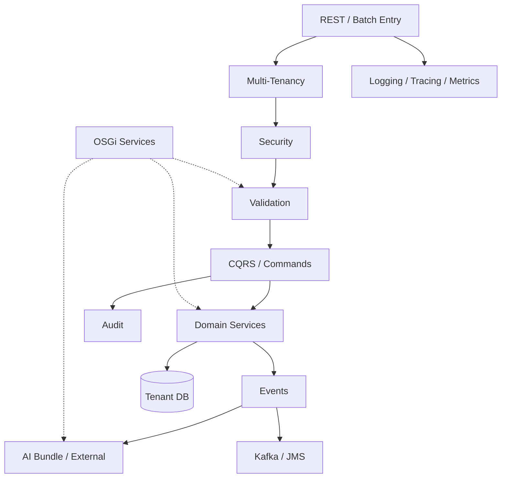
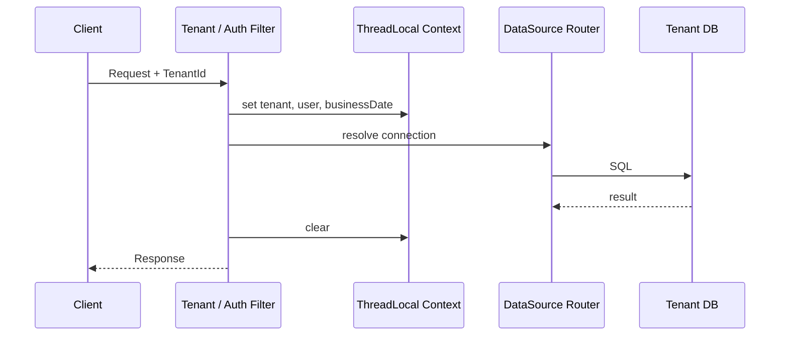
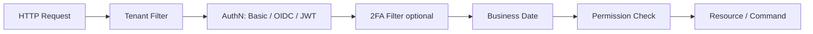
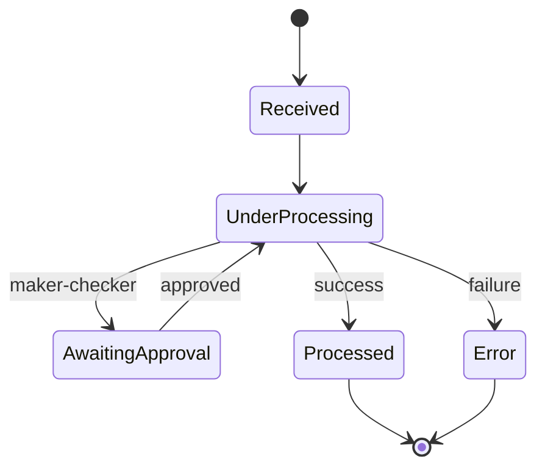
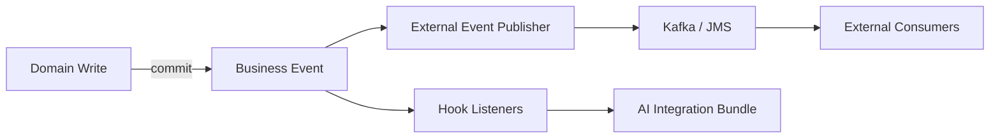
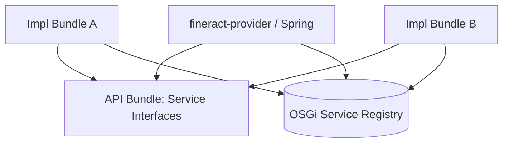
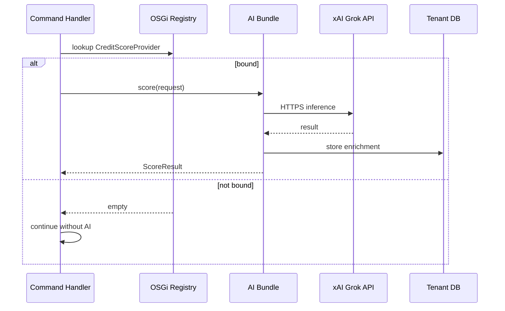
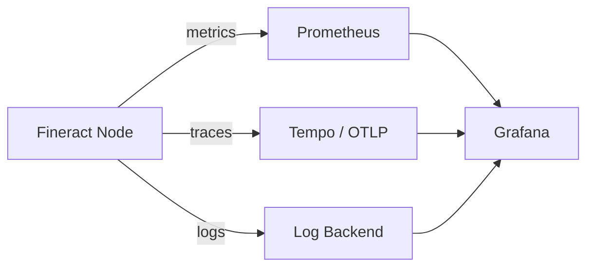
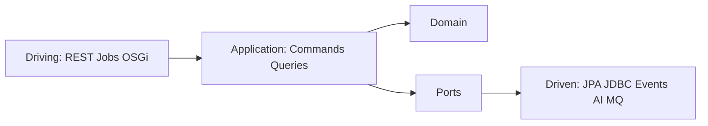
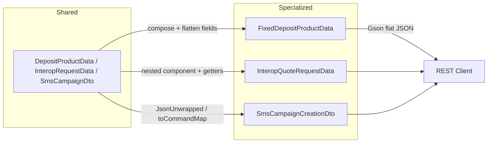

# 6. Crosscutting Concepts

Crosscutting concepts are architecture-wide solution approaches that span **multiple building blocks and runtime scenarios**. They explain the “how across the system?”, while [Chapter 4](04_runtime_view.md) describes concrete flows and [Chapter 5](05_deployment_view.md) describes operations.

**Notation**: Concept → Motivation → Mechanism → Rules/Constraints. Diagrams where helpful.

---

## 6.1 Overview

| # | Concept | Primary goal | Main modules / artifacts |
|---|---------|--------------|--------------------------|
| 1 | Multi-Tenancy | Isolation per institution | Tenant filters, `ThreadLocalContext`, tenant DBs |
| 2 | Security & Authorization | Authentication, permissions, 2FA/OIDC | `fineract-security`, Permissions |
| 3 | CQRS, Commands & Audit | Write path, traceability | Command pipeline, `m_portfolio_command_source` |
| 4 | Validation & Error Handling | Early, consistent errors | Jakarta Validation, Platform Exceptions |
| 5 | Domain & External Events | Decoupling, integration | Business Events, Hooks, Kafka/JMS |
| 6 | OSGi Modularity | Dynamic extensibility | Equinox, Service Registry, Bundles |
| 7 | AI Integration | External intelligence without monolith ML | AI bundle, xAI Grok API, Policies |
| 8 | Logging, Correlation & Observability | Operational safety | Logs, Metrics, Traces, Actuator |
| 9 | Jobs, COB & Resilience | Batch reliability | Partitioned Jobs, Retry, Message Handler |
| 10 | Configuration & Feature Modes | Environment-specific behavior | Env, Modes, Config Domain Service |
| 11 | Data Access & Caching | Performance, pooling | HikariCP, optional caches |
| 12 | API Style, DTO Composition & Compatibility | Stable integrations | REST, Idempotency, OpenAPI, Gson SPI |
| 13 | Hexagonal Architecture | Dependency rule, swappable edges | Ports & Adapters, CQRS, OSGi, AI |
| 14 | Clean Code | Readability, testability, safe evolution | Names, small units, Boy Scout, SOLID, CI |
| 15 | Domain-Driven Design | Domain models and context boundaries | Aggregates, UL, Events, Bounded Contexts |
| 16 | Event Sourcing (Writes) | Append-only write history | Event Store, Projectors, Snapshots |



---

## 6.2 Multi-Tenancy

### Motivation

One deployment serves **many institutions** (tenants). Data, configuration, business date, and often also the auth IdP must remain strictly separated.

### Mechanism

1. **Tenant identification** at the request edge  
   Header (e.g. Tenant ID), routing, or OIDC tenant context.
2. **Tenant resolution**  
   Metadata from `fineract_tenants` (JDBC URL, credentials, timezone, …).
3. **Context set**  
   `ThreadLocalContextUtil` / request context: tenant, user, business date.
4. **DataSource routing**  
   Connections go to the tenant DB (not to the registry DB for domain data).
5. **Context clear**  
   After request/job partition – mandatory against thread leaks (incl. virtual threads).

Relevant filters (excerpt from `fineract-security`):

- `TenantAwareBasicAuthenticationFilter`
- `TenantAwareAuthenticationFilter`
- `OidcTenantAwareFilter`
- `BusinessDateFilter`



### Rules

| Rule | Rationale |
|------|-----------|
| No domain access without tenant context | Prevents cross-tenant leaks |
| Batch partition = one tenant context | Parallelism without mixing |
| Read-only tenant DB optional | `fineract.tenant.read-only-*` for report nodes |
| Observe pool limits per tenant | `fineract.tenant.config.max-pool-size` vs. DB limits |

### Mapping Runtime / Deployment

- Runtime: [Scenario 4 Multi-Tenant Request](04_runtime_view.md)
- Deployment: [Persistence & Multi-Tenancy](05_deployment_view.md)

---

## 6.3 Security & Authorization

### Motivation

Core banking processes sensitive financial and personal data. Every write and most reads are **subject to authorization**.

### Authentication (swappable profiles)

| Mechanism | Module / API | Use |
|-----------|--------------|-----|
| **Basic Auth** | `TenantAwareBasicAuthenticationFilter`, `AuthenticationApiResource` | Dev, simple integrations |
| **OAuth2 / OIDC / JWT** | `OidcTenantAwareFilter`, JWT Converter, `TenantOidcConfig*` | Production, federation |
| **Two-Factor (2FA)** | `TwoFactorAuthenticationFilter`, `TwoFactorApiResource` | Additional step for privileged users |

OIDC configuration can be stored **per tenant** (`TenantOidcConfigService`) – multi-tenancy extends into security here.

### Authorization

- **Permission model** via roles/rights (AppUser, Roles, Permissions).
- Checks in the **Platform Security Context** before command execution and in resources.
- Maker-Checker: additional organizational approval for critical commands (see 6.4).

### Security pipeline (simplified)



### Rules

| Rule | Details |
|------|---------|
| Defense in Depth | TLS ([Deployment](05_deployment_view.md)) + AuthN + AuthZ + Audit |
| Least Privilege | Roles only necessary permissions; service accounts for batch/integration |
| Secrets | DB passwords, OIDC client secrets, AI API keys never hardcoded in the image |
| Equinox Console | Admin-only, not public (port 2501) |
| Tenant spoofing | Trust tenant header only in combination with AuthZ/IdP claims |

---

## 6.4 CQRS, Commands & Audit

### Motivation

Fineract separates **reads** (queries) and **writes** (commands). Writes run through a central pipeline – enabling audit, idempotency, maker-checker, and stepwise modernization.

### Legacy write path

```
REST Resource
  → PortfolioCommandSourceWritePlatformService
    → SynchronousCommandProcessingService
      → NewCommandSourceHandler
        → WritePlatformService
```

- Payload often as JSON string / `JsonCommand`
- Persistence of command state in **`m_portfolio_command_source`**
- Status e.g. PENDING / PROCESSED / ERROR / Await Approval

### New command stack (`fineract-command`)

```
REST (DTO) → CommandDispatcher → Hooks → CommandHandler<REQ,RES> → Domain
```

- Type-safe commands, Jakarta Validation
- Hooks: before / after / error (Username, Timestamp, Headers, …)
- Dispatcher swappable: sync, async, Disruptor

Both stacks can exist **in parallel**; migration module by module ([Runtime 4.3](04_runtime_view.md)).

### Audit & idempotency

| Concept | Behavior |
|---------|----------|
| **Command Audit** | Who / what / when / result – basis for compliance and support |
| **Idempotency Key** | Repeated requests with the same key return the stored result |
| **Maker-Checker** | Command waits for checker approval before domain persistence is finalized |
| **Retry** | Resilience4j configuration around command execution (without double booking thanks to idempotency) |



### Rules

- Every domain write goes through commands – no “silent” DB updates from controllers.
- The audit trail is non-negotiable; performance optimizations must not sacrifice it.
- New features prefer `fineract-command`; do not unnecessarily extend legacy.

---

## 6.5 Validation & Error Handling

### Motivation

Fail early, communicate clearly, protect domain invariants.

### Layers

| Layer | Mechanism | Example |
|-------|-----------|---------|
| **Transport** | HTTP status, JSON error body | 400/401/403/404/409 |
| **Bean Validation** | Jakarta annotations on DTOs (new stack) | `@NotNull`, amount bounds |
| **API/JSON Validation** | Legacy parsers, data validators | Required fields loan application |
| **Domain Validation** | Business rules in services | Product status, disbursement prerequisites |
| **OSGi Extensions** | Optional validator services | Institution-specific product rules |

### Error principles

- **Mappable exceptions**: Domain errors → stable API error codes/messages (i18n-capable).
- **No internal stack traces** to external clients in production.
- **Command errors** are recorded on the command record (audit), not only logged.
- **Validation before side effects**: check first, then book.

---

## 6.6 Domain Events, Hooks & External Events

Full inventory of Business Event TYPEs and ES mapping: **[12 Event Catalog](12_event_catalog.md)**.

### Motivation

Downstream systems (reporting, CRM, AI, messaging) should not block the core and should stay loosely coupled.

### Types

| Type | Character | Transport |
|------|-----------|-----------|
| **Internal Business Events** | In-process, often transaction-bound (after commit) | Spring Application Events |
| **Hooks** | Configurable webhooks/integrations | HTTP and others |
| **External Events** | For other bounded contexts / partners | Kafka or JMS (configurable) |

Configuration (excerpt):

- `fineract.remote-job-message-handler.spring-events|jms|kafka.*`
- `FINERACT_EXTERNAL_EVENTS_*` in Docker env files



### Rules

- Default: **asynchronous / after commit** – no event side effects in the same DB transaction except outbox patterns.
- Version event payloads; consumers must be tolerant.
- AI and third-party systems: best effort with retry/DLQ; do not roll back core success (except explicit synchronous policy gates).

### Mandatory for new business events (boot)

Every **concrete** `*BusinessEvent` that does **not** implement `NoExternalEvent` must be present in the tenant table **`m_external_event_configuration`** (`type` = Java simple name).

| Mechanism | Effect |
|-----------|--------|
| `ExternalEventConfigurationValidationService` | Classpath scan of all `BusinessEvent` implementations at startup |
| Missing DB entry | `ExternalEventConfigurationNotFoundException` → **ApplicationContext does not start** |
| Integration tests | `waitForFineract` times out even though Cargo/Tomcat is running |

**In the same PR:** Liquibase insert (typically `enabled=false`) + changelog include.  
Details and patterns: **[12.9 Event Catalog – Mandatory External Event Configuration](12_event_catalog.md#129-pflicht-external-event-konfiguration-in-der-db)**.

---

## 6.7 OSGi Modularity

### Motivation

Apache Fineract is historically modularized via Gradle modules, but **runtime extensions** (hot deploy, optional features per customer) are limited. fineract-osgi adds **OSGi (Equinox)**.

### Mechanism

| Element | Role |
|---------|------|
| **Equinox** | OSGi framework in (or beside) the application process |
| **Bundles** | JARs under `osgi/bundles` (api + impl); optional extensions |
| **Service Registry** | **Only** inter-bundle access path for ports (`ChargeDefinitionPort`, `CreditScoreProvider`, …) |
| **Declarative Services / Activator** | Lifecycle start/stop/bind/unbind + service registration |
| **Core Bridge** | Spring beans optionally publish/consume OSGi services under **api** interfaces |
| **api / impl / test** | Contract / implementation / Fragment-Host test bundles ([ADR-022](decisions/ADR-022-osgi-api-impl-test-bundles-services.md), [15](15_osgi_bundle_refactoring.md)) |

### Design principles

1. **Optional by default** – if a bundle is missing, the core remains functional.
2. **Interfaces in the `-api` bundle**, implementations in `-impl` bundles; consumers depend on api only.
3. **Inter-bundle = OSGi services** – not Spring `@Autowired` across modules, not **Karaf Features**.
4. **No cyclic bundle dependencies**; stable package exports (api / shared kernel only).
5. **Same bundle versions** on all nodes of a cluster ([Deployment 5.7](05_deployment_view.md)).
6. **Security**: signed bundles, no uncontrolled remote install in prod.
7. **Spring inside `-impl`** is allowed; Spring is **not** removed before the OSGi refactor ([ADR-003](decisions/ADR-003-spring-boot-gradle-module-als-kern-beibehalten.md)).



### Explicit non-goals (integration)

| Approach | Status |
|----------|--------|
| **OSGi Service Registry** under api interfaces | **Required** inter-bundle contract |
| **Apache Karaf Features** (feature XML install sets as module API) | **Rejected** for inter-bundle access ([ADR-022](decisions/ADR-022-osgi-api-impl-test-bundles-services.md)) |
| Karaf as optional distribution shell | Deferred only; not required |

### Typical extension points

- Validators / product rules  
- Credit scoring / AI  
- Notification channels  
- Import/export adapters  
- Institution-specific reports (when isolatable)

### Refactoring

Stepwise api/impl/test split and stages B0–B6: **[15 OSGi Bundle Refactoring](15_osgi_bundle_refactoring.md)**.

---

## 6.8 AI Integration (xAI Grok API)

### Motivation

Credit decisions, fraud hints, document summarization, etc. should run **externally** – no trained ML model in the banking monolith ([Design Decision](08_design_decisions.md)).

### Architecture patterns

| Pattern | Description | Recommendation |
|---------|-------------|----------------|
| **Async Enrichment** | Event → AI bundle → API → store result | Default |
| **Sync Policy Gate** | Command waits for score allow/deny | Only when regulatorily required |
| **Human-in-the-Loop** | Score as hint for officer, no auto-booking | Common for credit |

### Building blocks

- **OSGi AI bundle** implements e.g. `CreditScoreProvider`
- **HTTP client** with timeout, retry, circuit breaker
- **Secret**: API key from Vault/K8s Secret
- **Data minimization**: only necessary features to the AI; observe PII policies
- **Persistence**: score/explanation as note, custom fields, or own aggregate – **not** as a silent substitute for accounting

### Policy matrix

| AI result / error | Fail-Open | Fail-Closed |
|-------------------|-----------|-------------|
| Timeout / 5xx | Request continues | Abort command |
| Score below threshold | Store warning | Reject / force maker-checker |
| Bundle not installed | Default path | Report feature disabled |

Default for availability: **Fail-Open** on the hot path; product-specifically configurable.



### Rules

- AI does not silently decide bookings without an explicit business rule.
- Store prompts/responses in an auditable way (or hash + metadata) where compliance requires it.
- Monitor cost/latency (see 6.9).

---

## 6.9 Logging, Correlation & Observability

### Motivation

Without uniform observability, multi-tenant, COB, and pool problems are not manageable.

### Logging

| Aspect | Approach |
|--------|----------|
| Structure | Logback (override under `config/docker/logback/`) |
| Correlation | `fineract.correlation.enabled` + header `X-Correlation-ID` (configurable) |
| Tenant/User | log in MDC/context (no secrets) |
| OSGi | `osgi/logs/equinox.log` in addition to app log |

### Metrics & Health

- Spring Actuator: liveness/readiness ([Deployment](05_deployment_view.md))
- Prometheus: `FINERACT_MANAGEMENT_PROMETHEUS_ENABLED`
- CloudWatch optional
- Domain metrics (target): command latency, COB duration, AI timeout rate, pool utilization

### Tracing

- OTLP/Tempo: `FINERACT_MANAGEMENT_OLTP_*`
- Useful spans: HTTP → Command → DB → external AI call



### Rules

- **Do not** put PII and credentials in logs/traces in clear text.
- Propagate Correlation-ID from the edge through to the worker job (messaging headers).
- Alert on error rate, COB SLA, DB connections, AI latency.

---

## 6.10 Jobs, COB & Resilience

### Motivation

Close-of-Business and other jobs must be **partitionable, repeatable, and failure-tolerant**.

### Building blocks

| Building block | Function |
|----------------|----------|
| Scheduler / Job Framework | Trigger, stuck-job retry (`fineract.job.stuck-retry-threshold`) |
| Partitioned Jobs | e.g. `LOAN_COB` with chunk/partition/thread-pool properties |
| Remote Job Message Handler | Spring Events (local) or JMS/Kafka (distributed) |
| COB API Filter | protect online writes during COB on affected loans |
| Resilience | Retry on commands and external calls; timeouts mandatory |

### Configuration levers (examples)

- `LOAN_COB_CHUNK_SIZE`, `LOAN_COB_PARTITION_SIZE`, `LOAN_COB_POLL_INTERVAL`
- `LOAN_COB_THREAD_POOL_*`, `LOAN_COB_RETRY_LIMIT`
- `fineract.job.loan-cob-enabled`

### Rules

- Implement job steps **idempotently** (restart after crash).
- Workers without Liquibase; manager orchestrates.
- Exactly one active batch manager per cluster.
- OSGi logic in business steps: fast, optional, fault-tolerant.

---

## 6.11 Configuration & Feature Modes

### Motivation

One artifact, many environments: Dev Compose, multi-node, K8s, tenant policies.

### Layers

1. `application.properties` – defaults  
2. Environment variables / ConfigMaps – environment  
3. Secrets – credentials  
4. DB Configuration Domain Service – runtime business config  
5. OSGi `config.ini` / Component Properties – bundle level  

### Mode flags

| Mode | Effect |
|------|--------|
| `read-enabled` | Query API |
| `write-enabled` | Command API |
| `batch-manager-enabled` | Job orchestration |
| `batch-worker-enabled` | Job execution |

Modes are a **crosscutting deployment concept** with impact on security surface, Liquibase, and messaging ([Chapter 5.3](05_deployment_view.md)).

### Feature toggles (domain)

Examples: Loan COB on/off, external events, correlation IDs, IP tracking, journal entry aggregation. Toggles must be documented and set with safe defaults.

---

## 6.12 Data Access, Transactions & Caching

### Data Access

- JDBC/JPA via tenant DataSource; HikariCP pooling (`FINERACT_HIKARI_*`).
- Tenants DB only for routing/metadata; domain data in tenant DB.
- Optional read-only replica parameters per tenant.
- **JPA stack**: Spring Data JPA + **EclipseLink** (Hibernate excluded); multi-tenant via `RoutingDataSource`, one EMF.
- **CQRS persistence** ([ADR-016](decisions/ADR-016-jpa-ausbau-read-write-persistenz.md), [ADR-020](decisions/ADR-020-event-sourcing-writes-pflicht.md)): **Writes** in the target model → **Event Sourcing** (Create/Update/Delete); JPA/SQL for snapshots, read models, and journal; heavy reads/COB → JdbcTemplate/SQL. JPA hygiene **S1/S2** remains for projectors/legacy transition.

### Transactions

- Spring `@Transactional` on write services / command handlers.
- Events ideally after successful commit.
- Batch: chunk transactions instead of one giant TX for the whole COB.

### Caching

- Configuration and lookup data may be cached (platform-dependent).
- **No** aggressive caches on highly consistency-critical balances without an invalidation strategy.
- Command idempotency today DB-backed; later optional faster store (Redis) – only with a clear consistency model (`fineract-command` README).

---

## 6.13 Hexagonal Architecture (Ports & Adapters)

### Motivation

Domain and use cases should remain **independent** of transport (REST, batch) and technology (JPA, JDBC, Kafka, AI) – testable, OSGi-extensible, modernizable ([ADR-017](decisions/ADR-017-hexagonale-architektur.md)).

### Guiding model



| Ring | fineract-osgi |
|------|----------------|
| **Driving** | `*ApiResource`, COB/Batch, optional bundle entry points |
| **Application** | Command Handler, WritePlatformServices, validation orchestration |
| **Domain** | Aggregates, domain services, invariants |
| **Driven** | Spring Data JPA / EclipseLink, JdbcTemplate reads, Hooks, Kafka/JMS, AI client |

CQRS: **Commands** and **Queries** are application use cases with **different** driven adapters (write often JPA, read often JDBC – [ADR-016](decisions/ADR-016-jpa-ausbau-read-write-persistenz.md)).

### Rules

- Domain imports no JAX-RS / broker / servlet types.
- Resources remain thin driving adapters (HTTP ↔ Command/DTO).
- New ports only for real swappability or test seams (no interface theater).
- OSGi bundles = pluggable adapters behind stable ports ([ADR-002](decisions/ADR-002-osgi-equinox-fuer-laufzeitmodularitaet.md)).

### Relation to Building Blocks / Runtime

- Static: [03.2](03_building_block_view.md) · Dynamic: [04.3](04_runtime_view.md) Commands

---

## 6.14 Clean Code

### Motivation

A large legacy codebase and parallel modernization require a shared **code quality guiding model** – not only architecture boundaries ([ADR-018](decisions/ADR-018-clean-code.md)).

### Guiding principles (short)

| Principle | Practice |
|-----------|----------|
| **Names** | Domain language; use-case-clear commands/resources |
| **Small units** | Thin resources/handlers; logic in domain |
| **Composition** | Instead of fragile inheritance ([ADR-015](decisions/ADR-015-api-dtos-composition-statt-vererbung.md)) |
| **Explicit errors** | Validation before side effects; mappable exceptions |
| **Boy Scout** | Improve touched code locally, keep scope in the PR |
| **Tests** | Domain unit; adapter IT; secure API contracts |
| **Dependency Rule** | Domain without transport/vendor APIs ([ADR-017](decisions/ADR-017-hexagonale-architektur.md)) |

SOLID serves as **orientation** (S/O/L/I/D), not as dogmatic class explosion.

### Enforcement

Spotless/format, Checkstyle/SpotBugs (where active), CI tests, code review, arc42/Gherkin, `AGENTS.md`.

### Non-goals

No repo-wide reformat in one PR; no substitute for domain complexity; no big-bang clean rewrite.

---

## 6.15 Domain-Driven Design (DDD)

### Motivation

Core banking needs **clear domain models and context boundaries** – not only technical layers ([ADR-019](decisions/ADR-019-domain-driven-design.md)).

### Strategic

| Concept | Implementation |
|---------|----------------|
| **Bounded Context** | Domain Gradle modules (Loan, Savings, Accounting, Client, …); canonical list → [10](10_domain_context_map.md) |
| **Ubiquitous Language** | Code, commands, Gherkin, arc42 same domain language |
| **Context Map** | [10 Domain Context Map](10_domain_context_map.md) – integration via commands, events, IDs, GL mappings – not free entity sharing |
| **Anti-Corruption Layer** | Interop/AI/Import/Legacy JSON → type-safe application models |

### Tactical

| Building block | Role |
|----------------|------|
| **Aggregate** | Consistency boundary on write (e.g. Loan, SavingsAccount); Canvas → [11](11_aggregate_canvas.md) |
| **Entity / Value Object** | Identity vs. values (Money, enums/converters) |
| **Repository** | Persistence port of the aggregate (Spring Data / wrapper) |
| **Domain Service** | Domain logic across entities (interest, accounting) |
| **Application Service** | Use case + transaction (Command Handler) |
| **Domain Event** | Fact after commit (Hooks / External Events) |

DDD sits in the **domain and application ring** of the hexagon ([ADR-017](decisions/ADR-017-hexagonale-architektur.md)); CQRS separates write aggregates and read models ([ADR-004](decisions/ADR-004-cqrs-und-command-pipeline-beibehalten-modernisieren.md), [ADR-016](decisions/ADR-016-jpa-ausbau-read-write-persistenz.md)).

### Rules (short)

- One write use case ideally one aggregate (orchestrate cross-cutting concerns deliberately).  
- Queries do not bloat write aggregates.  
- New features: name Aggregate + Command + Event.  
- Legacy anemic: Boy Scout, no big-bang remodel.

---

## 6.16 Event Sourcing (Write Obligation)

### Motivation

Create/Update/Delete on domain aggregates should have a **complete, append-only history** – not only the current state ([ADR-020](decisions/ADR-020-event-sourcing-writes-pflicht.md)).

### Obligation

| Operation | Write model |
|-----------|-------------|
| Create / Update / Delete / Transition | Domain events in event store (source of truth) |
| Command | Decides events; optimistic concurrency on stream version |
| Read / Report / Journal | **Projections** (JDBC/JPA tables); journal remains relational |

### Demarcation

- **Not** event store = sole accounting ledger.  
- **Not** replay per GET.  
- Migration **strangler** (ES0–ES4): greenfield first, core aggregates stepwise.

### References

Commands [6.4](06_crosscutting_concepts.md) · DDD [6.15](06_crosscutting_concepts.md) · Persistence [6.12](06_crosscutting_concepts.md) · Runtime [04.3](04_runtime_view.md)

---

## 6.17 API Style, DTO Composition, Idempotency & Compatibility

| Topic | Concept |
|-------|---------|
| **Style** | REST under `/fineract-provider/api/v1`, headless (no UI in scope) |
| **CQRS outward** | Writes as commands, reads as queries – even if URL design is historically mixed |
| **Idempotency** | Header/key for writes; mandatory for integration retries |
| **OpenAPI** | Client generation (`fineract-client`); dummy/DTO types for spec |
| **DTO Composition** | Specialized API DTOs **compose** shared fields instead of deep inheritance ([ADR-015](decisions/ADR-015-api-dtos-composition-statt-vererbung.md)) |
| **Compatibility** | New command pipeline and DTO refactors must not break REST JSON contracts (keep flat) |
| **Correlation** | `X-Correlation-ID` for support cases |

### API DTO Composition (ADR-015)

Historically many response/request objects inherit from shared parents (`DepositProductData`, `CommandProcessingResult`, …). fineract-osgi gradually moves to **composition**:



| Rule | Meaning |
|------|---------|
| **Wire form stays flat** | JSON contains `id`, `state`, `depositAmount` at root level – no requirement for `product.id` |
| **GET ≠ CommandResult** | Read-only Interop DTOs no longer inherit from `CommandProcessingResult` |
| **Write pipeline keeps CPR** | Responses that run through `logCommandSource` remain CPR subtypes; shared Interop fields are copied flat |
| **Gson SPI** | `FineractGsonTypeAdapterRegistrar` + `ServiceLoader` in `GoogleGsonSerializerHelper` – modules register flatten adapters without core change |
| **Jackson where Jackson binds** | Request bodies with `@JsonUnwrapped`; Gson command re-serialization possibly via flat map |

Shared types (`DepositProductData`, `DepositAccountData`, `InteropRequestData`) remain for lookup, mapper base rows, and composition sources.

### Integration rules

- Clients send tenant + auth + idempotency key on writes.
- Breaking changes only versioned; OSGi extensions must not silently change the public API.
- DTO refactors must respect existing JSON field names and partial-response parameters.
- External AI is **not** part of the stable banking API – own facades/DTOs.

---

## 6.18 Interaction of Concepts (Example Flow)

Loan creation with optional AI – crosscutting layers:


---

## 6.19 Quality Mapping

| Crosscutting concept | Supported quality ([Ch. 7](07_quality_attributes.md)) |
|----------------------|--------------------------------------------------------|
| Multi-Tenancy | Security, isolation, SaaS scalability |
| Security & Audit | Confidentiality, compliance, traceability |
| CQRS / Commands | Scalability of writes/reads, maintainability |
| API DTO Composition | Maintainability, compatibility (flat JSON contracts) |
| Hexagonal Architecture | Maintainability, extensibility, testability |
| Clean Code | Maintainability, reliability, testability |
| Domain-Driven Design | Correctness, maintainability, extensibility |
| Event Sourcing (Writes) | Correctness, reliability, auditability |
| OSGi | Extensibility, maintainability, deployment flexibility |
| AI Integration | Extensibility, innovation without core complexity |
| Observability | Operability, performance diagnosis |
| Jobs/Resilience | Reliability, COB performance |
| Config/Modes | Portability, safe defaults |

---

## 6.20 Open Points / Next Iterations

- Uniform **outbox pattern** for external events (clearly define exactly-once / at-least-once)
- Standard interfaces for OSGi extension points (API bundle versioned)
- AI: data classification, prompt retention, model changelog
- Correlation-ID mandatory in worker messaging
- Policy-as-code for fail-open/fail-closed per product
- Cache/idempotency store decision (DB only vs. Redis)
- Migrate further DTO hierarchies to composition (Loan/Savings product where sensible); possibly align generated OpenAPI models
- Hexagon E3 / ADR-021: Ports in `moduleapi`; cross-module only via Module API ([14](14_module_api_boundaries.md)); ArchUnit entity + Module API rules ([13](13_archunit_bounded_context_rules.md)) — shrink freeze store
- DDD D3: further sharpen aggregate boundaries (Canvas [11](11_aggregate_canvas.md)); D4: ACL Interop/AI (Context Map [10](10_domain_context_map.md))
- Event Sourcing ES0/ES1: Event-store port, metamodel, greenfield obligation; pilot aggregate (ES2); event inventory: [12](12_event_catalog.md)

---

## 6.21 Related Gherkin Features

| Concept | Feature |
|---------|---------|
| Multi-Tenancy | [crosscutting/multi_tenant_isolation.feature](../gherkin/features/crosscutting/multi_tenant_isolation.feature) |
| Security | [crosscutting/security_authentication.feature](../gherkin/features/crosscutting/security_authentication.feature) |
| CQRS / Commands / Idempotency | [crosscutting/command_processing.feature](../gherkin/features/crosscutting/command_processing.feature), [loan/loan_command_idempotency.feature](../gherkin/features/loan/loan_command_idempotency.feature) |
| OSGi / AI | [osgi/](../gherkin/features/osgi/) |
| Jobs / Modes | [cob/close_of_business.feature](../gherkin/features/cob/close_of_business.feature), [crosscutting/node_modes.feature](../gherkin/features/crosscutting/node_modes.feature) |

Mapping: [gherkin/README.md](../gherkin/README.md).

---

*Next*: [07 Quality Attributes](07_quality_attributes.md) · *Back*: [05 Deployment View](05_deployment_view.md)
