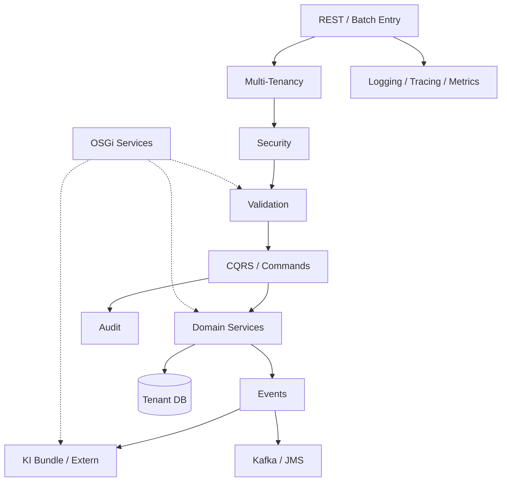
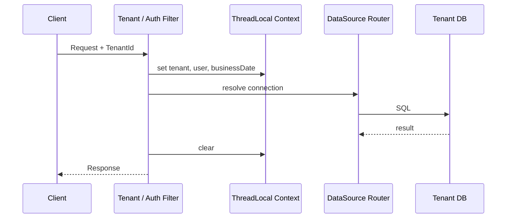
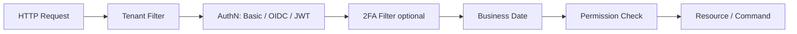
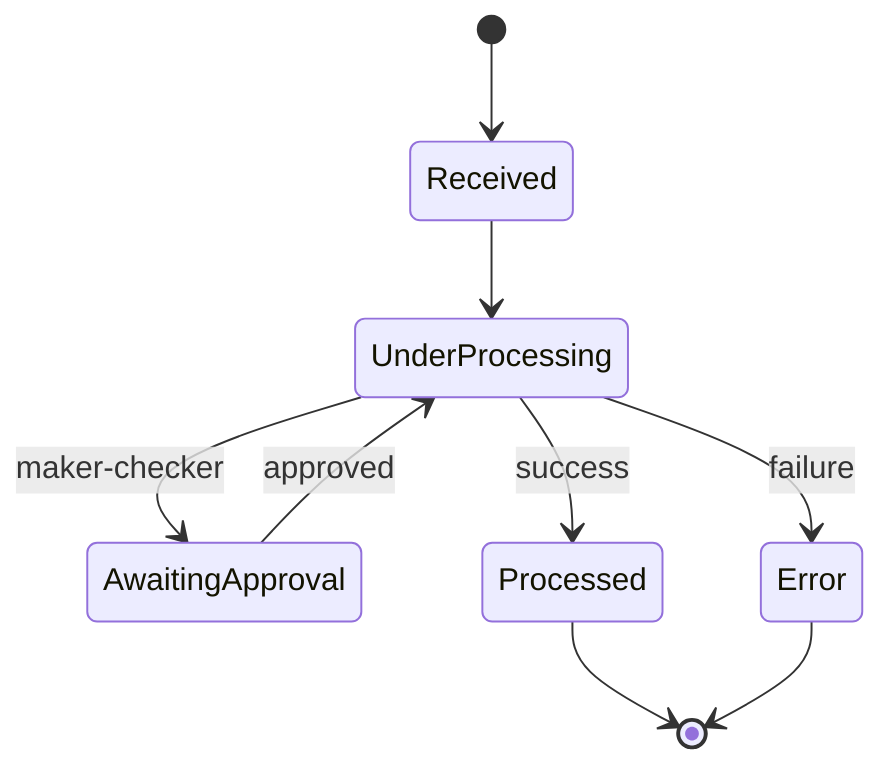
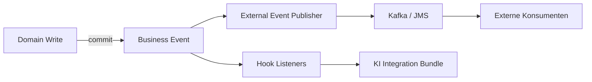
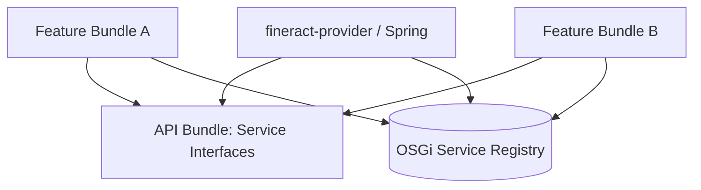
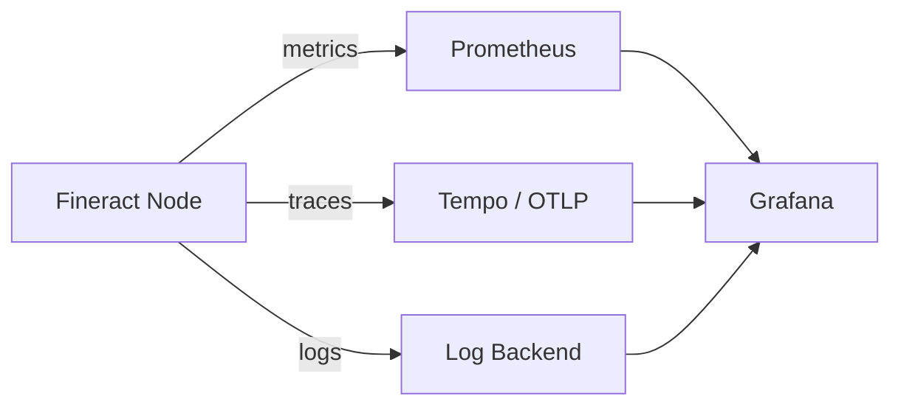
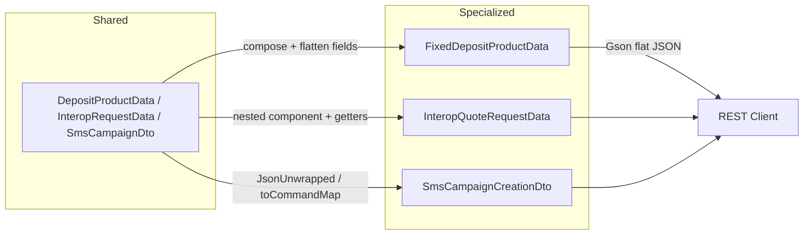
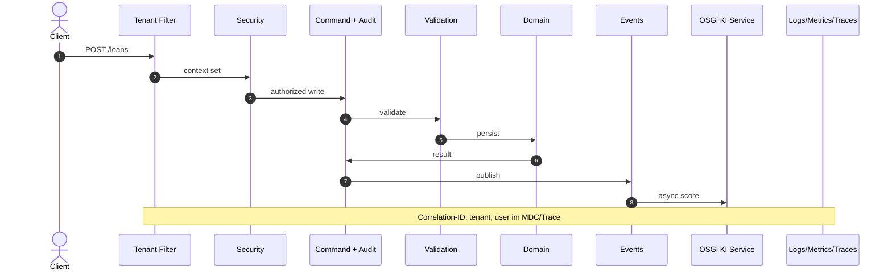

# 6. Crosscutting Concepts

Crosscutting Concepts sind architekturweite Lösungsansätze, die **mehrere Bausteine und Runtime-Szenarien** durchziehen. Sie erklären das „Wie übergreifend?“, während [Kapitel 4](04_runtime_view.md) konkrete Abläufe und [Kapitel 5](05_deployment_view.md) den Betrieb beschreiben.

**Notation**: Konzept → Motivation → Mechanismus → Regeln/Constraints. Diagramme wo hilfreich.

---

## 6.1 Überblick

| # | Konzept | Primäres Ziel | Hauptmodule / Artefakte |
|---|---------|---------------|-------------------------|
| 1 | Multi-Tenancy | Isolation pro Institut | Tenant-Filter, `ThreadLocalContext`, Tenant-DBs |
| 2 | Security & Authorization | Authentifizierung, Rechte, 2FA/OIDC | `fineract-security`, Permissions |
| 3 | CQRS, Commands & Audit | Schreibpfad, Nachvollziehbarkeit | Command Pipeline, `m_portfolio_command_source` |
| 4 | Validation & Error Handling | Frühe, konsistente Fehler | Jakarta Validation, Platform Exceptions |
| 5 | Domain & External Events | Entkopplung, Integration | Business Events, Hooks, Kafka/JMS |
| 6 | OSGi Modularity | Dynamische Erweiterbarkeit | Equinox, Service Registry, Bundles |
| 7 | KI-Integration | Externe Intelligenz ohne Monolith-ML | KI-Bundle, xAI Grok API, Policies |
| 8 | Logging, Correlation & Observability | Betriebssicherheit | Logs, Metrics, Traces, Actuator |
| 9 | Jobs, COB & Resilience | Batch-Zuverlässigkeit | Partitioned Jobs, Retry, Message Handler |
| 10 | Configuration & Feature Modes | Umgebungsspezifisches Verhalten | Env, Modes, Config Domain Service |
| 11 | Data Access & Caching | Performance, Pooling | HikariCP, optionale Caches |
| 12 | API-Stil, DTO Composition & Compatibility | Stabile Integrationen | REST, Idempotency, OpenAPI, Gson SPI |



---

## 6.2 Multi-Tenancy

### Motivation

Ein Deployment bedient **viele Institute** (Tenants). Daten, Konfiguration, Business Date und oft auch Auth-IdP müssen strikt getrennt bleiben.

### Mechanismus

1. **Tenant-Identifikation** am Request-Rand  
   Header (z. B. Tenant-ID), Routing oder OIDC-Tenant-Kontext.
2. **Tenant-Resolution**  
   Metadaten aus `fineract_tenants` (JDBC-URL, Credentials, Timezone, …).
3. **Context setzen**  
   `ThreadLocalContextUtil` / Request-Context: Tenant, User, Business Date.
4. **DataSource-Routing**  
   Verbindungen gehen in die Tenant-DB (nicht in die Registry-DB für Fachdaten).
5. **Context clear**  
   Nach Request/Job-Partition – Pflicht gegen Thread-Leaks (inkl. Virtual Threads).

Relevante Filter (Auszug `fineract-security`):

- `TenantAwareBasicAuthenticationFilter`
- `TenantAwareAuthenticationFilter`
- `OidcTenantAwareFilter`
- `BusinessDateFilter`



### Regeln

| Regel | Begründung |
|-------|------------|
| Kein Fachzugriff ohne Tenant-Context | Verhindert Cross-Tenant-Leaks |
| Batch-Partition = ein Tenant-Context | Parallelität ohne Vermischung |
| Read-only Tenant-DB optional | `fineract.tenant.read-only-*` für Report-Nodes |
| Pool-Grenzen pro Tenant beachten | `fineract.tenant.config.max-pool-size` vs. DB-Limits |

### Mapping Runtime / Deployment

- Runtime: [Szenario 4 Multi-Tenant Request](04_runtime_view.md)
- Deployment: [Persistenz & Multi-Tenancy](05_deployment_view.md)

---

## 6.3 Security & Authorization

### Motivation

Core Banking verarbeitet sensible Finanz- und Personendaten. Jeder Write und die meisten Reads sind **berechtigungspflichtig**.

### Authentifizierung (austauschbare Profile)

| Mechanismus | Modul / API | Einsatz |
|-------------|-------------|---------|
| **Basic Auth** | `TenantAwareBasicAuthenticationFilter`, `AuthenticationApiResource` | Dev, einfache Integrationen |
| **OAuth2 / OIDC / JWT** | `OidcTenantAwareFilter`, JWT Converter, `TenantOidcConfig*` | Produktion, Federation |
| **Two-Factor (2FA)** | `TwoFactorAuthenticationFilter`, `TwoFactorApiResource` | Zusätzliche Stufe für privilegierte Nutzer |

OIDC-Konfiguration kann **pro Tenant** hinterlegt sein (`TenantOidcConfigService`) – Multi-Tenancy greift hier in die Security hinein.

### Autorisierung

- **Permission-Modell** über Rollen/Rechte (AppUser, Roles, Permissions).
- Prüfungen im **Platform Security Context** vor Command-Ausführung und in Resources.
- Maker-Checker: zusätzliche organisatorische Freigabe für kritische Commands (siehe 6.4).

### Security-Pipeline (vereinfacht)



### Regeln

| Regel | Details |
|-------|---------|
| Defense in Depth | TLS ([Deployment](05_deployment_view.md)) + AuthN + AuthZ + Audit |
| Least Privilege | Rollen nur nötige Permissions; Service-Accounts für Batch/Integration |
| Secrets | DB-Passwörter, OIDC Client Secrets, KI-API-Keys nie im Image hardcoden |
| Equinox Console | Admin-only, nicht öffentlich (Port 2501) |
| Tenant spoofing | Tenant-Header nur in Kombination mit AuthZ/IdP-Claims vertrauen |

---

## 6.4 CQRS, Commands & Audit

### Motivation

Fineract trennt **Reads** (Queries) und **Writes** (Commands). Writes laufen über eine zentrale Pipeline – das ermöglicht Audit, Idempotenz, Maker-Checker und schrittweise Modernisierung.

### Legacy Write-Pfad

```
REST Resource
  → PortfolioCommandSourceWritePlatformService
    → SynchronousCommandProcessingService
      → NewCommandSourceHandler
        → WritePlatformService
```

- Payload oft als JSON-String / `JsonCommand`
- Persistenz des Command-Zustands in **`m_portfolio_command_source`**
- Status u. a. PENDING / PROCESSED / ERROR / Await Approval

### Neuer Command-Stack (`fineract-command`)

```
REST (DTO) → CommandDispatcher → Hooks → CommandHandler<REQ,RES> → Domain
```

- Typsichere Commands, Jakarta Validation
- Hooks: before / after / error (Username, Timestamp, Headers, …)
- Dispatcher austauschbar: sync, async, Disruptor

Beide Stacks können **parallel** existieren; Migration modulweise ([Runtime 4.3](04_runtime_view.md)).

### Audit & Idempotenz

| Konzept | Verhalten |
|---------|-----------|
| **Command Audit** | Wer / was / wann / Ergebnis – Grundlage für Compliance und Support |
| **Idempotency Key** | Wiederholte Requests mit gleichem Key liefern gespeichertes Ergebnis |
| **Maker-Checker** | Command wartet auf Checker-Freigabe, bevor Domain-Persistenz final wird |
| **Retry** | Resilience4j-Konfiguration um Command-Ausführung (ohne Doppelbuchung dank Idempotenz) |



### Regeln

- Jeder fachliche Write geht über Commands – keine „stillen“ DB-Updates aus Controllern.
- Audit-Trail ist unverhandelbar; Performance-Optimierungen dürfen ihn nicht opfern.
- Neue Features bevorzugen `fineract-command`; Legacy nicht unnötig erweitern.

---

## 6.5 Validation & Error Handling

### Motivation

Früh scheitern, klar kommunizieren, Domain-Invarianten schützen.

### Schichten

| Schicht | Mechanismus | Beispiel |
|---------|-------------|---------|
| **Transport** | HTTP-Status, JSON Error Body | 400/401/403/404/409 |
| **Bean Validation** | Jakarta Annotations auf DTOs (neuer Stack) | `@NotNull`, Betragsgrenzen |
| **API/JSON Validation** | Legacy-Parser, Data Validators | Pflichtfelder Loan Application |
| **Domain Validation** | Business Rules in Services | Produktstatus, Disbursement-Voraussetzungen |
| **OSGi Extensions** | optionale Validator-Services | instituts-spezifische Produktregeln |

### Fehlerprinzipien

- **Mappable Exceptions**: Domain-Fehler → stabile API-Fehlercodes/-messages (i18n-fähig).
- **Keine internen Stacktraces** an externe Clients in Produktion.
- **Command-Fehler** werden am Command-Record festgehalten (Audit), nicht nur geloggt.
- **Validierung vor Side Effects**: erst prüfen, dann buchen.

---

## 6.6 Domain Events, Hooks & External Events

### Motivation

Nachgelagerte Systeme (Reporting, CRM, KI, Messaging) sollen den Core nicht blockieren und lose koppeln.

### Arten

| Art | Charakter | Transport |
|-----|-----------|-----------|
| **Interne Business Events** | In-Process, oft transaction-bound (nach Commit) | Spring Application Events |
| **Hooks** | Konfigurierbare Webhooks/Integrationen | HTTP u. a. |
| **External Events** | Für andere Bounded Contexts / Partner | Kafka oder JMS (konfigurierbar) |

Konfiguration (Auszug):

- `fineract.remote-job-message-handler.spring-events|jms|kafka.*`
- `FINERACT_EXTERNAL_EVENTS_*` in Docker-Env-Dateien



### Regeln

- Default: **asynchron / nach Commit** – keine Event-Side-Effects in derselben DB-Transaktion außer Outbox-Patterns.
- Event-Payloads versionieren; Consumer müssen tolerant sein.
- KI und Dritt-systeme: best effort mit Retry/DLQ, Core-Erfolg nicht rückabwickeln (außer explizite synchrone Policy Gates).

---

## 6.7 OSGi Modularity

### Motivation

Apache Fineract ist historisch modularisiert über Gradle-Module, aber **Laufzeit-Erweiterungen** (Hot-Deploy, optionale Features pro Kunde) sind begrenzt. fineract-osgi ergänzt **OSGi (Equinox)**.

### Mechanismus

| Element | Rolle |
|---------|--------|
| **Equinox** | OSGi Framework im (oder neben dem) Application-Prozess |
| **Bundles** | Feature-JARs unter `osgi/bundles` |
| **Service Registry** | Publizieren/Finden von Interfaces (`CreditScoreProvider`, …) |
| **Declarative Services / Activator** | Lifecycle start/stop/bind/unbind |
| **Core Bridge** | Spring Beans nutzen OSGi Services optional |

### Entwurfsprinzipien

1. **Optional by default** – fehlt ein Bundle, bleibt Core funktionsfähig.
2. **Interfaces im Core-API-Bundle**, Implementierungen in Feature-Bundles.
3. **Keine zyklischen Bundle-Dependencies**; stabile Package-Exports.
4. **Gleiche Bundle-Versionen** auf allen Nodes eines Clusters ([Deployment 5.7](05_deployment_view.md)).
5. **Security**: signierte Bundles, kein unkontrolliertes Remote-Install in Prod.



### Typische Extension Points

- Validatoren / Product Rules  
- Credit Scoring / KI  
- Notification Channels  
- Import/Export Adapter  
- Instituts-spezifische Reports (wenn isolierbar)

---

## 6.8 KI-Integration (xAI Grok API)

### Motivation

Kreditentscheidung, Fraud-Hints, Dokumentenzusammenfassung etc. sollen **extern** laufen – kein trainiertes ML-Modell im Banking-Monolithen ([Design Decision](08_design_decisions.md)).

### Architektur-Pattern

| Pattern | Beschreibung | Empfehlung |
|---------|--------------|------------|
| **Async Enrichment** | Event → KI-Bundle → API → Ergebnis speichern | Default |
| **Sync Policy Gate** | Command wartet auf Score allow/deny | Nur wenn regulatorisch nötig |
| **Human-in-the-Loop** | Score als Hinweis für Officer, keine Auto-Buchung | Häufig bei Kredit |

### Bausteine

- **OSGi KI-Bundle** implementiert z. B. `CreditScoreProvider`
- **HTTP-Client** mit Timeout, Retry, Circuit Breaker
- **Secret**: API-Key aus Vault/K8s Secret
- **Datenminimierung**: nur nötige Features an die KI; PII-Policies beachten
- **Persistenz**: Score/Explanation als Note, Custom Fields oder eigenes Aggregat – **nicht** als stiller Ersatz für Accounting

### Policy-Matrix

| KI-Ergebnis / Fehler | Fail-Open | Fail-Closed |
|----------------------|-----------|-------------|
| Timeout / 5xx | Request läuft weiter | Command abbrechen |
| Score unter Schwellwert | Warning speichern | Reject / Maker-Checker erzwingen |
| Bundle nicht installiert | Default-Pfad | Feature deaktiviert melden |

Default für Verfügbarkeit: **Fail-Open** auf dem Hot-Path; produkt-spezifisch konfigurierbar.


### Regeln

- KI entscheidet nicht still über Buchungen ohne explizite Business-Rule.
- Prompts/Responses auditierbar speichern (oder Hash + Metadaten), wo Compliance es verlangt.
- Kosten/Latenz monitoren (siehe 6.9).

---

## 6.9 Logging, Correlation & Observability

### Motivation

Ohne einheitliche Observability sind Multi-Tenant-, COB- und Pool-Probleme nicht beherrschbar.

### Logging

| Aspekt | Ansatz |
|--------|--------|
| Struktur | Logback (Override unter `config/docker/logback/`) |
| Correlation | `fineract.correlation.enabled` + Header `X-Correlation-ID` (konfigurierbar) |
| Tenant/User | im MDC/Context loggen (keine Secrets) |
| OSGi | `osgi/logs/equinox.log` zusätzlich zum App-Log |

### Metrics & Health

- Spring Actuator: liveness/readiness ([Deployment](05_deployment_view.md))
- Prometheus: `FINERACT_MANAGEMENT_PROMETHEUS_ENABLED`
- CloudWatch optional
- Fachliche Metriken (Ziel): Command-Latenz, COB-Dauer, KI-Timeout-Rate, Pool-Utilization

### Tracing

- OTLP/Tempo: `FINERACT_MANAGEMENT_OLTP_*`
- Sinnvolle Spans: HTTP → Command → DB → external KI call



### Regeln

- PII und Credentials **nicht** in Logs/Traces im Klartext.
- Correlation-ID vom Edge bis zum Worker-Job durchreichen (Messaging-Headers).
- Alerting auf Error-Rate, COB SLA, DB-Connections, KI-Latenz.

---

## 6.10 Jobs, COB & Resilience

### Motivation

Close-of-Business und andere Jobs müssen **partitionierbar, wiederholbar und ausfallsicher** sein.

### Building Blocks

| Baustein | Funktion |
|----------|----------|
| Scheduler / Job Framework | Trigger, Stuck-Job-Retry (`fineract.job.stuck-retry-threshold`) |
| Partitioned Jobs | z. B. `LOAN_COB` mit chunk/partition/thread-pool Properties |
| Remote Job Message Handler | Spring Events (lokal) oder JMS/Kafka (verteilt) |
| COB API Filter | schützen Online-Writes während COB auf betroffenen Loans |
| Resilience | Retry an Commands und externen Calls; Timeouts zwingend |

### Konfigurationshebel (Beispiele)

- `LOAN_COB_CHUNK_SIZE`, `LOAN_COB_PARTITION_SIZE`, `LOAN_COB_POLL_INTERVAL`
- `LOAN_COB_THREAD_POOL_*`, `LOAN_COB_RETRY_LIMIT`
- `fineract.job.loan-cob-enabled`

### Regeln

- Job-Steps **idempotent** implementieren (Restart nach Crash).
- Worker ohne Liquibase; Manager orchestriert.
- Genau ein aktiver Batch-Manager pro Cluster.
- OSGi-Logic in Business Steps: schnell, optional, fehlertolerant.

---

## 6.11 Configuration & Feature Modes

### Motivation

Ein Artefakt, viele Umgebungen: Dev-Compose, Multi-Node, K8s, Tenant-Policies.

### Schichten

1. `application.properties` – Defaults  
2. Environment Variables / ConfigMaps – Umgebung  
3. Secrets – Credentials  
4. DB Configuration Domain Service – runtime business config  
5. OSGi `config.ini` / Component Properties – Bundle-Level  

### Mode-Flags

| Mode | Wirkung |
|------|---------|
| `read-enabled` | Query-API |
| `write-enabled` | Command-API |
| `batch-manager-enabled` | Job-Orchestrierung |
| `batch-worker-enabled` | Job-Ausführung |

Modes sind ein **crosscutting Deployment-Konzept** mit Auswirkung auf Security Surface, Liquibase und Messaging ([Kapitel 5.3](05_deployment_view.md)).

### Feature Toggles (fachlich)

Beispiele: Loan COB on/off, External Events, Correlation IDs, IP Tracking, Journal Entry Aggregation. Toggles gehören dokumentiert und default-sicher gesetzt.

---

## 6.12 Data Access, Transaktionen & Caching

### Data Access

- JDBC/JPA über Tenant-DataSource; HikariCP-Pooling (`FINERACT_HIKARI_*`).
- Tenants-DB nur für Routing/Metadaten; Fachdaten in Tenant-DB.
- Optional Read-only Replica-Parameter pro Tenant.
- **JPA-Stack**: Spring Data JPA + **EclipseLink** (Hibernate excluded); Multi-Tenant über `RoutingDataSource`, eine EMF.
- **CQRS-Persistenz** ([ADR-016](decisions/ADR-016-jpa-ausbau-read-write-persistenz.md)): Writes/Domain → JPA; einfache Reads → Projection/Specs; schwere Reads/COB → JdbcTemplate/SQL. Ausbau in Stufen **S1** (Hygiene) und **S2** (Performance), kein Big-Bang „alles JPA“.

### Transaktionen

- Spring `@Transactional` an Write-Services / Command-Handlern.
- Events idealerweise nach erfolgreichem Commit.
- Batch: Chunk-Transaktionen statt einer Riesen-TX für den ganzen COB.

### Caching

- Konfigurations- und Lookup-Daten können gecacht werden (plattformabhängig).
- **Keine** aggressiven Caches auf hochgradig konsistenzkritischen Salden ohne Invalidierungsstrategie.
- Command-Idempotency heute DB-gestützt; künftig optional schneller Store (Redis) – nur mit klarem Konsistenzmodell (`fineract-command` README).

---

## 6.13 API-Stil, DTO Composition, Idempotenz & Compatibility

| Thema | Konzept |
|-------|---------|
| **Stil** | REST unter `/fineract-provider/api/v1`, headless (keine UI im Scope) |
| **CQRS nach außen** | Writes als Commands, Reads als Queries – auch wenn URL-Design historisch gemischt ist |
| **Idempotenz** | Header/Key für Writes; Pflicht für Integrations-Retries |
| **OpenAPI** | Client-Generierung (`fineract-client`); Dummy/DTO-Typen für Spec |
| **DTO Composition** | Spezialisierte API-DTOs **komponieren** Shared-Felder statt tiefer Vererbung ([ADR-015](decisions/ADR-015-api-dtos-composition-statt-vererbung.md)) |
| **Compatibility** | Neue Command-Pipeline und DTO-Refactors dürfen REST-JSON-Verträge nicht brechen (flach halten) |
| **Correlation** | `X-Correlation-ID` für Support-Fälle |

### API-DTO Composition (ADR-015)

Historisch erben viele Response-/Request-Objekte von Shared-Parents (`DepositProductData`, `CommandProcessingResult`, …). fineract-osgi stellt schrittweise auf **Composition** um:



| Regel | Bedeutung |
|-------|-----------|
| **Wire-Form bleibt flach** | JSON enthält `id`, `state`, `depositAmount` auf Root-Ebene – keine Pflicht zu `product.id` |
| **GET ≠ CommandResult** | Read-only Interop-DTOs erben nicht mehr von `CommandProcessingResult` |
| **Write-Pipeline behält CPR** | Responses, die durch `logCommandSource` laufen, bleiben CPR-Subtypen; Shared-Interop-Felder werden flach kopiert |
| **Gson SPI** | `FineractGsonTypeAdapterRegistrar` + `ServiceLoader` in `GoogleGsonSerializerHelper` – Module registrieren Flatten-Adapter ohne Core-Änderung |
| **Jackson wo Jackson bindet** | Request-Bodies mit `@JsonUnwrapped`; Gson-Command-Re-Serialisierung ggf. über flache Map |

Shared-Typen (`DepositProductData`, `DepositAccountData`, `InteropRequestData`) bleiben für Lookup, Mapper-Basiszeilen und Composition-Quellen erhalten.

### Integrationsregeln

- Clients senden Tenant + Auth + Idempotency Key bei Writes.
- Breaking Changes nur versioniert; OSGi-Extensions dürfen öffentliche API nicht still verändern.
- DTO-Refactors müssen bestehende JSON-Feldnamen und Partial-Response-Parameter respektieren.
- Externe KI ist **kein** Teil der stabilen Banking-API – eigene Facades/DTOs.

---

## 6.14 Zusammenspiel der Konzepte (Beispielfluss)

Loan Creation mit optionaler KI – Crosscutting-Schichten:



---

## 6.15 Qualitätsbezug

| Crosscutting Concept | Unterstützte Qualität ([Kap. 7](07_quality_attributes.md)) |
|----------------------|--------------------------------------------------------------|
| Multi-Tenancy | Security, Isolation, SaaS-Skalierung |
| Security & Audit | Vertraulichkeit, Compliance, Nachvollziehbarkeit |
| CQRS / Commands | Skalierbarkeit Writes/Reads, Maintainability |
| API-DTO Composition | Maintainability, Compatibility (flache JSON-Verträge) |
| OSGi | Extensibility, Maintainability, Deployment-Flexibilität |
| KI-Integration | Extensibility, Innovation ohne Core-Komplexität |
| Observability | Operability, Performance-Diagnose |
| Jobs/Resilience | Reliability, COB-Performance |
| Config/Modes | Portability, sichere Defaults |

---

## 6.16 Offene Punkte / nächste Iterationen

- Einheitliches **Outbox-Pattern** für External Events (exactly-once / at-least-once klar definieren)
- Standard-Interfaces für OSGi Extension Points (API-Bundle versioniert)
- KI: Datenklassifikation, Retention von Prompts, Modell-Changelog
- Correlation-ID verpflichtend in Worker-Messaging
- Policy-as-Code für Fail-Open/Fail-Closed pro Produkt
- Cache-/Idempotency-Store-Entscheidung (DB only vs. Redis)
- Weitere DTO-Hierarchien auf Composition migrieren (Loan/Savings-Product wo sinnvoll); ggf. generierte OpenAPI-Modelle angleichen

---

## 6.17 Verwandte Gherkin-Features

| Konzept | Feature |
|---------|---------|
| Multi-Tenancy | [crosscutting/multi_tenant_isolation.feature](../gherkin/features/crosscutting/multi_tenant_isolation.feature) |
| Security | [crosscutting/security_authentication.feature](../gherkin/features/crosscutting/security_authentication.feature) |
| CQRS / Commands / Idempotenz | [crosscutting/command_processing.feature](../gherkin/features/crosscutting/command_processing.feature), [loan/loan_command_idempotency.feature](../gherkin/features/loan/loan_command_idempotency.feature) |
| OSGi / KI | [osgi/](../gherkin/features/osgi/) |
| Jobs / Modes | [cob/close_of_business.feature](../gherkin/features/cob/close_of_business.feature), [crosscutting/node_modes.feature](../gherkin/features/crosscutting/node_modes.feature) |

Mapping: [gherkin/README.md](../gherkin/README.md).

---

*Weiter*: [07 Quality Attributes](07_quality_attributes.md) · *Zurück*: [05 Deployment View](05_deployment_view.md)
