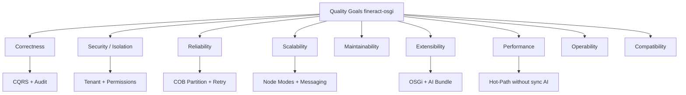
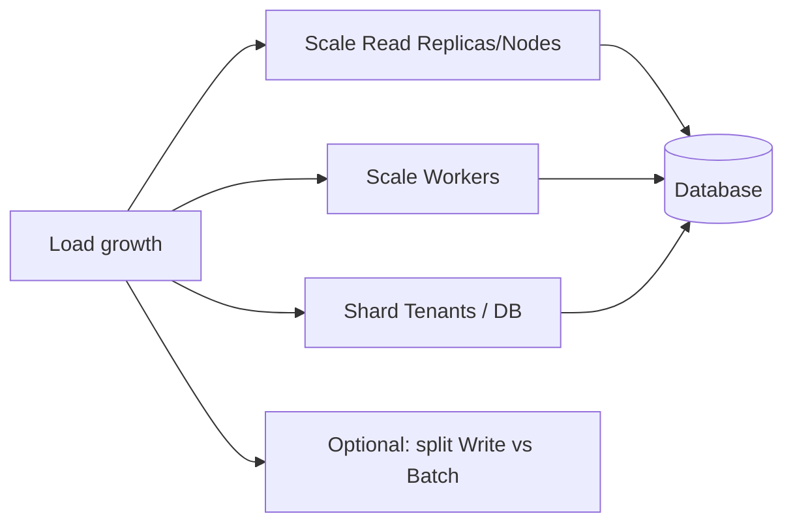
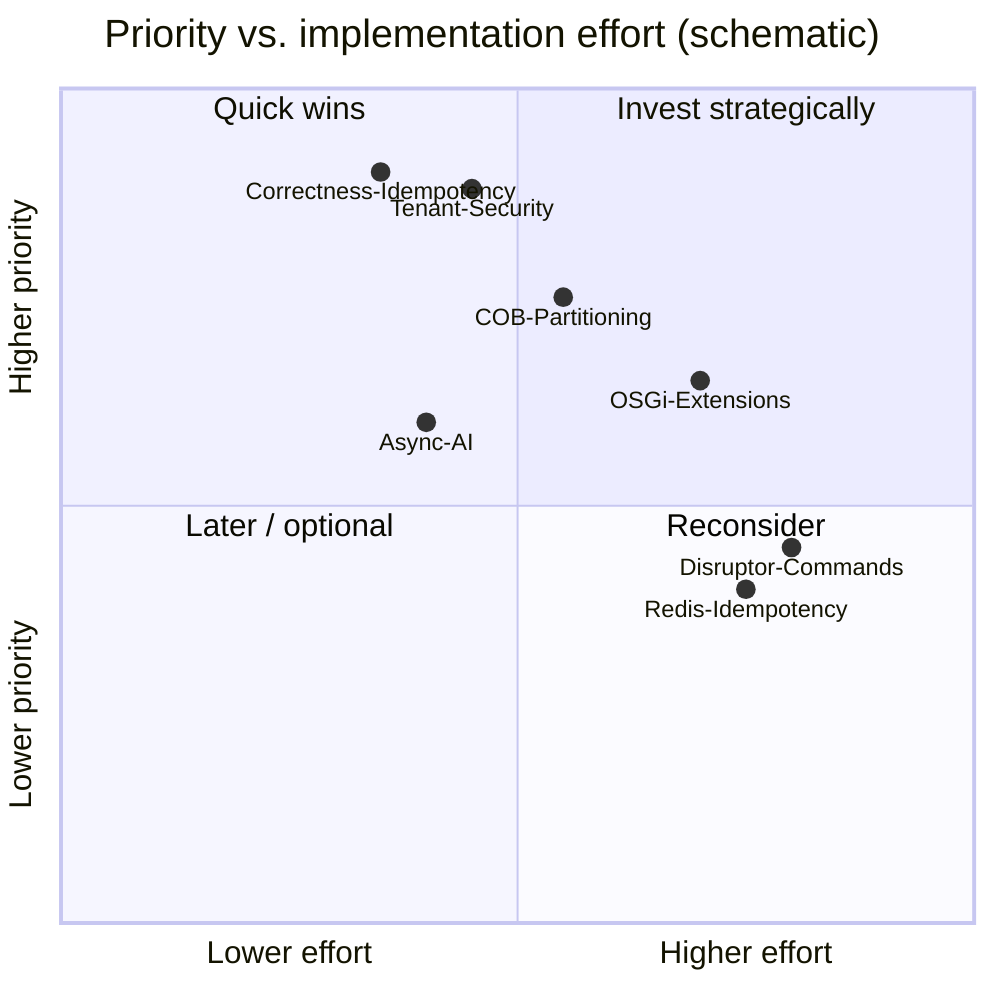

# 7. Quality Attributes

This chapter describes the **architecture-relevant quality requirements** of fineract-osgi: what “good enough” means, how the architecture responds, and how success becomes measurable.

It builds on [Runtime](04_runtime_view.md), [Deployment](05_deployment_view.md), and [Crosscutting Concepts](06_crosscutting_concepts.md). Security threat model of the upstream basis: [`SECURITY.md`](../../SECURITY.md).

**Notation (Quality Scenarios)**:

| Field | Meaning |
|-------|---------|
| **Stimulus** | Trigger (load, failure, change request, attack) |
| **Environment** | Operating state |
| **Response** | Expected system behavior |
| **Measure** | Measurable acceptance (target values are starting points, to be calibrated) |

---

## 7.1 Quality Goals (Priority)

| Prio | Quality goal | Short description | Primary levers |
|:----:|--------------|-------------------|----------------|
| 1 | **Correctness & Integrity** | Bookings, balances, audit are correct; no silent double bookings | CQRS, transactions, idempotency, validation |
| 2 | **Security & Isolation** | AuthN/Z, tenant separation, no cross-tenant leak | `fineract-security`, multi-tenancy, TLS |
| 3 | **Reliability** | COB and API remain manageable under partial failures | Retry, partitioning, modes, health probes |
| 4 | **Scalability** | More tenants, more COB load, more read traffic | Read/Write/Batch nodes, Kafka/JMS, OSGi |
| 5 | **Maintainability** | Modules understandable, migration manageable | Gradle modules, `fineract-command`, OSGi boundaries |
| 6 | **Extensibility** | AI and institution features without core fork | OSGi bundles, events, external AI |
| 7 | **Performance** | Acceptable API latency; COB within time window | Pools, chunk/partition, async AI |
| 8 | **Operability** | Observe, deploy, diagnose | Actuator, metrics, traces, Correlation-ID |
| 9 | **Compatibility** | Stable REST contracts for integrators | OpenAPI, parallel command stacks |



---

## 7.2 Quality Tree (Overview)

```text
fineract-osgi Quality
├── Runtime Qualities
│   ├── Performance (API latency, COB throughput)
│   ├── Scalability (horizontal Read/Worker, multi-tenant)
│   ├── Reliability / Availability (partial failures, restarts)
│   └── Security (AuthN/Z, Isolation, Audit)
├── Development Qualities
│   ├── Maintainability (module boundaries, type-safe commands)
│   ├── Extensibility (OSGi, Events, AI)
│   └── Compatibility / Migratability (Legacy + new stack)
└── Operational Qualities
    ├── Observability (Logs, Metrics, Traces)
    ├── Deployability (Docker, K8s, Modes)
    └── Configurability (Env, Feature Flags, Bundle Config)
```

---

## 7.3 Correctness & Data Integrity

### Motivation

Incorrect loan balances or double repayments are unacceptable. The quality “performance” must not undermine correctness.

### Architecture contribution

| Mechanism | Contribution |
|-----------|--------------|
| CQRS write path | Central, traceable mutation point |
| DB transactions | Atomic domain writes |
| Idempotency Key | Safe client retries |
| Command Audit (`m_portfolio_command_source`) | Reconstruction of “who did what when” |
| Validation layers | Errors before side effects ([Ch. 6.5](06_crosscutting_concepts.md)) |
| Maker-Checker | Four-eyes for critical operations |
| COB filter | Fewer race conditions online vs. batch |

### Scenario Q-CORR-1: Duplicate submit

| Field | Content |
|-------|---------|
| Stimulus | Client sends the same `POST /loans` twice (network retry) with the same idempotency key |
| Environment | Write node under normal load |
| Response | Exactly one domain creation; second call returns the stored result |
| Measure | No duplicate loan ID; command status consistent; HTTP without 5xx loop |

### Scenario Q-CORR-2: Failure mid-write

| Field | Content |
|-------|---------|
| Stimulus | Exception after partial work in the domain transaction |
| Environment | Single write node |
| Response | Rollback of domain data; command audited as ERROR; no “half” loan |
| Measure | DB invariants hold; no orphan schedule without loan |

### Constraints

- External AI must **not silently** change bookings (only enrichment / explicit policy).
- Event consumers are by default **at-least-once** → build consumers idempotently.

---

## 7.4 Security & Tenant Isolation

### Motivation

Back-office core banking: authenticated users, tenant-scoped data. Primary trust boundary: HTTPS API behind reverse proxy/WAF ([`SECURITY.md`](../../SECURITY.md)).

### Architecture contribution

| Mechanism | Contribution |
|-----------|--------------|
| AuthN (Basic / OIDC / JWT / 2FA) | Establish identity |
| Permissions + Security Context | Authorization per action |
| Tenant Filter + ThreadLocal | Context isolation per request/job |
| Separate tenant DBs/schemas | Data isolation |
| Audit Trail | Accountability |
| TLS, Secrets, Network Policies | Transport and operational hardening ([Ch. 5.13](05_deployment_view.md)) |

### Scenario Q-SEC-1: Cross-tenant access

| Field | Content |
|-------|---------|
| Stimulus | Authenticated user of tenant A requests resource of tenant B |
| Environment | Multi-tenant production |
| Response | No data access; 403/404 per policy |
| Measure | 0 successful cross-tenant reads/writes in tests and audits |

### Scenario Q-SEC-2: Unauthenticated API access

| Field | Content |
|-------|---------|
| Stimulus | Request without valid credentials on protected resource |
| Environment | Public ingress only up to proxy |
| Response | 401; no business logic, no tenant leak in error message |
| Measure | Actuator/health possibly exposed separately; API surface closed by default |

### Scenario Q-SEC-3: Bundle reload

| Field | Content |
|-------|---------|
| Stimulus | Ops installs OSGi feature bundle in production |
| Environment | Equinox embedded, console only admin network |
| Response | Only signed/approved bundles; core remains hardenable |
| Measure | No remote install from untrusted URLs; console not public |

### Non-goals (explicit)

- Volumetric DDoS (task of proxy/cloud)
- Physical DB host compromise
- Self-service end-customer UI (out of scope)

---

## 7.5 Reliability & Availability

### Motivation

Institutions expect predictable availability of the back-office API and **completion of COB** in the night window – even if individual workers die.

### Architecture contribution

| Mechanism | Contribution |
|-----------|--------------|
| Health liveness/readiness | K8s/LB remove unhealthy instances |
| Batch Manager + Worker | COB work distributed and restartable |
| Stuck-Job-Retry | `fineract.job.stuck-retry-threshold` |
| Partition/Chunk + retry-limit | Fine-grained repetition |
| Messaging (Kafka/JMS) | Decoupling manager/worker |
| Fail-Open AI (Default) | External AI does not take down the API |
| Optional OSGi Services | Extension failure ≠ total failure |

### Scenario Q-REL-1: Worker crash during COB

| Field | Content |
|-------|---------|
| Stimulus | Batch worker dies mid-partition |
| Environment | Manager + ≥2 workers, Kafka |
| Response | Partition is redelivered/retried; other partitions continue |
| Measure | COB ends successfully or with clear error list; no double interest bookings (idempotency of steps) |

### Scenario Q-REL-2: AI API down

| Field | Content |
|-------|---------|
| Stimulus | xAI Grok API timeout/5xx |
| Environment | Async enrichment active |
| Response | Loan create remains 2xx; score missing/pending; alarm/metric |
| Measure | Write success rate unchanged; AI error rate visible |

### Scenario Q-REL-3: Node restart

| Field | Content |
|-------|---------|
| Stimulus | Rolling restart of a write node |
| Environment | ≥2 write nodes behind LB |
| Response | In-flight requests fail controlled or are retried (idempotency); cluster accepts traffic |
| Measure | API availability ≥ target SLO (e.g. 99.5% monthly – to be agreed) |

### Guideline values (starting points)

| Indicator | Dev/Test | Target Prod (proposal) |
|-----------|----------|------------------------|
| API availability (Read+Write) | best effort | ≥ 99.5 % |
| RPO (DB) | n/a | ≤ 15 min (Backup/WAL) |
| RTO (API) | n/a | ≤ 30 min |
| COB Complete Success | manual ok | ≥ 99 % runs without manual intervention |

---

## 7.6 Scalability

### Motivation

More institutions (tenants), more parallel officers, growing loan portfolios and COB volume.

### Scaling axes

| Axis | Strategy | Limiting |
|------|----------|----------|
| **Read traffic** | Horizontal read nodes (`read-enabled`) | DB read capacity / replicas |
| **Write traffic** | Limited horizontal; idempotency + DB | DB write IOPS, locks |
| **COB / Batch** | N workers, partition size, chunk size | CPU steps, DB, queue lag |
| **Tenants** | Separate DBs, pool config per tenant | Connections = Nodes × Pools × Tenants |
| **Features** | OSGi bundles as needed | Bundle compatibility cluster-wide |
| **Integrations** | External events async | Broker throughput |



### Scenario Q-SCALE-1: COB volume doubles

| Field | Content |
|-------|---------|
| Stimulus | Number of active loans ×2 |
| Environment | Manager + worker pool |
| Response | Adjust worker replicas and/or partition parameters; COB stays in window |
| Measure | COB duration ≤ agreed window (e.g. 4 h); queue lag → 0 before cutoff |

### Scenario Q-SCALE-2: Report load

| Field | Content |
|-------|---------|
| Stimulus | Heavy reports parallel to day business |
| Environment | Read nodes + optional read-only tenant DB |
| Response | Reports do not hit write nodes |
| Measure | p95 write latency stays in SLO despite report peak |

### Configuration levers (code)

- `FINERACT_MODE_*` – split roles  
- `LOAN_COB_CHUNK_SIZE`, `LOAN_COB_PARTITION_SIZE`, thread-pool properties  
- `FINERACT_HIKARI_MAXIMUM_POOL_SIZE`, tenant pool min/max  
- Kafka/JMS instead of purely local Spring Events  

---

## 7.7 Performance

### Motivation

Officer UI/integrations need snappy writes; COB must run predictably. Hot path and batch path have **different** optimization goals.

### Architecture contribution

| Measure | Effect |
|---------|--------|
| Sync command default | Predictable latency, simpler correctness |
| Optional Disruptor/Async Dispatcher | Higher throughput where safely migrated |
| AI **async** (default) | Write path without inference latency |
| HikariCP + prep-stmt caches | Less connection overhead |
| COB partitioning | Parallelism instead of monolithic job |
| CQRS | Reads scale independently |
| Correlation + Metrics | Find bottlenecks instead of guessing |

### Scenario Q-PERF-1: Loan create latency

| Field | Content |
|-------|---------|
| Stimulus | `POST /loans` under normal load |
| Environment | Write node, DB local in DC, AI async |
| Response | Validation + persistence + audit in transaction |
| Measure (starting point) | p50 &lt; 300 ms, p95 &lt; 1 s, p99 &lt; 2 s (without external AI sync) |

### Scenario Q-PERF-2: Sync AI gate

| Field | Content |
|-------|---------|
| Stimulus | Product forces sync score before approve |
| Environment | AI API p95 = 800 ms |
| Response | Command latency rises by AI time + budget; timeout applies |
| Measure | Timeout e.g. 2–3 s; on exceed policy fail-open/closed; metric `ki.score.latency` |

### Scenario Q-PERF-3: COB throughput

| Field | Content |
|-------|---------|
| Stimulus | N loans in COB |
| Environment | M workers |
| Response | Steps parallel across partitions |
| Measure | Loans/minute ≥ baseline; regress &lt; 10 % between releases |

### Anti-patterns

- Synchronous external calls on the default write path  
- Too large COB chunks (long transactions, locks)  
- Pool sizes “by gut feel” without connection budget  
- Logging huge payloads at INFO  

---

## 7.8 Maintainability

### Motivation

Fineract is large and historically grown (JSON strings, Gson helpers). fineract-osgi aims for **clearer module and runtime boundaries**.

### Architecture contribution

| Lever | Benefit |
|-------|---------|
| Gradle modules (`fineract-loan`, `fineract-command`, …) | Build and team boundaries |
| New command stack | Type safety, fewer magic strings |
| API DTO Composition ([ADR-015](decisions/ADR-015-api-dtos-composition-statt-vererbung.md)) | Less fragile inheritance; shared fields explicitly composed; JSON stays flat |
| Hexagonal Architecture ([ADR-017](decisions/ADR-017-hexagonale-architektur.md)) | Dependency rule; domain testable without REST/DB; OSGi/AI as pluggable adapters |
| Clean Code ([ADR-018](decisions/ADR-018-clean-code.md)) | Names, small units, Boy Scout, tests; SOLID as orientation |
| Domain-Driven Design ([ADR-019](decisions/ADR-019-domain-driven-design.md), [10](10_domain_context_map.md)) | Bounded contexts, aggregates, ubiquitous language; read/write models separated |
| Event Sourcing Writes ([ADR-020](decisions/ADR-020-event-sourcing-writes-pflicht.md)) | Append-only history for Create/Update/Delete; journal/reads as projections |
| OSGi API vs. Impl Bundles | Stable extension contracts |
| arc42 + Gherkin | Shared understanding |
| Parallel legacy/new migration | Low risk, reviewable |
| Tests (Unit, Integration, E2E) | Regression net; composition smoke tests per DTO family |

### Scenario Q-MAINT-1: New required field on loan

| Field | Content |
|-------|---------|
| Stimulus | Domain requirement: new validated attribute |
| Environment | Module already migrated to `fineract-command` |
| Response | DTO + validation + handler + test; OpenAPI updated |
| Measure | Change local in module; no string-key hunt across 10 packages; CI green |

### Scenario Q-MAINT-2: Touch legacy module

| Field | Content |
|-------|---------|
| Stimulus | Bugfix in path not yet migrated |
| Environment | `JsonCommand` / legacy handler |
| Response | Minimal fix possible; optional ticket for migration |
| Measure | No big-bang refactor forced; technical debt visible |

### Metrics (engineering)

- Share of write APIs on new command stack  
- Cyclic module dependencies (target: 0 new)  
- Average review size / lead time for bundle-only features  

---

## 7.9 Extensibility

### Motivation

Institutions need differentiation (scoring, product rules) without forking the core.

### Architecture contribution

| Extension point | Mechanism |
|-----------------|-----------|
| Optional domain services | OSGi Service Registry |
| Downstream processing | Business/External Events, Hooks |
| AI | External API bundle (Grok) |
| Jobs | Configurable business steps |
| Security | OIDC per tenant, 2FA |

### Scenario Q-EXT-1: Enable AI scoring

| Field | Content |
|-------|---------|
| Stimulus | Customer wants credit score after application submit |
| Environment | Cluster with Equinox; secret for API key present |
| Response | Deploy bundle, bind service, consume event; core unchanged |
| Measure | Time-to-enable &lt; 1 day ops+config; rollback = bundle stop; core regression tests green |

### Scenario Q-EXT-2: Feature without bundle

| Field | Content |
|-------|---------|
| Stimulus | Bundle not installed / stopped |
| Environment | Production operation |
| Response | Default business path; no hard fail except fail-closed policy |
| Measure | Smoke tests all-in-one without AI bundle passed |

### Rules

- Version extension points (SemVer of API packages).  
- No silent REST contract changes by bundles.  
- Cluster-wide same bundle versions ([Ch. 5.7](05_deployment_view.md)).  

---

## 7.10 Compatibility & Migration

### Motivation

Integrators and existing clients must not break while command pipeline and OSGi are introduced.

### Architecture contribution

- REST API remains **backward compatible** during migration (`fineract-command` README goals).  
- Legacy and new stack run **in parallel**.  
- OpenAPI / `fineract-client` for contractual clarity.  
- Feature flags and mode flags for stepwise rollout.

### Scenario Q-COMPAT-1: Client without change

| Field | Content |
|-------|---------|
| Stimulus | Existing integrator against migrated module |
| Environment | Rolling deploy of new version |
| Response | Same URLs, status codes, core JSON fields |
| Measure | Contract/E2E suite green; no mandatory client release |

### Scenario Q-COMPAT-2: Rollback

| Field | Content |
|-------|---------|
| Stimulus | Regression after toggle to new dispatcher |
| Environment | Prod with config flag |
| Response | Flag back to sync/legacy; data consistent |
| Measure | Rollback &lt; 15 min without restore |

---

## 7.11 Operability (Observability & Operations)

### Motivation

Without measurability, SLOs are worthless.

### Architecture contribution

| Signal | Implementation |
|--------|----------------|
| Health | Actuator liveness/readiness |
| Metrics | Prometheus / optional CloudWatch |
| Traces | OTLP/Tempo |
| Logs | Logback, optional Correlation-ID (`X-Correlation-ID`) |
| OSGi | `equinox.log`, console (secured) |
| Jobs | Stuck detection, COB metadata |

### Scenario Q-OPS-1: Latency spike

| Field | Content |
|-------|---------|
| Stimulus | p95 write latency rises sharply |
| Environment | Prod with metrics/traces |
| Response | Spike isolatable to DB, pool wait, or AI sync |
| Measure | MTTD (Detect) &lt; 15 min; clear dashboards per node role |

### Scenario Q-OPS-2: Tenant incident

| Field | Content |
|-------|---------|
| Stimulus | Support ticket “Loan X wrong” |
| Environment | Correlation-ID + audit present |
| Response | Request → Command → Domain → Event traceable |
| Measure | MTTR support: audit hit in &lt; 10 min |

### Minimum dashboards

1. Request rate / error rate / latency by mode node  
2. Hikari active/pending, DB connections  
3. COB progress, partition failures, queue lag  
4. AI latency / error / circuit-open  
5. JVM heap/GC, pod restarts  

---

## 7.12 Deployability & Portability

### Motivation

Same artifact for laptop, Compose, Kubernetes, cloud.

### Architecture contribution

- 12-factor-near config via env (`application.properties` defaults)  
- Docker images and Compose blueprints  
- K8s manifests + startup scripts  
- Node modes instead of separate codebases  
- OSGi bundles as additional deployables  

### Scenario Q-DEP-1: Promotion Dev → Staging

| Field | Content |
|-------|---------|
| Stimulus | Release candidate |
| Environment | Image tag + config/secrets different |
| Response | Same image; only config/bundle set changes |
| Measure | No code change for env switch; smoke + migration ok |

### Constraints

- Compose examples are **not** prod hardening.  
- Liquibase primarily on leading node; workers without migration.  

---

## 7.13 Quality Scenarios – Overall Matrix

| ID | Quality | Stimulus (short) | Measure (short) |
|----|---------|------------------|-----------------|
| Q-CORR-1 | Integrity | Duplicate submit | no double booking |
| Q-CORR-2 | Integrity | Exception in write | Rollback + Audit ERROR |
| Q-SEC-1 | Security | Cross-tenant | Deny |
| Q-SEC-2 | Security | unauth request | 401 |
| Q-SEC-3 | Security | Bundle install | trusted only |
| Q-REL-1 | Reliability | Worker crash | COB recoverable |
| Q-REL-2 | Reliability | AI down | Write ok |
| Q-REL-3 | Reliability | Node restart | SLO availability |
| Q-SCALE-1 | Scalability | 2× Loans COB | window held |
| Q-SCALE-2 | Scalability | Report peak | Write p95 stable |
| Q-PERF-1 | Performance | Loan Create | p95 &lt; 1 s (guideline) |
| Q-PERF-2 | Performance | Sync AI | Timeout + Policy |
| Q-PERF-3 | Performance | COB load | Loans/min baseline |
| Q-MAINT-1 | Maintainability | new field | local change |
| Q-MAINT-2 | Maintainability | Legacy bug | Minimal fix |
| Q-EXT-1 | Extensibility | AI enable | Bundle-only |
| Q-EXT-2 | Extensibility | Bundle missing | degrade |
| Q-COMPAT-1 | Compatibility | old client | Contract green |
| Q-COMPAT-2 | Compatibility | Toggle rollback | &lt; 15 min |
| Q-OPS-1 | Operability | Latency spike | MTTD &lt; 15 min |
| Q-OPS-2 | Operability | Support case | Audit trace |
| Q-DEP-1 | Deployability | Env promotion | same image |

---

## 7.14 Trade-offs

| Decision | Gain | Cost |
|----------|------|------|
| CQRS + central command path | Audit, idempotency, control | More indirection; legacy complexity |
| Parallel legacy + new stack | Safe migration | Maintain two paths temporarily |
| OSGi optional services | Extensibility, hot deploy | Lifecycle/version discipline |
| External AI instead of embedded ML | Less core complexity | Latency, data protection, vendor dependency |
| AI async default | Performance, reliability | Score not immediately consistent |
| Horizontal workers | COB scaling | Exactly-one manager, messaging ops |
| Strict tenant isolation | Security | More connections/pools, ops effort |
| Sync commands default | Correctness, simplicity | Less raw throughput than Disruptor |



---

## 7.15 Verification & Evidence

| Quality | Evidence |
|---------|----------|
| Correctness | Unit/integration tests, E2E (`fineract-e2e-tests-*`), idempotency tests |
| Security | AuthZ tests, OIDC/2FA modules, threat model review, dependency scanning |
| Reliability | Chaos/kill worker in Compose-Kafka setup; stuck-job tests |
| Performance | JMH (`fineract-command`), k6/JMeter on staging, COB duration metrics |
| Scalability | Worker replica tests, pool exhaustion tests |
| Maintainability | Module boundaries in PRs, migration checklist command stack |
| Extensibility | Bundle install/stop smoke; optional service absent tests |
| Operability | Dashboard reviews, alert fire drills |
| Compatibility | OpenAPI diff, contract tests, client SDK builds |

### Definition of Done (architecture-related)

A change is quality-wise “done” when:

1. Affected quality scenarios are named,  
2. Measurement points (metric/log/test) exist or are justifiably omitted,  
3. Trade-offs at goal conflicts (e.g. sync AI vs. latency) are documented,  
4. No regression on correctness/security scenarios.

---

## 7.16 Relation to Other Chapters

| Chapter | Contribution to quality |
|---------|-------------------------|
| [03 Building Blocks](03_building_block_view.md) | Module boundaries → Maintainability, Extensibility |
| [04 Runtime](04_runtime_view.md) | Concrete flows for scenarios (Loan, COB, AI, OSGi) |
| [05 Deployment](05_deployment_view.md) | Scaling, HA, ports, secrets, modes |
| [06 Crosscutting](06_crosscutting_concepts.md) | Mechanisms behind the qualities |
| [08 Design Decisions](08_design_decisions.md) | Justified trade-offs (OSGi, AI, CQRS) |
| [`SECURITY.md`](../../SECURITY.md) | Threat model, in/out of scope |

---

## 7.17 Open Points / Next Iterations

- Fix binding **prod SLOs** per customer class (MFI small vs. large)  
- Baseline measurement loan create and COB on reference hardware  
- Attach further quality scenarios with step defs to E2E runner  
- Security SLAs for bundle signing and secret rotation  
- Capacity model: formula `max_connections` vs. Nodes × Hikari × Tenants  
- Formal assessment Disruptor/Redis idempotency against correctness risks  

---

## 7.18 Related Gherkin Features (Quality Tags)

Quality scenarios are referenceable in Gherkin via tags `@quality-Q-…`.

| Quality ID | Feature (primary) |
|------------|-------------------|
| Q-CORR-1 | [loan/loan_command_idempotency.feature](../gherkin/features/loan/loan_command_idempotency.feature) |
| Q-CORR-2 | [crosscutting/command_processing.feature](../gherkin/features/crosscutting/command_processing.feature), [accounting/…](../gherkin/features/accounting/loan_disbursement_journal.feature) |
| Q-SEC-1 | [crosscutting/multi_tenant_isolation.feature](../gherkin/features/crosscutting/multi_tenant_isolation.feature) |
| Q-SEC-2 | [crosscutting/security_authentication.feature](../gherkin/features/crosscutting/security_authentication.feature) |
| Q-SEC-3 | [osgi/optional_bundle_degradation.feature](../gherkin/features/osgi/optional_bundle_degradation.feature) |
| Q-REL-1 | [cob/close_of_business.feature](../gherkin/features/cob/close_of_business.feature) |
| Q-REL-2 | [osgi/ki_scoring_async.feature](../gherkin/features/osgi/ki_scoring_async.feature) |
| Q-EXT-1 / Q-EXT-2 | [osgi/ki_scoring_async.feature](../gherkin/features/osgi/ki_scoring_async.feature), [osgi/optional_bundle_degradation.feature](../gherkin/features/osgi/optional_bundle_degradation.feature) |
| Q-PERF-1 | [loan/loan_creation.feature](../gherkin/features/loan/loan_creation.feature) (`@manual`) |

Full matrix: [gherkin/README.md](../gherkin/README.md).

---

*Next*: [08 Design Decisions](08_design_decisions.md) · *Back*: [06 Crosscutting Concepts](06_crosscutting_concepts.md)
