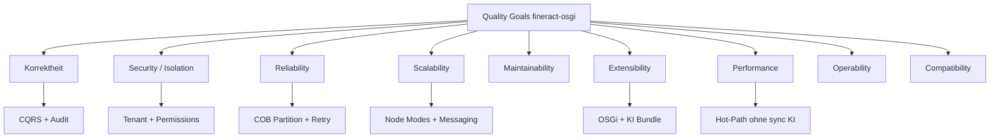
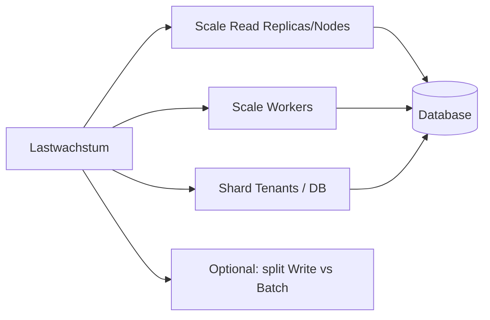
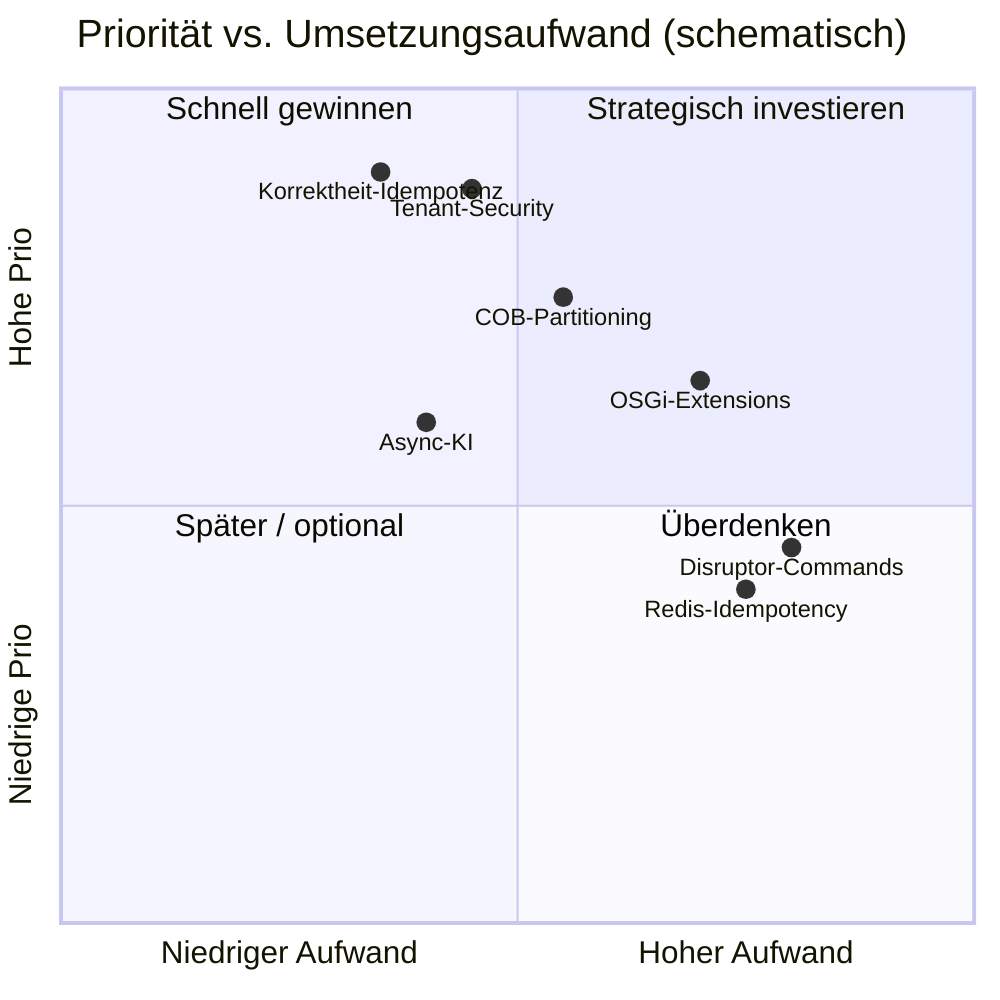

# 7. Quality Attributes

Dieses Kapitel beschreibt die **architekturrelevanten Qualitätsanforderungen** von fineract-osgi: was „gut genug“ bedeutet, wie die Architektur darauf reagiert und wie Erfolg messbar wird.

Es baut auf [Runtime](04_runtime_view.md), [Deployment](05_deployment_view.md) und [Crosscutting Concepts](06_crosscutting_concepts.md) auf. Sicherheits-Threat-Model der Upstream-Basis: [`SECURITY.md`](../../SECURITY.md).

**Notation (Quality Scenarios)**:

| Feld | Bedeutung |
|------|-----------|
| **Stimulus** | Auslöser (Last, Fehler, Änderungswunsch, Angriff) |
| **Umgebung** | Betriebszustand |
| **Response** | Erwartetes Systemverhalten |
| **Maß** | Messbare Akzeptanz (Zielwerte sind Startpunkte, zu kalibrieren) |

---

## 7.1 Qualitätsziele (Priorität)

| Prio | Qualitätsziel | Kurzbeschreibung | Primäre Hebel |
|:----:|---------------|------------------|---------------|
| 1 | **Korrektheit & Integrität** | Buchungen, Salden, Audit stimmen; keine stillen Doppelbuchungen | CQRS, Transaktionen, Idempotenz, Validierung |
| 2 | **Sicherheit & Isolation** | AuthN/Z, Tenant-Trennung, kein Cross-Tenant-Leak | `fineract-security`, Multi-Tenancy, TLS |
| 3 | **Zuverlässigkeit** | COB und API bleiben bei Teilausfällen beherrschbar | Retry, Partitioning, Modes, Health Probes |
| 4 | **Skalierbarkeit** | Mehr Tenants, mehr COB-Last, mehr Lese-Traffic | Read/Write/Batch-Nodes, Kafka/JMS, OSGi |
| 5 | **Wartbarkeit** | Module verständlich, Migration beherrschbar | Gradle-Module, `fineract-command`, OSGi-Grenzen |
| 6 | **Erweiterbarkeit** | KI und Instituts-Features ohne Core-Fork | OSGi Bundles, Events, externe KI |
| 7 | **Performance** | Akzeptable API-Latenz; COB in Zeitfenster | Pools, Chunk/Partition, async KI |
| 8 | **Operability** | Beobachten, deployen, diagnoseieren | Actuator, Metrics, Traces, Correlation-ID |
| 9 | **Kompatibilität** | Stabile REST-Verträge für Integratoren | OpenAPI, parallele Command-Stacks |



---

## 7.2 Quality Tree (Übersicht)

```text
fineract-osgi Quality
├── Runtime Qualities
│   ├── Performance (API-Latenz, COB-Durchsatz)
│   ├── Scalability (horizontal Read/Worker, multi-tenant)
│   ├── Reliability / Availability (Teilausfälle, Restarts)
│   └── Security (AuthN/Z, Isolation, Audit)
├── Development Qualities
│   ├── Maintainability (Modulgrenzen, typsichere Commands)
│   ├── Extensibility (OSGi, Events, KI)
│   └── Compatibility / Migratability (Legacy + neuer Stack)
└── Operational Qualities
    ├── Observability (Logs, Metrics, Traces)
    ├── Deployability (Docker, K8s, Modes)
    └── Configurability (Env, Feature Flags, Bundle Config)
```

---

## 7.3 Korrektheit & Datenintegrität

### Motivation

Fehlerhafte Kreditsalden oder doppelte Tilgungen sind inakzeptabel. Qualität „Performance“ darf Korrektheit nicht untergraben.

### Architekturbeitrag

| Mechanismus | Beitrag |
|-------------|---------|
| CQRS Write-Pfad | Zentrale, nachvollziehbare Mutationsstelle |
| DB-Transaktionen | Atomare Domain-Writes |
| Idempotency Key | Sichere Client-Retries |
| Command Audit (`m_portfolio_command_source`) | Rekonstruktion „wer hat was wann“ |
| Validierungsschichten | Fehler vor Side Effects ([Kap. 6.5](06_crosscutting_concepts.md)) |
| Maker-Checker | Vier-Augen für kritische Operationen |
| COB-Filter | Weniger Race Conditions Online vs. Batch |

### Szenario Q-CORR-1: Doppelter Submit

| Feld | Inhalt |
|------|--------|
| Stimulus | Client sendet denselben `POST /loans` zweimal (Netz-Retry) mit gleichem Idempotency-Key |
| Umgebung | Write-Node normal lastig |
| Response | Genau eine fachliche Anlage; zweiter Call liefert gespeichertes Ergebnis |
| Maß | Keine doppelte Loan-ID; Command-Status konsistent; HTTP ohne 5xx-Schleife |

### Szenario Q-CORR-2: Fehlschlag mitten im Write

| Feld | Inhalt |
|------|--------|
| Stimulus | Exception nach Teilarbeit in der Domain-Transaktion |
| Umgebung | Einzelner Write-Node |
| Response | Rollback der Fachdaten; Command als ERROR auditiert; kein „halber“ Kredit |
| Maß | DB-Invarianten halten; kein orphan schedule ohne Loan |

### Constraints

- Externe KI darf Buchungen **nicht still** verändern (nur Enrichment / explizite Policy).
- Event-Consumer sind standardmäßig **at-least-once** → Consumer idempotent bauen.

---

## 7.4 Sicherheit & Tenant-Isolation

### Motivation

Back-Office-Core-Banking: authentifizierte Nutzer, tenant-scoped Daten. Primäre Trust Boundary: HTTPS-API hinter Reverse Proxy/WAF ([`SECURITY.md`](../../SECURITY.md)).

### Architekturbeitrag

| Mechanismus | Beitrag |
|-------------|---------|
| AuthN (Basic / OIDC / JWT / 2FA) | Identität feststellen |
| Permissions + Security Context | Autorisierung pro Aktion |
| Tenant Filter + ThreadLocal | Context-Isolation pro Request/Job |
| Getrennte Tenant-DBs/Schemas | Datenisolation |
| Audit Trail | Accountability |
| TLS, Secrets, Network Policies | Transport- und Betriebs-Härtung ([Kap. 5.13](05_deployment_view.md)) |

### Szenario Q-SEC-1: Cross-Tenant-Zugriff

| Feld | Inhalt |
|------|--------|
| Stimulus | Authentifizierter User von Tenant A fordert Ressource von Tenant B an |
| Umgebung | Multi-Tenant-Produktion |
| Response | Kein Datenzugriff; 403/404 gemäß Policy |
| Maß | 0 erfolgreiche Cross-Tenant-Reads/Writes in Tests und Audits |

### Szenario Q-SEC-2: Unauthentifizierter API-Zugriff

| Feld | Inhalt |
|------|--------|
| Stimulus | Request ohne gültige Credentials auf geschützte Resource |
| Umgebung | Öffentlicher Ingress nur bis Proxy |
| Response | 401; keine Business-Logik, kein Tenant-Leak in Fehlermeldung |
| Maß | Actuator/Health ggf. getrennt exponiert; API-Oberfläche closed by default |

### Szenario Q-SEC-3: Bundle-Nachladen

| Feld | Inhalt |
|------|--------|
| Stimulus | Ops installiert OSGi-Feature-Bundle in Produktion |
| Umgebung | Equinox eingebettet, Console nur Admin-Netz |
| Response | Nur signierte/freigegebene Bundles; Core bleibt härtbar |
| Maß | Kein Remote-Install von untrusted URLs; Console nicht public |

### Nicht-Ziele (explizit)

- Volumetric DDoS (Aufgabe von Proxy/Cloud)
- Physischer DB-Host-Kompromiss
- Self-Service-Endkunden-UI (out of scope)

---

## 7.5 Zuverlässigkeit & Verfügbarkeit

### Motivation

Institute erwarten planbare Verfügbarkeit der Back-Office-API und **Abschluss des COB** im Nachtfenster – auch wenn einzelne Worker sterben.

### Architekturbeitrag

| Mechanismus | Beitrag |
|-------------|---------|
| Health liveness/readiness | K8s/LB entfernen kranke Instanzen |
| Batch Manager + Worker | COB-Arbeit verteilt und wiederanlaufbar |
| Stuck-Job-Retry | `fineract.job.stuck-retry-threshold` |
| Partition/Chunk + retry-limit | Feingranulare Wiederholung |
| Messaging (Kafka/JMS) | Entkopplung Manager/Worker |
| Fail-Open KI (Default) | Externe KI bringt API nicht nieder |
| Optional OSGi Services | Extension-Ausfall ≠ Totalausfall |

### Szenario Q-REL-1: Worker-Crash während COB

| Feld | Inhalt |
|------|--------|
| Stimulus | Batch-Worker stirbt mitten in einer Partition |
| Umgebung | Manager + ≥2 Worker, Kafka |
| Response | Partition wird redelivered/retry; andere Partitionen laufen weiter |
| Maß | COB endet erfolgreich oder mit klarer Fehlerliste; keine doppelten Zinsbuchungen (Idempotenz der Steps) |

### Szenario Q-REL-2: KI-API down

| Feld | Inhalt |
|------|--------|
| Stimulus | xAI Grok API timeout/5xx |
| Umgebung | Async Enrichment aktiv |
| Response | Loan Create bleibt 2xx; Score fehlt/pending; Alarm/Metric |
| Maß | Write-Erfolgsrate unverändert; KI-Error-Rate sichtbar |

### Szenario Q-REL-3: Node-Restart

| Feld | Inhalt |
|------|--------|
| Stimulus | Rolling Restart eines Write-Nodes |
| Umgebung | ≥2 Write-Nodes hinter LB |
| Response | Inflight-Requests failen kontrolliert oder werden wiederholt (Idempotency); Cluster nimmt Traffic an |
| Maß | Verfügbarkeit API ≥ Ziel-SLO (z. B. 99.5 % monatlich – zu vereinbaren) |

### Richtwerte (Startpunkte)

| Indikator | Dev/Test | Ziel Prod (Vorschlag) |
|-----------|----------|------------------------|
| API Verfügbarkeit (Read+Write) | best effort | ≥ 99.5 % |
| RPO (DB) | n/a | ≤ 15 min (Backup/WAL) |
| RTO (API) | n/a | ≤ 30 min |
| COB Complete Success | manuell ok | ≥ 99 % Läufe ohne manuellen Eingriff |

---

## 7.6 Skalierbarkeit

### Motivation

Mehr Institute (Tenants), mehr parallele Officer, wachsende Loan-Portfolios und COB-Volumen.

### Skalierungsachsen

| Achse | Strategie | Limitierend |
|-------|-----------|-------------|
| **Read-Traffic** | Horizontale Read-Nodes (`read-enabled`) | DB Read Capacity / Replicas |
| **Write-Traffic** | Begrenzt horizontal; Idempotenz + DB | DB Write IOPS, Locks |
| **COB / Batch** | N Worker, Partition Size, Chunk Size | CPU Steps, DB, Queue Lag |
| **Tenants** | Getrennte DBs, Pool-Config pro Tenant | Connections = Nodes × Pools × Tenants |
| **Features** | OSGi Bundles pro Bedarf | Bundle-Kompatibilität cluster-weit |
| **Integrationen** | External Events async | Broker Throughput |



### Szenario Q-SCALE-1: COB-Volumen verdoppelt

| Feld | Inhalt |
|------|--------|
| Stimulus | Anzahl aktiver Loans ×2 |
| Umgebung | Manager + Worker-Pool |
| Response | Worker-Replicas und/oder Partition-Parameter anpassen; COB bleibt im Fenster |
| Maß | COB-Dauer ≤ vereinbartes Fenster (z. B. 4 h); Queue Lag → 0 vor Cutoff |

### Szenario Q-SCALE-2: Report-Last

| Feld | Inhalt |
|------|--------|
| Stimulus | Schwere Auswertungen parallel zum Tagesgeschäft |
| Umgebung | Read-Nodes + optionale Read-only Tenant-DB |
| Response | Reports treffen Write-Nodes nicht |
| Maß | p95 Write-Latenz bleibt im SLO trotz Report-Peak |

### Konfigurationshebel (Code)

- `FINERACT_MODE_*` – Rollen splitten  
- `LOAN_COB_CHUNK_SIZE`, `LOAN_COB_PARTITION_SIZE`, Thread-Pool-Properties  
- `FINERACT_HIKARI_MAXIMUM_POOL_SIZE`, Tenant pool min/max  
- Kafka/JMS statt rein lokaler Spring Events  

---

## 7.7 Performance

### Motivation

Officer-UI/Integrationen brauchen snappy Writes; COB muss planbar durchlaufen. Hot-Path und Batch-Path haben **unterschiedliche** Optimierungsziele.

### Architekturbeitrag

| Maßnahme | Wirkung |
|----------|---------|
| Sync Command Default | Vorhersagbare Latenz, einfachere Korrektheit |
| Optional Disruptor/Async Dispatcher | Höherer Durchsatz wo sicher migriert |
| KI **async** (Default) | Write-Pfad ohne Inference-Latenz |
| HikariCP + Prep-Stmt-Caches | Weniger Connection-Overhead |
| COB Partitionierung | Parallelität statt monolithischer Job |
| CQRS | Reads skalieren unabhängig |
| Correlation + Metrics | Engpässe finden statt raten |

### Szenario Q-PERF-1: Loan Create Latenz

| Feld | Inhalt |
|------|--------|
| Stimulus | `POST /loans` unter Normalast |
| Umgebung | Write-Node, DB lokal im DC, KI async |
| Response | Validierung + Persistenz + Audit in Transaktion |
| Maß (Startpunkt) | p50 &lt; 300 ms, p95 &lt; 1 s, p99 &lt; 2 s (ohne externe KI sync) |

### Szenario Q-PERF-2: Sync-KI-Gate

| Feld | Inhalt |
|------|--------|
| Stimulus | Produkt erzwingt sync Score vor Approve |
| Umgebung | KI-API p95 = 800 ms |
| Response | Command-Latenz steigt um KI-Zeit + Budget; Timeout greift |
| Maß | Timeout z. B. 2–3 s; bei Überschreitung Policy Fail-Open/Closed; Metric `ki.score.latency` |

### Szenario Q-PERF-3: COB Throughput

| Feld | Inhalt |
|------|--------|
| Stimulus | N Loans im COB |
| Umgebung | M Worker |
| Response | Steps parallel über Partitionen |
| Maß | Loans/Minute ≥ Baseline; regress &lt; 10 % zwischen Releases |

### Anti-Patterns

- Synchrone externe Calls im Default-Write-Pfad  
- Zu große COB-Chunks (lange Transaktionen, Locks)  
- Pool-Größen „auf Verdacht“ ohne Connection-Budget  
- Logging mit riesigen Payloads auf INFO  

---

## 7.8 Wartbarkeit (Maintainability)

### Motivation

Fineract ist groß und historisch gewachsen (JSON-Strings, Gson-Helfer). fineract-osgi zielt auf **klarere Modul- und Laufzeitgrenzen**.

### Architekturbeitrag

| Hebel | Nutzen |
|-------|--------|
| Gradle-Module (`fineract-loan`, `fineract-command`, …) | Build- und Team-Grenzen |
| Neuer Command-Stack | Typsicherheit, weniger Magic Strings |
| API-DTO Composition ([ADR-015](decisions/ADR-015-api-dtos-composition-statt-vererbung.md)) | Weniger fragile Vererbung; Shared-Felder explizit komponiert; JSON bleibt flach |
| Hexagonale Architektur ([ADR-017](decisions/ADR-017-hexagonale-architektur.md)) | Dependency Rule; Domain testbar ohne REST/DB; OSGi/KI als steckbare Adapter |
| Clean Code ([ADR-018](decisions/ADR-018-clean-code.md)) | Namen, kleine Einheiten, Boy Scout, Tests; SOLID als Orientierung |
| Domain-Driven Design ([ADR-019](decisions/ADR-019-domain-driven-design.md)) | Bounded Contexts, Aggregates, Ubiquitous Language; Read/Write-Modelle getrennt |
| Event Sourcing Writes ([ADR-020](decisions/ADR-020-event-sourcing-writes-pflicht.md)) | Append-only Historie für Create/Update/Delete; Journal/Reads als Projektionen |
| OSGi API vs. Impl Bundles | Stabile Extension-Verträge |
| arc42 + Gherkin | Gemeinsames Verständnis |
| Parallele Legacy/Neu-Migration | Risikoarm, reviewbar |
| Tests (Unit, Integration, E2E) | Regressionsnetz; Composition-Smoke-Tests pro DTO-Familie |

### Szenario Q-MAINT-1: Neues Pflichtfeld am Loan

| Feld | Inhalt |
|------|--------|
| Stimulus | Fachliche Anforderung: neues validiertes Attribut |
| Umgebung | Modul bereits auf `fineract-command` migriert |
| Response | DTO + Validation + Handler + Test; OpenAPI aktualisiert |
| Maß | Änderung lokal im Modul; keine String-Key-Jagd über 10 Packages; CI grün |

### Szenario Q-MAINT-2: Legacy-Modul anfassen

| Feld | Inhalt |
|------|--------|
| Stimulus | Bugfix in noch nicht migriertem Pfad |
| Umgebung | `JsonCommand` / Legacy Handler |
| Response | Minimal-Fix möglich; optional Ticket für Migration |
| Maß | Kein Big-Bang-Refactor erzwungen; techn. Schulden sichtbar |

### Metriken (Engineering)

- Anteil Write-APIs auf neuem Command-Stack  
- Zyklische Modul-Dependencies (Ziel: 0 neu)  
- Mittlere Review-Größe / Lead Time für Bundle-only Features  

---

## 7.9 Erweiterbarkeit (Extensibility)

### Motivation

Institute brauchen Differenzierung (Scoring, Produktregeln), ohne den Core zu forken.

### Architekturbeitrag

| Extension Point | Mechanismus |
|-----------------|-------------|
| Optionale Domain-Services | OSGi Service Registry |
| Nachgelagerte Verarbeitung | Business/External Events, Hooks |
| KI | Externes API-Bundle (Grok) |
| Jobs | Konfigurierbare Business Steps |
| Security | OIDC pro Tenant, 2FA |

### Szenario Q-EXT-1: KI-Scoring aktivieren

| Feld | Inhalt |
|------|--------|
| Stimulus | Kunde will Credit Score nach Application Submit |
| Umgebung | Cluster mit Equinox; Secret für API-Key vorhanden |
| Response | Bundle deployen, Service binden, Event konsumieren; Core unverändert |
| Maß | Time-to-Enable &lt; 1 Tag Ops+Config; Rollback = Bundle stop; Core-Regressionstests grün |

### Szenario Q-EXT-2: Feature ohne Bundle

| Feld | Inhalt |
|------|--------|
| Stimulus | Bundle nicht installiert / gestoppt |
| Umgebung | Produktivbetrieb |
| Response | Default-Business-Pfad; keine Hard-Fail außer Fail-Closed-Policy |
| Maß | Smoke-Tests All-in-One ohne KI-Bundle bestanden |

### Regeln

- Extension Points versionieren (SemVer der API-Packages).  
- Keine stillen REST-Vertragsänderungen durch Bundles.  
- Cluster-weite gleiche Bundle-Versionen ([Kap. 5.7](05_deployment_view.md)).  

---

## 7.10 Kompatibilität & Migration

### Motivation

Integratoren und bestehende Clients dürfen nicht brechen, während Command-Pipeline und OSGi eingeführt werden.

### Architekturbeitrag

- REST-API bleibt **rückwärtskompatibel** während Migration (`fineract-command` README-Ziele).  
- Legacy und neuer Stack laufen **parallel**.  
- OpenAPI / `fineract-client` für vertragliche Klarheit.  
- Feature Flags und Mode-Flags für schrittweises Rollout.

### Szenario Q-COMPAT-1: Client ohne Änderung

| Feld | Inhalt |
|------|--------|
| Stimulus | Bestehender Integrator gegen migriertes Modul |
| Umgebung | Rolling Deploy neuer Version |
| Response | Gleiche URLs, Statuscodes, Kern-JSON-Felder |
| Maß | Contract-/E2E-Suite grün; keine Pflicht zu Client-Release |

### Szenario Q-COMPAT-2: Rollback

| Feld | Inhalt |
|------|--------|
| Stimulus | Regression nach Toggle auf neuen Dispatcher |
| Umgebung | Prod mit Config-Flag |
| Response | Flag zurück auf sync/legacy; Daten konsistent |
| Maß | Rollback &lt; 15 min ohne Restore |

---

## 7.11 Operability (Beobachtbarkeit & Betrieb)

### Motivation

Ohne Messbarkeit sind SLOs Makulatur.

### Architekturbeitrag

| Signal | Umsetzung |
|--------|-----------|
| Health | Actuator liveness/readiness |
| Metrics | Prometheus / optional CloudWatch |
| Traces | OTLP/Tempo |
| Logs | Logback, optional Correlation-ID (`X-Correlation-ID`) |
| OSGi | `equinox.log`, Console (abgesichert) |
| Jobs | Stuck detection, COB-Metadaten |

### Szenario Q-OPS-1: Latenz-Spike

| Feld | Inhalt |
|------|--------|
| Stimulus | p95 Write-Latenz steigt stark |
| Umgebung | Prod mit Metrics/Traces |
| Response | Spike auf DB, Pool-Wait oder KI-sync eingrenzbar |
| Maß | MTTD (Detect) &lt; 15 min; klare Dashboards pro Node-Rolle |

### Szenario Q-OPS-2: Tenant-Incident

| Feld | Inhalt |
|------|--------|
| Stimulus | Support-Ticket „Loan X falsch“ |
| Umgebung | Correlation-ID + Audit vorhanden |
| Response | Request → Command → Domain → Event nachziehbar |
| Maß | MTTR-Unterstützung: Audit-Treffer in &lt; 10 min |

### Mindest-Dashboards

1. Request Rate / Error Rate / Latency nach Mode-Node  
2. Hikari active/pending, DB connections  
3. COB progress, partition failures, queue lag  
4. KI latency / error / circuit-open  
5. JVM heap/GC, pod restarts  

---

## 7.12 Deployability & Portability

### Motivation

Gleiches Artefakt für Laptop, Compose, Kubernetes, Cloud.

### Architekturbeitrag

- 12-Factor-nahe Config über Env (`application.properties` Defaults)  
- Docker-Images und Compose-Blaupausen  
- K8s Manifeste + Startup-Skripte  
- Node-Modes statt separater Codebasen  
- OSGi-Bundles als zusätzliche Deployables  

### Szenario Q-DEP-1: Promotion Dev → Staging

| Feld | Inhalt |
|------|--------|
| Stimulus | Release Candidate |
| Umgebung | Image-Tag + Config/Secrets unterschiedlich |
| Response | Gleiches Image; nur Config/Bundle-Satz ändert sich |
| Maß | Keine Code-Änderung für Env-Switch; Smoke + Migration ok |

### Constraints

- Compose-Beispiele sind **nicht** Prod-Härtung.  
- Liquibase primär auf führendem Node; Worker ohne Migration.  

---

## 7.13 Quality Scenarios – Gesamtmatrix

| ID | Qualität | Stimulus (kurz) | Maß (kurz) |
|----|----------|-----------------|------------|
| Q-CORR-1 | Integrität | Doppel-Submit | keine Doppelbuchung |
| Q-CORR-2 | Integrität | Exception im Write | Rollback + Audit ERROR |
| Q-SEC-1 | Security | Cross-Tenant | Deny |
| Q-SEC-2 | Security | unauth Request | 401 |
| Q-SEC-3 | Security | Bundle Install | nur trusted |
| Q-REL-1 | Reliability | Worker Crash | COB recoverable |
| Q-REL-2 | Reliability | KI down | Write ok |
| Q-REL-3 | Reliability | Node Restart | SLO availability |
| Q-SCALE-1 | Scalability | 2× Loans COB | Fenster gehalten |
| Q-SCALE-2 | Scalability | Report Peak | Write p95 stabil |
| Q-PERF-1 | Performance | Loan Create | p95 &lt; 1 s (Richtwert) |
| Q-PERF-2 | Performance | Sync KI | Timeout + Policy |
| Q-PERF-3 | Performance | COB load | Loans/min Baseline |
| Q-MAINT-1 | Maintainability | neues Feld | lokale Änderung |
| Q-MAINT-2 | Maintainability | Legacy Bug | Minimal-Fix |
| Q-EXT-1 | Extensibility | KI enable | Bundle-only |
| Q-EXT-2 | Extensibility | Bundle missing | degrade |
| Q-COMPAT-1 | Compatibility | alter Client | Contract grün |
| Q-COMPAT-2 | Compatibility | Toggle Rollback | &lt; 15 min |
| Q-OPS-1 | Operability | Latenz-Spike | MTTD &lt; 15 min |
| Q-OPS-2 | Operability | Support Case | Audit-Trace |
| Q-DEP-1 | Deployability | Env Promotion | same image |

---

## 7.14 Trade-offs

| Entscheidung | Gewinn | Preis |
|--------------|--------|-------|
| CQRS + zentraler Command-Pfad | Audit, Idempotenz, Kontrolle | Mehr Indirection; Legacy-Komplexität |
| Parallel Legacy + neuer Stack | Sichere Migration | Zwei Pfade pflegen temporär |
| OSGi optional Services | Extensibility, Hot-Deploy | Lifecycle-/Versionsdisziplin |
| Externe KI statt embedded ML | Weniger Core-Komplexität | Latenz, Datenschutz, Abhängigkeit Vendor |
| KI async Default | Performance, Reliability | Score nicht sofort konsistent |
| Horizontale Worker | COB-Skalierung | Genau-ein-Manager, Messaging-Ops |
| Strenge Tenant-Isolation | Security | Mehr Connections/Pools, Ops-Aufwand |
| Sync Commands Default | Korrektheit, Einfachheit | Weniger Roh-Durchsatz als Disruptor |



---

## 7.15 Verifikation & Nachweis

| Qualität | Nachweis |
|----------|----------|
| Korrektheit | Unit-/Integrationstests, E2E (`fineract-e2e-tests-*`), Idempotency-Tests |
| Security | AuthZ-Tests, OIDC/2FA-Module, Threat Model Review, Dependency Scanning |
| Reliability | Chaos/Kill Worker in Compose-Kafka-Setup; Stuck-Job-Tests |
| Performance | JMH (`fineract-command`), k6/JMeter auf Staging, COB-Dauer-Metriken |
| Scalability | Worker-Replica-Tests, Pool-Exhaustion-Tests |
| Maintainability | Modul-Grenzen in PRs, Migration-Checkliste Command-Stack |
| Extensibility | Bundle install/stop Smoke; optional Service absent tests |
| Operability | Dashboard-Reviews, Alert-Fire-Drills |
| Compatibility | OpenAPI Diff, Contract Tests, Client SDK Builds |

### Definition of Done (architekturbezogen)

Eine Änderung gilt qualitätsseitig als „fertig“, wenn:

1. Betroffene Quality Scenarios benannt sind,  
2. Messpunkte (Metric/Log/Test) existieren oder begründet entfallen,  
3. Trade-offs bei Zielkonflikten (z. B. sync KI vs. Latenz) dokumentiert sind,  
4. Keine Regression auf Korrektheit/Security-Szenarien.

---

## 7.16 Bezug zu anderen Kapiteln

| Kapitel | Beitrag zu Qualität |
|---------|---------------------|
| [03 Building Blocks](03_building_block_view.md) | Modulgrenzen → Maintainability, Extensibility |
| [04 Runtime](04_runtime_view.md) | Konkrete Abläufe für Scenarios (Loan, COB, KI, OSGi) |
| [05 Deployment](05_deployment_view.md) | Skalierung, HA, Ports, Secrets, Modes |
| [06 Crosscutting](06_crosscutting_concepts.md) | Mechanismen hinter den Qualitäten |
| [08 Design Decisions](08_design_decisions.md) | Begründete Trade-offs (OSGi, KI, CQRS) |
| [`SECURITY.md`](../../SECURITY.md) | Threat Model, In/Out-of-Scope |

---

## 7.17 Offene Punkte / nächste Iterationen

- Verbindliche **Prod-SLOs** pro Kundenklasse (MFI klein vs. groß) festziehen  
- Baseline-Messung Loan-Create und COB auf Referenz-Hardware  
- Weitere Quality-Szenarien mit Step-Defs an E2E-Runner anbinden  
- Security-SLAs für Bundle-Signing und Secret-Rotation  
- Kapazitätsmodell: Formel `max_connections` vs. Nodes × Hikari × Tenants  
- Formale Bewertung Disruptor/Redis-Idempotency gegen Korrektheitsrisiken  

---

## 7.18 Verwandte Gherkin-Features (Quality-Tags)

Quality-Szenarien sind in Gherkin über Tags `@quality-Q-…` referenzierbar.

| Quality-ID | Feature (primär) |
|------------|------------------|
| Q-CORR-1 | [loan/loan_command_idempotency.feature](../gherkin/features/loan/loan_command_idempotency.feature) |
| Q-CORR-2 | [crosscutting/command_processing.feature](../gherkin/features/crosscutting/command_processing.feature), [accounting/…](../gherkin/features/accounting/loan_disbursement_journal.feature) |
| Q-SEC-1 | [crosscutting/multi_tenant_isolation.feature](../gherkin/features/crosscutting/multi_tenant_isolation.feature) |
| Q-SEC-2 | [crosscutting/security_authentication.feature](../gherkin/features/crosscutting/security_authentication.feature) |
| Q-SEC-3 | [osgi/optional_bundle_degradation.feature](../gherkin/features/osgi/optional_bundle_degradation.feature) |
| Q-REL-1 | [cob/close_of_business.feature](../gherkin/features/cob/close_of_business.feature) |
| Q-REL-2 | [osgi/ki_scoring_async.feature](../gherkin/features/osgi/ki_scoring_async.feature) |
| Q-EXT-1 / Q-EXT-2 | [osgi/ki_scoring_async.feature](../gherkin/features/osgi/ki_scoring_async.feature), [osgi/optional_bundle_degradation.feature](../gherkin/features/osgi/optional_bundle_degradation.feature) |
| Q-PERF-1 | [loan/loan_creation.feature](../gherkin/features/loan/loan_creation.feature) (`@manual`) |

Vollständige Matrix: [gherkin/README.md](../gherkin/README.md).

---

*Weiter*: [08 Design Decisions](08_design_decisions.md) · *Zurück*: [06 Crosscutting Concepts](06_crosscutting_concepts.md)
