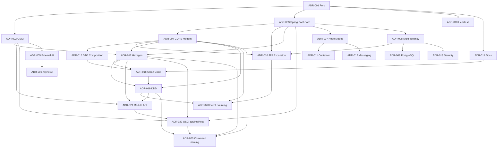

# 8. Design Decisions

This chapter documents the **essential architecture decisions** of fineract-osgi: problem, options, decision, consequences, and relation to the quality goals ([Chapter 7](07_quality_attributes.md)).

**Format (ADR-light)**:

| Field | Meaning |
|-------|---------|
| **Status** | proposed / accepted / superseded |
| **Context** | Problem and forces |
| **Decision** | What we do |
| **Alternatives** | What was discarded or deferred |
| **Consequences** | Gains, costs, risks |
| **Qualities** | Affected goals from Ch. 7 |

Decisions are grouped chronologically/logically, not by Jira tickets.

Individual ADRs live under [`decisions/`](decisions/) – **one file per decision** (see also [`decisions/README.md`](decisions/README.md)).

---

## 8.1 Decision Overview

| ID | Decision | Status | Core message |
|----|----------|--------|--------------|
| [ADR-001](decisions/ADR-001-fork-fineract-osgi-statt-pure-upstream.md) | Fork fineract-osgi | accepted | Own evolution line for OSGi + AI |
| [ADR-002](decisions/ADR-002-osgi-equinox-fuer-laufzeitmodularitaet.md) | OSGi / Equinox | accepted | Dynamic feature bundles |
| [ADR-003](decisions/ADR-003-spring-boot-gradle-module-als-kern-beibehalten.md) | Spring Boot + Gradle modules | accepted | No big-bang rewrite |
| [ADR-004](decisions/ADR-004-cqrs-und-command-pipeline-beibehalten-modernisieren.md) | Modernize CQRS | accepted | Legacy parallel, `fineract-command` new |
| [ADR-005](decisions/ADR-005-externe-ki-xai-grok-statt-embedded-ml.md) | External AI | accepted | Inference outside the core |
| [ADR-006](decisions/ADR-006-ki-default-asynchron-fail-open.md) | AI async / Fail-Open | accepted | Hot path protects availability |
| [ADR-007](decisions/ADR-007-node-rollen-read-write-batch.md) | Node Modes | accepted | Scaling without code forks |
| [ADR-008](decisions/ADR-008-multi-tenancy-mit-getrennten-tenant-datenbanken.md) | Multi-Tenancy | accepted | Isolation before shared-schema simplicity |
| [ADR-009](decisions/ADR-009-postgresql-als-primaere-datenbank-fuer-fineract-osgi.md) | PostgreSQL first | accepted | Target DB; MySQL/MariaDB still compatible |
| [ADR-010](decisions/ADR-010-headless-rest-api-keine-ui-im-scope.md) | Headless API | accepted | UI remains external product |
| [ADR-011](decisions/ADR-011-container-first-deployment-compose-kubernetes.md) | Container-first | accepted | Compose for dev, K8s for cluster |
| [ADR-012](decisions/ADR-012-messaging-fuer-verteilte-jobs-kafka-jms-optional.md) | Optional Messaging | accepted | Spring Events local, broker distributed |
| [ADR-013](decisions/ADR-013-sicherheit-am-api-rand-defense-in-depth.md) | Security at the edge | accepted | Proxy/WAF + AuthN/Z + Audit |
| [ADR-014](decisions/ADR-014-arc42-gherkin-als-doku-strategie.md) | arc42 + Gherkin | accepted | Document architecture and behavior |
| [ADR-015](decisions/ADR-015-api-dtos-composition-statt-vererbung.md) | API DTO Composition | accepted | Specialized DTOs compose shared fields; API stays flat |
| [ADR-016](decisions/ADR-016-jpa-ausbau-read-write-persistenz.md) | JPA expansion Read/Write | accepted | Spring Data + EclipseLink; hybrid reads; scope S1/S2 |
| [ADR-017](decisions/ADR-017-hexagonale-architektur.md) | Hexagonal Architecture | accepted | Ports & Adapters as guiding model; mapping to CQRS/OSGi/AI |
| [ADR-018](decisions/ADR-018-clean-code.md) | Clean Code | accepted | Readable, testable code; Boy Scout; SOLID as orientation |
| [ADR-019](decisions/ADR-019-domain-driven-design.md) | Domain-Driven Design | accepted | Bounded Contexts, Aggregates, UL; Context Map → [10](10_domain_context_map.md) |
| [ADR-020](decisions/ADR-020-event-sourcing-writes-pflicht.md) | Event Sourcing Writes | accepted | Create/Update/Delete event-sourced; inventory → [12](12_event_catalog.md) |
| [ADR-021](decisions/ADR-021-modul-kommunikation-nur-ueber-module-api.md) | Module API only | accepted | Subprojects only via `moduleapi` / Events / Shared Kernel |
| [ADR-022](decisions/ADR-022-osgi-api-impl-test-bundles-services.md) | OSGi api/impl/test + services | accepted | Bundle split; Service Registry only; no Karaf Features; Spring stays in impl |
| [ADR-023](decisions/ADR-023-fineract-command-module-naming.md) | Command module naming | accepted | Capability name `fineract-command`; drop `…-core`; api/impl under that tree |

---

## 8.2 Discarded / Deferred Major Options

| Topic | Status | Comment |
|-------|--------|---------|
| Full microservice cut per domain | deferred | Transaction and COB consistency too expensive as start |
| Event store **replaces** accounting journal | rejected | Double-entry remains relational; see [ADR-020](decisions/ADR-020-event-sourcing-writes-pflicht.md) |
| Event Sourcing only optional | rejected | [ADR-020](decisions/ADR-020-event-sourcing-writes-pflicht.md): mandatory for domain writes |
| Embedded ML in provider | rejected | [ADR-005](decisions/ADR-005-externe-ki-xai-grok-statt-embedded-ml.md) |
| Big-bang command migration | rejected | [ADR-004](decisions/ADR-004-cqrs-und-command-pipeline-beibehalten-modernisieren.md) |
| Redis idempotency store | deferred | Evaluate only after stable new command stack |
| Apache Camel as default dispatcher | deferred | Optional after several module migrations |
| Karaf as mandatory runtime | deferred | Equinox first; Karaf possibly distribution later |
| Karaf Features as inter-bundle contract | rejected | [ADR-022](decisions/ADR-022-osgi-api-impl-test-bundles-services.md): OSGi **Service Registry** only |
| Remove Spring before OSGi refactor | rejected | [ADR-022](decisions/ADR-022-osgi-api-impl-test-bundles-services.md) / [ADR-003](decisions/ADR-003-spring-boot-gradle-module-als-kern-beibehalten.md) |
| UI in core | rejected | [ADR-010](decisions/ADR-010-headless-rest-api-keine-ui-im-scope.md) |
| Blockchain/RTGS in core | rejected | Upstream out of scope |

---

## 8.3 Decision Matrix vs. Quality Goals

| ADR | Correct. | Security | Reliab. | Scale | Maint. | Extens. | Perf. | Ops | Compat. |
|-----|:--------:|:--------:|:-------:|:-----:|:------:|:-------:|:-----:|:---:|:-------:|
| 001 Fork | | | | | + | + | | | ± |
| 002 OSGi | | ± | + | + | + | ++ | | ± | |
| 003 Spring Core | + | | + | | + | | | + | ++ |
| 004 CQRS modern | ++ | + | + | + | ++ | | + | | ++ |
| 005 External AI | | ± | + | | + | ++ | + | ± | |
| 006 Async AI | ± | | ++ | | | | ++ | + | |
| 007 Node Modes | | | + | ++ | | | + | + | |
| 008 Multi-Tenant | + | ++ | | + | | | | ± | |
| 009 PostgreSQL | | | + | | | | + | + | ± |
| 010 Headless | | + | | | + | | | | + |
| 011 Container | | ± | + | + | | | | ++ | + |
| 012 Messaging | ± | | + | ++ | | | + | ± | |
| 013 Security | + | ++ | | | | | | + | |
| 014 Docs | | | | | ++ | | | + | |
| 015 DTO Composition | + | | | | ++ | + | | | ++ |
| 016 JPA Expansion | + | | + | + | ++ | | + | + | + |
| 017 Hexagon | + | | | | ++ | ++ | | | + |
| 018 Clean Code | + | | + | | ++ | | | + | + |
| 019 DDD | ++ | | + | | ++ | + | | | + |
| 020 Event Sourcing | ++ | + | + | ± | + | + | ± | ± | ± |
| 021 Module API | + | | | | ++ | ++ | | | + |
| 022 OSGi api/impl/test | | ± | + | | ++ | ++ | | ± | + |
| 023 Command naming | | | | | ++ | + | | | + |

*(++ strongly positive, + positive, ± mixed/trade-off)*

---

## 8.4 How New ADRs Are Adopted

1. Assign next free number; create file `decisions/ADR-NNN-short-slug.md` (template: existing ADRs).  
2. Problem and forces in 5–10 lines; at least two real alternatives.  
3. Decision + mapping to quality scenarios (Ch. 7).  
4. Consequences incl. ops/security follow-ups.  
5. Entry in the overview table and matrix above; mermaid dependency if applicable.  
6. Link from Runtime/Deployment/Crosscutting when behavior changes.  
7. Status `proposed` until review; then `accepted` or `superseded` with successor ID.

Details: [`decisions/README.md`](decisions/README.md).

---

## 8.5 Open Decision Needs

| Topic | Open question | Blocks |
|-------|---------------|--------|
| Equinox embedded vs. sidecar | final process model | Prod image layout |
| Bundle signing PKI | who signs, how verified | Prod hot deploy |
| Wave 2 follow-up | Wave 1 **complete**; **document** api/impl/test **in progress** — see [document plan](15_osgi_bundle_refactoring_fineract-document.md) / [15.6](15_osgi_bundle_refactoring.md#suggested-rollout-order-postcommand-pilot) | [ADR-022](decisions/ADR-022-osgi-api-impl-test-bundles-services.md) / [15](15_osgi_bundle_refactoring.md) |
| Outbox for external events | exactly vs. at-least-once UX | Enterprise integration |
| Sync AI products | which products fail-closed default | Lending policy |
| Helm chart | timing vs. raw manifests | Platform teams |
| Upstream sync policy | cadence, automatic merges | [ADR-001](decisions/ADR-001-fork-fineract-osgi-statt-pure-upstream.md) drift |
| Redis/Camel | re-evaluate after command migration | Perf optimization |

---

## 8.6 Related Gherkin Features (ADR Tags)

| ADR | Feature(s) with tag |
|-----|---------------------|
| [ADR-002](decisions/ADR-002-osgi-equinox-fuer-laufzeitmodularitaet.md) OSGi | `@adr-002` → [osgi/optional_bundle_degradation.feature](../gherkin/features/osgi/optional_bundle_degradation.feature) |
| [ADR-004](decisions/ADR-004-cqrs-und-command-pipeline-beibehalten-modernisieren.md) CQRS | `@adr-004` → [command_processing](../gherkin/features/crosscutting/command_processing.feature), [loan_command_idempotency](../gherkin/features/loan/loan_command_idempotency.feature) |
| [ADR-005](decisions/ADR-005-externe-ki-xai-grok-statt-embedded-ml.md) / [006](decisions/ADR-006-ki-default-asynchron-fail-open.md) AI | `@adr-005` `@adr-006` → [osgi/ki_scoring_async.feature](../gherkin/features/osgi/ki_scoring_async.feature) |
| [ADR-007](decisions/ADR-007-node-rollen-read-write-batch.md) Modes | `@adr-007` → [node_modes](../gherkin/features/crosscutting/node_modes.feature), [close_of_business](../gherkin/features/cob/close_of_business.feature) |
| [ADR-008](decisions/ADR-008-multi-tenancy-mit-getrennten-tenant-datenbanken.md) Multi-Tenant | `@adr-008` → [multi_tenant_isolation](../gherkin/features/crosscutting/multi_tenant_isolation.feature) |
| [ADR-012](decisions/ADR-012-messaging-fuer-verteilte-jobs-kafka-jms-optional.md) Messaging | `@adr-012` → [close_of_business](../gherkin/features/cob/close_of_business.feature) |
| [ADR-013](decisions/ADR-013-sicherheit-am-api-rand-defense-in-depth.md) Security | `@adr-013` → [security_authentication](../gherkin/features/crosscutting/security_authentication.feature) |
| [ADR-014](decisions/ADR-014-arc42-gherkin-als-doku-strategie.md) Docs | Mapping process in [gherkin/README.md](../gherkin/README.md) |
| [ADR-015](decisions/ADR-015-api-dtos-composition-statt-vererbung.md) DTO Composition | Unit: `*DtoCompositionTest`; IT: Interop/Deposit API contracts remain flat |
| [ADR-016](decisions/ADR-016-jpa-ausbau-read-write-persistenz.md) JPA Expansion | Repository/COB ITs; N+1 and batch measurements on pilot modules |
| [ADR-017](decisions/ADR-017-hexagonale-architektur.md) Hexagon | Module reviews dependency rule; domain unit tests with fake ports |
| [ADR-018](decisions/ADR-018-clean-code.md) Clean Code | Review checklist; Spotless/CI; Boy Scout in touched diffs |
| [ADR-019](decisions/ADR-019-domain-driven-design.md) DDD | Context/Aggregate in reviews; Gherkin UL; domain events after commit; Context Map [10](10_domain_context_map.md) |
| [ADR-020](decisions/ADR-020-event-sourcing-writes-pflicht.md) Event Sourcing | Event-store port; pilot aggregate; projector/idempotency ITs |
| [ADR-022](decisions/ADR-022-osgi-api-impl-test-bundles-services.md) OSGi bundles | `@adr-002` / `@runtime-osgi-lifecycle` → [osgi/optional_bundle_degradation.feature](../gherkin/features/osgi/optional_bundle_degradation.feature); playbook [15](15_osgi_bundle_refactoring.md) |

---

*Next*: [09 Glossary](09_glossary.md) · *Back*: [07 Quality Attributes](07_quality_attributes.md)
