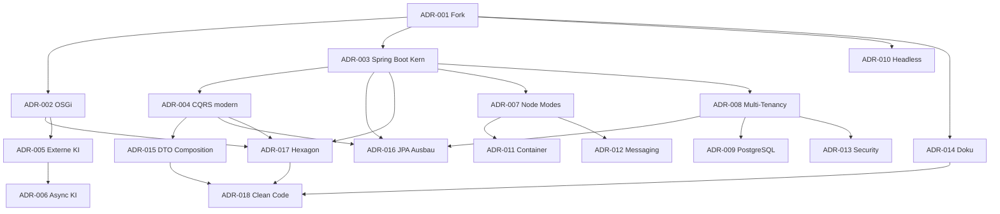

# 8. Design Decisions

Dieses Kapitel dokumentiert die **wesentlichen Architekturentscheidungen** von fineract-osgi: Problem, Optionen, Entscheidung, Konsequenzen und Bezug zu den Qualitätszielen ([Kapitel 7](07_quality_attributes.md)).

**Format (ADR-light)**:

| Feld | Bedeutung |
|------|-----------|
| **Status** | proposed / accepted / superseded |
| **Kontext** | Problem und Kräfte |
| **Entscheidung** | Was wir tun |
| **Alternativen** | Was verworfen oder zurückgestellt wurde |
| **Konsequenzen** | Gewinne, Kosten, Risiken |
| **Qualitäten** | Betroffene Ziele aus Kap. 7 |

Entscheidungen sind chronologisch/logisch gruppiert, nicht nach Jira-Tickets.

Die einzelnen ADRs liegen unter [`decisions/`](decisions/) – **eine Datei pro Entscheidung** (siehe auch [`decisions/README.md`](decisions/README.md)).

---

## 8.1 Entscheidungsübersicht

| ID | Entscheidung | Status | Kernbotschaft |
|----|--------------|--------|---------------|
| [ADR-001](decisions/ADR-001-fork-fineract-osgi-statt-pure-upstream.md) | Fork fineract-osgi | accepted | Eigene Evolutionslinie für OSGi + KI |
| [ADR-002](decisions/ADR-002-osgi-equinox-fuer-laufzeitmodularitaet.md) | OSGi / Equinox | accepted | Dynamische Feature-Bundles |
| [ADR-003](decisions/ADR-003-spring-boot-gradle-module-als-kern-beibehalten.md) | Spring Boot + Gradle-Module | accepted | Kein Big-Bang-Rewrite |
| [ADR-004](decisions/ADR-004-cqrs-und-command-pipeline-beibehalten-modernisieren.md) | CQRS modernisieren | accepted | Legacy parallel, `fineract-command` neu |
| [ADR-005](decisions/ADR-005-externe-ki-xai-grok-statt-embedded-ml.md) | Externe KI | accepted | Inference außerhalb des Cores |
| [ADR-006](decisions/ADR-006-ki-default-asynchron-fail-open.md) | KI async / Fail-Open | accepted | Hot-Path schützt Verfügbarkeit |
| [ADR-007](decisions/ADR-007-node-rollen-read-write-batch.md) | Node Modes | accepted | Skalierung ohne Code-Forks |
| [ADR-008](decisions/ADR-008-multi-tenancy-mit-getrennten-tenant-datenbanken.md) | Multi-Tenancy | accepted | Isolation vor Shared-Schema-Einfachheit |
| [ADR-009](decisions/ADR-009-postgresql-als-primaere-datenbank-fuer-fineract-osgi.md) | PostgreSQL first | accepted | Ziel-DB; MySQL/MariaDB weiter kompatibel |
| [ADR-010](decisions/ADR-010-headless-rest-api-keine-ui-im-scope.md) | Headless API | accepted | UI bleibt externes Produkt |
| [ADR-011](decisions/ADR-011-container-first-deployment-compose-kubernetes.md) | Container-first | accepted | Compose für Dev, K8s für Cluster |
| [ADR-012](decisions/ADR-012-messaging-fuer-verteilte-jobs-kafka-jms-optional.md) | Optional Messaging | accepted | Spring Events lokal, Broker verteilt |
| [ADR-013](decisions/ADR-013-sicherheit-am-api-rand-defense-in-depth.md) | Security am Rand | accepted | Proxy/WAF + AuthN/Z + Audit |
| [ADR-014](decisions/ADR-014-arc42-gherkin-als-doku-strategie.md) | arc42 + Gherkin | accepted | Architektur und Verhalten dokumentieren |
| [ADR-015](decisions/ADR-015-api-dtos-composition-statt-vererbung.md) | API-DTO Composition | accepted | Spezialisierte DTOs komponieren Shared-Felder; API bleibt flach |
| [ADR-016](decisions/ADR-016-jpa-ausbau-read-write-persistenz.md) | JPA-Ausbau Read/Write | accepted | Spring Data + EclipseLink; Hybrid Reads; Scope S1/S2 |
| [ADR-017](decisions/ADR-017-hexagonale-architektur.md) | Hexagonale Architektur | accepted | Ports & Adapters als Leitbild; Mapping auf CQRS/OSGi/KI |
| [ADR-018](decisions/ADR-018-clean-code.md) | Clean Code | accepted | Lesbarer, testbarer Code; Boy Scout; SOLID als Orientierung |

---

## 8.2 Verworfene / zurückgestellte Großoptionen

| Thema | Status | Kommentar |
|-------|--------|-----------|
| Kompletter Microservice-Schnitt pro Domain | deferred | Transaktions- und COB-Konsistenz zu teuer als Start |
| Event Sourcing als Ledger | rejected (jetzt) | Anderes Paradigma; Double-Entry bleibt relational |
| Embedded ML im Provider | rejected | [ADR-005](decisions/ADR-005-externe-ki-xai-grok-statt-embedded-ml.md) |
| Big-Bang Command-Migration | rejected | [ADR-004](decisions/ADR-004-cqrs-und-command-pipeline-beibehalten-modernisieren.md) |
| Redis-Idempotency store | deferred | Erst nach stabilem neuem Command-Stack bewerten |
| Apache Camel als Default-Dispatcher | deferred | Optional nach mehreren Modul-Migrationen |
| Karaf als Pflicht-Runtime | deferred | Equinox first; Karaf ggf. Distribution später |
| UI im Core | rejected | [ADR-010](decisions/ADR-010-headless-rest-api-keine-ui-im-scope.md) |
| Blockchain/RTGS im Core | rejected | Upstream out of scope |

---

## 8.3 Entscheidungsmatrix vs. Qualitätsziele

| ADR | Korrekt. | Security | Reliab. | Scale | Maint. | Extens. | Perf. | Ops | Compat. |
|-----|:--------:|:--------:|:-------:|:-----:|:------:|:-------:|:-----:|:---:|:-------:|
| 001 Fork | | | | | + | + | | | ± |
| 002 OSGi | | ± | + | + | + | ++ | | ± | |
| 003 Spring Kern | + | | + | | + | | | + | ++ |
| 004 CQRS modern | ++ | + | + | + | ++ | | + | | ++ |
| 005 Externe KI | | ± | + | | + | ++ | + | ± | |
| 006 Async KI | ± | | ++ | | | | ++ | + | |
| 007 Node Modes | | | + | ++ | | | + | + | |
| 008 Multi-Tenant | + | ++ | | + | | | | ± | |
| 009 PostgreSQL | | | + | | | | + | + | ± |
| 010 Headless | | + | | | + | | | | + |
| 011 Container | | ± | + | + | | | | ++ | + |
| 012 Messaging | ± | | + | ++ | | | + | ± | |
| 013 Security | + | ++ | | | | | | + | |
| 014 Doku | | | | | ++ | | | + | |
| 015 DTO Composition | + | | | | ++ | + | | | ++ |
| 016 JPA Ausbau | + | | + | + | ++ | | + | + | + |
| 017 Hexagon | + | | | | ++ | ++ | | | + |
| 018 Clean Code | + | | + | | ++ | | | + | + |

*(++ stark positiv, + positiv, ± gemischt/Trade-off)*

---

## 8.4 Wie neue ADRs aufgenommen werden

1. Nächste freie Nummer vergeben; Datei `decisions/ADR-NNN-kurzslug.md` anlegen (Vorlage: bestehende ADRs).  
2. Problem und Kräfte in 5–10 Zeilen; mindestens zwei echte Alternativen.  
3. Entscheidung + Mapping auf Quality Scenarios (Kap. 7).  
4. Konsequenzen inkl. Ops-/Security-Folgen.  
5. Eintrag in der Übersichtstabelle und Matrix oben; ggf. Mermaid-Abhängigkeit.  
6. Verlinkung aus Runtime/Deployment/Crosscutting, wenn Verhalten sich ändert.  
7. Status `proposed` bis Review; danach `accepted` oder `superseded` mit Nachfolger-ID.

Details: [`decisions/README.md`](decisions/README.md).

---

## 8.5 Offene Entscheidungsbedarfe

| Thema | Offene Frage | Blocker für |
|-------|--------------|-------------|
| Equinox embedded vs. Sidecar | finales Prozessmodell | Prod-Image-Layout |
| Bundle-Signing-PKI | wer signiert, wie verifiziert | Prod-Hot-Deploy |
| Outbox für External Events | exactly vs. at-least-once UX | Enterprise-Integration |
| Sync-KI-Produkte | welche Produkte Fail-Closed default | Lending-Policy |
| Helm-Chart | Timing vs. rohe Manifeste | Plattform-Teams |
| Upstream-Sync-Policy | Kadenz, automatische Merges | [ADR-001](decisions/ADR-001-fork-fineract-osgi-statt-pure-upstream.md) Drift |
| Redis/Camel | nach Command-Migration re-evaluieren | Perf-Optimierung |

---

## 8.6 Verwandte Gherkin-Features (ADR-Tags)

| ADR | Feature(s) mit Tag |
|-----|-------------------|
| [ADR-002](decisions/ADR-002-osgi-equinox-fuer-laufzeitmodularitaet.md) OSGi | `@adr-002` → [osgi/optional_bundle_degradation.feature](../gherkin/features/osgi/optional_bundle_degradation.feature) |
| [ADR-004](decisions/ADR-004-cqrs-und-command-pipeline-beibehalten-modernisieren.md) CQRS | `@adr-004` → [command_processing](../gherkin/features/crosscutting/command_processing.feature), [loan_command_idempotency](../gherkin/features/loan/loan_command_idempotency.feature) |
| [ADR-005](decisions/ADR-005-externe-ki-xai-grok-statt-embedded-ml.md) / [006](decisions/ADR-006-ki-default-asynchron-fail-open.md) KI | `@adr-005` `@adr-006` → [osgi/ki_scoring_async.feature](../gherkin/features/osgi/ki_scoring_async.feature) |
| [ADR-007](decisions/ADR-007-node-rollen-read-write-batch.md) Modes | `@adr-007` → [node_modes](../gherkin/features/crosscutting/node_modes.feature), [close_of_business](../gherkin/features/cob/close_of_business.feature) |
| [ADR-008](decisions/ADR-008-multi-tenancy-mit-getrennten-tenant-datenbanken.md) Multi-Tenant | `@adr-008` → [multi_tenant_isolation](../gherkin/features/crosscutting/multi_tenant_isolation.feature) |
| [ADR-012](decisions/ADR-012-messaging-fuer-verteilte-jobs-kafka-jms-optional.md) Messaging | `@adr-012` → [close_of_business](../gherkin/features/cob/close_of_business.feature) |
| [ADR-013](decisions/ADR-013-sicherheit-am-api-rand-defense-in-depth.md) Security | `@adr-013` → [security_authentication](../gherkin/features/crosscutting/security_authentication.feature) |
| [ADR-014](decisions/ADR-014-arc42-gherkin-als-doku-strategie.md) Doku | Mapping-Prozess in [gherkin/README.md](../gherkin/README.md) |
| [ADR-015](decisions/ADR-015-api-dtos-composition-statt-vererbung.md) DTO Composition | Unit: `*DtoCompositionTest`; IT: Interop/Deposit-API-Verträge unverändert flach |
| [ADR-016](decisions/ADR-016-jpa-ausbau-read-write-persistenz.md) JPA Ausbau | Repository-/COB-ITs; N+1- und Batch-Messungen an Pilotmodulen |
| [ADR-017](decisions/ADR-017-hexagonale-architektur.md) Hexagon | Modul-Reviews Dependency Rule; Domain-Unit-Tests mit Fake-Ports |
| [ADR-018](decisions/ADR-018-clean-code.md) Clean Code | Review-Checkliste; Spotless/CI; Boy Scout in angefassten Diffs |

---

*Weiter*: [09 Glossary](09_glossary.md) · *Zurück*: [07 Quality Attributes](07_quality_attributes.md)
