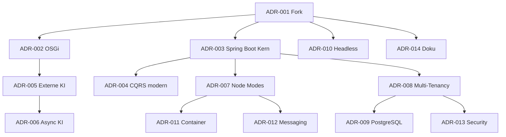
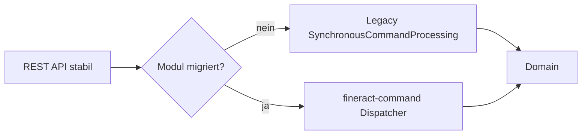

# 8. Design Decisions

Dieses Kapitel dokumentiert die **wesentlichen Architekturentscheidungen** von fineract-osgi: Problem, Optionen, Entscheidung, Konsequenzen und Bezug zu den Qualitätszielen ([Kapitel 7](07_quality_attributes.md)).

**Format (ADR-light)**:

| Feld | Bedeutung |
|------|-----------|
| **Status** | proposed / accepted / superseded |
| **Kontext** | Problem und Kräfte |
| **Entscheidung** | Was wir tun |
| **Alternativen** | Was verworfen oder zurückgestellt wurde |
| **Konsequenzen** | Gewinne, Kosten, Risiken |
| **Qualitäten** | Betroffene Ziele aus Kap. 7 |

Entscheidungen sind chronologisch/logisch gruppiert, nicht nach Jira-Tickets.

---

## 8.1 Entscheidungsübersicht

| ID | Entscheidung | Status | Kernbotschaft |
|----|--------------|--------|---------------|
| [ADR-001](#81-adr-001--fork-fineract-osgi-statt-pure-upstream) | Fork fineract-osgi | accepted | Eigene Evolutionslinie für OSGi + KI |
| [ADR-002](#82-adr-002--osgi-equinox-für-laufzeitmodularität) | OSGi / Equinox | accepted | Dynamische Feature-Bundles |
| [ADR-003](#83-adr-003--spring-boot--gradle-module-als-kern-beibehalten) | Spring Boot + Gradle-Module | accepted | Kein Big-Bang-Rewrite |
| [ADR-004](#84-adr-004--cqrs-und-command-pipeline-beibehalten--modernisieren) | CQRS modernisieren | accepted | Legacy parallel, `fineract-command` neu |
| [ADR-005](#85-adr-005--externe-ki-xai-grok-statt-embedded-ml) | Externe KI | accepted | Inference außerhalb des Cores |
| [ADR-006](#86-adr-006--ki-default-asynchron--fail-open) | KI async / Fail-Open | accepted | Hot-Path schützt Verfügbarkeit |
| [ADR-007](#87-adr-007--node-rollen-read--write--batch) | Node Modes | accepted | Skalierung ohne Code-Forks |
| [ADR-008](#88-adr-008--multi-tenancy-mit-getrennten-tenant-datenbanken) | Multi-Tenancy | accepted | Isolation vor Shared-Schema-Einfachheit |
| [ADR-009](#89-adr-009--postgresql-als-primäre-datenbank-für-fineract-osgi) | PostgreSQL first | accepted | Ziel-DB; MySQL/MariaDB weiter kompatibel |
| [ADR-010](#810-adr-010--headless-rest-api-keine-ui-im-scope) | Headless API | accepted | UI bleibt externes Produkt |
| [ADR-011](#811-adr-011--container-first-deployment-compose--kubernetes) | Container-first | accepted | Compose für Dev, K8s für Cluster |
| [ADR-012](#812-adr-012--messaging-für-verteilte-jobs-kafkajms-optional) | Optional Messaging | accepted | Spring Events lokal, Broker verteilt |
| [ADR-013](#813-adr-013--sicherheit-am-api-rand--defense-in-depth) | Security am Rand | accepted | Proxy/WAF + AuthN/Z + Audit |
| [ADR-014](#814-adr-014--arc42--gherkin-als-doku-strategie) | arc42 + Gherkin | accepted | Architektur und Verhalten dokumentieren |

---

## 8.1 ADR-001 – Fork fineract-osgi statt pure Upstream

| | |
|--|--|
| **Status** | accepted |
| **Qualitäten** | Extensibility, Maintainability, Compatibility (kontrolliert) |

### Kontext

Apache Fineract deckt Core Banking für Inklusion ab, ist aber monolithisch/modular nur auf Build-Ebene. fineract-osgi will **OSGi-Laufzeitmodularität** und **KI-Erweiterbarkeit** vorantreiben, ohne den Upstream-Release-Takt und jede Community-Entscheidung zu blockieren.

### Entscheidung

Einen **dedizierten Fork/Arbeitsstrang `fineract-osgi`** führen, der:

- den Fineract-1.x-Kern und Domain-Module übernimmt,
- OSGi- und KI-Pfade dokumentiert und schrittweise implementiert,
- Upstream-Fixes selektiv übernimmt.

### Alternativen

| Option | Warum nicht (jetzt) |
|--------|---------------------|
| Nur Upstream-PRs | Zu langsam/unsicher für OSGi-Experimente; Scope-Konflikt |
| Komplett neues System | Fachlicher Verlust, Jahre Aufwand |
| Nur Plugins ohne Fork | Laufzeit-Plugin-Modell fehlt im Upstream |

### Konsequenzen

- **+** Eigene Architektur-Roadmap (arc42, OSGi, KI)  
- **+** Experimente ohne Upstream zu destabilisieren  
- **−** Merge-Aufwand und Drift-Risiko zu Apache Fineract  
- **−** Klare Governance nötig (was zurückfließt, was fork-spezifisch bleibt)

### Bezug

- [01 Introduction](01_introduction.md), [02 Context](02_context_and_scope.md)

---

## 8.2 ADR-002 – OSGi (Equinox) für Laufzeitmodularität

| | |
|--|--|
| **Status** | accepted |
| **Qualitäten** | Extensibility, Maintainability, Deployability |

### Kontext

Gradle-Module strukturieren den Build, erlauben aber kein **dynamisches** Aktivieren/Ersetzen von Features (KI, instituts-spezifische Regeln) zur Laufzeit. Kunden sollen Erweiterungen laden können, ohne den Core neu zu bauen.

### Entscheidung

**OSGi** als Modularitätsmodell einführen; als Framework **Eclipse Equinox** (siehe `osgi/`, `docs/arc42/osgi.gradle`).

Prinzipien:

1. Feature-Implementierungen als **Bundles**  
2. Verträge als exportierte **Service-Interfaces**  
3. Core nutzt Services **optional** (Service Registry / Tracker)  
4. Fehlt ein Bundle → **Degradation**, kein Totalausfall  

### Alternativen

| Option | Bewertung |
|--------|-----------|
| **Apache Felix** | Valide; Equinox wegen Tooling/Console/Enterprise-Nähe bevorzugt |
| **Apache Karaf** | Mehr Ops-Komfort, aber schwergewichtigere Plattform; später optional als Distribution |
| **PF4J / Spring Plugin** | Leichter, aber schwächere Isolation/Versionierung als OSGi |
| **Microservices pro Feature** | Maximale Isolation, aber Ops- und Transaktionskomplexität für Core Banking zu hoch |
| **Nur Gradle-Module** | Unzureichend für Hot-Deploy und kunden-spezifische Binaries |

### Konsequenzen

- **+** Hot-Deploy, klare API/Impl-Trennung, kunden-spezifische Bundles  
- **+** Unterstützt Qualitätsziel Erweiterbarkeit ([Q-EXT-*](07_quality_attributes.md))  
- **−** Bundle-Lifecycle, Package-Exports, Versionsdisziplin  
- **−** Lernkurve; Equinox Console muss gehärtet werden (Port 2501)  
- **−** Cluster: gleiche Bundle-Versionen auf allen Nodes  

### Bezug

- Runtime [4.4](04_runtime_view.md), Deployment [5.7](05_deployment_view.md), Crosscutting [6.7](06_crosscutting_concepts.md)

---

## 8.3 ADR-003 – Spring Boot + Gradle-Module als Kern beibehalten

| | |
|--|--|
| **Status** | accepted |
| **Qualitäten** | Maintainability, Compatibility, Reliability |

### Kontext

Ein vollständiger Rewrite (neue Sprache, neues Framework) würde Fachlogik (Loans, Savings, Accounting, COB) riskieren. Fineract bringt Spring, Batch, Security und ein großes Testnetz mit.

### Entscheidung

- **Spring Boot** bleibt Application-Container und DI-Grundlage.  
- Bestehende **Gradle-Module** (`fineract-provider`, `fineract-loan`, `fineract-core`, …) bleiben die Build-Struktur.  
- OSGi **ergänzt** den Kern (Bridge), ersetzt ihn nicht in einem Schritt.

### Alternativen

| Option | Warum verworfen |
|--------|-----------------|
| Quarkus / Micronaut Rewrite | Kein ausreichender ROI vs. Migrationsrisiko |
| Reines OSGi-Blueprint ohne Spring | Verlust Ökosystem und Contributor-Wissen |
| Softwarica „Modulith only“ ohne OSGi | Reicht nicht für dynamische Kunden-Features |

### Konsequenzen

- **+** Kontinuität, bestehende Tests und Integrationen nutzbar  
- **+** Schrittweise Modernisierung möglich  
- **−** Zwei Welten (Spring + OSGi) müssen gebridged werden  
- **−** Technische Schulden des Monolithen bleiben zunächst bestehen  

---

## 8.4 ADR-004 – CQRS und Command-Pipeline beibehalten & modernisieren

| | |
|--|--|
| **Status** | accepted |
| **Qualitäten** | Korrektheit, Maintainability, Performance, Compatibility |

### Kontext

Writes laufen über CQRS (`SynchronousCommandProcessingService`). Historisch: JSON-Strings, Magic Keys, schwere Test- und Refactoring-Kosten (`fineract-command/README.md`). Gleichzeitig sind Audit, Maker-Checker und Idempotenz wertvoll und bleiben nötig.

### Entscheidung

1. **CQRS beibehalten** (Reads vs. Writes).  
2. **Legacy-Pipeline unangetastet parallel** weiterlaufen lassen.  
3. Neuen Stack **`fineract-command`** einführen:  
   - typsichere `Command<REQ>`  
   - Jakarta Validation  
   - austauschbare `CommandDispatcher` (sync Pflicht; async/Disruptor optional)  
   - Hooks für Cross-Cutting  
4. Migration **modulweise**, REST-Vertrag **100 % abwärtskompatibel**.  
5. Storage-Layer-Cleanup ist **Non-Goal** dieser Entscheidung.

### Alternativen

| Option | Bewertung |
|--------|-----------|
| Big-Bang Ersatz der Legacy-Pipeline | Zu riskant für Banking-Core |
| Event-Sourced Rewrite | Fachlich/operativ anderer Systemtyp |
| Direkt Apache Camel als einziger Bus | Optional später; nicht als Blocker für Typisierung |
| CQRS aufgeben, klassische Service-Calls | Verlust Audit/Idempotency-Zentralisierung |

### Konsequenzen

- **+** Typsicherheit, bessere DX, messbare Pipeline  
- **+** Rollback auf sync Dispatcher möglich  
- **−** Zwei Command-Welten während der Migration  
- **−** Disziplin nötig, Legacy nicht weiter aufzublähen  

### Bezug

- Runtime [4.3](04_runtime_view.md), Crosscutting [6.4](06_crosscutting_concepts.md), FINERACT-2169 u. a.

---

## 8.5 ADR-005 – Externe KI (xAI Grok) statt embedded ML

| | |
|--|--|
| **Status** | accepted |
| **Qualitäten** | Extensibility, Maintainability, Performance, Security |

### Kontext

Kredit-Scoring, Hinweise, Textanalyse sollen möglich sein. Ein trainiertes ML-Modell *im* Banking-Monolithen würde Release-, GPU-, Compliance- und Team-Kompetenz-Probleme schaffen.

### Entscheidung

KI als **externe Inferenz** anbinden (Referenz: **xAI Grok API**), gekapselt in einem **OSGi-Feature-Bundle** (z. B. `CreditScoreProvider`).

- Core Banking bleibt frei von Modellgewichten und Training-Pipelines.  
- Austausch des Providers (anderer Vendor/Modell) über Bundle-Impl.  
- Datenminimierung und Secret-Handling Pflicht ([Kap. 6.8](06_crosscutting_concepts.md)).

### Alternativen

| Option | Warum nicht |
|--------|-------------|
| Embedded TensorFlow/ONNX im Core | Aufblähung, Ops, Haftungs-/Lizenzfragen |
| Batch-only Offline-Scoring ohne API | Zu träge für Officer-Workflows; ergänzend ok |
| KI direkt in Command-Handlern hardcoden | Kopplung, nicht multi-vendor, nicht OSGi-konform |
| Anderer Cloud-LLM only | Möglich; Architektur bleibt vendor-neutral über Interface |

### Konsequenzen

- **+** Schlanker Core, schnelle Innovation am Rand  
- **+** Passt zu OSGi-Extension-Modell  
- **−** Abhängigkeit von Netz, Vendor, Kosten  
- **−** Datenschutz/PII-Governance für Payloads nötig  
- **−** Latenz- und Ausfallbehandlung explizit designen (ADR-006)

---

## 8.6 ADR-006 – KI default asynchron & Fail-Open

| | |
|--|--|
| **Status** | accepted |
| **Qualitäten** | Performance, Reliability; Trade-off vs. strikte Auto-Decision |

### Kontext

Externe Inference kann 100 ms–mehrere Sekunden dauern und ausfallen. Sync im Default-Write-Pfad gefährdet p95 und Verfügbarkeit ([Q-PERF-1](07_quality_attributes.md), [Q-REL-2](07_quality_attributes.md)).

### Entscheidung

| Aspekt | Default | Ausnahme |
|--------|---------|----------|
| Aufrufzeitpunkt | **Async** nach Domain-Event / nach Commit | Sync nur als konfiguriertes **Policy Gate** |
| Bei Timeout/5xx | **Fail-Open** (Write bleibt erfolgreich) | **Fail-Closed** nur produkt-/regulatorisch erzwungen |
| Buchungen | KI ändert **nie still** Salden | Nur Enrichment oder explizite Business-Rule |

### Alternativen

| Option | Bewertung |
|--------|-----------|
| Immer sync vor Persistenz | Hohe Korrektheit der „KI-Entscheidung“, schlechte Latenz/Verfügbarkeit |
| Immer Fail-Closed | Sicher für Auto-Reject-Produkte, riskant für Ops |
| Fire-and-forget ohne Persistenz des Scores | Zu wenig Auditierbarkeit |

### Konsequenzen

- **+** Write-SLO und COB entkoppelt von Vendor-Latenz  
- **+** Klare Policy-Matrix pro Produkt möglich  
- **−** Score ggf. erst verzögert sichtbar (Eventual Enrichment)  
- **−** Produkt-Teams müssen Fail-Closed bewusst einschalten  

---

## 8.7 ADR-007 – Node-Rollen Read / Write / Batch

| | |
|--|--|
| **Status** | accepted |
| **Qualitäten** | Scalability, Reliability, Deployability |

### Kontext

Ein All-in-One-Prozess reicht für Dev und kleine Institute. Größere Last braucht Trennung von Online-API und COB-Arbeit, ohne separate Codebasen.

### Entscheidung

Rollen über **Mode-Flags** steuern (bereits im Fineract-Kern):

- `fineract.mode.read-enabled`  
- `fineract.mode.write-enabled`  
- `fineract.mode.batch-manager-enabled`  
- `fineract.mode.batch-worker-enabled`  

Dazu `FINERACT_NODE_ID`; Worker typisch ohne Liquibase.

Topologien: All-in-One → API+Batch split → Manager + N Worker ([Kap. 5.3](05_deployment_view.md)).

### Alternativen

| Option | Warum nicht |
|--------|-------------|
| Getrennte Artefakte pro Rolle | Build-/Release-Vervielfachung |
| Immer nur All-in-One | COB und Reports ersticken Online-Traffic |
| Kubernetes Jobs only ohne Modes | Unzureichend für langlebige Worker und API-Filter |

### Konsequenzen

- **+** Horizontale Skalierung der richtigen Ebene  
- **+** Ein Image, viele Rollen  
- **−** Fehlkonfiguration (zweiter Manager) muss operativ verhindert werden  
- **−** Mehr Deployment-Komplexität und Connection-Budget-Planung  

---

## 8.8 ADR-008 – Multi-Tenancy mit getrennten Tenant-Datenbanken

| | |
|--|--|
| **Status** | accepted |
| **Qualitäten** | Security, Isolation, Scalability |

### Kontext

SaaS-/Hosting-Szenarien bedienen viele Institute. Strikte Trennung von Daten und oft Konfiguration (inkl. OIDC pro Tenant) ist Pflicht.

### Entscheidung

- Zentrale **Tenants-Registry-DB** (`fineract_tenants`)  
- **Fachdaten pro Tenant** in eigener DB/Schema  
- Request- und Job-Context über Filter + ThreadLocal  
- Optional Read-only-Connections für Report-Nodes  

### Alternativen

| Option | Bewertung |
|--------|-----------|
| Shared Schema + `tenant_id` Spalte | Einfacher Betrieb, schwächere Isolation, riskantere Queries |
| DB-pro-Tenant auf eigenem Server immer | Maximale Isolation, hohe Kosten; optional für Großkunden |
| Schema-pro-Request dynamisch ohne Pool | Performance-Falle |

### Konsequenzen

- **+** Starke Isolation, Backup/Restore pro Institut möglich  
- **+** Passt zu Security-Szenarien Q-SEC-1  
- **−** Connection-Pools multiplizieren sich  
- **−** Ops muss Tenant-Lifecycle (Provisionierung) beherrschen  

---

## 8.9 ADR-009 – PostgreSQL als primäre Datenbank für fineract-osgi

| | |
|--|--|
| **Status** | accepted |
| **Qualitäten** | Operability, Portability, Compatibility |

### Kontext

Upstream unterstützt MySQL/MariaDB/PostgreSQL. Die arc42- und Compose-Referenz von fineract-osgi priorisiert **PostgreSQL** (Docker-Defaults, Doku).

### Entscheidung

- **PostgreSQL** ist die **primäre** dokumentierte und getestete Ziel-DB für fineract-osgi.  
- MySQL/MariaDB bleiben über bestehende Compose-/K8s-Beispiele **kompatibel**, sind aber nicht der strategische Fokus.  
- K8s-Beispiele mit MySQL im Repo gelten als Upstream-Erbe, nicht als Zielbild.

### Alternativen

| Option | Bewertung |
|--------|-----------|
| MySQL first | Upstream-Nähe; nicht die gewählte Doku-Linie |
| Nur Managed Cloud-SQL-Abstraktion | Ziel-Betrieb ok, ersetzt nicht die Engine-Entscheidung |
| Separate DB-Engine pro Modul | Unnötige Komplexität |

### Konsequenzen

- **+** Klare Referenzarchitektur, ein Ops-Pfad  
- **−** Dual-Stack-Tests kosten extra, wenn MySQL weiter offiziell supportet wird  
- **−** Migration bestehender MySQL-Kunden braucht Runbook  

---

## 8.10 ADR-010 – Headless REST-API, keine UI im Scope

| | |
|--|--|
| **Status** | accepted |
| **Qualitäten** | Maintainability, Compatibility |

### Kontext

Fineract ist API-first; UIs (Web App, Community App, Self-Service) sind separate Produkte ([`SECURITY.md`](../../SECURITY.md), [Kap. 2](02_context_and_scope.md)).

### Entscheidung

fineract-osgi liefert **keine** First-Class-UI im Architektur-Scope. Integration über REST/OpenAPI; optionale Compose-Dateien für UI-Nebenstacks sind Demo, nicht Kern.

### Alternativen

| Option | Warum nicht |
|--------|-------------|
| UI in denselben Deployable | Vermischt Release-Zyklen und Threat Model |
| GraphQL als Primär-API | Zusätzliche Oberfläche ohne Bedarf der bestehenden Integratoren |

### Konsequenzen

- **+** Klarer Schnitt, kleineres Security-Scope  
- **−** UX-Verantwortung liegt bei Integratoren/Frontend-Teams  

---

## 8.11 ADR-011 – Container-first Deployment (Compose + Kubernetes)

| | |
|--|--|
| **Status** | accepted |
| **Qualitäten** | Deployability, Operability, Scalability |

### Kontext

Betreiber erwarten reproduzierbare Umgebungen von Laptop bis Cluster.

### Entscheidung

- **Docker Compose** für Dev/Test und dokumentierte Topologien (Single, Manager/Worker, Kafka/ActiveMQ).  
- **Kubernetes**-Manifeste als Cluster-Blaupause.  
- App-Nodes weitgehend **stateless**; Zustand in DB/Messaging.  
- Compose/K8s-Beispiele sind **nicht** automatisch production-hardened.

### Alternativen

| Option | Bewertung |
|--------|-----------|
| Nur Bare-Metal JAR | Möglich, schlechtere Reproduzierbarkeit |
| Nur Helm von Tag 1 | Ziel; Manifeste zuerst, Chart folgt (offener Punkt Kap. 5) |
| Serverless Functions für Commands | Unpassend für lange COB-Transaktionen und State |

### Konsequenzen

- **+** Gleiches Image, Modes per Env  
- **+** Passt zu Health-Probes und horizontalen Workern  
- **−** Secrets-, TLS- und Network-Härtung bleiben Betreiberpflicht  

---

## 8.12 ADR-012 – Messaging für verteilte Jobs (Kafka/JMS optional)

| | |
|--|--|
| **Status** | accepted |
| **Qualitäten** | Scalability, Reliability |

### Kontext

COB und Remote Jobs brauchen bei mehreren Workern eine Verteilung. Für Single-Node reichen In-Process-Events.

### Entscheidung

- **Default lokal**: Spring Events (`fineract.remote-job-message-handler.spring-events`).  
- **Verteilt**: Kafka **oder** JMS/ActiveMQ per Konfiguration.  
- External Events analog optional über denselben Broker-Stack.  
- Kein Zwang zu einem Broker in der Minimalinstallation.

### Alternativen

| Option | Bewertung |
|--------|-----------|
| Immer Kafka erzwingen | Hürde für kleine Deployments |
| Nur DB-Polling für Work-Queues | Einfach, aber Last und Locking auf der Banking-DB |
| Cloud-proprietary Queues only | Lock-in; Adapter später möglich |

### Konsequenzen

- **+** Skalierbare Worker-Plane  
- **+** Entkopplung Online vs. Batch  
- **−** At-least-once → idempotente Consumer/Steps  
- **−** Ops-Kompetenz für Broker-HA in Prod  

---

## 8.13 ADR-013 – Sicherheit am API-Rand + Defense in Depth

| | |
|--|--|
| **Status** | accepted |
| **Qualitäten** | Security, Operability |

### Kontext

Threat Model: API ist primäre Trust Boundary; kein Direkt-Expose ohne Reverse Proxy/WAF empfohlen.

### Entscheidung

1. **TLS** und idealerweise Reverse Proxy vor Fineract.  
2. **AuthN** austauschbar: Basic (Dev), OIDC/JWT, optional 2FA.  
3. **AuthZ** über Permissions im Security Context.  
4. **Tenant-Context** vor Fachlogik.  
5. **Audit** aller Writes.  
6. Equinox Console und JDWP **nicht** öffentlich.  
7. KI- und DB-Secrets außerhalb des Images.

### Alternativen

| Option | Warum nicht |
|--------|-------------|
| Security nur im Service-Mesh | Mesh ergänzt, ersetzt App-AuthZ nicht |
| API-Keys ohne User-Context für alles | Unzureichend für Maker-Checker und Audit |
| „Security by obscurity“ interner Ports | Unzureichend |

### Konsequenzen

- **+** Mehrschichtig, an Upstream-Modell angelehnt  
- **−** Korrekte Proxy-, CORS- und Header-Konfiguration nötig  
- **−** OIDC pro Tenant erhöht Config-Komplexität  

### Bezug

- [`SECURITY.md`](../../SECURITY.md), Crosscutting [6.3](06_crosscutting_concepts.md)

---

## 8.14 ADR-014 – arc42 + Gherkin als Doku-Strategie

| | |
|--|--|
| **Status** | accepted |
| **Qualitäten** | Maintainability, Operability |

### Kontext

Architektur- und Fachverhalten müssen für Menschen und Agenten auffindbar sein (`docs/`, `AGENTS.md`).

### Entscheidung

- **arc42** unter `docs/arc42/` für Architektur (Kontext bis Entscheidungen).  
- **Gherkin** unter `docs/gherkin/` für verhaltensnahe Anforderungen (BDD).  
- Querverweise zwischen Runtime, Deployment, Crosscutting, Quality und ADRs.

### Alternativen

| Option | Bewertung |
|--------|-----------|
| Nur Code als Doku | Zu hohe Onboarding-Kosten |
| Nur Wiki extern | Drift zum Repo |
| C4 only | Ergänzend möglich; arc42 deckt Qualität/ADRs besser ab |

### Konsequenzen

- **+** Einheitliche Navigationsstruktur, PR-reviewbare Doku  
- **−** Doku muss bei Architekturänderungen mitgepflegt werden  

---

## 8.15 Verworfene / zurückgestellte Großoptionen

| Thema | Status | Kommentar |
|-------|--------|-----------|
| Kompletter Microservice-Schnitt pro Domain | deferred | Transaktions- und COB-Konsistenz zu teuer als Start |
| Event Sourcing als Ledger | rejected (jetzt) | Anderes Paradigma; Double-Entry bleibt relational |
| Embedded ML im Provider | rejected | ADR-005 |
| Big-Bang Command-Migration | rejected | ADR-004 |
| Redis-Idempotency store | deferred | Erst nach stabilem neuem Command-Stack bewerten |
| Apache Camel als Default-Dispatcher | deferred | Optional nach mehreren Modul-Migrationen |
| Karaf als Pflicht-Runtime | deferred | Equinox first; Karaf ggf. Distribution später |
| UI im Core | rejected | ADR-010 |
| Blockchain/RTGS im Core | rejected | Upstream out of scope |

---

## 8.16 Entscheidungsmatrix vs. Qualitätsziele

| ADR | Korrekt. | Security | Reliab. | Scale | Maint. | Extens. | Perf. | Ops | Compat. |
|-----|:--------:|:--------:|:-------:|:-----:|:------:|:-------:|:-----:|:---:|:-------:|
| 001 Fork | | | | | + | + | | | ± |
| 002 OSGi | | ± | + | + | + | ++ | | ± | |
| 003 Spring Kern | + | | + | | + | | | + | ++ |
| 004 CQRS modern | ++ | + | + | + | ++ | | + | | ++ |
| 005 Externe KI | | ± | + | | + | ++ | + | ± | |
| 006 Async KI | ± | | ++ | | | | ++ | + | |
| 007 Node Modes | | | + | ++ | | | + | + | |
| 008 Multi-Tenant | + | ++ | | + | | | | ± | |
| 009 PostgreSQL | | | + | | | | + | + | ± |
| 010 Headless | | + | | | + | | | | + |
| 011 Container | | ± | + | + | | | | ++ | + |
| 012 Messaging | ± | | + | ++ | | | + | ± | |
| 013 Security | + | ++ | | | | | | + | |
| 014 Doku | | | | | ++ | | | + | |

*(++ stark positiv, + positiv, ± gemischt/Trade-off)*

---

## 8.17 Wie neue ADRs aufgenommen werden

1. Problem und Kräfte in 5–10 Zeilen.  
2. Mindestens zwei echte Alternativen.  
3. Entscheidung + Mapping auf Quality Scenarios (Kap. 7).  
4. Konsequenzen inkl. Ops-/Security-Folgen.  
5. Verlinkung aus Runtime/Deployment/Crosscutting, wenn Verhalten sich ändert.  
6. Status `proposed` bis Review; danach `accepted` oder `superseded` mit Nachfolger-ID.

---

## 8.18 Offene Entscheidungsbedarfe

| Thema | Offene Frage | Blocker für |
|-------|--------------|-------------|
| Equinox embedded vs. Sidecar | finales Prozessmodell | Prod-Image-Layout |
| Bundle-Signing-PKI | wer signiert, wie verifiziert | Prod-Hot-Deploy |
| Outbox für External Events | exactly vs. at-least-once UX | Enterprise-Integration |
| Sync-KI-Produkte | welche Produkte Fail-Closed default | Lending-Policy |
| Helm-Chart | Timing vs. rohe Manifeste | Plattform-Teams |
| Upstream-Sync-Policy | Kadenz, automatische Merges | ADR-001 Drift |
| Redis/Camel | nach Command-Migration re-evaluieren | Perf-Optimierung |

---

## 8.19 Verwandte Gherkin-Features (ADR-Tags)

| ADR | Feature(s) mit Tag |
|-----|-------------------|
| ADR-002 OSGi | `@adr-002` → [osgi/optional_bundle_degradation.feature](../gherkin/features/osgi/optional_bundle_degradation.feature) |
| ADR-004 CQRS modern | `@adr-004` → [command_processing](../gherkin/features/crosscutting/command_processing.feature), [loan_command_idempotency](../gherkin/features/loan/loan_command_idempotency.feature) |
| ADR-005 / 006 KI | `@adr-005` `@adr-006` → [osgi/ki_scoring_async.feature](../gherkin/features/osgi/ki_scoring_async.feature) |
| ADR-007 Modes | `@adr-007` → [node_modes](../gherkin/features/crosscutting/node_modes.feature), [close_of_business](../gherkin/features/cob/close_of_business.feature) |
| ADR-008 Multi-Tenant | `@adr-008` → [multi_tenant_isolation](../gherkin/features/crosscutting/multi_tenant_isolation.feature) |
| ADR-012 Messaging | `@adr-012` → [close_of_business](../gherkin/features/cob/close_of_business.feature) |
| ADR-013 Security | `@adr-013` → [security_authentication](../gherkin/features/crosscutting/security_authentication.feature) |
| ADR-014 Doku | Mapping-Prozess in [gherkin/README.md](../gherkin/README.md) |

---

*Weiter*: [09 Glossary](09_glossary.md) · *Zurück*: [07 Quality Attributes](07_quality_attributes.md)
