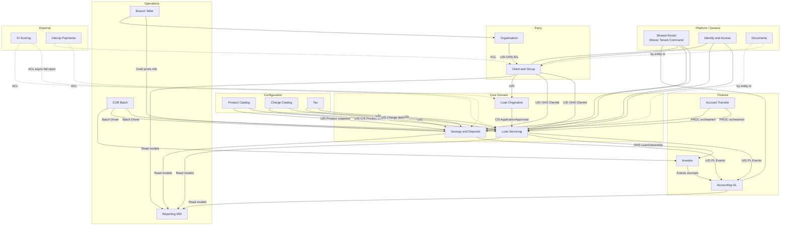

# 10. Domain Context Map (DDD)

Dieses Kapitel dokumentiert die **strategische Domain-Zerlegung** von fineract-osgi: Bounded Contexts, Subdomain-Klassifikation, Context Map (Upstream/Downstream) und Migrationsreihenfolge.

Es erfüllt Evolutionsstufe **D1** aus [ADR-019](decisions/ADR-019-domain-driven-design.md) (*Context-Map in Doku*) und ergänzt:

- physische Module → [03 Building Block View](03_building_block_view.md)
- Hexagon / Ports → [ADR-017](decisions/ADR-017-hexagonale-architektur.md)
- Write-Events / ES → [ADR-020](decisions/ADR-020-event-sourcing-writes-pflicht.md)
- Fach-/Technikkontext → [02 Context and Scope](02_context_and_scope.md)

**Status:** living document – Context-Grenzen schärfen sich mit ES- und Modul-Migration (D3/D4).

---

## 10.1 Leitprinzipien

| Prinzip | Bedeutung in fineract-osgi |
|---------|----------------------------|
| **Gradle-Modul ≠ Bounded Context** | Module sind physische Schnitte; BCs sind sprachliche und modellhafte Grenzen. Ein BC kann mehrere Module umfassen (z. B. Loan Servicing); ein Modul kann Teile mehrerer Legacy-Contexts hosten (`fineract-core`). |
| **Integration ohne Entity-Sharing** | Über Context-Grenzen: **IDs**, **Published Language** (Commands, Avro/Business Events, Application-DTOs) – nicht JPA-Entities fremder Domains importieren. |
| **Shared Kernel eng** | Nur echte Querschnittskonzepte (Money/Currency, Tenant/BusinessDate, ExternalId, Permission-Metamodell, Event-Envelope). Kein „alles in `fineract-core`“. |
| **Accounting bleibt Ledger** | Journal/GL ist eigener Context und **Projektion** aus Domain Events – nicht durch Event Store ersetzt ([ADR-020](decisions/ADR-020-event-sourcing-writes-pflicht.md)). |
| **Inkrementell** | Context Map steuert Strangler-Migration; kein Big-Bang-Microservice-Schnitt. |

### Integrationsstile (Legende)

| Kürzel | Stil | Verwendung hier |
|--------|------|-----------------|
| **U/D** | Upstream / Downstream | Daten- und Modellfluss: Downstream hängt von Upstream ab |
| **OHS** | Open Host Service | Stabile API/Events des Upstream für mehrere Downstream-Konsumenten |
| **PL** | Published Language | Gemeinsames Integrationsvokabular (Avro, Command-Typen, Event-Namen) |
| **C/S** | Customer / Supplier | Explizite Lieferbeziehung (Downstream als Kunde) |
| **CF** | Conformist | Downstream übernimmt Upstream-Modell weitgehend unverändert |
| **ACL** | Anti-Corruption Layer | Übersetzung fremder/externer Modelle ins eigene Modell |
| **SK** | Shared Kernel | Eng geteilte Typen/Packages – bewusst klein halten |
| **PROC** | Process / Orchestration | Context orchestriert mehrere Aggregates ohne eigene Produkt-Wahrheit |

---

## 10.2 Bounded Contexts (Zielbild)

### 10.2.1 Portfolio / Kernprodukte

| Bounded Context | Verantwortung | Ubiquitous Language (Auszug) | Ist-Artefakte |
|-----------------|---------------|------------------------------|---------------|
| **Loan Servicing** | Lifecycle und Kontenführung aktiver Kredite | Disbursement, Schedule, Repayment, Write-off, Reschedule, Delinquency, Charge-off | `fineract-loan`, `fineract-progressive-loan`, `fineract-working-capital-loan`, `portfolio/loanaccount` |
| **Loan Origination** | Antrag, Prüfung, Genehmigung, Übergabe an Servicing | Application, Underwriting, Approval, Scoring | `fineract-loan-origination` (+ Application-Submit-Teile im Loan-Legacy) |
| **Savings & Deposits** | Spareinlagen, Fest- und Ratensparverträge | Deposit, Withdrawal, Interest Posting, Hold, Maturity, Pre-Closure, GSIM | `fineract-savings` |
| **Share Accounts** | Genossenschafts-/Mitgliedsanteile | Share Product, Subscription, Dividend | `portfolio/shareaccounts`, `shareproducts` (provider/core) |
| **Account Transfer** | Kontoübergreifende Bewegungen (Process Context) | Account Transfer, Standing Instruction, Loan from Savings | `portfolio/account` (provider) |

**Loan Servicing – interne Module (kein eigener Deploy-Schnitt nötig):**

| Modul / Subdomain | Rolle |
|-------------------|--------|
| Standard Loan | Klassischer Kredit-Lifecycle |
| Progressive Loan | Progressive Schedule / Recalculation |
| Working Capital Loan | WC-Produkte, Breach / Near-Breach |
| Delinquency | Ranges, Buckets, Pause – spricht Loan-Sprache |

### 10.2.2 Party & Organisation

| Bounded Context | Verantwortung | Ubiquitous Language (Auszug) | Ist-Artefakte |
|-----------------|---------------|------------------------------|---------------|
| **Client & Group (Party)** | Kunden und Gruppen als Portfolio-Träger | Client, Non-Person, Activation, Closure, Transfer, Group/Center, Membership | `portfolio/client`, `portfolio/group` (core + provider) |
| **Organisation** | Institutionsstruktur und Kalender | Office, Staff, Working Days, Holiday, Currency | `organisation/*` (core/provider) |
| **Branch Cash / Teller** | Filialkasse und Teller-Settlement | Teller, Cashier, Cash Transaction | `fineract-branch` |

### 10.2.3 Product & Pricing Configuration

| Bounded Context | Verantwortung | Ubiquitous Language (Auszug) | Ist-Artefakte |
|-----------------|---------------|------------------------------|---------------|
| **Product Catalog** | Produktdefinitionen (Config, nicht Runtime-Account) | LoanProduct, SavingsProduct, Fund, Interest Chart (Produkt) | Loan/Savings-Product-Packages, `fineract-rates` |
| **Charge Catalog** | Gebühren-*Definitionen* | Charge Definition, Charge Time, Amount Rule | `fineract-charge` |
| **Tax** | Steuerkomponenten und -gruppen | Tax Component, Tax Group | `fineract-tax` |
| **Collateral** | Sicherheitenverwaltung | Collateral, Valuation, Client/Loan Collateral Link | `portfolio/collateral*` |

> **Hinweis:** Eine instanziierte `LoanCharge` / `SavingsAccountCharge` gehört dem jeweiligen **Account-Context** (Entity unter Loan/Savings), nicht dem Charge Catalog.

### 10.2.4 Finance & Nachgelagert

| Bounded Context | Verantwortung | Ubiquitous Language (Auszug) | Ist-Artefakte |
|-----------------|---------------|------------------------------|---------------|
| **Accounting (GL)** | Kontenplan, Journal, Abschlüsse, Product→GL-Mapping | GL Account, Journal Entry, Closure, Provisioning, Accounting Rule | `fineract-accounting` |
| **Investor / Secondary Market** | Kreditverkauf / Ownership Transfer | External Asset Owner, Loan Ownership Transfer | `fineract-investor` |
| **Reporting & Regulatory** | Auswertungen und regulatorische Formate (primär Read) | Report, MIX, Trial Balance Export | `fineract-report`, `fineract-mix`, `adhocquery` |

### 10.2.5 Integration & Plattform

| Bounded Context / System | Verantwortung | Ist-Artefakte |
|--------------------------|---------------|---------------|
| **COB / Batch Operations** | Orchestrierung periodischer Domain-Schritte (Driver, keine Produkt-Wahrheit) | `fineract-cob` + Domain-COB-Steps |
| **Interop (Payments)** | Externes Zahlungs-/Identifier-Protokoll → ACL vor Savings/Client | `interoperation` (provider/savings) |
| **Document Management** | Anhänge und Metadaten an Entity-IDs | `fineract-document` |
| **Identity & Access** | Users, Roles, Permissions, OIDC, 2FA | `fineract-security`, `useradministration` |
| **Platform / Shared Kernel** | Tenant, Command-Pipeline, Validation, Event-Envelope, Codes | `fineract-core` (Ziel: abmagern), `fineract-command*`, `fineract-validation`, `fineract-avro-schemas` |

---

## 10.3 Core / Supporting / Generic Subdomains

Klassifikation steuert **Investitionsintensität** (Modellqualität, ES-Priorität, Team-Fokus) – nicht „ob gebraucht“.

```text
                    STRATEGISCHER WERT
                         ↑
     CORE                │  Loan Servicing
                         │  Savings & Deposits
                         │  Loan Origination (wenn Underwriting/KI differenzierend)
                         │
     SUPPORTING          │  Client & Group
                         │  Accounting (GL)
                         │  Product Catalog / Charges / Tax
                         │  Organisation / Branch Cash
                         │  Account Transfer
                         │  Investor, Collateral, Share
                         │  COB, Reporting / MIX
                         │
     GENERIC             │  IAM / Security, Documents, Notifications
                         │  Multi-Tenancy, Command/Audit, Validation
                         │  Interop-Protokoll-Adapter, Object Store
                         ↓
              EIGENENTWICKLUNG / MODELLTIEFE →
```

| Typ | Contexts | Begründung |
|-----|----------|------------|
| **Core Domain** | Loan Servicing, Savings & Deposits, optional Loan Origination | Differenzierung (Schedule, Recalc, Progressive, WC, Deposit Interest); höchste Fehlerkosten; ES/CQRS-Nutzen maximal |
| **Supporting Subdomain** | Client/Group, Accounting, Products/Charges/Tax, Organisation, Branch, Transfers, Investor, Collateral, Share, COB, Reporting | Unerlässlich für den Betrieb; Accounting ist *kritisch*, aber regulatorisch standardisierbar |
| **Generic Subdomain** | Security/IAM, Documents, Platform/Tenant, Command-Infra, Validation, Notifications, Interop-ACL | Standardisieren, dünn halten, austauschbare Adapter |

### Shared Kernel (eng)

| Erlaubt im SK | Nicht im SK |
|---------------|-------------|
| `Money` / `Currency` / Monetary primitives | `Client`, `Loan`, `SavingsAccount` Entities |
| `ExternalId`, Tenant-/BusinessDate-Kontext | Portfolio-Write-Services |
| Identity-VOs: `ClientId`, `OfficeId`, `StaffId`, `LoanId`, … | Volle JPA-Graphen fremder Domains |
| Permission-/Command-Metamodell, Event Envelope (`MessageV1`) | Accounting-Journal-Logik |

---

## 10.4 Context Map

### 10.4.1 Übersicht (Zielbild)



### 10.4.2 Upstream / Downstream-Beziehungen

| Upstream | Downstream | Stil | Mechanismus / Published Language |
|----------|------------|------|----------------------------------|
| **Organisation** | Client, Loan, Branch, COB | OHS | `OfficeId`, `StaffId`; Working Days für Schedule/COB |
| **Client & Group** | Loan, Savings, Origination, Investor | OHS / PL | `ClientId` / `GroupId`; Events `ClientActivated`, `ClientClosed`, `ClientTransferred` – **kein** Import der `Client`-Entity in die Loan-Domain |
| **Product Catalog** | Loan / Savings | C/S | Produkt-**Snapshot** bei Account-Erstellung (Konditionen einfrieren) |
| **Charge Catalog / Tax** | Loan / Savings | CF auf Definitions-Ebene | Katalog-IDs; Instanzen leben im Account-Aggregate |
| **Loan Origination** | Loan Servicing | C/S | z. B. `LoanApplicationApproved` → Servicing erzeugt `Loan` |
| **Loan Servicing** | Accounting | U/D, PL | Business/Domain Events → Journal-Projector |
| **Savings & Deposits** | Accounting | U/D, PL | analog Loan |
| **Loan Servicing** | Investor | OHS | Ownership-Transfer-Events |
| **Investor** | Accounting | U/D | Investor-spezifische Journals |
| **Account Transfer** | Loan + Savings | PROC | Orchestrierung; jede Seite behält eigenes Aggregate |
| **COB / Batch** | Loan / Savings / Investor | Downstream driver | Ruft Application-Ports; kennt keine Entity-Internals |
| **Reporting** | (alle fachlichen Contexts) | pure Downstream | Read Models / Event-Feeds |
| **KI / Interop** | Origination, Loan, Savings, Client | **ACL** | Externe Modelle → interne Commands; Fail-Open für async KI ([ADR-006](decisions/ADR-006-ki-default-asynchron-fail-open.md)) |
| **Identity & Access** | alle Write-Contexts | Generic OHS | Permissions vor Commands |

### 10.4.3 Abhängigkeitsrichtung (Soll)

```text
Organisation ──► Client/Group ──► Loan / Savings ──► Accounting
     │                │                  │                ▲
     └──── COB ◄──────┴──────────────────┘                │
                    Events / Product snapshots ───────────┘
```

### 10.4.4 Bekannte Ist-Abweichungen (Technical Debt)

| Abweichung | Problem | Ziel |
|------------|---------|------|
| `Loan` hält JPA-`@ManyToOne` auf `Client` / `Group` / `LoanProduct` | Objektgraph-Kopplung über Context-Grenzen | Nur IDs + ProductSnapshot / Read-Projection |
| `Client` / `Group` / Teile Organisation in `fineract-core` | Shared Kernel zu fett | Eigenes Party-/Organisation-Modul bzw. klare Packages mit Ports |
| God-Aggregates (`Loan` ~2k LOC, `SavingsAccount` ~3k+ LOC) | Unklare Invarianten; ES-Streams unhandlich | Snapshot + Events; optionale Root-Splits (z. B. RescheduleRequest) |
| Accounting-Mapping-Code unter Loan-Packages | Context-Leak | Mapping im Accounting-Context; Loan publiziert fachliche Events |
| Account Transfer als implizite Service-Kopplung | Verteilte Transaktionen ohne klare Orchestrierung | Process Manager / Saga über Application-Ports |

---

## 10.5 Aggregate Roots (Kerncontexts)

Detail-Canvas kann später pro Aggregat ergänzt werden. Hier die **empfohlenen Roots** für Reviews und ES-Streams.

### 10.5.1 Loan Servicing

| Aggregate Root | Konsistenzgrenze (Auszug) | Stream-Idee |
|----------------|---------------------------|-------------|
| **`Loan`** | Status/Timeline, Term, Schedule Installments, Transactions (bzw. kritischer Zustand), Disbursements, Allocation Rules, Summary | `Loan-{id}` |
| **`LoanProduct`** | Produktkonditionen, Recalc-/Delinquency-Config-Refs | `LoanProduct-{id}` |
| **`LoanRescheduleRequest`** | Antrag bis Approval; Apply schreibt Events auf `Loan` | eigenes Root bis Approval |
| **`GLIM`** | Group Loan Individual Monitoring Container | `GLIM-{id}` |
| **`DelinquencyBucket` / `Range`** | Config | Config-Streams |
| **WC Breach** (optional) | Working-Capital-Breach-Lifecycle | `WcLoanBreach-{id}` o. ä. |

**Regeln:** `Client` und `LoanProduct` im Loan-Write-Modell nur als **ID** (+ eingefrorener Product-Snapshot). Transaktionshistorie primär als **Event-Stream** / Read Model, nicht als voll geladene JPA-Collection für jeden Use Case.

### 10.5.2 Savings & Deposits

| Aggregate Root | Konsistenzgrenze (Auszug) | Stream-Idee |
|----------------|---------------------------|-------------|
| **`SavingsAccount`** | Status, Balance/Summary, Transactions, Account Charges, Holds | `SavingsAccount-{id}` |
| **`FixedDepositAccount`** | Term, Pre-Closure, Maturity, Chart am Account | eigener Stream-Typ oder Spezialisierung |
| **`RecurringDepositAccount`** | Recurring Schedule vs. Actuals | analog FD |
| **`SavingsProduct` / FD/RD Product** | Produktconfig | Product-Streams |
| **`GSIM`** | Group Savings Monitoring | `GSIM-{id}` |
| **`InterestRateChart`** | Slabs, Incentives | Config-Root |

### 10.5.3 Client & Group

| Aggregate Root | Konsistenzgrenze (Auszug) | Stream-Idee |
|----------------|---------------------------|-------------|
| **`Client`** | Person/NonPerson, Status, Office, Identifiers, Family, Addresses | `Client-{id}` |
| **`Group`** | Membership, Roles, Status, Hierarchy | `Group-{id}` |
| **`ClientTransfer`** | Office-Transfer-Workflow | Process-Aggregate |
| **`ClientCharge`** | optional Entity unter Client oder kleines Root | — |

**Nicht** im Client-Aggregate: Loan- und Savings-Konten (nur Read-Model „Account Summary“).

### 10.5.4 Weitere Roots (Kurz)

| Context | Roots (Auszug) |
|---------|----------------|
| Accounting | `GLAccount`, `JournalEntry` (Header+Lines atomar), `GLClosure`, `ProductToGLAccountMapping`, `AccountingRule` |
| Organisation | `Office`, `Staff`, `WorkingDays`, `Holiday` |
| Branch | `Teller`, `Cashier` |
| Investor | Ownership-Transfer / External Asset Owner |
| Charge Catalog | `Charge` (Definition) |
| Tax | `TaxComponent`, `TaxGroup` |
| COB | `COBRun` / Partition Lock (prozessual-technisch) |

---

## 10.6 Mapping: Bounded Context ↔ Gradle-Modul (Ist)

| Bounded Context | Primäre Module / Packages | Reife Modulgrenze |
|-----------------|---------------------------|-------------------|
| Loan Servicing | `fineract-loan`, `fineract-progressive-loan`, `fineract-working-capital-loan` | hoch (Module existieren; Kopplungen bleiben) |
| Loan Origination | `fineract-loan-origination` | mittel |
| Savings & Deposits | `fineract-savings` | hoch |
| Accounting | `fineract-accounting` | hoch |
| Charge / Tax / Rates | `fineract-charge`, `fineract-tax`, `fineract-rates` | hoch |
| Investor | `fineract-investor` | hoch |
| Branch | `fineract-branch` | hoch |
| Documents | `fineract-document` | hoch |
| Reporting / MIX | `fineract-report`, `fineract-mix` | mittel |
| COB | `fineract-cob` | hoch (Orchestrierung) |
| Client & Group | core + provider `portfolio/client`, `portfolio/group` | **niedrig** – Extraktion priorisiert |
| Organisation | core/provider `organisation/*` | niedrig–mittel |
| Share Accounts | provider/core | niedrig |
| Account Transfer | provider `portfolio/account` | niedrig |
| Interop | provider `interoperation` | mittel (ACL-Kandidat) |
| IAM | `fineract-security` | hoch |
| Platform / SK | `fineract-core`, `fineract-command*` | überladen – abmagern |

---

## 10.7 Migrationsreihenfolge (Strangler)

Abgestimmt mit [ADR-020](decisions/ADR-020-event-sourcing-writes-pflicht.md) (ES0→ES4) und ADR-019 (D1–D4).

### Phase 0 – Fundament (parallel)

| Maßnahme | Bezug |
|----------|--------|
| Event-Store-Port, Envelope, Tenant, Optimistic Concurrency | ES0 |
| Dieses Kapitel + Glossar-Begriffe | D1 |
| Dependency-Rule (Domain ohne REST/Broker-APIs) | ADR-017 |
| Shared Kernel abmagern (Identity-VOs statt Entity-Sharing) | D3-Vorbereitung |

### Fachliche Reihenfolge

| Prio | Context | Begründung |
|:----:|---------|------------|
| 1 | **Charge Catalog + Tax + Rates** | Klein; idealer ES-/Hexagon-Pilot |
| 2 | **Client & Group** | Upstream des Portfolios; heute falsch im SK; hoher struktureller Hebel |
| 3 | **Organisation** | Upstream für Client/COB/Schedule |
| 4 | **Accounting als Projection-Context** | Modul existiert; Event-Konsum vor Loan-ES-Cutover |
| 5 | **Savings & Deposits** | Klarer als Loan; zweiter ES-Kern |
| 6 | **Loan Origination** | Greenfield-freundlich; KI-ACL |
| 7 | **Loan Servicing (Standard)** | Höchste Komplexität – erst wenn Client/Product/GL-Ports stehen |
| 8 | **Progressive / Working Capital** | Hinter stabilen Loan-Ports |
| 9 | **Account Transfer, Investor, Interop, Branch** | Orchestrierung/ACL auf stabilen Ports |
| 10 | **COB** | Steps hinter Domain-Ports refactoren |
| 11 | **Reporting / MIX / Documents** | Read-side von Published Language speisen |

### Strangler-Taktik pro Context

1. Modul-/Package-Grenze und öffentliche Application-Ports ziehen.  
2. ACL am Rand zu Legacy-`JsonCommand`.  
3. Dual-Write oder Catch-up nur für **ein** Aggregat.  
4. Cutover: Event-Stream = Write-SoT; Tabelle = Projection.  
5. OSGi-Feature-Bundle erst bei stabilem Port.

### Warum nicht Loan zuerst?

- Größter God-Aggregate und meiste Cross-Context-Joins.  
- Ohne Client-Upstream und GL-Projector wird die Monolith-Kopplung in Events fortgeschrieben.  
- ADR-020 empfiehlt Pilot auf schlankem Aggregat vor Portfolio-Kern.

---

## 10.8 Review-Checkliste (Context-Grenzen)

Bei neuem oder angefasstem Code:

1. **Welcher Bounded Context?** (Name aus 10.2)  
2. **Welches Aggregate Root?** Wird nur ein Root pro TX geändert?  
3. **Upstream-Abhängigkeit:** ID / Snapshot / Event – oder unerlaubter Entity-Import?  
4. **Published Language:** Command- und Event-Name in Ubiquitous Language?  
5. **Accounting:** Journal nur als Folge/Projektion, nicht als versteckte Business-Rule im falschen Context?  
6. **Read-Modell:** Query bläht Write-Aggregate nicht auf (CQRS)?  
7. **ES-Plan:** Neues zustandsänderndes Feature hat Event-Pfad oder dokumentierte Ausnahme bis Cutover?

---

## 10.9 Offene Punkte (D3 / D4)

| Thema | Nächster Schritt |
|-------|------------------|
| Aggregate Canvas Loan / Savings / Client | Invarianten, Commands, Events, Konflikte pro Root |
| Import-Audit `portfolio.client.domain.Client` in Loan/Savings | ACL-Backlog und ArchUnit-Regeln |
| Share Accounts & Account Transfer als eigene Module | Extraktion aus provider |
| Interop/KI ACL-Standard | Ports + Fail-Open/Closed-Policy pro Use Case (D4) |
| Product Snapshot-Schema | Versionierte VO-Struktur für Loan/Savings-Eröffnung |

---

## 10.10 Bezug

| Dokument | Rolle |
|----------|--------|
| [ADR-019 Domain-Driven Design](decisions/ADR-019-domain-driven-design.md) | Strategisches/taktisches DDD-Leitbild |
| [ADR-017 Hexagonale Architektur](decisions/ADR-017-hexagonale-architektur.md) | Ports & Adapters pro Context |
| [ADR-020 Event Sourcing](decisions/ADR-020-event-sourcing-writes-pflicht.md) | Write-SoT pro Aggregate Stream |
| [ADR-004 CQRS](decisions/ADR-004-cqrs-und-command-pipeline-beibehalten-modernisieren.md) | Commands vs. Queries |
| [03 Building Blocks](03_building_block_view.md) | Physische Module |
| [06.15 DDD](06_crosscutting_concepts.md) | Querschnitt Kurzfassung |
| [09 Glossary](09_glossary.md) | Begriffe (BC, OHS, ACL, …) |

---

*Navigation:* [README](README.md) · [08 Design Decisions](08_design_decisions.md) · [09 Glossary](09_glossary.md)
