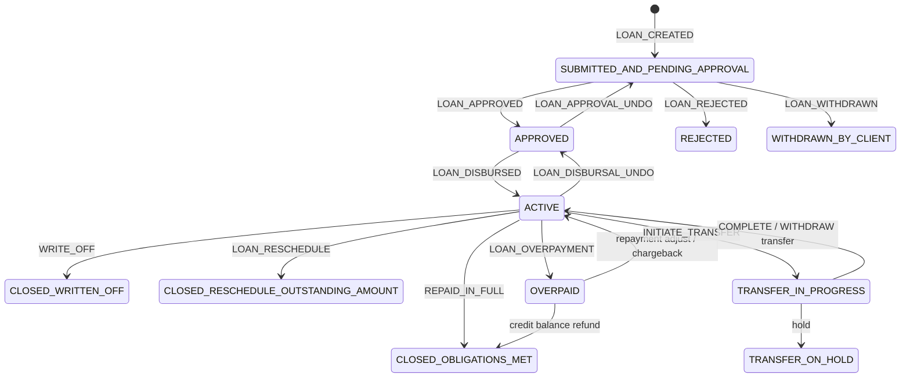
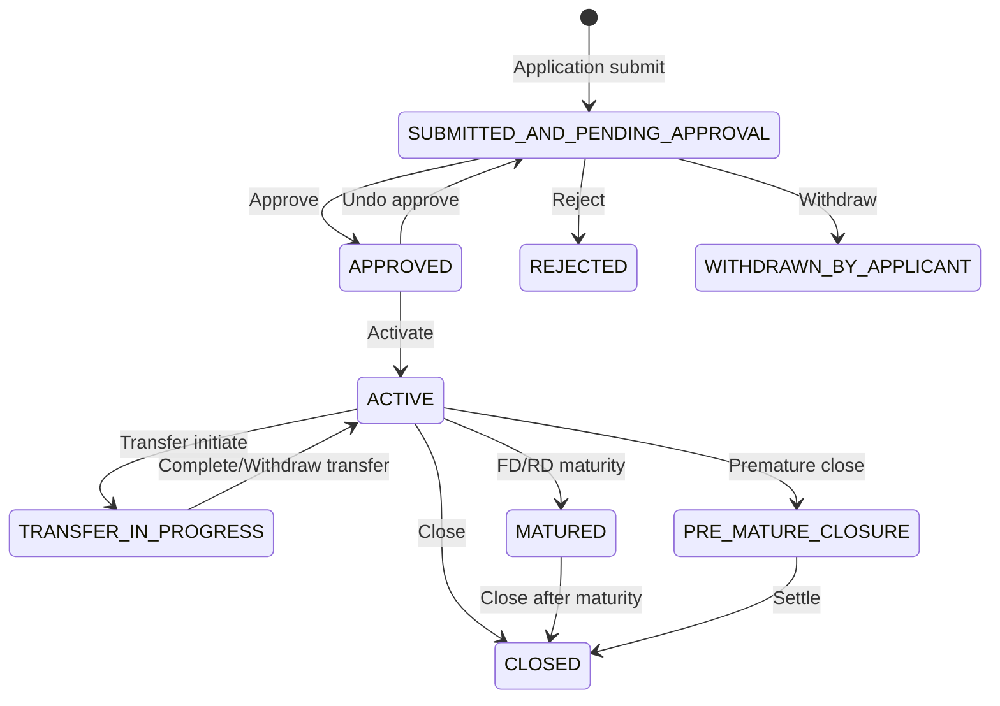
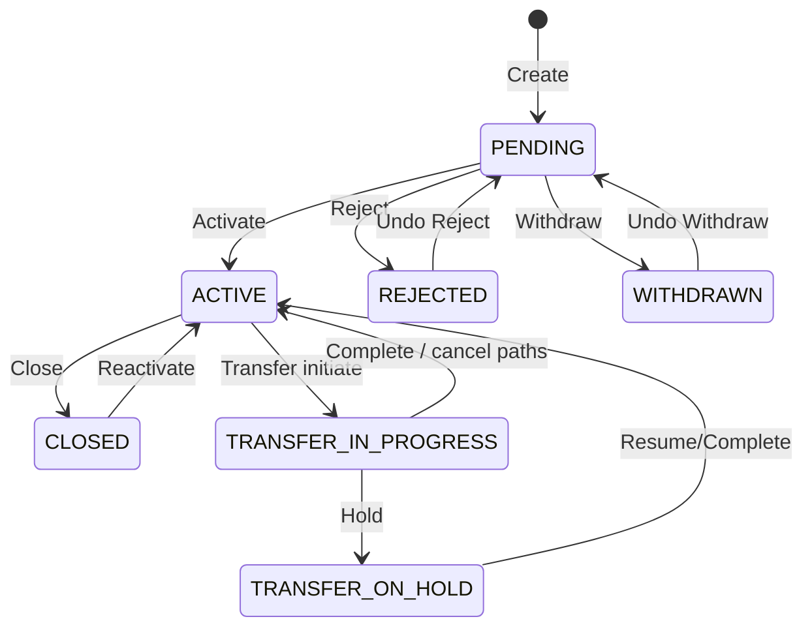
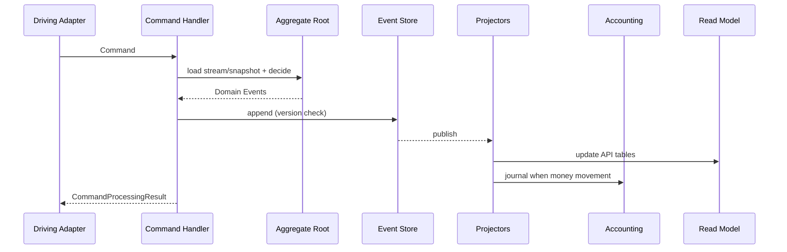

# 11. Aggregate Canvas – Loan, Savings, Client

Tactical DDD for the three central write aggregates. Complements the strategic [Domain Context Map](10_domain_context_map.md) and the north-star decisions [ADR-019](decisions/ADR-019-domain-driven-design.md) / [ADR-020](decisions/ADR-020-event-sourcing-writes-pflicht.md).

**Purpose of this chapter**

| Benefit | For whom |
|--------|---------|
| Clear consistency boundaries and invariants | Feature dev, reviews |
| Command → status → event mapping | ES migration, CQRS |
| Conflict and split recommendations | God-aggregate reduction |
| Alignment as-is code ↔ target model | Modernisation |

**Sources in code (as-is)**

| Aggregate | Root class | Status | Lifecycle / events |
|----------|-------------|--------|-------------------|
| Loan | `fineract-loan` … `Loan` (~2.2k LOC) | `LoanStatus` | `LoanEvent`, `DefaultLoanLifecycleStateMachine`, `*Loan*BusinessEvent` |
| Savings | `fineract-savings` … `SavingsAccount` (~3.7k LOC) | `SavingsAccountStatusType` + SubStatus | `Savings*BusinessEvent`, handlers |
| Client | `fineract-core` … `Client` (~1k LOC) | `ClientStatus` | `ClientCreate/Activate/RejectBusinessEvent`, handlers |

**Canvas legend**

| Field | Meaning |
|------|-----------|
| **Root** | Entry point for writes; stream ID for event sourcing |
| **Members** | Entities/VOs *inside* the consistency boundary |
| **Invariants** | Must hold after every command |
| **Commands** | Application inputs (handler names ≈ as-is) |
| **Domain Events** | Fact after successful decision (ES target / business events as-is) |
| **Policies** | Reactions of other contexts (Accounting, COB, …) |
| **Conflicts** | Concurrent writes, optimistic lock, saga risks |

---

## 11.1 Aggregate canvas: `Loan`

### 11.1.1 Profile

| | |
|--|--|
| **Bounded Context** | Loan Servicing ([10.2](10_domain_context_map.md)) |
| **Aggregate Root** | `Loan` |
| **Identity** | `LoanId` (technically `Long` / typed VO in future); business `accountNo`, optional `externalId` |
| **ES Stream** | `Loan-{id}` (optimistic concurrency / `@Version` today) |
| **Ubiquitous Language** | Application, Approval, Disbursement, Repayment Schedule, Installment, Transaction, Charge, Write-off, Reschedule, Overpaid, Delinquency |
| **Not in the aggregate** | `Client` entity, `Group` entity, `LoanProduct` as mutable shared object, GL journal |

### 11.1.2 Members (consistency boundary – target)

```text
Loan (Root)
├── Status + Timeline (submitted/approved/disbursed/closed/…)
├── Term / ProductSnapshot (frozen terms)     ← today: ManyToOne LoanProduct
├── ClientId / GroupId / OfficeId / StaffId         ← today: entity refs
├── LoanRepaymentScheduleDetail (embedded terms)
├── LoanRepaymentScheduleInstallment[]
├── LoanTransaction[]          (critical state; history → events)
├── LoanCharge[] (+ PaidBy, InstallmentCharge)
├── LoanDisbursementDetails[]  (multi-disburse)
├── LoanSummary                (derived)
├── LoanTermVariations[]
├── Payment/Credit Allocation Rules (progressive)
├── Interest Recalculation Details
└── Officer Assignment History
```

**Optional own roots (split recommendation):**

| Candidate | When to separate |
|----------|----------------|
| `LoanRescheduleRequest` | Workflow before apply; apply emits events on `Loan` |
| `LoanCharge` | Very high parallelism / long streams |
| `GLIM` | Group container already own entity |
| Progressive/WC-specific breach objects | Different lifecycle language |

### 11.1.3 State machine



As-is enum: `LoanStatus` (`100` Pending … `700` Overpaid). Internal triggers: `LoanEvent`. Implementation: `DefaultLoanLifecycleStateMachine`.

### 11.1.4 Invariants

| ID | Invariant | Typical violation |
|----|------------|---------------------|
| L-I1 | Status transitions only per state machine | Approve from Active |
| L-I2 | Disbursement only from `APPROVED` (or allowed special cases multi-disburse / closed→disburse policy) | Disburse while Pending |
| L-I3 | No business repayment before first disbursement | Repayment in Approved without Active |
| L-I4 | Principal/Interest/Fees/Penalties in summary = f(Schedule, Transactions, Charges) | Manual summary write |
| L-I5 | Amounts in product currency; scale per currency | Foreign currency without FX context |
| L-I6 | `ClientId` set for individual loan; group/GLIM rules for group loans | Loan without party reference |
| L-I7 | Product snapshot: after approval/disburse no silent product mutations on the live loan | Live join on changed product |
| L-I8 | Transaction order and value dates business-consistent (business date) | Backdating against closure/policy |
| L-I9 | Charge-off / write-off end regular accrual paths per policy | Accrual after write-off |
| L-I10 | Optimistic concurrency: parallel writes on same `Loan-{id}` serialise | Lost update schedule vs. repayment |

### 11.1.5 Commands (excerpt, grouped)

Derived from `*CommandHandler` in the loan module (as-is names).

| Group | Commands (handler ≈) | Expected status beforehand |
|--------|----------------------|---------------------------|
| **Application** | Submit, Modify, Delete Application | Pending |
| **Decision** | Approve, Undo Approval, Reject, Withdraw by Applicant | Pending / Approved |
| **Disbursement** | Disburse, Disburse to Savings, Undo Disburse, Undo Last Disburse, Update Disburse Date/Details | Approved / Active |
| **Repayment & Adjust** | Repayment, Recovery Payment, Down Payment, Goodwill Credit, Refunds, Chargeback, Adjustment, Waive Interest | Active / Overpaid / Closed* |
| **Charges** | Add/Update/Delete/Pay/Waive Charge, Charge Adjustment/Refund, Overdue Charge | per policy Active+ |
| **Lifecycle end** | Close, Close as Rescheduled, Write-off, Undo Write-off, Foreclosure, Contract Termination | Active / … |
| **Restructure** | Schedule Variation Create/Delete, Re-Age, Re-Amortize (+ Undo) | Active |
| **Charge-off** | Charge-off, Undo Charge-off | Active |
| **Amount changes** | Approved Amount / Available Disbursement Amount Modification | Approved / Active |
| **Officer / Fraud** | Assign/Remove Officer, Mark Fraud | various |
| **Transfer** | Initiate / Complete / Reject / Withdraw Transfer (often via client-transfer orchestration) | Active |
| **GLIM bulk** | GLIM Approve/Disburse/Repay/Undo | Group path |

### 11.1.6 Domain / business events

**Internal lifecycle events (`LoanEvent`)** drive the state machine.  
**Business events** (as-is, selection) are the published language toward hooks/external events/accounting:

| Category | Events (examples) |
|-----------|-------------------|
| Application | `LoanCreated`, `LoanApplicationModified`, `LoanApproved`, `LoanUndoApproval`, `LoanRejected`, `LoanWithdrawnByApplicant` |
| Disbursement | `LoanDisbursal`, `LoanDisbursalTransaction`, `LoanUndoDisbursal`, `LoanUndoLastDisbursal` |
| Money in/out | `LoanTransactionMakeRepayment*`, Refund/Goodwill/DownPayment/Recovery/Waiver Pre/Post events |
| Charges | `LoanAddCharge`, `LoanUpdateCharge`, `LoanDeleteCharge`, `LoanWaiveCharge`, Charge Payment/Adjustment/Refund |
| Close / Risk | `LoanClose`, `LoanCloseAsReschedule`, `LoanWrittenOff*`, `LoanChargeOff*`, `LoanForeClosure*`, `LoanStatusChanged` |
| Schedule | `LoanInterestRecalculation`, Reschedule-due-*, `LoanScheduleVariations*`, ReAge/ReAmortize |
| Transfer | `LoanInitiateTransfer`, `LoanRejectTransfer`, `LoanWithdrawTransfer`, Accept Transfer |
| Balance | `LoanBalanceChanged`, Delinquency range/pause, Snapshots |

**ES target:** the same facts as append-only stream events; business events = projection/outbox of domain events ([ADR-020](decisions/ADR-020-event-sourcing-writes-pflicht.md)).

### 11.1.7 Policies (downstream)

| After event | Downstream context | Reaction |
|------------|-------------------|----------|
| Disbursement / Repayment / Write-off / Charge … | **Accounting** | Journal entries (projector) |
| Disburse to Savings | **Savings** | Deposit (via transfer/orchestration) |
| Status/balance changed | **COB** | Accrual, penalty, delinquency steps |
| Ownership transfer | **Investor** | Secondary market postings |
| Client transfer complete | **Organisation** indirectly | Office on read models |

### 11.1.8 Conflicts & transaction boundaries

| Conflict | Handling |
|----------|--------|
| Two parallel repayments | Optimistic lock on loan version; second command retry/fail |
| COB accrual vs. online repayment | COB lock / stay-locked; business date ordering |
| Reschedule apply vs. payment | Reschedule as own request root until apply; apply exclusive on loan |
| Multi-disburse + charge | One TX, one aggregate write |
| Loan + Savings disburse | **Not** one aggregate – process/saga: loan disburse event → savings deposit command (or synchronous orchestration with clear compensation) |

### 11.1.9 Design debt → target

| As-is | Target |
|-----|------|
| God class `Loan` with all collections | Root holds **current** state; history = event stream; heavy queries in read model |
| `@ManyToOne Client/Product` | `ClientId` + `ProductSnapshot` VO |
| Accounting code in loan module | domain events only; mapping in accounting |
| Origination in same aggregate model | Application phase → **Loan Origination** context, handoff event |

---

## 11.2 Aggregate canvas: `SavingsAccount`

### 11.2.1 Profile

| | |
|--|--|
| **Bounded Context** | Savings & Deposits |
| **Aggregate Root** | `SavingsAccount` (FD/RD as specialisation or own roots – see 11.2.9) |
| **Identity** | `SavingsAccountId`; `accountNo`; optional `externalId` |
| **ES Stream** | `SavingsAccount-{id}` |
| **Ubiquitous Language** | Deposit, Withdrawal, Activation, Interest Posting, Hold, Block Credit/Debit, Dormant, Escheat, Maturity, Pre-Closure |
| **Not in the aggregate** | `Client` entity, product as live-mutable ref, GL journal, Loan |

### 11.2.2 Members

```text
SavingsAccount (Root)
├── Status + SubStatus (NONE | INACTIVE | DORMANT | ESCHEAT | BLOCK*)
├── ClientId / GroupId / GSIM-Ref / OfficeId / StaffId
├── ProductSnapshot (interest, min balance, overdraft flags, …)
├── SavingsAccountSummary (balances, interest posted, …)
├── SavingsAccountTransaction[]
├── SavingsAccountCharge[]
├── OnHold amounts / OnHold transactions (refs)
├── DepositAccountTerm / Recurring / InterestChart on account (FD/RD)
└── Officer Assignment History
```

### 11.2.3 State machine



**SubStatus** (orthogonal, `SavingsAccountSubStatusEnum`): controls operational locks (block all / credit / debit), inactivity, dormant, escheat – without replacing the main status.

### 11.2.4 Invariants

| ID | Invariant |
|----|------------|
| S-I1 | Status transitions only along allowed application/activate/close/transfer/maturity paths |
| S-I2 | Deposit/withdrawal primarily in status `ACTIVE` (force-withdrawal/policy exceptions must be documented) |
| S-I3 | Under `BLOCK` / `BLOCK_DEBIT` / `BLOCK_CREDIT`: corresponding booking directions forbidden |
| S-I4 | Available balance = ledger balance − holds − min-balance reserves (product policy) |
| S-I5 | Withdrawal must not push available balance below policy minimum (unless overdraft allowed) |
| S-I6 | Interest posting idempotent per period/business date (COB-safe) |
| S-I7 | Charges: due account charges consistent with transactions (pay/waive/inactivate) |
| S-I8 | FD: before maturity no free withdrawals except pre-closure path |
| S-I9 | RD: mandatory deposit rules vs. actual deposits must be reconcilable |
| S-I10 | Currency/scale as for loan; one currency per account |

### 11.2.5 Commands (excerpt)

| Group | Commands (handler ≈) |
|--------|----------------------|
| **Application** | Savings/FD/RD Submit, Modify, Delete, Approve, Undo Approve, Reject, Withdraw Application |
| **Activation / Close** | Activate, Close, Premature Close (FD/RD), GSIM Activate/Close |
| **Cash** | Deposit, Withdrawal, Force Withdrawal, Transaction Adjustment |
| **Interest** | Calculate Interest, Post Interest, Post Interest as-on-date |
| **Charges** | Add/Delete/Pay/Inactivate/Waive Account Charge, Annual Fee |
| **Holds / Blocks** | Hold Amount, Release Amount, Block Account, Block Credits, Block Debits (+ unblock variants where present) |
| **GSIM** | GSIM Submit/Approve/Undo/Reject/Deposit/Activation/Close |
| **Product config** | Create/Update/Delete Savings/FD/RD **Product** → own config aggregate, not account |

### 11.2.6 Domain / business events

| Category | As-is examples / ES target names |
|-----------|------------------------------|
| Lifecycle | `SavingsAccountSubmitted`, `Approved`, `Activated`, `Rejected`, `Closed`, `Matured`, `PreMatureClosed` |
| Cash | `SavingsDeposit`, `SavingsWithdrawal`, `SavingsAccountForceWithdrawal`, `SavingsAccountTransaction` |
| Interest | `InterestCalculated`, `InterestPosted` |
| Risk/Ops | `AmountHeld`, `AmountReleased`, `AccountBlocked`, `CreditsBlocked`, `DebitsBlocked`, `SubStatusChanged` |
| Charges | `SavingsChargeAdded`, `Paid`, `Waived`, `Inactivated` |

Avro schemas under `fineract-avro-schemas` (`SavingsAccount*`, FD/RD) form the **published language** toward external systems.

### 11.2.7 Policies

| Event | Downstream |
|-------|------------|
| Deposit/Withdrawal/Interest/Close | **Accounting** journal |
| Activate/Close | **Client** read model / Interop identifier |
| Hold/Block | **Interop / Payments** ACL (quote/transfer may fail) |
| Interest/Dormancy | **COB** steps |

### 11.2.8 Conflicts

| Conflict | Handling |
|----------|--------|
| Parallel deposit + withdrawal | Optimistic lock account version |
| Hold vs. withdrawal | Hold in aggregate; withdrawal checks available |
| COB interest post vs. online tx | Business date + lock; idempotent posting keys |
| Account transfer Loan←→Savings | Process context; two aggregate writes in defined order |
| GSIM parent vs. child accounts | Parent orchestrates; child accounts own streams |

### 11.2.9 FD / RD: one root or several?

| Option | Recommendation |
|--------|------------|
| **A – One root `SavingsAccount`** with type + term details | Fits as-is code (`IDepositAccountType`); one stream type |
| **B – Own roots FD/RD** | Clearer maturity/pre-closure invariants; more duplication |

**Recommendation:** medium term **A with strong typing** and own domain services for maturity; if ES stream explosion or team split → **B**.

---

## 11.3 Aggregate canvas: `Client`

### 11.3.1 Profile

| | |
|--|--|
| **Bounded Context** | Client & Group (Party) |
| **Aggregate Root** | `Client` |
| **Identity** | `ClientId`; `accountNo`; `externalId`; unique `mobileNo` / `email` (tenant-scoped) |
| **ES Stream** | `Client-{id}` |
| **Ubiquitous Language** | Pending, Active, Reject, Withdraw, Close, Reactivate, Transfer, Identifier, Legal Form (Person/Entity) |
| **Not in the aggregate** | Loan/Savings accounts, Group as *full* membership truth (prefer group aggregate + events), document bytes |

### 11.3.2 Members

```text
Client (Root)
├── Status (+ optional subStatus CodeValue)
├── OfficeId / transferToOfficeId / StaffId
├── Legal form + Person name fields OR NonPerson details
├── DisplayName / Mobile / Email / DoB / Gender / Type / Classification
├── Timeline (submitted, activated, rejected, withdrawn, closed, reopened)
├── ClientIdentifier[]
├── ClientFamilyMember[]          (can grow large → optional split)
├── Address links (ClientAddress) (optional split)
├── ClientCharge[] + ClientTransaction[] (fees without account)
├── defaultSavingsProductId / defaultSavingsAccountId (IDs only)
└── imageId (document ref, not blob)
```

**Related roots in party context:** `Group`, `ClientTransfer` (process).

### 11.3.3 State machine



As-is enum: `ClientStatus` (Pending `100`, Active `300`, Transfer `303/304`, Closed `600`, Rejected `700`, Withdrawn `800`).

### 11.3.4 Invariants

| ID | Invariant |
|----|------------|
| C-I1 | Status transitions only per state machine |
| C-I2 | Activation requires office and valid mandatory fields (name/legal form policy) |
| C-I3 | Active client is prerequisite for *new* loan/savings applications (policy in downstream, enforced via client status query) |
| C-I4 | Closed/Rejected/Withdrawn: no new portfolio accounts |
| C-I5 | Identifiers unique per type/value in tenant |
| C-I6 | Mobile/email uniqueness constraints respected |
| C-I7 | Transfer: restricted mutations while `TRANSFER_*` |
| C-I8 | `OfficeId` always set; transfer changes office only via transfer path |
| C-I9 | ClientCharges payable/waivable only in allowed status |
| C-I10 | No embedding of loan/savings balances in client write model |

### 11.3.5 Commands (excerpt)

| Group | Commands (handler ≈) |
|--------|----------------------|
| **Lifecycle** | Create, Update, Activate, Close, Reject, Undo Reject, Withdraw, Undo Withdraw, Reactivate, Delete* |
| **Staff** | Assign Staff, Unassign Staff |
| **Identifiers** | Create/Update/Delete Client Identifier |
| **Family** | Add/Update/Delete Family Member |
| **Address** | Add/Update Address |
| **Charges** | Create/Delete/Pay/Waive Client Charge, Undo Client Transaction |
| **Savings default** | Update Client Savings Account (default account **ID**) |

\*Delete only in the allowed pending window / policy.

### 11.3.6 Domain / business events

| As-is (provider) | ES target |
|----------------|---------|
| `ClientCreateBusinessEvent` | `ClientCreated` |
| `ClientActivateBusinessEvent` | `ClientActivated` |
| `ClientUpdateBusinessEvent` | `ClientUpdated` |
| `ClientCloseBusinessEvent` | `ClientClosed` |
| `ClientRejectBusinessEvent` | `ClientRejected` |
| `ClientWithdrawBusinessEvent` | `ClientWithdrawn` |
| `ClientReactivateBusinessEvent` | `ClientReactivated` |
| `ClientUndoRejectBusinessEvent` | `ClientRejectionUndone` |
| `ClientUndoWithdrawBusinessEvent` | `ClientWithdrawalUndone` |
| `ClientDeleteBusinessEvent` | `ClientDeleted` |
| `ClientAssignStaffBusinessEvent` / `ClientUnassignStaffBusinessEvent` | Staff assigned/unassigned |
| `ClientTransferPropose/Accept/Reject/WithdrawBusinessEvent` | Transfer lifecycle |

Full table: [12 Event Catalog](12_event_catalog.md). Still open: Identifier, Family, Address, ClientCharge.

**Note:** New `*BusinessEvent` classes always need an entry in `m_external_event_configuration` (Liquibase), otherwise the app does not start → [12.9](12_event_catalog.md#129-required-external-event-configuration-in-the-db).

### 11.3.7 Policies

| Event | Downstream |
|-------|------------|
| `ClientActivated` | Enable loan/savings origination (guard) |
| `ClientClosed` | Forbid new accounts; existing accounts: institutional policy (block vs. force-close) |
| `ClientTransferred` | Loan/Savings officer/office update (orchestration, do not silently mutate inside the client TX) |
| Create/Activate | **Interop** KYC identifier; **Documents** optional |
| ClientCharge paid | **Accounting** when posted |

### 11.3.8 Conflicts

| Conflict | Handling |
|----------|--------|
| Parallel update client vs. activate | Version on client |
| Transfer vs. loan disburse | Transfer substatus; downstream rejects disburse when client under transfer |
| Close client with open loans | Domain rule / application guard (supporting policy) – do not silently “close loans” inside the client aggregate |
| Group membership vs. client | Membership changes on the **Group** aggregate or explicit domain service with two writes |

### 11.3.9 Design debt → target

| As-is | Target |
|-----|------|
| `Client` in `fineract-core` | Party module / BC with ports |
| JPA `Set<Group> groups` on client | IDs + group aggregate as source of membership |
| Few business events | Full lifecycle event palette for ES and guards |
| ClientCharge + transactions in same root | OK while volume small; otherwise split |

---

## 11.4 Cross-cutting: commands → events → projections

Common pattern for all three aggregates ([ADR-004](decisions/ADR-004-cqrs-und-command-pipeline-beibehalten-modernisieren.md), [ADR-020](decisions/ADR-020-event-sourcing-writes-pflicht.md)):



| Aggregate | Typical projection targets |
|----------|----------------------------|
| Loan | `m_loan*`, schedule tables, delinquency, search, Avro external |
| Savings | `m_savings*`, interest summary, Avro |
| Client | `m_client*`, identifiers, address, search |

---

## 11.5 Comparative decision matrix

| Question | Loan | SavingsAccount | Client |
|-------|------|----------------|--------|
| **Suitable ES pilot?** | no (too large first) | conditional (after client) | **yes** (after charge pilot) |
| **God-aggregate risk** | very high | very high | medium |
| **Downstream pressure** | Accounting, COB, Investor | Accounting, COB, Interop | Loan, Savings, Interop |
| **Upstream dependencies** | Client, Product, Charge, Tax, Org | Client, Product, Charge, Tax, Org | Organisation |
| **Natural stream length** | very long (tx + schedule) | long (tx) | short–medium |
| **Snapshot recommendation** | yes (after N events / after disburse) | yes | optional |
| **Split priority** | RescheduleRequest, ProductSnapshot | FD/RD services, holds | Address/Family optional |

---

## 11.6 Review checklist (per PR on the aggregate)

1. Which **root** is written? (ideally only one)  
2. Which **invariants** (L-I* / S-I* / C-I*) are affected and tested?  
3. Which **status** before/after? Does the state machine allow the transition?  
4. Which **domain events** arise? Names in UL?  
5. Are foreign entities (**Client/Product/GL**) imported instead of IDs/events?  
6. Does **Accounting** need a projection? Idempotency?  
7. **Concurrency**: version/lock, COB interaction?  
8. Read path: new field only in the **write model** or also projection?

---

## 11.7 Next deep dives

| Artifact | Content |
|----------|--------|
| Event catalog per aggregate | → done in [12 Event Catalog](12_event_catalog.md) |
| ArchUnit rules | → done in [13](13_archunit_bounded_context_rules.md) |
| Aggregate canvas `Group`, `JournalEntry`, `LoanProduct` | Supporting contexts |
| Gherkin scenarios per invariant | e.g. `@invariant L-I2` on disbursement features |

---

## 11.8 References

| Document | Role |
|----------|--------|
| [10 Domain Context Map](10_domain_context_map.md) | Strategic boundaries |
| [12 Event Catalog](12_event_catalog.md) | As-is business events → ES target names |
| [ADR-019 DDD](decisions/ADR-019-domain-driven-design.md) | Aggregates, UL |
| [ADR-020 Event Sourcing](decisions/ADR-020-event-sourcing-writes-pflicht.md) | Stream = write SoT |
| [ADR-004 CQRS](decisions/ADR-004-cqrs-und-command-pipeline-beibehalten-modernisieren.md) | Commands / queries |
| [04 Runtime View](04_runtime_view.md) | Loan/command flows |
| [06.15 DDD](06_crosscutting_concepts.md) | Cross-cutting |
| Code | `LoanStatus`, `LoanEvent`, `DefaultLoanLifecycleStateMachine`, `SavingsAccountStatusType`, `ClientStatus`, command handlers |

---

*Navigation:* [README](README.md) · [12 Event Catalog](12_event_catalog.md) · [10 Context Map](10_domain_context_map.md) · [09 Glossary](09_glossary.md)
