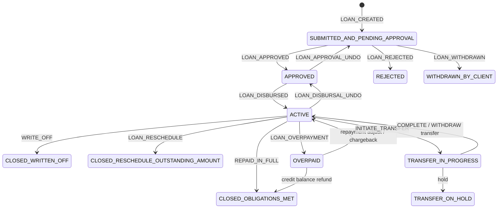
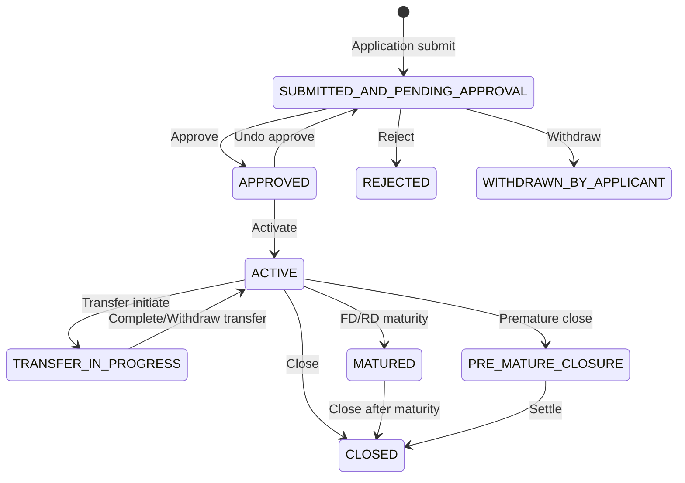
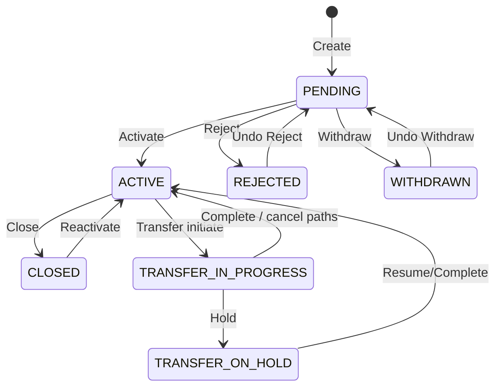
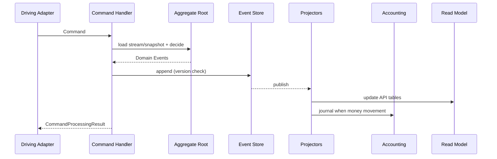

# 11. Aggregate Canvas – Loan, Savings, Client

Taktisches DDD für die drei zentralen Write-Aggregates. Ergänzt die strategische [Domain Context Map](10_domain_context_map.md) und die Leitbilder [ADR-019](decisions/ADR-019-domain-driven-design.md) / [ADR-020](decisions/ADR-020-event-sourcing-writes-pflicht.md).

**Zweck dieses Kapitels**

| Nutzen | Für wen |
|--------|---------|
| Klare Konsistenzgrenzen und Invarianten | Feature-Dev, Reviews |
| Command → Status → Event-Mapping | ES-Migration, CQRS |
| Konflikt- und Schnitt-Empfehlungen | God-Aggregate-Abbau |
| Abgleich Ist-Code ↔ Zielmodell | Modernisierung |

**Quellen im Code (Ist)**

| Aggregat | Root-Klasse | Status | Lifecycle / Events |
|----------|-------------|--------|-------------------|
| Loan | `fineract-loan` … `Loan` (~2.2k LOC) | `LoanStatus` | `LoanEvent`, `DefaultLoanLifecycleStateMachine`, `*Loan*BusinessEvent` |
| Savings | `fineract-savings` … `SavingsAccount` (~3.7k LOC) | `SavingsAccountStatusType` + SubStatus | `Savings*BusinessEvent`, Handlers |
| Client | `fineract-core` … `Client` (~1k LOC) | `ClientStatus` | `ClientCreate/Activate/RejectBusinessEvent`, Handlers |

**Canvas-Legende**

| Feld | Bedeutung |
|------|-----------|
| **Root** | Einstieg für Writes; Stream-ID für Event Sourcing |
| **Members** | Entities/VOs *innerhalb* der Konsistenzgrenze |
| **Invarianten** | Müssen nach jedem Command gelten |
| **Commands** | Application-Eingänge (Handler-Namen ≈ Ist) |
| **Domain Events** | Tatsache nach erfolgreicher Entscheidung (ES-Ziel / Business Events Ist) |
| **Policies** | Reaktionen anderer Contexts (Accounting, COB, …) |
| **Konflikte** | Concurrent Writes, Optimistic Lock, Saga-Risiken |

---

## 11.1 Aggregate Canvas: `Loan`

### 11.1.1 Steckbrief

| | |
|--|--|
| **Bounded Context** | Loan Servicing ([10.2](10_domain_context_map.md)) |
| **Aggregate Root** | `Loan` |
| **Identity** | `LoanId` (technisch `Long` / künftig typed VO); fachlich `accountNo`, optional `externalId` |
| **ES Stream** | `Loan-{id}` (Optimistic Concurrency / `@Version` heute) |
| **Ubiquitous Language** | Application, Approval, Disbursement, Repayment Schedule, Installment, Transaction, Charge, Write-off, Reschedule, Overpaid, Delinquency |
| **Nicht im Aggregat** | `Client` Entity, `Group` Entity, `LoanProduct` als mutable Shared Object, GL-Journal |

### 11.1.2 Members (Konsistenzgrenze – Ziel)

```text
Loan (Root)
├── Status + Timeline (submitted/approved/disbursed/closed/…)
├── Term / ProductSnapshot (frozen Konditionen)     ← heute: ManyToOne LoanProduct
├── ClientId / GroupId / OfficeId / StaffId         ← heute: Entity-Refs
├── LoanRepaymentScheduleDetail (embedded terms)
├── LoanRepaymentScheduleInstallment[]
├── LoanTransaction[]          (kritischer Zustand; Historie → Events)
├── LoanCharge[] (+ PaidBy, InstallmentCharge)
├── LoanDisbursementDetails[]  (Multi-Disburse)
├── LoanSummary                (derived)
├── LoanTermVariations[]
├── Payment/Credit Allocation Rules (progressive)
├── Interest Recalculation Details
└── Officer Assignment History
```

**Optional eigene Roots (Schnitt-Empfehlung):**

| Kandidat | Wann trennen |
|----------|----------------|
| `LoanRescheduleRequest` | Workflow vor Apply; Apply emittiert Events auf `Loan` |
| `LoanCharge` | Sehr hohe Parallelität / lange Streams |
| `GLIM` | Gruppen-Container bereits eigene Entity |
| Progressive/WC-spezifische Breach-Objekte | Andere Lifecycle-Sprache |

### 11.1.3 Statusmaschine



Ist-Enum: `LoanStatus` (`100` Pending … `700` Overpaid). Interne Trigger: `LoanEvent`. Implementierung: `DefaultLoanLifecycleStateMachine`.

### 11.1.4 Invarianten

| ID | Invariante | Typische Verletzung |
|----|------------|---------------------|
| L-I1 | Statusübergänge nur gemäß State Machine | Approve aus Active |
| L-I2 | Disbursement nur aus `APPROVED` (bzw. erlaubte Sonderfälle Multi-Disburse / closed→disburse policy) | Disburse im Pending |
| L-I3 | Keine fachliche Tilgung vor erstem Disbursement | Repayment im Approved ohne Active |
| L-I4 | Principal/Interest/Fees/Penalties im Summary = f(Schedule, Transactions, Charges) | Manuelles Summary-Schreiben |
| L-I5 | Beträge in Product-Currency; Scale gemäß Currency | Fremdwährung ohne FX-Context |
| L-I6 | `ClientId` gesetzt für Individual Loan; Group/GLIM-Regeln für Gruppenkredite | Loan ohne Party-Bezug |
| L-I7 | Product-Snapshot: nach Approval/Disburse keine stillen Produkt-Mutationen am laufenden Loan | Live-Join auf geändertes Product |
| L-I8 | Transaction-Reihenfolge und Value Dates fachlich konsistent (Business Date) | Backdating gegen Closure/Policy |
| L-I9 | Charge-off / Write-off beenden reguläre Accrual-Pfade gemäß Policy | Accrual nach Write-off |
| L-I10 | Optimistic concurrency: parallele Writes auf dasselbe `Loan-{id}` serialisieren | Lost Update Schedule vs. Repayment |

### 11.1.5 Commands (Auszug, gruppiert)

Abgeleitet aus `*CommandHandler` im Loan-Modul (Ist-Namen).

| Gruppe | Commands (Handler ≈) | Erwarteter Status vorher |
|--------|----------------------|---------------------------|
| **Application** | Submit, Modify, Delete Application | Pending |
| **Decision** | Approve, Undo Approval, Reject, Withdraw by Applicant | Pending / Approved |
| **Disbursement** | Disburse, Disburse to Savings, Undo Disburse, Undo Last Disburse, Update Disburse Date/Details | Approved / Active |
| **Repayment & Adjust** | Repayment, Recovery Payment, Down Payment, Goodwill Credit, Refunds, Chargeback, Adjustment, Waive Interest | Active / Overpaid / Closed* |
| **Charges** | Add/Update/Delete/Pay/Waive Charge, Charge Adjustment/Refund, Overdue Charge | je Policy Active+ |
| **Lifecycle end** | Close, Close as Rescheduled, Write-off, Undo Write-off, Foreclosure, Contract Termination | Active / … |
| **Restructure** | Schedule Variation Create/Delete, Re-Age, Re-Amortize (+ Undo) | Active |
| **Charge-off** | Charge-off, Undo Charge-off | Active |
| **Amount changes** | Approved Amount / Available Disbursement Amount Modification | Approved / Active |
| **Officer / Fraud** | Assign/Remove Officer, Mark Fraud | diverse |
| **Transfer** | Initiate / Complete / Reject / Withdraw Transfer (oft über Client-Transfer-Orchestrierung) | Active |
| **GLIM bulk** | GLIM Approve/Disburse/Repay/Undo | Group path |

### 11.1.6 Domain / Business Events

**Interne Lifecycle-Events (`LoanEvent`)** steuern die State Machine.  
**Business Events** (Ist, Auswahl) sind die Published Language Richtung Hooks/External Events/Accounting:

| Kategorie | Events (Beispiele) |
|-----------|-------------------|
| Application | `LoanCreated`, `LoanApplicationModified`, `LoanApproved`, `LoanUndoApproval`, `LoanRejected`, `LoanWithdrawnByApplicant` |
| Disbursement | `LoanDisbursal`, `LoanDisbursalTransaction`, `LoanUndoDisbursal`, `LoanUndoLastDisbursal` |
| Money in/out | `LoanTransactionMakeRepayment*`, Refund/Goodwill/DownPayment/Recovery/Waiver Pre/Post Events |
| Charges | `LoanAddCharge`, `LoanUpdateCharge`, `LoanDeleteCharge`, `LoanWaiveCharge`, Charge Payment/Adjustment/Refund |
| Close / Risk | `LoanClose`, `LoanCloseAsReschedule`, `LoanWrittenOff*`, `LoanChargeOff*`, `LoanForeClosure*`, `LoanStatusChanged` |
| Schedule | `LoanInterestRecalculation`, Reschedule-due-*, `LoanScheduleVariations*`, ReAge/ReAmortize |
| Transfer | `LoanInitiateTransfer`, `LoanRejectTransfer`, `LoanWithdrawTransfer`, Accept Transfer |
| Balance | `LoanBalanceChanged`, Delinquency range/pause, Snapshots |

**ES-Ziel:** dieselben Fakten als append-only Stream-Events; Business Events = Projektion/Outbox der Domain Events ([ADR-020](decisions/ADR-020-event-sourcing-writes-pflicht.md)).

### 11.1.7 Policies (Downstream)

| Nach Event | Downstream Context | Reaktion |
|------------|-------------------|----------|
| Disbursement / Repayment / Write-off / Charge … | **Accounting** | Journal Entries (Projector) |
| Disburse to Savings | **Savings** | Deposit (über Transfer/Orchestrierung) |
| Status/Balance geändert | **COB** | Accrual, Penalty, Delinquency Steps |
| Ownership transfer | **Investor** | Secondary market postings |
| Client transfer complete | **Organisation** indirekt | Office auf Read Models |

### 11.1.8 Konflikte & Transaktionsgrenzen

| Konflikt | Umgang |
|----------|--------|
| Zwei parallele Repayments | Optimistic lock auf Loan-Version; zweiter Command retry/fail |
| COB Accrual vs. Online-Repayment | COB-Lock / Stay-locked; Business Date Ordering |
| Reschedule Apply vs. Payment | Reschedule als eigener Request-Root bis Apply; Apply exklusiv auf Loan |
| Multi-Disburse + Charge | Eine TX, ein Aggregate Write |
| Loan + Savings Disburse | **Nicht** ein Aggregat – Process/Saga: Loan disburse event → Savings deposit command (oder synchrone Orchestrierung mit klarer Kompensation) |

### 11.1.9 Design Debt → Ziel

| Ist | Ziel |
|-----|------|
| God-Class `Loan` mit allen Collections | Root hält **aktuellen** Zustand; Historie = Event Stream; schwere Queries im Read Model |
| `@ManyToOne Client/Product` | `ClientId` + `ProductSnapshot` VO |
| Accounting-Code im Loan-Modul | nur Domain Events; Mapping in Accounting |
| Origination im selben Aggregat-Modell | Application-Phase → **Loan Origination** Context, Handoff-Event |

---

## 11.2 Aggregate Canvas: `SavingsAccount`

### 11.2.1 Steckbrief

| | |
|--|--|
| **Bounded Context** | Savings & Deposits |
| **Aggregate Root** | `SavingsAccount` (FD/RD als Spezialisierung oder eigene Roots – siehe 11.2.9) |
| **Identity** | `SavingsAccountId`; `accountNo`; optional `externalId` |
| **ES Stream** | `SavingsAccount-{id}` |
| **Ubiquitous Language** | Deposit, Withdrawal, Activation, Interest Posting, Hold, Block Credit/Debit, Dormant, Escheat, Maturity, Pre-Closure |
| **Nicht im Aggregat** | `Client` Entity, Product als live-mutable Ref, GL-Journal, Loan |

### 11.2.2 Members

```text
SavingsAccount (Root)
├── Status + SubStatus (NONE | INACTIVE | DORMANT | ESCHEAT | BLOCK*)
├── ClientId / GroupId / GSIM-Ref / OfficeId / StaffId
├── ProductSnapshot (interest, min balance, overdraft flags, …)
├── SavingsAccountSummary (balances, interest posted, …)
├── SavingsAccountTransaction[]
├── SavingsAccountCharge[]
├── OnHold amounts / OnHold transactions (Refs)
├── DepositAccountTerm / Recurring / InterestChart am Account (FD/RD)
└── Officer Assignment History
```

### 11.2.3 Statusmaschine



**SubStatus** (orthogonal, `SavingsAccountSubStatusEnum`): steuert operatives Sperren (Block all / credit / debit), Inaktivität, Dormant, Escheat – ohne den Hauptstatus zu ersetzen.

### 11.2.4 Invarianten

| ID | Invariante |
|----|------------|
| S-I1 | Statusübergänge nur erlaubte Application/Activate/Close/Transfer/Maturity-Pfade |
| S-I2 | Deposit/Withdrawal primär im Status `ACTIVE` (Force-Withdrawal/Policy-Ausnahmen dokumentieren) |
| S-I3 | Bei `BLOCK` / `BLOCK_DEBIT` / `BLOCK_CREDIT`: entsprechende Buchungsrichtungen verboten |
| S-I4 | Available Balance = Ledger Balance − Holds − Min-Balance-Reserven (Product Policy) |
| S-I5 | Withdrawal darf Available Balance nicht unter Policy-Minimum drücken (außer Overdraft erlaubt) |
| S-I6 | Interest Posting idempotent pro Periode/Business Date (COB-sicher) |
| S-I7 | Charges: fällige Account Charges konsistent zu Transactions (Pay/Waive/Inactivate) |
| S-I8 | FD: vor Maturity keine freien Withdrawals außer Pre-Closure-Pfad |
| S-I9 | RD: Mandatory Deposit-Regeln vs. actual deposits nachvollziehbar |
| S-I10 | Currency/Scale wie Loan; eine Währung pro Account |

### 11.2.5 Commands (Auszug)

| Gruppe | Commands (Handler ≈) |
|--------|----------------------|
| **Application** | Savings/FD/RD Submit, Modify, Delete, Approve, Undo Approve, Reject, Withdraw Application |
| **Activation / Close** | Activate, Close, Premature Close (FD/RD), GSIM Activate/Close |
| **Cash** | Deposit, Withdrawal, Force Withdrawal, Transaction Adjustment |
| **Interest** | Calculate Interest, Post Interest, Post Interest as-on-date |
| **Charges** | Add/Delete/Pay/Inactivate/Waive Account Charge, Annual Fee |
| **Holds / Blocks** | Hold Amount, Release Amount, Block Account, Block Credits, Block Debits (+ Unblock-Varianten wo vorhanden) |
| **GSIM** | GSIM Submit/Approve/Undo/Reject/Deposit/Activation/Close |
| **Product config** | Create/Update/Delete Savings/FD/RD **Product** → eigenes Config-Aggregate, nicht Account |

### 11.2.6 Domain / Business Events

| Kategorie | Ist-Beispiele / ES-Zielnamen |
|-----------|------------------------------|
| Lifecycle | `SavingsAccountSubmitted`, `Approved`, `Activated`, `Rejected`, `Closed`, `Matured`, `PreMatureClosed` |
| Cash | `SavingsDeposit`, `SavingsWithdrawal`, `SavingsAccountForceWithdrawal`, `SavingsAccountTransaction` |
| Interest | `InterestCalculated`, `InterestPosted` |
| Risk/Ops | `AmountHeld`, `AmountReleased`, `AccountBlocked`, `CreditsBlocked`, `DebitsBlocked`, `SubStatusChanged` |
| Charges | `SavingsChargeAdded`, `Paid`, `Waived`, `Inactivated` |

Avro-Schemas unter `fineract-avro-schemas` (`SavingsAccount*`, FD/RD) bilden die **Published Language** Richtung externe Systeme.

### 11.2.7 Policies

| Event | Downstream |
|-------|------------|
| Deposit/Withdrawal/Interest/Close | **Accounting** Journal |
| Activate/Close | **Client** Read Model / Interop Identifier |
| Hold/Block | **Interop / Payments** ACL (Quote/Transfer darf failen) |
| Interest/Dormancy | **COB** Steps |

### 11.2.8 Konflikte

| Konflikt | Umgang |
|----------|--------|
| Parallel Deposit + Withdrawal | Optimistic lock Account-Version |
| Hold vs. Withdrawal | Hold im Aggregate; Withdrawal prüft Available |
| COB Interest Post vs. Online Tx | Business Date + Lock; idempotente Posting-Keys |
| Account Transfer Loan←→Savings | Process Context; zwei Aggregate Writes in definierter Reihenfolge |
| GSIM parent vs. child accounts | Parent orchestriert; Child-Accounts eigene Streams |

### 11.2.9 FD / RD: ein Root oder mehrere?

| Option | Empfehlung |
|--------|------------|
| **A – Ein Root `SavingsAccount`** mit Type + Term-Details | Passt zum Ist-Code (`IDepositAccountType`); ein Stream-Typ |
| **B – Eigene Roots FD/RD** | Klarere Invarianten Maturity/Pre-Closure; mehr Duplikation |

**Empfehlung:** mittelfristig **A mit starkem Typ** und eigenen Domain Services für Maturity; bei ES-Stream-Explosion oder Team-Split → **B**.

---

## 11.3 Aggregate Canvas: `Client`

### 11.3.1 Steckbrief

| | |
|--|--|
| **Bounded Context** | Client & Group (Party) |
| **Aggregate Root** | `Client` |
| **Identity** | `ClientId`; `accountNo`; `externalId`; unique `mobileNo` / `email` (tenant-scoped) |
| **ES Stream** | `Client-{id}` |
| **Ubiquitous Language** | Pending, Active, Reject, Withdraw, Close, Reactivate, Transfer, Identifier, Legal Form (Person/Entity) |
| **Nicht im Aggregat** | Loan/Savings Accounts, Group als *volle* Membership-Wahrheit (besser Group-Aggregate + Events), Documents-Bytes |

### 11.3.2 Members

```text
Client (Root)
├── Status (+ optional subStatus CodeValue)
├── OfficeId / transferToOfficeId / StaffId
├── Legal form + Person name fields OR NonPerson details
├── DisplayName / Mobile / Email / DoB / Gender / Type / Classification
├── Timeline (submitted, activated, rejected, withdrawn, closed, reopened)
├── ClientIdentifier[]
├── ClientFamilyMember[]          (kann groß werden → optional split)
├── Address links (ClientAddress) (optional split)
├── ClientCharge[] + ClientTransaction[] (Gebühren ohne Konto)
├── defaultSavingsProductId / defaultSavingsAccountId (IDs only)
└── imageId (Document-Ref, nicht Blob)
```

**Verwandte Roots im Party-Context:** `Group`, `ClientTransfer` (Process).

### 11.3.3 Statusmaschine



Ist-Enum: `ClientStatus` (Pending `100`, Active `300`, Transfer `303/304`, Closed `600`, Rejected `700`, Withdrawn `800`).

### 11.3.4 Invarianten

| ID | Invariante |
|----|------------|
| C-I1 | Statusübergänge nur gemäß State Machine |
| C-I2 | Activation erfordert Office und gültige Pflichtfelder (Name/Legal Form Policy) |
| C-I3 | Active Client ist Voraussetzung für *neue* Loan/Savings Applications (Policy im Downstream, erzwungen über Client-Status-Query) |
| C-I4 | Closed/Rejected/Withdrawn: keine neuen Portfolio-Accounts |
| C-I5 | Identifiers unique pro Typ/Value im Tenant |
| C-I6 | Mobile/Email uniqueness Constraints respektieren |
| C-I7 | Transfer: während `TRANSFER_*` eingeschränkte Mutationen |
| C-I8 | `OfficeId` immer gesetzt; Transfer ändert Office nur über Transfer-Pfad |
| C-I9 | ClientCharges nur im erlaubten Status zahlbar/waivable |
| C-I10 | Keine Einbettung von Loan/Savings-Salden in Client-Write-Modell |

### 11.3.5 Commands (Auszug)

| Gruppe | Commands (Handler ≈) |
|--------|----------------------|
| **Lifecycle** | Create, Update, Activate, Close, Reject, Undo Reject, Withdraw, Undo Withdraw, Reactivate, Delete* |
| **Staff** | Assign Staff, Unassign Staff |
| **Identifiers** | Create/Update/Delete Client Identifier |
| **Family** | Add/Update/Delete Family Member |
| **Address** | Add/Update Address |
| **Charges** | Create/Delete/Pay/Waive Client Charge, Undo Client Transaction |
| **Savings default** | Update Client Savings Account (Default-Account **ID**) |

\*Delete nur im erlaubten Pending-Fenster / Policy.

### 11.3.6 Domain / Business Events

| Ist (Provider) | ES-Ziel |
|----------------|---------|
| `ClientCreateBusinessEvent` | `ClientCreated` |
| `ClientActivateBusinessEvent` | `ClientActivated` |
| `ClientUpdateBusinessEvent` | `ClientUpdated` |
| `ClientCloseBusinessEvent` | `ClientClosed` |
| `ClientRejectBusinessEvent` | `ClientRejected` |
| `ClientWithdrawBusinessEvent` | `ClientWithdrawn` |
| `ClientReactivateBusinessEvent` | `ClientReactivated` |
| `ClientUndoRejectBusinessEvent` | `ClientRejectionUndone` |
| `ClientUndoWithdrawBusinessEvent` | `ClientWithdrawalUndone` |
| `ClientDeleteBusinessEvent` | `ClientDeleted` |
| `ClientAssignStaffBusinessEvent` / `ClientUnassignStaffBusinessEvent` | Staff assigned/unassigned |
| `ClientTransferPropose/Accept/Reject/WithdrawBusinessEvent` | Transfer lifecycle |

Vollständige Tabelle: [12 Event Catalog](12_event_catalog.md). Noch offen: Identifier, Family, Address, ClientCharge.

**Hinweis:** Neue `*BusinessEvent`-Klassen brauchen immer einen Eintrag in `m_external_event_configuration` (Liquibase), sonst startet die App nicht → [12.9](12_event_catalog.md#129-pflicht-external-event-konfiguration-in-der-db).

### 11.3.7 Policies

| Event | Downstream |
|-------|------------|
| `ClientActivated` | Loan/Savings Origination freigeben (Guard) |
| `ClientClosed` | Neue Accounts verbieten; bestehende Accounts: instituts-Policy (block vs. force-close) |
| `ClientTransferred` | Loan/Savings Officer/Office-Update (Orchestrierung, nicht im Client-TX stumm mutieren) |
| Create/Activate | **Interop** KYC Identifier; **Documents** optional |
| ClientCharge paid | **Accounting** wenn gebucht |

### 11.3.8 Konflikte

| Konflikt | Umgang |
|----------|--------|
| Parallel Update Client vs. Activate | Version auf Client |
| Transfer vs. Loan Disburse | Transfer-Substatus; Downstream lehnt Disburse ab wenn Client under transfer |
| Close Client mit offenen Loans | Domain Rule / Application Guard (Supporting Policy) – nicht stillschweigend im Client-Aggregate „Loans schließen“ |
| Group membership vs. Client | Membership-Änderungen am **Group**-Aggregate oder explizite Domain Service mit zwei Writes |

### 11.3.9 Design Debt → Ziel

| Ist | Ziel |
|-----|------|
| `Client` in `fineract-core` | Party-Modul / BC mit Ports |
| JPA `Set<Group> groups` am Client | IDs + Group-Aggregate als Source of Membership |
| Wenige Business Events | Volle Lifecycle-Event-Palette für ES und Guards |
| ClientCharge + Transactions im selben Root | ok solange Volumen klein; sonst Split |

---

## 11.4 Querschnitt: Commands → Events → Projektionen

Gemeinsames Muster für alle drei Aggregates ([ADR-004](decisions/ADR-004-cqrs-und-command-pipeline-beibehalten-modernisieren.md), [ADR-020](decisions/ADR-020-event-sourcing-writes-pflicht.md)):



| Aggregat | Typische Projection Targets |
|----------|----------------------------|
| Loan | `m_loan*`, Schedule tables, Delinquency, Search, Avro external |
| Savings | `m_savings*`, Interest summary, Avro |
| Client | `m_client*`, Identifiers, Address, Search |

---

## 11.5 Vergleichende Entscheidungsmatrix

| Frage | Loan | SavingsAccount | Client |
|-------|------|----------------|--------|
| **ES-Pilot geeignet?** | nein (zu groß zuerst) | bedingt (nach Client) | **ja** (nach Charge-Pilot) |
| **God-Aggregate-Risiko** | sehr hoch | sehr hoch | mittel |
| **Downstream-Druck** | Accounting, COB, Investor | Accounting, COB, Interop | Loan, Savings, Interop |
| **Upstream-Abhängigkeiten** | Client, Product, Charge, Tax, Org | Client, Product, Charge, Tax, Org | Organisation |
| **Natürliche Stream-Länge** | sehr lang (Tx + Schedule) | lang (Tx) | kurz–mittel |
| **Snapshot-Empfehlung** | ja (nach N Events / nach Disburse) | ja | optional |
| **Split-Priorität** | RescheduleRequest, ProductSnapshot | FD/RD services, Holds | Address/Family optional |

---

## 11.6 Review-Checkliste (pro PR am Aggregat)

1. Welches **Root** wird geschrieben? (nur eines idealerweise)  
2. Welche **Invarianten** (L-I* / S-I* / C-I*) sind betroffen und getestet?  
3. Welcher **Status** vorher/nachher? State Machine erlaubt den Übergang?  
4. Welche **Domain Events** entstehen? Namen in UL?  
5. Werden fremde Entities (**Client/Product/GL**) importiert statt IDs/Events?  
6. Braucht **Accounting** eine Projection? Idempotenz?  
7. **Concurrency**: Version/Lock, COB-Interaktion?  
8. Read-Pfad: neues Feld nur im **Write-Model** oder auch Projection?

---

## 11.7 Nächste Vertiefungen

| Artefakt | Inhalt |
|----------|--------|
| Event-Katalog pro Aggregat | → erledigt in [12 Event Catalog](12_event_catalog.md) |
| ArchUnit-Regeln | → erledigt in [13](13_archunit_bounded_context_rules.md) |
| Aggregate Canvas `Group`, `JournalEntry`, `LoanProduct` | Supporting Contexts |
| Gherkin-Szenarien pro Invariante | z. B. `@invariant L-I2` an Disbursement-Features |

---

## 11.8 Bezug

| Dokument | Rolle |
|----------|--------|
| [10 Domain Context Map](10_domain_context_map.md) | Strategische Grenzen |
| [12 Event Catalog](12_event_catalog.md) | Ist-BusinessEvents → ES-Zielnamen |
| [ADR-019 DDD](decisions/ADR-019-domain-driven-design.md) | Aggregates, UL |
| [ADR-020 Event Sourcing](decisions/ADR-020-event-sourcing-writes-pflicht.md) | Stream = Write-SoT |
| [ADR-004 CQRS](decisions/ADR-004-cqrs-und-command-pipeline-beibehalten-modernisieren.md) | Commands / Queries |
| [04 Runtime View](04_runtime_view.md) | Loan/Command-Abläufe |
| [06.15 DDD](06_crosscutting_concepts.md) | Querschnitt |
| Code | `LoanStatus`, `LoanEvent`, `DefaultLoanLifecycleStateMachine`, `SavingsAccountStatusType`, `ClientStatus`, Command Handlers |

---

*Navigation:* [README](README.md) · [12 Event Catalog](12_event_catalog.md) · [10 Context Map](10_domain_context_map.md) · [09 Glossary](09_glossary.md)
