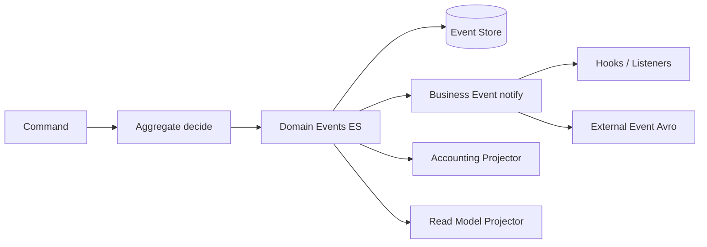

# 12. Event-Katalog (Business Events → Domain/ES)

Vollständiger Katalog der **konkreten** `*BusinessEvent`-Typen im Repo (Stand Code-Scan), gemappt auf Bounded Contexts, Aggregate-Streams und **ES-Zielnamen** ([ADR-020](decisions/ADR-020-event-sourcing-writes-pflicht.md)).

Ergänzt:

- strategisch: [10 Domain Context Map](10_domain_context_map.md)
- taktisch: [11 Aggregate Canvas](11_aggregate_canvas.md)
- DDD: [ADR-019](decisions/ADR-019-domain-driven-design.md)
- Messaging/Hooks: [06 Crosscutting](06_crosscutting_concepts.md)

**Status:** living inventory – bei neuen Event-Klassen aktualisieren (siehe [12.9 Pflicht DB-Config](#129-pflicht-external-event-konfiguration-in-der-db) und [12.10 Pflege](#1210-pflege-und-code-scan)).

---

## 12.1 Event-Taxonomie

| Schicht | Rolle | Persistenz / Transport | Beispiel |
|---------|--------|------------------------|---------|
| **Domain Event (ES-Ziel)** | Autoritative Tatsache am Aggregate; append-only Stream | Event Store (Write-SoT) | `LoanRepaymentPosted` |
| **Business Event (Ist)** | Nachricht nach Domain-Änderung (in-process) | `BusinessEventNotifierService` | `LoanTransactionMakeRepaymentPostBusinessEvent` |
| **External Event** | Downstream/Partner (Kafka/JMS) | Avro + Serializer, wenn nicht `NoExternalEvent` | `MessageV1` + `LoanTransactionDataV1` |
| **Internal Lifecycle Trigger** | State Machine, kein externes Produkt-Event | Enum im Domain-Code | `LoanEvent.LOAN_DISBURSED` |
| **Pre-Event** | Hook *vor* Commit der Wirkung | oft kompensierbar; **kein** ES-Fakt | `…PreBusinessEvent` |
| **Post-Event / Fact** | Nach erfolgreicher Änderung | ES-Kandidat / Outbox | `…PostBusinessEvent` oder `…BusinessEvent` |



### Spaltenlegende (Tabellen)

| Spalte | Bedeutung |
|--------|-----------|
| **Ist TYPE** | `getType()` / `TYPE`-Konstante der Java-Klasse |
| **Phase** | `pre` = vor Wirkung; `post` = nach Commit-Wirkung; `fact` = einfaches Fakt-Event |
| **Aggregat/Stream** | ES-Stream-Zuordnung (Ziel) |
| **ES-Zielname** | Vorgeschlagener Domain-Event-Name (ohne `BusinessEvent`-Suffix); `—` = nicht in ES |
| **ES-Rolle** | Kandidat vs. hook-only |
| **GL** | Typische Journal-Relevanz (heuristisch) |
| **Ext** | Potentiell externalisierbar; `nein` = `NoExternalEvent` o. ä.; `ja*` = sofern External-Events global aktiv und Serializer existiert |

### Inventar-Überblick (Code-Scan)

| Bereich | Konkrete TYPEs | Bemerkung |
|---------|---------------:|-----------|
| Loan Servicing | ~98 | größter Katalog; viele Pre/Post-Paare |
| Working Capital Loan | 8 | eigene Transaction-Events |
| Savings | 9 | dünner als Loan |
| FD/RD Create | 2 | Lifecycle unvollständig als Events |
| Client | 16 | Lifecycle/Staff/Transfer verdrahtet (Identifier/Charge/Family noch offen) |
| Group/Center | 2 | nur Create |
| Share | 3 | |
| Investor | 1 | Ownership Transfer |
| Accounting | 1 | `JournalEntryCreated` (`NoExternalEvent`) |
| Document | 2 | |
| Datatable | 3 | `NoExternalEvent` |
| COB locks | 2 | operativ |
| LoanProduct | 1 | nur Create |
| Platform bulk | 1 | Envelope |
| **Summe konkret** | **~149** | +13 Client-Lifecycle/Transfer Events; plus abstrakte Basisklassen |

---

## 12.2 Katalog nach Bounded Context

### Client & Group (Party) — Client

_Konkrete Business-Event-Typen: **16**_ (Lifecycle + Staff + Transfer; Serializer: `ClientBusinessEventSerializer` → Avro `ClientDataV1`)

| Ist TYPE (`getType`) | Phase | Aggregat/Stream | ES-Zielname (Vorschlag) | ES-Rolle | GL | Ext |
|---|:---:|---|---|---|:---:|:---:|
| `ClientCreateBusinessEvent` | fact | Client | `ClientCreated` | ES-Kandidat | selten/nein | ja* |
| `ClientActivateBusinessEvent` | fact | Client | `ClientActivated` | ES-Kandidat | selten/nein | ja* |
| `ClientUpdateBusinessEvent` | fact | Client | `ClientUpdated` | ES-Kandidat | selten/nein | ja* |
| `ClientCloseBusinessEvent` | fact | Client | `ClientClosed` | ES-Kandidat | selten/nein | ja* |
| `ClientRejectBusinessEvent` | fact | Client | `ClientRejected` | ES-Kandidat | selten/nein | ja* |
| `ClientWithdrawBusinessEvent` | fact | Client | `ClientWithdrawn` | ES-Kandidat | selten/nein | ja* |
| `ClientReactivateBusinessEvent` | fact | Client | `ClientReactivated` | ES-Kandidat | selten/nein | ja* |
| `ClientUndoRejectBusinessEvent` | fact | Client | `ClientRejectionUndone` | ES-Kandidat | selten/nein | ja* |
| `ClientUndoWithdrawBusinessEvent` | fact | Client | `ClientWithdrawalUndone` | ES-Kandidat | selten/nein | ja* |
| `ClientDeleteBusinessEvent` | fact | Client | `ClientDeleted` | ES-Kandidat | selten/nein | ja* |
| `ClientAssignStaffBusinessEvent` | fact | Client | `ClientStaffAssigned` | ES-Kandidat | selten/nein | ja* |
| `ClientUnassignStaffBusinessEvent` | fact | Client | `ClientStaffUnassigned` | ES-Kandidat | selten/nein | ja* |
| `ClientTransferProposeBusinessEvent` | fact | Client | `ClientTransferProposed` | ES-Kandidat | selten/nein | ja* |
| `ClientTransferAcceptBusinessEvent` | fact | Client | `ClientTransferAccepted` | ES-Kandidat | selten/nein | ja* |
| `ClientTransferRejectBusinessEvent` | fact | Client | `ClientTransferRejected` | ES-Kandidat | selten/nein | ja* |
| `ClientTransferWithdrawBusinessEvent` | fact | Client | `ClientTransferWithdrawn` | ES-Kandidat | selten/nein | ja* |

### Client & Group (Party) — Group/Center

_Konkrete Business-Event-Typen: **2**_

| Ist TYPE (`getType`) | Phase | Aggregat/Stream | ES-Zielname (Vorschlag) | ES-Rolle | GL | Ext |
|---|:---:|---|---|---|:---:|:---:|
| `CentersCreateBusinessEvent` | fact | Group/Center | `CentersCreate` | ES-Kandidat | selten/nein | ja* |
| `GroupsCreateBusinessEvent` | fact | Group/Center | `GroupsCreate` | ES-Kandidat | selten/nein | ja* |

### Loan Servicing

_Konkrete Business-Event-Typen: **98**_

#### lifecycle

| Ist TYPE (`getType`) | Phase | Aggregat/Stream | ES-Zielname (Vorschlag) | ES-Rolle | GL | Ext |
|---|:---:|---|---|---|:---:|:---:|
| `LoanApplicationModifiedBusinessEvent` | fact | Loan | `LoanApplicationModified` | ES-Kandidat | nein | ja* |
| `LoanApprovedAmountChangedBusinessEvent` | fact | Loan | `LoanApprovedAmountChanged` | ES-Kandidat | nein | ja* |
| `LoanApprovedBusinessEvent` | fact | Loan | `LoanApproved` | ES-Kandidat | nein | ja* |
| `LoanCloseBusinessEvent` | fact | Loan | `LoanClose` | ES-Kandidat | nein | ja* |
| `LoanCreatedBusinessEvent` | fact | Loan | `LoanCreated` | ES-Kandidat | nein | ja* |
| `LoanDisbursalBusinessEvent` | fact | Loan | `LoanDisbursal` | ES-Kandidat | ja | ja* |
| `LoanRejectedBusinessEvent` | fact | Loan | `LoanRejected` | ES-Kandidat | nein | ja* |
| `LoanStatusChangedBusinessEvent` | fact | Loan | `LoanStatusChanged` | ES-Kandidat | nein | ja* |
| `LoanUndoApprovalBusinessEvent` | fact | Loan | `LoanUndoApproval` | ES-Kandidat | nein | ja* |
| `LoanUndoDisbursalBusinessEvent` | fact | Loan | `LoanUndoDisbursal` | ES-Kandidat | ja | ja* |
| `LoanUndoLastDisbursalBusinessEvent` | fact | Loan | `LoanUndoLastDisbursal` | ES-Kandidat | ja | ja* |
| `LoanUpdateDisbursementDataBusinessEvent` | fact | Loan | `LoanUpdateDisbursementData` | ES-Kandidat | nein | ja* |
| `LoanWithdrawnByApplicantBusinessEvent` | fact | Loan | `LoanWithdrawnByApplicant` | ES-Kandidat | nein | ja* |

#### transactions

| Ist TYPE (`getType`) | Phase | Aggregat/Stream | ES-Zielname (Vorschlag) | ES-Rolle | GL | Ext |
|---|:---:|---|---|---|:---:|:---:|
| `LoanAccrualAdjustmentTransactionBusinessEvent` | fact | Loan | `LoanAccrualAdjustmentTransaction` | ES-Kandidat | ja | ja* |
| `LoanAccrualTransactionCreatedBusinessEvent` | fact | Loan | `LoanAccrualTransactionCreated` | ES-Kandidat | ja | ja* |
| `LoanAdjustTransactionBusinessEvent` | fact | Loan | `LoanAdjustTransaction` | ES-Kandidat | ja | ja* |
| `LoanBuyDownFeeAdjustmentTransactionCreatedBusinessEvent` | fact | Loan | `LoanBuyDownFeeAdjustmentTransactionCreated` | ES-Kandidat | ja | ja* |
| `LoanBuyDownFeeAmortizationAdjustmentTransactionCreatedBusinessEvent` | fact | Loan | `LoanBuyDownFeeAmortizationAdjustmentTransactionCreated` | ES-Kandidat | ja | ja* |
| `LoanBuyDownFeeAmortizationTransactionCreatedBusinessEvent` | fact | Loan | `LoanBuyDownFeeAmortizationTransactionCreated` | ES-Kandidat | ja | ja* |
| `LoanBuyDownFeeTransactionCreatedBusinessEvent` | fact | Loan | `LoanBuyDownFeeTransactionCreated` | ES-Kandidat | ja | ja* |
| `LoanCapitalizedIncomeAdjustmentTransactionCreatedBusinessEvent` | fact | Loan | `LoanCapitalizedIncomeAdjustmentTransactionCreated` | ES-Kandidat | ja | ja* |
| `LoanCapitalizedIncomeAmortizationAdjustmentTransactionCreatedBusinessEvent` | fact | Loan | `LoanCapitalizedIncomeAmortizationAdjustmentTransactionCreated` | ES-Kandidat | ja | ja* |
| `LoanCapitalizedIncomeAmortizationTransactionCreatedBusinessEvent` | fact | Loan | `LoanCapitalizedIncomeAmortizationTransactionCreated` | ES-Kandidat | ja | ja* |
| `LoanCapitalizedIncomeTransactionCreatedBusinessEvent` | fact | Loan | `LoanCapitalizedIncomeTransactionCreated` | ES-Kandidat | ja | ja* |
| `LoanCreditBalanceRefundPostBusinessEvent` | post | Loan | `LoanCreditBalanceRefund` | ES-Kandidat (post = committed) | ja | ja* |
| `LoanCreditBalanceRefundPreBusinessEvent` | pre | Loan | `—` | hook-only (pre); kein ES-Fakt | nein | ja* |
| `LoanDisbursalTransactionBusinessEvent` | fact | Loan | `LoanDisbursalTransaction` | ES-Kandidat | ja | ja* |
| `LoanForeClosurePostBusinessEvent` | post | Loan | `LoanForeClosure` | ES-Kandidat (post = committed) | ja | ja* |
| `LoanForeClosurePreBusinessEvent` | pre | Loan | `—` | hook-only (pre); kein ES-Fakt | nein | ja* |
| `LoanRefundPostBusinessEvent` | post | Loan | `LoanRefund` | ES-Kandidat (post = committed) | ja | ja* |
| `LoanRefundPreBusinessEvent` | pre | Loan | `—` | hook-only (pre); kein ES-Fakt | nein | ja* |
| `LoanRepaymentDueBusinessEvent` | fact | Loan | `LoanRepaymentDue` | ES-Kandidat | ja | ja* |
| `LoanRepaymentOverdueBusinessEvent` | fact | Loan | `LoanRepaymentOverdue` | ES-Kandidat | ja | ja* |
| `LoanTransactionAccrualActivityPostBusinessEvent` | post | Loan | `LoanTransactionAccrualActivity` | ES-Kandidat (post = committed) | ja | ja* |
| `LoanTransactionAccrualActivityPreBusinessEvent` | pre | Loan | `—` | hook-only (pre); kein ES-Fakt | nein | ja* |
| `LoanTransactionContractTerminationPostBusinessEvent` | post | Loan | `LoanTransactionContractTermination` | ES-Kandidat (post = committed) | ja | ja* |
| `LoanTransactionDownPaymentPostBusinessEvent` | post | Loan | `LoanTransactionDownPayment` | ES-Kandidat (post = committed) | ja | ja* |
| `LoanTransactionDownPaymentPreBusinessEvent` | pre | Loan | `—` | hook-only (pre); kein ES-Fakt | nein | ja* |
| `LoanTransactionGoodwillCreditPostBusinessEvent` | post | Loan | `LoanTransactionGoodwillCredit` | ES-Kandidat (post = committed) | ja | ja* |
| `LoanTransactionGoodwillCreditPreBusinessEvent` | pre | Loan | `—` | hook-only (pre); kein ES-Fakt | nein | ja* |
| `LoanTransactionInterestPaymentWaiverPostBusinessEvent` | post | Loan | `LoanTransactionInterestPaymentWaiver` | ES-Kandidat (post = committed) | ja | ja* |
| `LoanTransactionInterestPaymentWaiverPreBusinessEvent` | pre | Loan | `—` | hook-only (pre); kein ES-Fakt | nein | ja* |
| `LoanTransactionInterestRefundPostBusinessEvent` | post | Loan | `LoanTransactionInterestRefund` | ES-Kandidat (post = committed) | ja | ja* |
| `LoanTransactionInterestRefundPreBusinessEvent` | pre | Loan | `—` | hook-only (pre); kein ES-Fakt | nein | ja* |
| `LoanTransactionMakeRepaymentPostBusinessEvent` | post | Loan | `LoanTransactionMakeRepayment` | ES-Kandidat (post = committed) | ja | ja* |
| `LoanTransactionMakeRepaymentPreBusinessEvent` | pre | Loan | `—` | hook-only (pre); kein ES-Fakt | nein | ja* |
| `LoanTransactionMerchantIssuedRefundPostBusinessEvent` | post | Loan | `LoanTransactionMerchantIssuedRefund` | ES-Kandidat (post = committed) | ja | ja* |
| `LoanTransactionMerchantIssuedRefundPreBusinessEvent` | pre | Loan | `—` | hook-only (pre); kein ES-Fakt | nein | ja* |
| `LoanTransactionPayoutRefundPostBusinessEvent` | post | Loan | `LoanTransactionPayoutRefund` | ES-Kandidat (post = committed) | ja | ja* |
| `LoanTransactionPayoutRefundPreBusinessEvent` | pre | Loan | `—` | hook-only (pre); kein ES-Fakt | nein | ja* |
| `LoanTransactionRecoveryPaymentPostBusinessEvent` | post | Loan | `LoanTransactionRecoveryPayment` | ES-Kandidat (post = committed) | ja | ja* |
| `LoanTransactionRecoveryPaymentPreBusinessEvent` | pre | Loan | `—` | hook-only (pre); kein ES-Fakt | nein | ja* |
| `LoanUndoContractTerminationBusinessEvent` | fact | Loan | `LoanUndoContractTermination` | ES-Kandidat | ja | ja* |
| `LoanWaiveInterestBusinessEvent` | fact | Loan | `LoanWaiveInterest` | ES-Kandidat | ja | ja* |

#### charges

| Ist TYPE (`getType`) | Phase | Aggregat/Stream | ES-Zielname (Vorschlag) | ES-Rolle | GL | Ext |
|---|:---:|---|---|---|:---:|:---:|
| `LoanAddChargeBusinessEvent` | fact | Loan | `LoanAddCharge` | ES-Kandidat | nein | ja* |
| `LoanApplyOverdueChargeBusinessEvent` | fact | Loan | `LoanApplyOverdueCharge` | ES-Kandidat | nein | ja* |
| `LoanChargeAdjustmentPostBusinessEvent` | post | Loan | `LoanChargeAdjustment` | ES-Kandidat (post = committed) | nein | ja* |
| `LoanChargeAdjustmentPreBusinessEvent` | pre | Loan | `—` | hook-only (pre); kein ES-Fakt | nein | ja* |
| `LoanChargeOffPostBusinessEvent` | post | Loan | `LoanChargeOff` | ES-Kandidat (post = committed) | ja | ja* |
| `LoanChargeOffPreBusinessEvent` | pre | Loan | `—` | hook-only (pre); kein ES-Fakt | nein | ja* |
| `LoanChargePaymentPostBusinessEvent` | post | Loan | `LoanChargePayment` | ES-Kandidat (post = committed) | ja | ja* |
| `LoanChargePaymentPreBusinessEvent` | pre | Loan | `—` | hook-only (pre); kein ES-Fakt | nein | ja* |
| `LoanChargeRefundBusinessEvent` | fact | Loan | `LoanChargeRefund` | ES-Kandidat | ja | ja* |
| `LoanChargebackTransactionBusinessEvent` | fact | Loan | `LoanChargebackTransaction` | ES-Kandidat | ja | ja* |
| `LoanDeleteChargeBusinessEvent` | fact | Loan | `LoanDeleteCharge` | ES-Kandidat | nein | ja* |
| `LoanUndoChargeOffBusinessEvent` | fact | Loan | `LoanUndoChargeOff` | ES-Kandidat | ja | ja* |
| `LoanUpdateChargeBusinessEvent` | fact | Loan | `LoanUpdateCharge` | ES-Kandidat | nein | ja* |
| `LoanWaiveChargeBusinessEvent` | fact | Loan | `LoanWaiveCharge` | ES-Kandidat | ja | ja* |
| `LoanWaiveChargeUndoBusinessEvent` | fact | Loan | `LoanWaiveChargeUndo` | ES-Kandidat | ja | ja* |

#### schedule

| Ist TYPE (`getType`) | Phase | Aggregat/Stream | ES-Zielname (Vorschlag) | ES-Rolle | GL | Ext |
|---|:---:|---|---|---|:---:|:---:|
| `LoanCloseAsRescheduleBusinessEvent` | fact | Loan | `LoanCloseAsReschedule` | ES-Kandidat | nein | ja* |
| `LoanInterestRecalculationBusinessEvent` | fact | Loan | `LoanInterestRecalculation` | ES-Kandidat | ja | ja* |
| `LoanReAgeBusinessEvent` | fact | Loan | `LoanReAge` | ES-Kandidat | nein | ja* |
| `LoanReAgeTransactionBusinessEvent` | fact | Loan | `LoanReAgeTransaction` | ES-Kandidat | nein | ja* |
| `LoanReAmortizeBusinessEvent` | fact | Loan | `LoanReAmortize` | ES-Kandidat | nein | ja* |
| `LoanReAmortizeTransactionBusinessEvent` | fact | Loan | `LoanReAmortizeTransaction` | ES-Kandidat | nein | ja* |
| `LoanRescheduledDueAdjustScheduleBusinessEvent` | fact | Loan | `LoanRescheduledDueAdjustSchedule` | ES-Kandidat | nein | ja* |
| `LoanRescheduledDueCalendarChangeBusinessEvent` | fact | Loan | `LoanRescheduledDueCalendarChange` | ES-Kandidat | nein | ja* |
| `LoanRescheduledDueHolidayBusinessEvent` | fact | Loan | `LoanRescheduledDueHoliday` | ES-Kandidat | nein | ja* |
| `LoanScheduleVariationsAddedBusinessEvent` | fact | Loan | `LoanScheduleVariationsAdded` | ES-Kandidat | nein | ja* |
| `LoanScheduleVariationsDeletedBusinessEvent` | fact | Loan | `LoanScheduleVariationsDeleted` | ES-Kandidat | nein | ja* |
| `LoanUndoReAgeBusinessEvent` | fact | Loan | `LoanUndoReAge` | ES-Kandidat | nein | ja* |
| `LoanUndoReAgeTransactionBusinessEvent` | fact | Loan | `LoanUndoReAgeTransaction` | ES-Kandidat | nein | ja* |
| `LoanUndoReAmortizeBusinessEvent` | fact | Loan | `LoanUndoReAmortize` | ES-Kandidat | nein | ja* |
| `LoanUndoReAmortizeTransactionBusinessEvent` | fact | Loan | `LoanUndoReAmortizeTransaction` | ES-Kandidat | nein | ja* |

#### transfer

| Ist TYPE (`getType`) | Phase | Aggregat/Stream | ES-Zielname (Vorschlag) | ES-Rolle | GL | Ext |
|---|:---:|---|---|---|:---:|:---:|
| `LoanAcceptTransferBusinessEvent` | fact | Loan | `LoanAcceptTransfer` | ES-Kandidat | nein | ja* |
| `LoanInitiateTransferBusinessEvent` | fact | Loan | `LoanInitiateTransfer` | ES-Kandidat | nein | ja* |
| `LoanRejectTransferBusinessEvent` | fact | Loan | `LoanRejectTransfer` | ES-Kandidat | nein | ja* |
| `LoanWithdrawTransferBusinessEvent` | fact | Loan | `LoanWithdrawTransfer` | ES-Kandidat | nein | ja* |

#### officer

| Ist TYPE (`getType`) | Phase | Aggregat/Stream | ES-Zielname (Vorschlag) | ES-Rolle | GL | Ext |
|---|:---:|---|---|---|:---:|:---:|
| `LoanReassignOfficerBusinessEvent` | fact | Loan | `LoanReassignOfficer` | ES-Kandidat | nein | ja* |
| `LoanRemoveOfficerBusinessEvent` | fact | Loan | `LoanRemoveOfficer` | ES-Kandidat | nein | ja* |

#### risk-snapshot

| Ist TYPE (`getType`) | Phase | Aggregat/Stream | ES-Zielname (Vorschlag) | ES-Rolle | GL | Ext |
|---|:---:|---|---|---|:---:|:---:|
| `LoanAccountCustomSnapshotBusinessEvent` | fact | Loan | `LoanAccountCustomSnapshot` | ES-Kandidat | nein | ja* |
| `LoanAccountDelinquencyPauseChangedBusinessEvent` | fact | Loan | `LoanAccountDelinquencyPauseChanged` | ES-Kandidat | nein | ja* |
| `LoanAccountSnapshotBusinessEvent` | fact | Loan | `LoanAccountSnapshot` | ES-Kandidat | nein | ja* |
| `LoanBalanceChangedBusinessEvent` | fact | Loan | `LoanBalanceChanged` | ES-Kandidat | nein | ja* |
| `LoanDelinquencyRangeChangeBusinessEvent` | fact | Loan | `LoanDelinquencyRangeChange` | ES-Kandidat | nein | ja* |

#### other

| Ist TYPE (`getType`) | Phase | Aggregat/Stream | ES-Zielname (Vorschlag) | ES-Rolle | GL | Ext |
|---|:---:|---|---|---|:---:|:---:|
| `LoanUndoWrittenOffBusinessEvent` | fact | Loan | `LoanUndoWrittenOff` | ES-Kandidat | ja | ja* |
| `LoanWrittenOffPostBusinessEvent` | post | Loan | `LoanWrittenOff` | ES-Kandidat (post = committed) | ja | ja* |
| `LoanWrittenOffPreBusinessEvent` | pre | Loan | `—` | hook-only (pre); kein ES-Fakt | nein | ja* |

### Product Catalog — LoanProduct

_Konkrete Business-Event-Typen: **1**_

| Ist TYPE (`getType`) | Phase | Aggregat/Stream | ES-Zielname (Vorschlag) | ES-Rolle | GL | Ext |
|---|:---:|---|---|---|:---:|:---:|
| `LoanProductCreateBusinessEvent` | fact | LoanProduct | `LoanProductCreate` | ES-Kandidat | nein | ja* |

### Loan Servicing — Working Capital

_Konkrete Business-Event-Typen: **8**_

| Ist TYPE (`getType`) | Phase | Aggregat/Stream | ES-Zielname (Vorschlag) | ES-Rolle | GL | Ext |
|---|:---:|---|---|---|:---:|:---:|
| `WorkingCapitalLoanChargeAdjustmentPostBusinessEvent` | post | WorkingCapitalLoan / Loan | `WorkingCapitalLoanChargeAdjustment` | ES-Kandidat (post = committed) | nein | ja* |
| `WorkingCapitalLoanChargeAdjustmentPreBusinessEvent` | pre | WorkingCapitalLoan / Loan | `—` | hook-only (pre); kein ES-Fakt | nein | ja* |
| `WorkingCapitalLoanCreditBalanceRefundTransactionBusinessEvent` | fact | WorkingCapitalLoan / Loan | `WorkingCapitalLoanCreditBalanceRefundTransaction` | ES-Kandidat | ja | ja* |
| `WorkingCapitalLoanDisbursalTransactionBusinessEvent` | fact | WorkingCapitalLoan / Loan | `WorkingCapitalLoanDisbursalTransaction` | ES-Kandidat | ja | ja* |
| `WorkingCapitalLoanDiscountFeeAdjustmentTransactionBusinessEvent` | fact | WorkingCapitalLoan / Loan | `WorkingCapitalLoanDiscountFeeAdjustmentTransaction` | ES-Kandidat | nein | ja* |
| `WorkingCapitalLoanDiscountFeeTransactionBusinessEvent` | fact | WorkingCapitalLoan / Loan | `WorkingCapitalLoanDiscountFeeTransaction` | ES-Kandidat | nein | ja* |
| `WorkingCapitalLoanRepaymentTransactionBusinessEvent` | fact | WorkingCapitalLoan / Loan | `WorkingCapitalLoanRepaymentTransaction` | ES-Kandidat | ja | ja* |
| `WorkingCapitalLoanUndoDisbursalTransactionBusinessEvent` | fact | WorkingCapitalLoan / Loan | `WorkingCapitalLoanUndoDisbursalTransaction` | ES-Kandidat | ja | ja* |

### Savings & Deposits — SavingsAccount

_Konkrete Business-Event-Typen: **9**_

#### lifecycle

| Ist TYPE (`getType`) | Phase | Aggregat/Stream | ES-Zielname (Vorschlag) | ES-Rolle | GL | Ext |
|---|:---:|---|---|---|:---:|:---:|
| `SavingsActivateBusinessEvent` | fact | SavingsAccount | `SavingsActivate` | ES-Kandidat | nein | ja* |
| `SavingsApproveBusinessEvent` | fact | SavingsAccount | `SavingsApprove` | ES-Kandidat | nein | ja* |
| `SavingsCloseBusinessEvent` | fact | SavingsAccount | `SavingsClose` | ES-Kandidat | nein | ja* |
| `SavingsCreateBusinessEvent` | fact | SavingsAccount | `SavingsCreate` | ES-Kandidat | nein | ja* |
| `SavingsRejectBusinessEvent` | fact | SavingsAccount | `SavingsReject` | ES-Kandidat | nein | ja* |

#### transactions

| Ist TYPE (`getType`) | Phase | Aggregat/Stream | ES-Zielname (Vorschlag) | ES-Rolle | GL | Ext |
|---|:---:|---|---|---|:---:|:---:|
| `SavingsAccountForceWithdrawalBusinessEvent` | fact | SavingsAccount | `SavingsAccountForceWithdrawal` | ES-Kandidat | ja | ja* |
| `SavingsDepositBusinessEvent` | fact | SavingsAccount | `SavingsDeposit` | ES-Kandidat | ja | ja* |
| `SavingsWithdrawalBusinessEvent` | fact | SavingsAccount | `SavingsWithdrawal` | ES-Kandidat | ja | ja* |

#### interest

| Ist TYPE (`getType`) | Phase | Aggregat/Stream | ES-Zielname (Vorschlag) | ES-Rolle | GL | Ext |
|---|:---:|---|---|---|:---:|:---:|
| `SavingsPostInterestBusinessEvent` | fact | SavingsAccount | `SavingsPostInterest` | ES-Kandidat | ja | ja* |

### Savings & Deposits — FD/RD

_Konkrete Business-Event-Typen: **2**_

| Ist TYPE (`getType`) | Phase | Aggregat/Stream | ES-Zielname (Vorschlag) | ES-Rolle | GL | Ext |
|---|:---:|---|---|---|:---:|:---:|
| `FixedDepositAccountCreateBusinessEvent` | fact | FixedDepositAccount | `FixedDepositAccountCreate` | ES-Kandidat | ja | ja* |
| `RecurringDepositAccountCreateBusinessEvent` | fact | RecurringDepositAccount | `RecurringDepositAccountCreate` | ES-Kandidat | ja | ja* |

### Share Accounts

_Konkrete Business-Event-Typen: **3**_

| Ist TYPE (`getType`) | Phase | Aggregat/Stream | ES-Zielname (Vorschlag) | ES-Rolle | GL | Ext |
|---|:---:|---|---|---|:---:|:---:|
| `ShareAccountApproveBusinessEvent` | fact | ShareAccount/Product | `ShareAccountApprove` | ES-Kandidat | nein | ja* |
| `ShareAccountCreateBusinessEvent` | fact | ShareAccount/Product | `ShareAccountCreate` | ES-Kandidat | nein | ja* |
| `ShareProductDividentsCreateBusinessEvent` | fact | ShareAccount/Product | `ShareProductDividentsCreate` | ES-Kandidat | nein | ja* |

### Investor / Secondary Market

_Konkrete Business-Event-Typen: **1**_

| Ist TYPE (`getType`) | Phase | Aggregat/Stream | ES-Zielname (Vorschlag) | ES-Rolle | GL | Ext |
|---|:---:|---|---|---|:---:|:---:|
| `LoanOwnershipTransferBusinessEvent` | fact | LoanOwnership | `LoanOwnershipTransfer` | ES-Kandidat | nein | ja* |

### Accounting (GL) — Projection events

_Konkrete Business-Event-Typen: **1**_

| Ist TYPE (`getType`) | Phase | Aggregat/Stream | ES-Zielname (Vorschlag) | ES-Rolle | GL | Ext |
|---|:---:|---|---|---|:---:|:---:|
| `JournalEntryCreatedBusinessEvent` | fact | JournalEntry (projection) | `JournalEntryCreated` | Projection-Signal (kein Portfolio-SoT) | ja | nein |

### Document Management

_Konkrete Business-Event-Typen: **2**_

| Ist TYPE (`getType`) | Phase | Aggregat/Stream | ES-Zielname (Vorschlag) | ES-Rolle | GL | Ext |
|---|:---:|---|---|---|:---:|:---:|
| `DocumentCreatedBusinessEvent` | fact | Document | `DocumentCreated` | ES-Kandidat | selten/nein | ja* |
| `DocumentDeletedBusinessEvent` | fact | Document | `DocumentDeleted` | ES-Kandidat | selten/nein | ja* |

### Platform — Datatables

_Konkrete Business-Event-Typen: **3**_

| Ist TYPE (`getType`) | Phase | Aggregat/Stream | ES-Zielname (Vorschlag) | ES-Rolle | GL | Ext |
|---|:---:|---|---|---|:---:|:---:|
| `DatatableEntryCreatedBusinessEvent` | fact | DatatableEntry | `DatatableEntryCreated` | ES-Kandidat | selten/nein | nein |
| `DatatableEntryDeletedBusinessEvent` | fact | DatatableEntry | `DatatableEntryDeleted` | ES-Kandidat | selten/nein | nein |
| `DatatableEntryUpdatedBusinessEvent` | fact | DatatableEntry | `DatatableEntryUpdated` | ES-Kandidat | selten/nein | nein |

### COB / Batch Operations

_Konkrete Business-Event-Typen: **2**_

| Ist TYPE (`getType`) | Phase | Aggregat/Stream | ES-Zielname (Vorschlag) | ES-Rolle | GL | Ext |
|---|:---:|---|---|---|:---:|:---:|
| `LoanAccountsStayedLockedBusinessEvent` | fact | COB (ops) | `LoanAccountsStayedLocked` | ES-Kandidat | selten/nein | ja* |
| `SavingsAccountsStayedLockedBusinessEvent` | fact | COB (ops) | `SavingsAccountsStayedLocked` | ES-Kandidat | selten/nein | ja* |

### Platform

_Konkrete Business-Event-Typen: **1**_

| Ist TYPE (`getType`) | Phase | Aggregat/Stream | ES-Zielname (Vorschlag) | ES-Rolle | GL | Ext |
|---|:---:|---|---|---|:---:|:---:|
| `BulkBusinessEvent` | fact | n/a (bulk envelope) | `Bulk` | ES-Kandidat | nein | ja* |

---

## 12.3 Interne Loan-Lifecycle-Trigger (`LoanEvent`)

Kein Business-/External-Event, sondern Input der `DefaultLoanLifecycleStateMachine`:

| `LoanEvent` | Typische Statuswirkung | Verwandte Business Events (Auszug) |
|-------------|------------------------|-------------------------------------|
| `LOAN_CREATED` | → `SUBMITTED_AND_PENDING_APPROVAL` | `LoanCreatedBusinessEvent` |
| `LOAN_APPROVED` | Pending → `APPROVED` | `LoanApprovedBusinessEvent` |
| `LOAN_APPROVAL_UNDO` | Approved → Pending | `LoanUndoApprovalBusinessEvent` |
| `LOAN_REJECTED` | Pending → `REJECTED` | `LoanRejectedBusinessEvent` |
| `LOAN_WITHDRAWN` | Pending → `WITHDRAWN_BY_CLIENT` | `LoanWithdrawnByApplicantBusinessEvent` |
| `LOAN_DISBURSED` | Approved → `ACTIVE` | `LoanDisbursalBusinessEvent`, `LoanDisbursalTransactionBusinessEvent` |
| `LOAN_DISBURSAL_UNDO` / `_LAST` | Active → Approved | `LoanUndoDisbursal*BusinessEvent` |
| `LOAN_REPAYMENT_OR_WAIVER` / `REPAID_IN_FULL` | Active / Closed / Overpaid | `LoanTransactionMakeRepayment*`, `LoanStatusChanged` |
| `LOAN_OVERPAYMENT` | → `OVERPAID` | Status + Balance Events |
| `WRITE_OFF_OUTSTANDING` / `_UNDO` | → `CLOSED_WRITTEN_OFF` | `LoanWrittenOff*`, `LoanUndoWrittenOff` |
| `LOAN_RESCHEDULE` | → `CLOSED_RESCHEDULE_OUTSTANDING_AMOUNT` | `LoanCloseAsReschedule`, Reschedule-Events |
| `LOAN_CHARGE_PAYMENT` / `LOAN_CHARGE_ADDED` / `LOAN_CHARGE_ADJUSTMENT` | oft Active bleiben | Charge-* Events |
| `LOAN_FORECLOSURE` | Close-Pfad | `LoanForeClosure*` |
| `LOAN_CREDIT_BALANCE_REFUND` | Overpaid → Closed | `LoanCreditBalanceRefund*` |
| `LOAN_CHARGEBACK` | u. a. Closed/Overpaid → Active | `LoanChargebackTransactionBusinessEvent` |
| `LOAN_INITIATE_TRANSFER` / `COMPLETE` / `REJECT` / `WITHDRAW` | Transfer-Status | `Loan*TransferBusinessEvent` |
| `LOAN_CONTRACT_TERMINATION` | Contract end | `LoanTransactionContractTermination*` |
| `LOAN_ADJUST_TRANSACTION` | Adjust | `LoanAdjustTransactionBusinessEvent` |
| `LOAN_REFUND` / `LOAN_RECOVERY_PAYMENT` / `LOAN_EDIT_MULTI_DISBURSE_DATE` / `INTERST_REBATE_OWED` / `LOAN_CLOSED` | diverse | zugehörige Tx/Close Events |
| *(nebenbei)* | Statuswechsel allgemein | `LoanStatusChangedBusinessEvent` |

---

## 12.4 ES-Namenskonvention (Ziel)

| Regel | Beispiel |
|-------|----------|
| Past tense / Fakt | `LoanDisbursed`, nicht `DisburseLoan` |
| Aggregat-Präfix | `Client…`, `Loan…`, `Savings…` |
| Kein `BusinessEvent` / `Pre`/`Post` im Stream-Namen | `LoanRepaymentPosted` statt `…MakeRepaymentPostBusinessEvent` |
| Pre-Events **nicht** in den Event Store | nur Post/Fact |
| Undo als eigenes Event | `LoanDisbursalUndone`, `LoanWriteOffUndone` |
| Schema-Version | `LoanRepaymentPostedV1` (Avro/Upcaster) parallel möglich |
| Stream-ID | `Loan-{id}`, `SavingsAccount-{id}`, `Client-{id}` |

**Mapping-Muster Ist → ES**

| Ist-Muster | ES-Muster |
|------------|-----------|
| `XBusinessEvent` | `X` → ideal umbenennen zu past tense (`Xed`/`XPosted`) |
| `XPreBusinessEvent` | verwerfen für ES; Application-Hook |
| `XPostBusinessEvent` | `X` / `XPosted` als Domain Event |
| `LoanStatusChangedBusinessEvent` | oft **ableitbar** aus spezifischerem Event; optional deduplizieren |
| `LoanBalanceChangedBusinessEvent` | oft Projection/Read-Signal, nicht primärer SoT-Fakt |
| Snapshots (`LoanAccountSnapshot*`) | **kein** Domain-Event der Wahrheit; periodische/Read-Hilfe |

---

## 12.5 Lückenanalyse (Commands ohne Business Event)

### Client (Upstream – Lifecycle größtenteils geschlossen)

| Command-Gruppe | Ist-Event | Status |
|----------------|-----------|--------|
| Create / Activate / Reject | `ClientCreate` / `Activate` / `Reject` | vorhanden |
| Update / Close / Withdraw / Reactivate | `ClientUpdate` / `Close` / `Withdraw` / `Reactivate` | **verdrahtet** |
| Undo Reject / Undo Withdraw | `ClientUndoReject` / `ClientUndoWithdraw` | **verdrahtet** |
| Delete (pending only) | `ClientDelete` | **verdrahtet** (vor physischem Delete) |
| Assign / Unassign Staff | `ClientAssignStaff` / `ClientUnassignStaff` | **verdrahtet** |
| Transfer Propose/Accept/Reject/Withdraw | `ClientTransfer*` | **verdrahtet** |
| Identifier CRUD | **fehlt** | künftiges Sub-Aggregate-Event |
| Family / Address | **fehlt** | optional |
| Client Charge / Pay / Waive | **fehlt** | optional / Accounting-nah |

### Savings

| Thema | Ist | Lücke |
|-------|-----|--------|
| Application undo / withdraw | Create/Approve/Reject/Activate/Close | Undo Approve, Withdraw Application, Modify |
| Holds / Blocks / SubStatus | — | `AmountHeld`, `Released`, `Blocked`, `CreditsBlocked`, … |
| Charges am Account | — | Add/Pay/Waive/Inactivate |
| Transaction Adjustment | Deposit/Withdrawal/Force | `SavingsTransactionAdjusted` |
| FD/RD Lifecycle | nur `*Create` | Approve, Activate, Mature, PrematureClose, Interest |
| GSIM | — | gesamte GSIM-Palette |

### Loan (relativ vollständig, Restlücken)

| Thema | Hinweis |
|-------|---------|
| Pre/Post-Paare | ES nur Post; Pre bleibt Hook |
| `LoanBalanceChanged` / Snapshots | als Domain-SoT hinterfragen |
| GLIM-spezifische Events | oft über normale Loan-Events + GLIM-ID |
| Product Update/Delete | nur `LoanProductCreate` |
| Fraud mark | prüfen, ob nur Command ohne Event |

### Group / Share / Organisation

| Context | Lücke |
|---------|--------|
| Group/Center | Update, Activate, Close, Membership |
| Share | Transaktionen, Close, Reject, … |
| Organisation (Office/Staff) | praktisch keine Business Events im Scan |

---

## 12.6 Avro / External Payload (Published Language)

Payload-Schemas unter `fineract-avro-schemas/src/main/avro/` – **nicht** 1:1 pro Business-Event-TYPE, sondern wiederverwendbare Datencontainer:

| Domain-Ordner | Typische Schemas | Genutzt von (Serializer-Gruppen) |
|---------------|------------------|----------------------------------|
| `loan/v1` | `LoanAccountDataV1`, `LoanTransactionDataV1`, `LoanChargeDataV1`, `LoanChargeDeletedV1`, Delinquency/Schedule/Ownership, … | Loan* Serializers |
| `savings/v1` | `SavingsAccountDataV1`, `SavingsAccountTransactionDataV1`, Locked, … | Savings* Serializers |
| `fixeddeposit/v1`, `recurringdeposit/v1` | Account Data | FD/RD Create |
| `client/v1` | `ClientDataV1`, Timeline, Collateral | Client* |
| `group/v1` | `GroupGeneralDataV1`, Roles | Groups* |
| `share/v1` | Share Account/Product/Tx | Share* |
| `document/v1` | `DocumentDataV1` | Document* |
| `gl/v1` | `GLAccountDataV1` | (Journal oft intern) |
| `workingcapitalloan/v1` | `WorkingCapitalLoanTransactionDataV1` | WC Tx |
| Envelope | `MessageV1`, `BulkMessage*` | alle External Events |

**ES-Hinweis:** Avro-DTOs sind **Integrations-/Read-orientiert**. Domain Events im Store sollten schlanke, versionierte Fakten sein; Avro kann Projection/External bleiben.

---

## 12.7 `NoExternalEvent` / interne-only

| TYPE | Grund |
|------|--------|
| `DatatableEntryCreatedBusinessEvent` | `NoExternalEvent` |
| `DatatableEntryUpdatedBusinessEvent` | `NoExternalEvent` |
| `DatatableEntryDeletedBusinessEvent` | `NoExternalEvent` |
| `JournalEntryCreatedBusinessEvent` | typisch intern (`LoanJournalEntryCreatedBusinessEvent` / Journal) – nicht als Partner-API gedacht |

Alle anderen TYPEs sind **potentiell** externalisierbar, sofern External Events aktiviert und ein Serializer greift.

---

## 12.8 Priorität für ES-Einführung

| Prio | Events zuerst | Warum |
|:----:|---------------|--------|
| 1 | Client lifecycle (Create/Activate/Close/… – **neu**) | Upstream; Guards für Portfolio |
| 2 | Charge Catalog (greenfield, noch dünn im Katalog) | ES-Pilot klein |
| 3 | Savings Create/Approve/Activate/Deposit/Withdrawal/Interest/Close | mittlerer Kern |
| 4 | Loan Create/Approve/Disburse/Repayment/WriteOff/Close (+ Post-Tx) | Portfolio-Kern |
| 5 | Loan Charges, Reschedule, Transfers | nach Kern |
| 6 | WC, Investor, Share, COB ops | spezialisiert |

**Regel:** Ein Command erzeugt **0..n Domain Events** im Store; Business Events können 1:1 gespiegelt oder aus Domain Events projiziert werden (Strangler: Dual-Publish).

---

## 12.9 Pflicht: External-Event-Konfiguration in der DB

> **Jeder neue konkrete `*BusinessEvent` (der nicht `NoExternalEvent` implementiert) muss in `m_external_event_configuration` registriert werden** – sonst startet die Anwendung nicht.

### Warum

`ExternalEventConfigurationValidationService` scannt beim Boot alle Klassen, die `BusinessEvent` implementieren (ClassGraph, Quelle: `ExternalEventSourceService`). Für jeden Simple-Name muss ein Eintrag in `m_external_event_configuration` existieren:

```text
Configuration not found for external event <SimpleName>
→ BeanCreationException → App/Context startet nicht
→ Integrationstests: waitForFineract Timeout (Cargo/Tomcat up, App down)
```

Ausnahme: `NoExternalEvent`, abstrakte Basisklassen, Interfaces, `BulkBusinessEvent`.

### Was im selben PR mitliefern

| Schritt | Artefakt |
|---------|----------|
| 1 | Java-Klasse `…BusinessEvent` mit `TYPE` / `getType()` |
| 2 | **Liquibase** Tenant-Changelog: `INSERT` in `m_external_event_configuration` (`type` = SimpleName, typisch `enabled=false`) |
| 3 | Include in `fineract-provider/.../changelog-tenant.xml` (bzw. Modul-Changelog) |
| 4 | Unit-Test-Listen aktualisieren, falls vorhanden (`ExternalEventConfigurationValidationServiceTest`) |
| 5 | Optional: Serializer + Avro |
| 6 | Zeile in diesem Katalog (Kap. 12.2) |
| 7 | ES-Mapping (past tense, Stream) wenn Write-SoT betroffen |

### Liquibase-Muster (Beispiel)

```xml
<changeSet author="fineract" id="…">
    <preConditions onFail="MARK_RAN">
        <sqlCheck expectedResult="0">
            SELECT COUNT(*) FROM m_external_event_configuration
            WHERE type = 'MyNewBusinessEvent'
        </sqlCheck>
    </preConditions>
    <insert tableName="m_external_event_configuration">
        <column name="type" value="MyNewBusinessEvent"/>
        <column name="enabled" valueBoolean="false"/>
    </insert>
</changeSet>
```

Referenz: `parts/0242_add_client_lifecycle_external_event_configuration.xml` (Client-Lifecycle-Events).

### Review-Checkliste

- [ ] Neuer Event-Typ hat DB-Konfiguration (Liquibase)?  
- [ ] `enabled` bewusst gesetzt (Default oft `false` bis Consumer/Serializer stehen)?  
- [ ] App-Start / `waitForFineract` bzw. Actuator Health nach Migrate grün?  
- [ ] Katalog und ggf. Unit-Test-Whitelist angepasst?

---

## 12.10 Pflege und Code-Scan

Neuen Event-Typen hinzufügen: **zuerst [12.9](#129-pflicht-external-event-konfiguration-in-der-db)** (DB-Registrierung ist Pflicht, kein Optional).

1. Java-Klasse unter `…/event/business/domain/…` mit `TYPE`.  
2. **Liquibase `m_external_event_configuration`** (Pflicht, außer `NoExternalEvent`).  
3. Zeile in diesem Kapitel (passender Context/Unterabschnitt).  
4. Optional Serializer + Avro, wenn external.  
5. ES-Mapping: past-tense Name, Stream, Upcaster-Version.  
6. `ExternalEventConfigurationValidationServiceTest` Listen erweitern (falls betroffen).

**Scan-Kommando (Inventar neu erzeugen):**

```bash
find . -path '*/src/main/java/*' -name '*BusinessEvent.java' ! -path '*/build/*' \
  | wc -l
# TYPE-Konstanten:
grep -R --include='*BusinessEvent.java' 'static final String TYPE' \
  fineract-*/src/main/java | wc -l
```

---

## 12.11 Bezug

| Dokument | Rolle |
|----------|--------|
| [10 Context Map](10_domain_context_map.md) | Context-Grenzen |
| [11 Aggregate Canvas](11_aggregate_canvas.md) | Commands/Invarianten |
| [06.6 Events](06_crosscutting_concepts.md) | Transport, Boot-Validierung |
| [ADR-020](decisions/ADR-020-event-sourcing-writes-pflicht.md) | ES-Pflicht Writes |
| [ADR-019](decisions/ADR-019-domain-driven-design.md) | Domain Events |
| [ADR-012](decisions/ADR-012-messaging-fuer-verteilte-jobs-kafka-jms-optional.md) | Transport |
| Code | `BusinessEventNotifierService`, `ExternalEventConfigurationValidationService`, `m_external_event_configuration`, `fineract-avro-schemas` |

---

*Navigation:* [README](README.md) · [11 Aggregate Canvas](11_aggregate_canvas.md) · [10 Context Map](10_domain_context_map.md)
