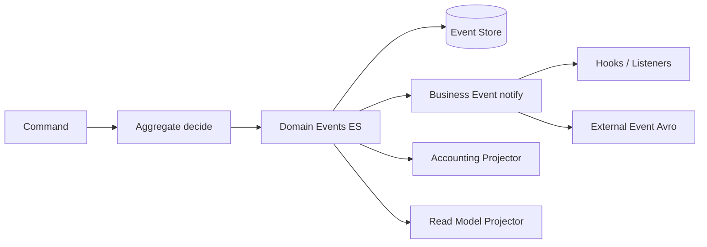

# 12. Event Catalog (Business Events → Domain/ES)

Complete catalog of the **concrete** `*BusinessEvent` types in the repo (as of code scan), mapped to bounded contexts, aggregate streams, and **ES target names** ([ADR-020](decisions/ADR-020-event-sourcing-writes-pflicht.md)).

Complements:

- strategic: [10 Domain Context Map](10_domain_context_map.md)
- tactical: [11 Aggregate Canvas](11_aggregate_canvas.md)
- DDD: [ADR-019](decisions/ADR-019-domain-driven-design.md)
- messaging/hooks: [06 Crosscutting](06_crosscutting_concepts.md)

**Status:** living inventory – update when new event classes are added (see [12.9 Required DB config](#129-required-external-event-configuration-in-the-db) and [12.10 Maintenance](#1210-maintenance-and-code-scan)).

---

## 12.1 Event taxonomy

| Layer | Role | Persistence / transport | Example |
|---------|--------|------------------------|---------|
| **Domain Event (ES target)** | Authoritative fact on the aggregate; append-only stream | Event store (write SoT) | `LoanRepaymentPosted` |
| **Business Event (as-is)** | Message after domain change (in-process) | `BusinessEventNotifierService` | `LoanTransactionMakeRepaymentPostBusinessEvent` |
| **External Event** | Downstream/partners (Kafka/JMS) | Avro + serializer, unless `NoExternalEvent` | `MessageV1` + `LoanTransactionDataV1` |
| **Internal Lifecycle Trigger** | State machine, no external product event | Enum in domain code | `LoanEvent.LOAN_DISBURSED` |
| **Pre-Event** | Hook *before* effect commit | often compensatable; **not** an ES fact | `…PreBusinessEvent` |
| **Post-Event / Fact** | After successful change | ES candidate / outbox | `…PostBusinessEvent` or `…BusinessEvent` |



### Column legend (tables)

| Column | Meaning |
|--------|-----------|
| **As-is TYPE** | `getType()` / `TYPE` constant of the Java class |
| **Phase** | `pre` = before effect; `post` = after commit effect; `fact` = simple fact event |
| **Aggregate/Stream** | ES stream assignment (target) |
| **ES target name** | Proposed domain event name (without `BusinessEvent` suffix); `—` = not in ES |
| **ES role** | Candidate vs. hook-only |
| **GL** | Typical journal relevance (heuristic) |
| **Ext** | Potentially externalisable; `no` = `NoExternalEvent` or similar; `yes*` = if external events are globally enabled and a serializer exists |

### Inventory overview (code scan)

| Area | Concrete TYPEs | Note |
|---------|---------------:|-----------|
| Loan Servicing | ~98 | largest catalog; many pre/post pairs |
| Working Capital Loan | 8 | own transaction events |
| Savings | 9 | thinner than loan |
| FD/RD Create | 2 | lifecycle incomplete as events |
| Client | 16 | lifecycle/staff/transfer wired (identifier/charge/family still open) |
| Group/Center | 2 | create only |
| Share | 3 | |
| Investor | 1 | Ownership Transfer |
| Accounting | 1 | `JournalEntryCreated` (`NoExternalEvent`) |
| Document | 2 | |
| Datatable | 3 | `NoExternalEvent` |
| COB locks | 2 | operational |
| LoanProduct | 1 | create only |
| Platform bulk | 1 | Envelope |
| **Concrete total** | **~149** | +13 client lifecycle/transfer events; plus abstract base classes |

---

## 12.2 Catalog by bounded context

### Client & Group (Party) — Client

_Concrete business event types: **16**_ (lifecycle + staff + transfer; serializer: `ClientBusinessEventSerializer` → Avro `ClientDataV1`)

| As-is TYPE (`getType`) | Phase | Aggregate/Stream | ES target name (proposal) | ES role | GL | Ext |
|---|:---:|---|---|---|:---:|:---:|
| `ClientCreateBusinessEvent` | fact | Client | `ClientCreated` | ES candidate | rare/no | yes* |
| `ClientActivateBusinessEvent` | fact | Client | `ClientActivated` | ES candidate | rare/no | yes* |
| `ClientUpdateBusinessEvent` | fact | Client | `ClientUpdated` | ES candidate | rare/no | yes* |
| `ClientCloseBusinessEvent` | fact | Client | `ClientClosed` | ES candidate | rare/no | yes* |
| `ClientRejectBusinessEvent` | fact | Client | `ClientRejected` | ES candidate | rare/no | yes* |
| `ClientWithdrawBusinessEvent` | fact | Client | `ClientWithdrawn` | ES candidate | rare/no | yes* |
| `ClientReactivateBusinessEvent` | fact | Client | `ClientReactivated` | ES candidate | rare/no | yes* |
| `ClientUndoRejectBusinessEvent` | fact | Client | `ClientRejectionUndone` | ES candidate | rare/no | yes* |
| `ClientUndoWithdrawBusinessEvent` | fact | Client | `ClientWithdrawalUndone` | ES candidate | rare/no | yes* |
| `ClientDeleteBusinessEvent` | fact | Client | `ClientDeleted` | ES candidate | rare/no | yes* |
| `ClientAssignStaffBusinessEvent` | fact | Client | `ClientStaffAssigned` | ES candidate | rare/no | yes* |
| `ClientUnassignStaffBusinessEvent` | fact | Client | `ClientStaffUnassigned` | ES candidate | rare/no | yes* |
| `ClientTransferProposeBusinessEvent` | fact | Client | `ClientTransferProposed` | ES candidate | rare/no | yes* |
| `ClientTransferAcceptBusinessEvent` | fact | Client | `ClientTransferAccepted` | ES candidate | rare/no | yes* |
| `ClientTransferRejectBusinessEvent` | fact | Client | `ClientTransferRejected` | ES candidate | rare/no | yes* |
| `ClientTransferWithdrawBusinessEvent` | fact | Client | `ClientTransferWithdrawn` | ES candidate | rare/no | yes* |

### Client & Group (Party) — Group/Center

_Concrete business event types: **2**_

| As-is TYPE (`getType`) | Phase | Aggregate/Stream | ES target name (proposal) | ES role | GL | Ext |
|---|:---:|---|---|---|:---:|:---:|
| `CentersCreateBusinessEvent` | fact | Group/Center | `CentersCreate` | ES candidate | rare/no | yes* |
| `GroupsCreateBusinessEvent` | fact | Group/Center | `GroupsCreate` | ES candidate | rare/no | yes* |

### Loan Servicing

_Concrete business event types: **98**_

#### lifecycle

| As-is TYPE (`getType`) | Phase | Aggregate/Stream | ES target name (proposal) | ES role | GL | Ext |
|---|:---:|---|---|---|:---:|:---:|
| `LoanApplicationModifiedBusinessEvent` | fact | Loan | `LoanApplicationModified` | ES candidate | no | yes* |
| `LoanApprovedAmountChangedBusinessEvent` | fact | Loan | `LoanApprovedAmountChanged` | ES candidate | no | yes* |
| `LoanApprovedBusinessEvent` | fact | Loan | `LoanApproved` | ES candidate | no | yes* |
| `LoanCloseBusinessEvent` | fact | Loan | `LoanClose` | ES candidate | no | yes* |
| `LoanCreatedBusinessEvent` | fact | Loan | `LoanCreated` | ES candidate | no | yes* |
| `LoanDisbursalBusinessEvent` | fact | Loan | `LoanDisbursal` | ES candidate | yes | yes* |
| `LoanRejectedBusinessEvent` | fact | Loan | `LoanRejected` | ES candidate | no | yes* |
| `LoanStatusChangedBusinessEvent` | fact | Loan | `LoanStatusChanged` | ES candidate | no | yes* |
| `LoanUndoApprovalBusinessEvent` | fact | Loan | `LoanUndoApproval` | ES candidate | no | yes* |
| `LoanUndoDisbursalBusinessEvent` | fact | Loan | `LoanUndoDisbursal` | ES candidate | yes | yes* |
| `LoanUndoLastDisbursalBusinessEvent` | fact | Loan | `LoanUndoLastDisbursal` | ES candidate | yes | yes* |
| `LoanUpdateDisbursementDataBusinessEvent` | fact | Loan | `LoanUpdateDisbursementData` | ES candidate | no | yes* |
| `LoanWithdrawnByApplicantBusinessEvent` | fact | Loan | `LoanWithdrawnByApplicant` | ES candidate | no | yes* |

#### transactions

| As-is TYPE (`getType`) | Phase | Aggregate/Stream | ES target name (proposal) | ES role | GL | Ext |
|---|:---:|---|---|---|:---:|:---:|
| `LoanAccrualAdjustmentTransactionBusinessEvent` | fact | Loan | `LoanAccrualAdjustmentTransaction` | ES candidate | yes | yes* |
| `LoanAccrualTransactionCreatedBusinessEvent` | fact | Loan | `LoanAccrualTransactionCreated` | ES candidate | yes | yes* |
| `LoanAdjustTransactionBusinessEvent` | fact | Loan | `LoanAdjustTransaction` | ES candidate | yes | yes* |
| `LoanBuyDownFeeAdjustmentTransactionCreatedBusinessEvent` | fact | Loan | `LoanBuyDownFeeAdjustmentTransactionCreated` | ES candidate | yes | yes* |
| `LoanBuyDownFeeAmortizationAdjustmentTransactionCreatedBusinessEvent` | fact | Loan | `LoanBuyDownFeeAmortizationAdjustmentTransactionCreated` | ES candidate | yes | yes* |
| `LoanBuyDownFeeAmortizationTransactionCreatedBusinessEvent` | fact | Loan | `LoanBuyDownFeeAmortizationTransactionCreated` | ES candidate | yes | yes* |
| `LoanBuyDownFeeTransactionCreatedBusinessEvent` | fact | Loan | `LoanBuyDownFeeTransactionCreated` | ES candidate | yes | yes* |
| `LoanCapitalizedIncomeAdjustmentTransactionCreatedBusinessEvent` | fact | Loan | `LoanCapitalizedIncomeAdjustmentTransactionCreated` | ES candidate | yes | yes* |
| `LoanCapitalizedIncomeAmortizationAdjustmentTransactionCreatedBusinessEvent` | fact | Loan | `LoanCapitalizedIncomeAmortizationAdjustmentTransactionCreated` | ES candidate | yes | yes* |
| `LoanCapitalizedIncomeAmortizationTransactionCreatedBusinessEvent` | fact | Loan | `LoanCapitalizedIncomeAmortizationTransactionCreated` | ES candidate | yes | yes* |
| `LoanCapitalizedIncomeTransactionCreatedBusinessEvent` | fact | Loan | `LoanCapitalizedIncomeTransactionCreated` | ES candidate | yes | yes* |
| `LoanCreditBalanceRefundPostBusinessEvent` | post | Loan | `LoanCreditBalanceRefund` | ES candidate (post = committed) | yes | yes* |
| `LoanCreditBalanceRefundPreBusinessEvent` | pre | Loan | `—` | hook-only (pre); no ES fact | no | yes* |
| `LoanDisbursalTransactionBusinessEvent` | fact | Loan | `LoanDisbursalTransaction` | ES candidate | yes | yes* |
| `LoanForeClosurePostBusinessEvent` | post | Loan | `LoanForeClosure` | ES candidate (post = committed) | yes | yes* |
| `LoanForeClosurePreBusinessEvent` | pre | Loan | `—` | hook-only (pre); no ES fact | no | yes* |
| `LoanRefundPostBusinessEvent` | post | Loan | `LoanRefund` | ES candidate (post = committed) | yes | yes* |
| `LoanRefundPreBusinessEvent` | pre | Loan | `—` | hook-only (pre); no ES fact | no | yes* |
| `LoanRepaymentDueBusinessEvent` | fact | Loan | `LoanRepaymentDue` | ES candidate | yes | yes* |
| `LoanRepaymentOverdueBusinessEvent` | fact | Loan | `LoanRepaymentOverdue` | ES candidate | yes | yes* |
| `LoanTransactionAccrualActivityPostBusinessEvent` | post | Loan | `LoanTransactionAccrualActivity` | ES candidate (post = committed) | yes | yes* |
| `LoanTransactionAccrualActivityPreBusinessEvent` | pre | Loan | `—` | hook-only (pre); no ES fact | no | yes* |
| `LoanTransactionContractTerminationPostBusinessEvent` | post | Loan | `LoanTransactionContractTermination` | ES candidate (post = committed) | yes | yes* |
| `LoanTransactionDownPaymentPostBusinessEvent` | post | Loan | `LoanTransactionDownPayment` | ES candidate (post = committed) | yes | yes* |
| `LoanTransactionDownPaymentPreBusinessEvent` | pre | Loan | `—` | hook-only (pre); no ES fact | no | yes* |
| `LoanTransactionGoodwillCreditPostBusinessEvent` | post | Loan | `LoanTransactionGoodwillCredit` | ES candidate (post = committed) | yes | yes* |
| `LoanTransactionGoodwillCreditPreBusinessEvent` | pre | Loan | `—` | hook-only (pre); no ES fact | no | yes* |
| `LoanTransactionInterestPaymentWaiverPostBusinessEvent` | post | Loan | `LoanTransactionInterestPaymentWaiver` | ES candidate (post = committed) | yes | yes* |
| `LoanTransactionInterestPaymentWaiverPreBusinessEvent` | pre | Loan | `—` | hook-only (pre); no ES fact | no | yes* |
| `LoanTransactionInterestRefundPostBusinessEvent` | post | Loan | `LoanTransactionInterestRefund` | ES candidate (post = committed) | yes | yes* |
| `LoanTransactionInterestRefundPreBusinessEvent` | pre | Loan | `—` | hook-only (pre); no ES fact | no | yes* |
| `LoanTransactionMakeRepaymentPostBusinessEvent` | post | Loan | `LoanTransactionMakeRepayment` | ES candidate (post = committed) | yes | yes* |
| `LoanTransactionMakeRepaymentPreBusinessEvent` | pre | Loan | `—` | hook-only (pre); no ES fact | no | yes* |
| `LoanTransactionMerchantIssuedRefundPostBusinessEvent` | post | Loan | `LoanTransactionMerchantIssuedRefund` | ES candidate (post = committed) | yes | yes* |
| `LoanTransactionMerchantIssuedRefundPreBusinessEvent` | pre | Loan | `—` | hook-only (pre); no ES fact | no | yes* |
| `LoanTransactionPayoutRefundPostBusinessEvent` | post | Loan | `LoanTransactionPayoutRefund` | ES candidate (post = committed) | yes | yes* |
| `LoanTransactionPayoutRefundPreBusinessEvent` | pre | Loan | `—` | hook-only (pre); no ES fact | no | yes* |
| `LoanTransactionRecoveryPaymentPostBusinessEvent` | post | Loan | `LoanTransactionRecoveryPayment` | ES candidate (post = committed) | yes | yes* |
| `LoanTransactionRecoveryPaymentPreBusinessEvent` | pre | Loan | `—` | hook-only (pre); no ES fact | no | yes* |
| `LoanUndoContractTerminationBusinessEvent` | fact | Loan | `LoanUndoContractTermination` | ES candidate | yes | yes* |
| `LoanWaiveInterestBusinessEvent` | fact | Loan | `LoanWaiveInterest` | ES candidate | yes | yes* |

#### charges

| As-is TYPE (`getType`) | Phase | Aggregate/Stream | ES target name (proposal) | ES role | GL | Ext |
|---|:---:|---|---|---|:---:|:---:|
| `LoanAddChargeBusinessEvent` | fact | Loan | `LoanAddCharge` | ES candidate | no | yes* |
| `LoanApplyOverdueChargeBusinessEvent` | fact | Loan | `LoanApplyOverdueCharge` | ES candidate | no | yes* |
| `LoanChargeAdjustmentPostBusinessEvent` | post | Loan | `LoanChargeAdjustment` | ES candidate (post = committed) | no | yes* |
| `LoanChargeAdjustmentPreBusinessEvent` | pre | Loan | `—` | hook-only (pre); no ES fact | no | yes* |
| `LoanChargeOffPostBusinessEvent` | post | Loan | `LoanChargeOff` | ES candidate (post = committed) | yes | yes* |
| `LoanChargeOffPreBusinessEvent` | pre | Loan | `—` | hook-only (pre); no ES fact | no | yes* |
| `LoanChargePaymentPostBusinessEvent` | post | Loan | `LoanChargePayment` | ES candidate (post = committed) | yes | yes* |
| `LoanChargePaymentPreBusinessEvent` | pre | Loan | `—` | hook-only (pre); no ES fact | no | yes* |
| `LoanChargeRefundBusinessEvent` | fact | Loan | `LoanChargeRefund` | ES candidate | yes | yes* |
| `LoanChargebackTransactionBusinessEvent` | fact | Loan | `LoanChargebackTransaction` | ES candidate | yes | yes* |
| `LoanDeleteChargeBusinessEvent` | fact | Loan | `LoanDeleteCharge` | ES candidate | no | yes* |
| `LoanUndoChargeOffBusinessEvent` | fact | Loan | `LoanUndoChargeOff` | ES candidate | yes | yes* |
| `LoanUpdateChargeBusinessEvent` | fact | Loan | `LoanUpdateCharge` | ES candidate | no | yes* |
| `LoanWaiveChargeBusinessEvent` | fact | Loan | `LoanWaiveCharge` | ES candidate | yes | yes* |
| `LoanWaiveChargeUndoBusinessEvent` | fact | Loan | `LoanWaiveChargeUndo` | ES candidate | yes | yes* |

#### schedule

| As-is TYPE (`getType`) | Phase | Aggregate/Stream | ES target name (proposal) | ES role | GL | Ext |
|---|:---:|---|---|---|:---:|:---:|
| `LoanCloseAsRescheduleBusinessEvent` | fact | Loan | `LoanCloseAsReschedule` | ES candidate | no | yes* |
| `LoanInterestRecalculationBusinessEvent` | fact | Loan | `LoanInterestRecalculation` | ES candidate | yes | yes* |
| `LoanReAgeBusinessEvent` | fact | Loan | `LoanReAge` | ES candidate | no | yes* |
| `LoanReAgeTransactionBusinessEvent` | fact | Loan | `LoanReAgeTransaction` | ES candidate | no | yes* |
| `LoanReAmortizeBusinessEvent` | fact | Loan | `LoanReAmortize` | ES candidate | no | yes* |
| `LoanReAmortizeTransactionBusinessEvent` | fact | Loan | `LoanReAmortizeTransaction` | ES candidate | no | yes* |
| `LoanRescheduledDueAdjustScheduleBusinessEvent` | fact | Loan | `LoanRescheduledDueAdjustSchedule` | ES candidate | no | yes* |
| `LoanRescheduledDueCalendarChangeBusinessEvent` | fact | Loan | `LoanRescheduledDueCalendarChange` | ES candidate | no | yes* |
| `LoanRescheduledDueHolidayBusinessEvent` | fact | Loan | `LoanRescheduledDueHoliday` | ES candidate | no | yes* |
| `LoanScheduleVariationsAddedBusinessEvent` | fact | Loan | `LoanScheduleVariationsAdded` | ES candidate | no | yes* |
| `LoanScheduleVariationsDeletedBusinessEvent` | fact | Loan | `LoanScheduleVariationsDeleted` | ES candidate | no | yes* |
| `LoanUndoReAgeBusinessEvent` | fact | Loan | `LoanUndoReAge` | ES candidate | no | yes* |
| `LoanUndoReAgeTransactionBusinessEvent` | fact | Loan | `LoanUndoReAgeTransaction` | ES candidate | no | yes* |
| `LoanUndoReAmortizeBusinessEvent` | fact | Loan | `LoanUndoReAmortize` | ES candidate | no | yes* |
| `LoanUndoReAmortizeTransactionBusinessEvent` | fact | Loan | `LoanUndoReAmortizeTransaction` | ES candidate | no | yes* |

#### transfer

| As-is TYPE (`getType`) | Phase | Aggregate/Stream | ES target name (proposal) | ES role | GL | Ext |
|---|:---:|---|---|---|:---:|:---:|
| `LoanAcceptTransferBusinessEvent` | fact | Loan | `LoanAcceptTransfer` | ES candidate | no | yes* |
| `LoanInitiateTransferBusinessEvent` | fact | Loan | `LoanInitiateTransfer` | ES candidate | no | yes* |
| `LoanRejectTransferBusinessEvent` | fact | Loan | `LoanRejectTransfer` | ES candidate | no | yes* |
| `LoanWithdrawTransferBusinessEvent` | fact | Loan | `LoanWithdrawTransfer` | ES candidate | no | yes* |

#### officer

| As-is TYPE (`getType`) | Phase | Aggregate/Stream | ES target name (proposal) | ES role | GL | Ext |
|---|:---:|---|---|---|:---:|:---:|
| `LoanReassignOfficerBusinessEvent` | fact | Loan | `LoanReassignOfficer` | ES candidate | no | yes* |
| `LoanRemoveOfficerBusinessEvent` | fact | Loan | `LoanRemoveOfficer` | ES candidate | no | yes* |

#### risk-snapshot

| As-is TYPE (`getType`) | Phase | Aggregate/Stream | ES target name (proposal) | ES role | GL | Ext |
|---|:---:|---|---|---|:---:|:---:|
| `LoanAccountCustomSnapshotBusinessEvent` | fact | Loan | `LoanAccountCustomSnapshot` | ES candidate | no | yes* |
| `LoanAccountDelinquencyPauseChangedBusinessEvent` | fact | Loan | `LoanAccountDelinquencyPauseChanged` | ES candidate | no | yes* |
| `LoanAccountSnapshotBusinessEvent` | fact | Loan | `LoanAccountSnapshot` | ES candidate | no | yes* |
| `LoanBalanceChangedBusinessEvent` | fact | Loan | `LoanBalanceChanged` | ES candidate | no | yes* |
| `LoanDelinquencyRangeChangeBusinessEvent` | fact | Loan | `LoanDelinquencyRangeChange` | ES candidate | no | yes* |

#### other

| As-is TYPE (`getType`) | Phase | Aggregate/Stream | ES target name (proposal) | ES role | GL | Ext |
|---|:---:|---|---|---|:---:|:---:|
| `LoanUndoWrittenOffBusinessEvent` | fact | Loan | `LoanUndoWrittenOff` | ES candidate | yes | yes* |
| `LoanWrittenOffPostBusinessEvent` | post | Loan | `LoanWrittenOff` | ES candidate (post = committed) | yes | yes* |
| `LoanWrittenOffPreBusinessEvent` | pre | Loan | `—` | hook-only (pre); no ES fact | no | yes* |

### Product Catalog — LoanProduct

_Concrete business event types: **1**_

| As-is TYPE (`getType`) | Phase | Aggregate/Stream | ES target name (proposal) | ES role | GL | Ext |
|---|:---:|---|---|---|:---:|:---:|
| `LoanProductCreateBusinessEvent` | fact | LoanProduct | `LoanProductCreate` | ES candidate | no | yes* |

### Loan Servicing — Working Capital

_Concrete business event types: **8**_

| As-is TYPE (`getType`) | Phase | Aggregate/Stream | ES target name (proposal) | ES role | GL | Ext |
|---|:---:|---|---|---|:---:|:---:|
| `WorkingCapitalLoanChargeAdjustmentPostBusinessEvent` | post | WorkingCapitalLoan / Loan | `WorkingCapitalLoanChargeAdjustment` | ES candidate (post = committed) | no | yes* |
| `WorkingCapitalLoanChargeAdjustmentPreBusinessEvent` | pre | WorkingCapitalLoan / Loan | `—` | hook-only (pre); no ES fact | no | yes* |
| `WorkingCapitalLoanCreditBalanceRefundTransactionBusinessEvent` | fact | WorkingCapitalLoan / Loan | `WorkingCapitalLoanCreditBalanceRefundTransaction` | ES candidate | yes | yes* |
| `WorkingCapitalLoanDisbursalTransactionBusinessEvent` | fact | WorkingCapitalLoan / Loan | `WorkingCapitalLoanDisbursalTransaction` | ES candidate | yes | yes* |
| `WorkingCapitalLoanDiscountFeeAdjustmentTransactionBusinessEvent` | fact | WorkingCapitalLoan / Loan | `WorkingCapitalLoanDiscountFeeAdjustmentTransaction` | ES candidate | no | yes* |
| `WorkingCapitalLoanDiscountFeeTransactionBusinessEvent` | fact | WorkingCapitalLoan / Loan | `WorkingCapitalLoanDiscountFeeTransaction` | ES candidate | no | yes* |
| `WorkingCapitalLoanRepaymentTransactionBusinessEvent` | fact | WorkingCapitalLoan / Loan | `WorkingCapitalLoanRepaymentTransaction` | ES candidate | yes | yes* |
| `WorkingCapitalLoanUndoDisbursalTransactionBusinessEvent` | fact | WorkingCapitalLoan / Loan | `WorkingCapitalLoanUndoDisbursalTransaction` | ES candidate | yes | yes* |

### Savings & Deposits — SavingsAccount

_Concrete business event types: **9**_

#### lifecycle

| As-is TYPE (`getType`) | Phase | Aggregate/Stream | ES target name (proposal) | ES role | GL | Ext |
|---|:---:|---|---|---|:---:|:---:|
| `SavingsActivateBusinessEvent` | fact | SavingsAccount | `SavingsActivate` | ES candidate | no | yes* |
| `SavingsApproveBusinessEvent` | fact | SavingsAccount | `SavingsApprove` | ES candidate | no | yes* |
| `SavingsCloseBusinessEvent` | fact | SavingsAccount | `SavingsClose` | ES candidate | no | yes* |
| `SavingsCreateBusinessEvent` | fact | SavingsAccount | `SavingsCreate` | ES candidate | no | yes* |
| `SavingsRejectBusinessEvent` | fact | SavingsAccount | `SavingsReject` | ES candidate | no | yes* |

#### transactions

| As-is TYPE (`getType`) | Phase | Aggregate/Stream | ES target name (proposal) | ES role | GL | Ext |
|---|:---:|---|---|---|:---:|:---:|
| `SavingsAccountForceWithdrawalBusinessEvent` | fact | SavingsAccount | `SavingsAccountForceWithdrawal` | ES candidate | yes | yes* |
| `SavingsDepositBusinessEvent` | fact | SavingsAccount | `SavingsDeposit` | ES candidate | yes | yes* |
| `SavingsWithdrawalBusinessEvent` | fact | SavingsAccount | `SavingsWithdrawal` | ES candidate | yes | yes* |

#### interest

| As-is TYPE (`getType`) | Phase | Aggregate/Stream | ES target name (proposal) | ES role | GL | Ext |
|---|:---:|---|---|---|:---:|:---:|
| `SavingsPostInterestBusinessEvent` | fact | SavingsAccount | `SavingsPostInterest` | ES candidate | yes | yes* |

### Savings & Deposits — FD/RD

_Concrete business event types: **2**_

| As-is TYPE (`getType`) | Phase | Aggregate/Stream | ES target name (proposal) | ES role | GL | Ext |
|---|:---:|---|---|---|:---:|:---:|
| `FixedDepositAccountCreateBusinessEvent` | fact | FixedDepositAccount | `FixedDepositAccountCreate` | ES candidate | yes | yes* |
| `RecurringDepositAccountCreateBusinessEvent` | fact | RecurringDepositAccount | `RecurringDepositAccountCreate` | ES candidate | yes | yes* |

### Share Accounts

_Concrete business event types: **3**_

| As-is TYPE (`getType`) | Phase | Aggregate/Stream | ES target name (proposal) | ES role | GL | Ext |
|---|:---:|---|---|---|:---:|:---:|
| `ShareAccountApproveBusinessEvent` | fact | ShareAccount/Product | `ShareAccountApprove` | ES candidate | no | yes* |
| `ShareAccountCreateBusinessEvent` | fact | ShareAccount/Product | `ShareAccountCreate` | ES candidate | no | yes* |
| `ShareProductDividentsCreateBusinessEvent` | fact | ShareAccount/Product | `ShareProductDividentsCreate` | ES candidate | no | yes* |

### Investor / Secondary Market

_Concrete business event types: **1**_

| As-is TYPE (`getType`) | Phase | Aggregate/Stream | ES target name (proposal) | ES role | GL | Ext |
|---|:---:|---|---|---|:---:|:---:|
| `LoanOwnershipTransferBusinessEvent` | fact | LoanOwnership | `LoanOwnershipTransfer` | ES candidate | no | yes* |

### Accounting (GL) — Projection events

_Concrete business event types: **1**_

| As-is TYPE (`getType`) | Phase | Aggregate/Stream | ES target name (proposal) | ES role | GL | Ext |
|---|:---:|---|---|---|:---:|:---:|
| `JournalEntryCreatedBusinessEvent` | fact | JournalEntry (projection) | `JournalEntryCreated` | Projection signal (not portfolio SoT) | yes | no |

### Document Management

_Concrete business event types: **2**_

| As-is TYPE (`getType`) | Phase | Aggregate/Stream | ES target name (proposal) | ES role | GL | Ext |
|---|:---:|---|---|---|:---:|:---:|
| `DocumentCreatedBusinessEvent` | fact | Document | `DocumentCreated` | ES candidate | rare/no | yes* |
| `DocumentDeletedBusinessEvent` | fact | Document | `DocumentDeleted` | ES candidate | rare/no | yes* |

### Platform — Datatables

_Concrete business event types: **3**_

| As-is TYPE (`getType`) | Phase | Aggregate/Stream | ES target name (proposal) | ES role | GL | Ext |
|---|:---:|---|---|---|:---:|:---:|
| `DatatableEntryCreatedBusinessEvent` | fact | DatatableEntry | `DatatableEntryCreated` | ES candidate | rare/no | no |
| `DatatableEntryDeletedBusinessEvent` | fact | DatatableEntry | `DatatableEntryDeleted` | ES candidate | rare/no | no |
| `DatatableEntryUpdatedBusinessEvent` | fact | DatatableEntry | `DatatableEntryUpdated` | ES candidate | rare/no | no |

### COB / Batch Operations

_Concrete business event types: **2**_

| As-is TYPE (`getType`) | Phase | Aggregate/Stream | ES target name (proposal) | ES role | GL | Ext |
|---|:---:|---|---|---|:---:|:---:|
| `LoanAccountsStayedLockedBusinessEvent` | fact | COB (ops) | `LoanAccountsStayedLocked` | ES candidate | rare/no | yes* |
| `SavingsAccountsStayedLockedBusinessEvent` | fact | COB (ops) | `SavingsAccountsStayedLocked` | ES candidate | rare/no | yes* |

### Platform

_Concrete business event types: **1**_

| As-is TYPE (`getType`) | Phase | Aggregate/Stream | ES target name (proposal) | ES role | GL | Ext |
|---|:---:|---|---|---|:---:|:---:|
| `BulkBusinessEvent` | fact | n/a (bulk envelope) | `Bulk` | ES candidate | no | yes* |

---

## 12.3 Internal loan lifecycle triggers (`LoanEvent`)

Not a business/external event, but input to `DefaultLoanLifecycleStateMachine`:

| `LoanEvent` | Typical status effect | Related business events (excerpt) |
|-------------|------------------------|-------------------------------------|
| `LOAN_CREATED` | → `SUBMITTED_AND_PENDING_APPROVAL` | `LoanCreatedBusinessEvent` |
| `LOAN_APPROVED` | Pending → `APPROVED` | `LoanApprovedBusinessEvent` |
| `LOAN_APPROVAL_UNDO` | Approved → Pending | `LoanUndoApprovalBusinessEvent` |
| `LOAN_REJECTED` | Pending → `REJECTED` | `LoanRejectedBusinessEvent` |
| `LOAN_WITHDRAWN` | Pending → `WITHDRAWN_BY_CLIENT` | `LoanWithdrawnByApplicantBusinessEvent` |
| `LOAN_DISBURSED` | Approved → `ACTIVE` | `LoanDisbursalBusinessEvent`, `LoanDisbursalTransactionBusinessEvent` |
| `LOAN_DISBURSAL_UNDO` / `_LAST` | Active → Approved | `LoanUndoDisbursal*BusinessEvent` |
| `LOAN_REPAYMENT_OR_WAIVER` / `REPAID_IN_FULL` | Active / Closed / Overpaid | `LoanTransactionMakeRepayment*`, `LoanStatusChanged` |
| `LOAN_OVERPAYMENT` | → `OVERPAID` | Status + balance events |
| `WRITE_OFF_OUTSTANDING` / `_UNDO` | → `CLOSED_WRITTEN_OFF` | `LoanWrittenOff*`, `LoanUndoWrittenOff` |
| `LOAN_RESCHEDULE` | → `CLOSED_RESCHEDULE_OUTSTANDING_AMOUNT` | `LoanCloseAsReschedule`, reschedule events |
| `LOAN_CHARGE_PAYMENT` / `LOAN_CHARGE_ADDED` / `LOAN_CHARGE_ADJUSTMENT` | often remain Active | Charge-* events |
| `LOAN_FORECLOSURE` | Close path | `LoanForeClosure*` |
| `LOAN_CREDIT_BALANCE_REFUND` | Overpaid → Closed | `LoanCreditBalanceRefund*` |
| `LOAN_CHARGEBACK` | among others Closed/Overpaid → Active | `LoanChargebackTransactionBusinessEvent` |
| `LOAN_INITIATE_TRANSFER` / `COMPLETE` / `REJECT` / `WITHDRAW` | Transfer status | `Loan*TransferBusinessEvent` |
| `LOAN_CONTRACT_TERMINATION` | Contract end | `LoanTransactionContractTermination*` |
| `LOAN_ADJUST_TRANSACTION` | Adjust | `LoanAdjustTransactionBusinessEvent` |
| `LOAN_REFUND` / `LOAN_RECOVERY_PAYMENT` / `LOAN_EDIT_MULTI_DISBURSE_DATE` / `INTERST_REBATE_OWED` / `LOAN_CLOSED` | various | related Tx/Close events |
| *(incidental)* | Status change in general | `LoanStatusChangedBusinessEvent` |

---

## 12.4 ES naming convention (target)

| Rule | Example |
|-------|----------|
| Past tense / fact | `LoanDisbursed`, not `DisburseLoan` |
| Aggregate prefix | `Client…`, `Loan…`, `Savings…` |
| No `BusinessEvent` / `Pre`/`Post` in stream name | `LoanRepaymentPosted` instead of `…MakeRepaymentPostBusinessEvent` |
| Pre-events **not** in the event store | post/fact only |
| Undo as own event | `LoanDisbursalUndone`, `LoanWriteOffUndone` |
| Schema version | `LoanRepaymentPostedV1` (Avro/upcaster) possible in parallel |
| Stream ID | `Loan-{id}`, `SavingsAccount-{id}`, `Client-{id}` |

**Mapping pattern as-is → ES**

| As-is pattern | ES pattern |
|------------|-----------|
| `XBusinessEvent` | `X` → ideally rename to past tense (`Xed`/`XPosted`) |
| `XPreBusinessEvent` | discard for ES; application hook |
| `XPostBusinessEvent` | `X` / `XPosted` as domain event |
| `LoanStatusChangedBusinessEvent` | often **derivable** from a more specific event; optional deduplicate |
| `LoanBalanceChangedBusinessEvent` | often projection/read signal, not primary SoT fact |
| Snapshots (`LoanAccountSnapshot*`) | **not** a domain event of truth; periodic/read aid |

---

## 12.5 Gap analysis (commands without business event)

### Client (upstream – lifecycle largely closed)

| Command group | As-is event | Status |
|----------------|-----------|--------|
| Create / Activate / Reject | `ClientCreate` / `Activate` / `Reject` | present |
| Update / Close / Withdraw / Reactivate | `ClientUpdate` / `Close` / `Withdraw` / `Reactivate` | **wired** |
| Undo Reject / Undo Withdraw | `ClientUndoReject` / `ClientUndoWithdraw` | **wired** |
| Delete (pending only) | `ClientDelete` | **wired** (before physical delete) |
| Assign / Unassign Staff | `ClientAssignStaff` / `ClientUnassignStaff` | **wired** |
| Transfer Propose/Accept/Reject/Withdraw | `ClientTransfer*` | **wired** |
| Identifier CRUD | **missing** | future sub-aggregate event |
| Family / Address | **missing** | optional |
| Client Charge / Pay / Waive | **missing** | optional / accounting-adjacent |

### Savings

| Topic | As-is | Gap |
|-------|-----|--------|
| Application undo / withdraw | Create/Approve/Reject/Activate/Close | Undo Approve, Withdraw Application, Modify |
| Holds / Blocks / SubStatus | — | `AmountHeld`, `Released`, `Blocked`, `CreditsBlocked`, … |
| Charges on account | — | Add/Pay/Waive/Inactivate |
| Transaction Adjustment | Deposit/Withdrawal/Force | `SavingsTransactionAdjusted` |
| FD/RD Lifecycle | only `*Create` | Approve, Activate, Mature, PrematureClose, Interest |
| GSIM | — | entire GSIM palette |

### Loan (relatively complete, residual gaps)

| Topic | Note |
|-------|---------|
| Pre/Post pairs | ES only Post; Pre remains hook |
| `LoanBalanceChanged` / Snapshots | question as domain SoT |
| GLIM-specific events | often via normal loan events + GLIM ID |
| Product Update/Delete | only `LoanProductCreate` |
| Fraud mark | check whether command only without event |

### Group / Share / Organisation

| Context | Gap |
|---------|--------|
| Group/Center | Update, Activate, Close, Membership |
| Share | Transactions, Close, Reject, … |
| Organisation (Office/Staff) | practically no business events in scan |

---

## 12.6 Avro / external payload (published language)

Payload schemas under `fineract-avro-schemas/src/main/avro/` – **not** 1:1 per business event TYPE, but reusable data containers:

| Domain folder | Typical schemas | Used by (serializer groups) |
|---------------|------------------|----------------------------------|
| `loan/v1` | `LoanAccountDataV1`, `LoanTransactionDataV1`, `LoanChargeDataV1`, `LoanChargeDeletedV1`, Delinquency/Schedule/Ownership, … | Loan* serializers |
| `savings/v1` | `SavingsAccountDataV1`, `SavingsAccountTransactionDataV1`, Locked, … | Savings* serializers |
| `fixeddeposit/v1`, `recurringdeposit/v1` | Account Data | FD/RD Create |
| `client/v1` | `ClientDataV1`, Timeline, Collateral | Client* |
| `group/v1` | `GroupGeneralDataV1`, Roles | Groups* |
| `share/v1` | Share Account/Product/Tx | Share* |
| `document/v1` | `DocumentDataV1` | Document* |
| `gl/v1` | `GLAccountDataV1` | (Journal often internal) |
| `workingcapitalloan/v1` | `WorkingCapitalLoanTransactionDataV1` | WC Tx |
| Envelope | `MessageV1`, `BulkMessage*` | all external events |

**ES note:** Avro DTOs are **integration/read-oriented**. Domain events in the store should be lean, versioned facts; Avro can remain projection/external.

---

## 12.7 `NoExternalEvent` / internal-only

| TYPE | Reason |
|------|--------|
| `DatatableEntryCreatedBusinessEvent` | `NoExternalEvent` |
| `DatatableEntryUpdatedBusinessEvent` | `NoExternalEvent` |
| `DatatableEntryDeletedBusinessEvent` | `NoExternalEvent` |
| `JournalEntryCreatedBusinessEvent` | typically internal (`LoanJournalEntryCreatedBusinessEvent` / Journal) – not intended as partner API |

All other TYPEs are **potentially** externalisable if external events are enabled and a serializer applies.

---

## 12.8 Priority for ES introduction

| Prio | Events first | Why |
|:----:|---------------|--------|
| 1 | Client lifecycle (Create/Activate/Close/… – **new**) | Upstream; guards for portfolio |
| 2 | Charge Catalog (greenfield, still thin in catalog) | Small ES pilot |
| 3 | Savings Create/Approve/Activate/Deposit/Withdrawal/Interest/Close | medium core |
| 4 | Loan Create/Approve/Disburse/Repayment/WriteOff/Close (+ Post-Tx) | Portfolio core |
| 5 | Loan Charges, Reschedule, Transfers | after core |
| 6 | WC, Investor, Share, COB ops | specialised |

**Rule:** One command produces **0..n domain events** in the store; business events can be mirrored 1:1 or projected from domain events (strangler: dual-publish).

---

## 12.9 Required: external event configuration in the DB

> **Every new concrete `*BusinessEvent` (that does not implement `NoExternalEvent`) must be registered in `m_external_event_configuration`** – otherwise the application does not start.

### Why

`ExternalEventConfigurationValidationService` scans at boot all classes that implement `BusinessEvent` (ClassGraph, source: `ExternalEventSourceService`). For every simple name an entry in `m_external_event_configuration` must exist:

```text
Configuration not found for external event <SimpleName>
→ BeanCreationException → App/Context does not start
→ Integration tests: waitForFineract timeout (Cargo/Tomcat up, app down)
```

Exception: `NoExternalEvent`, abstract base classes, interfaces, `BulkBusinessEvent`.

### What to ship in the same PR

| Step | Artifact |
|---------|----------|
| 1 | Java class `…BusinessEvent` with `TYPE` / `getType()` |
| 2 | **Liquibase** tenant changelog: `INSERT` into `m_external_event_configuration` (`type` = SimpleName, typically `enabled=false`) |
| 3 | Include in `fineract-provider/.../changelog-tenant.xml` (or module changelog) |
| 4 | Update unit-test lists if present (`ExternalEventConfigurationValidationServiceTest`) |
| 5 | Optional: serializer + Avro |
| 6 | Row in this catalog (ch. 12.2) |
| 7 | ES mapping (past tense, stream) when write SoT is affected |

### Liquibase pattern (example)

```xml
<changeSet author="fineract" id="…">
    <preConditions onFail="MARK_RAN">
        <sqlCheck expectedResult="0">
            SELECT COUNT(*) FROM m_external_event_configuration
            WHERE type = 'MyNewBusinessEvent'
        </sqlCheck>
    </preConditions>
    <insert tableName="m_external_event_configuration">
        <column name="type" value="MyNewBusinessEvent"/>
        <column name="enabled" valueBoolean="false"/>
    </insert>
</changeSet>
```

Reference: `parts/0242_add_client_lifecycle_external_event_configuration.xml` (client lifecycle events).

### Review checklist

- [ ] New event type has DB configuration (Liquibase)?  
- [ ] `enabled` set deliberately (default often `false` until consumer/serializer are ready)?  
- [ ] App start / `waitForFineract` or actuator health green after migrate?  
- [ ] Catalog and unit-test whitelist updated if needed?

---

## 12.10 Maintenance and code scan

When adding new event types: **first [12.9](#129-required-external-event-configuration-in-the-db)** (DB registration is mandatory, not optional).

1. Java class under `…/event/business/domain/…` with `TYPE`.  
2. **Liquibase `m_external_event_configuration`** (required, except `NoExternalEvent`).  
3. Row in this chapter (matching context/subsection).  
4. Optional serializer + Avro when external.  
5. ES mapping: past-tense name, stream, upcaster version.  
6. Extend `ExternalEventConfigurationValidationServiceTest` lists (if affected).

**Scan command (regenerate inventory):**

```bash
find . -path '*/src/main/java/*' -name '*BusinessEvent.java' ! -path '*/build/*' \
  | wc -l
# TYPE constants:
grep -R --include='*BusinessEvent.java' 'static final String TYPE' \
  fineract-*/src/main/java | wc -l
```

---

## 12.11 References

| Document | Role |
|----------|--------|
| [10 Context Map](10_domain_context_map.md) | Context boundaries |
| [11 Aggregate Canvas](11_aggregate_canvas.md) | Commands/invariants |
| [06.6 Events](06_crosscutting_concepts.md) | Transport, boot validation |
| [ADR-020](decisions/ADR-020-event-sourcing-writes-pflicht.md) | ES mandatory writes |
| [ADR-019](decisions/ADR-019-domain-driven-design.md) | Domain events |
| [ADR-012](decisions/ADR-012-messaging-fuer-verteilte-jobs-kafka-jms-optional.md) | Transport |
| Code | `BusinessEventNotifierService`, `ExternalEventConfigurationValidationService`, `m_external_event_configuration`, `fineract-avro-schemas` |

---

*Navigation:* [README](README.md) · [11 Aggregate Canvas](11_aggregate_canvas.md) · [10 Context Map](10_domain_context_map.md)
