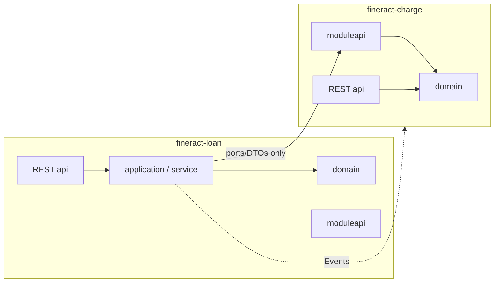

# 14. Module API Boundaries

Subprojects (Gradle domain modules) communicate **only via module APIs** – DDD bounded contexts + hexagon ports ([ADR-021](decisions/ADR-021-modul-kommunikation-nur-ueber-module-api.md)).

---

## 14.1 Problem

| Today | Risk |
|-------|--------|
| `fineract-loan` → `Charge` entity | tight coupling, difficult ES migration |
| `fineract-investor` → `Loan` entity | Investor knows loan internals |
| Accounting code in loan packages | Context leak |
| REST `api` mixed with domain | Adapter ≠ port |

---

## 14.2 Target picture



**Composition root** (`fineract-provider`) wires implementations; domain modules do not depend on foreign impls.

---

## 14.3 Package convention

| Slice | Package | Visibility |
|-------|---------|--------------|
| **Module API** | `org.apache.fineract.<area>.moduleapi` | **exported** to other modules |
| Domain | `...domain` | internal |
| Application | `...service`, `...handler` | internal (interfaces migrate stepwise into `moduleapi`) |
| REST | `...api` | Driving adapter – do not import from foreign domain modules |
| Data (transition) | `...data` | DTO; mid-term into `moduleapi` or read-model module |

Examples (scaffolds present):

- `org.apache.fineract.portfolio.loanaccount.moduleapi`
- `org.apache.fineract.portfolio.savings.moduleapi`
- `org.apache.fineract.portfolio.charge.moduleapi`
- `org.apache.fineract.accounting.moduleapi`
- `org.apache.fineract.portfolio.client.moduleapi`

---

## 14.4 What may live in `moduleapi`?

| Allowed | Not allowed |
|---------|----------------|
| Port interfaces (`ChargeLookupPort`, `ClientStatusGuard`) | JPA entities / `@Entity` |
| Commands/queries as typed interfaces | `*Repository` Spring Data |
| Stable DTOs / IDs / value objects | REST resources / Jersey |
| Event types of the published language (or reference) | Handler implementations |
| Exceptions of the public contract surface | EclipseLink/JPA types |

Implementations: `...service.impl` or adapter packages **in the same module**, bound to ports by Spring/OSGi.

---

## 14.5 ArchUnit enforcement

| Test class | Focus |
|------------|--------|
| [`BoundedContextEntityDependencyRulesTest`](../../fineract-architecture/src/test/java/org/apache/fineract/architecture/BoundedContextEntityDependencyRulesTest.java) | Domain-entity cross-imports |
| [`ModuleApiBoundaryRulesTest`](../../fineract-architecture/src/test/java/org/apache/fineract/architecture/ModuleApiBoundaryRulesTest.java) | Module slice must not use foreign **internals** |

```bash
./gradlew :fineract-architecture:test
```

Legacy violations: **freeze store**. New internal imports → build red. Reduce debt → store shrinks.

---

## 14.6 Migration playbook (per hotspot)

1. **Define port** in provider `moduleapi` (e.g. `ChargeDefinitionPort.findActiveCharge(id)`).  
2. **Adapter** in the provider module implements the port with existing domain code.  
3. **Consumer** (loan) switches to the port.  
4. ArchUnit freeze shrinks.  
5. Optional: move port interface into own module `moduleapi` when ownership is clear.  
6. **OSGi physical split** (later): `-api` / `-impl` / `-test` bundles and Service Registry registration — see [15](15_osgi_bundle_refactoring.md) and [ADR-022](decisions/ADR-022-osgi-api-impl-test-bundles-services.md). Module API ports become Export-Package + OSGi service interfaces; **not** Karaf Features.

---

## 14.7 provider vs. domain modules

| Module type | Rule |
|-----------|--------|
| **Domain modules** (loan, savings, accounting, …) | only foreign `moduleapi` (+ events, shared kernel) |
| **fineract-provider** | Composition root: may wire modules; new business logic still belongs in domain modules |
| **fineract-core** | **Shared kernel** as-is (`~802` types after leftover peels 1–30). Domain modules may import it (**one-way**). Core must not take `*-api` deps that cycle. **Not** a dump for **new** aggregates — those belong in domain `*-api` / `*-impl`. Do not peel remaining hub / fund-style residuals ([core slices — standing rule](15_osgi_bundle_refactoring_fineract-core-slices.md#standing-rule-fineract-core-is-the-shared-kernel)). |

---

## 14.8 References

- [ADR-021](decisions/ADR-021-modul-kommunikation-nur-ueber-module-api.md)  
- [ADR-022 OSGi api/impl/test + services](decisions/ADR-022-osgi-api-impl-test-bundles-services.md)  
- [15 OSGi Bundle Refactoring](15_osgi_bundle_refactoring.md)  
- [15o Core slices / shared-kernel standing rule](15_osgi_bundle_refactoring_fineract-core-slices.md)  
- [ADR-017 Hexagon](decisions/ADR-017-hexagonale-architektur.md)  
- [10 Context Map](10_domain_context_map.md)  
- [13 ArchUnit Entity Rules](13_archunit_bounded_context_rules.md)  

---

*Navigation:* [README](README.md) · [fineract-architecture](../../fineract-architecture/README.md)
