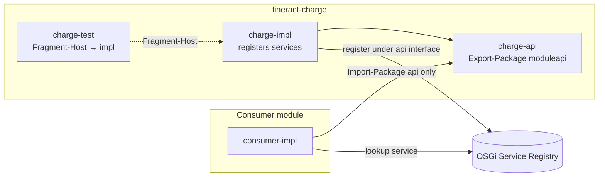
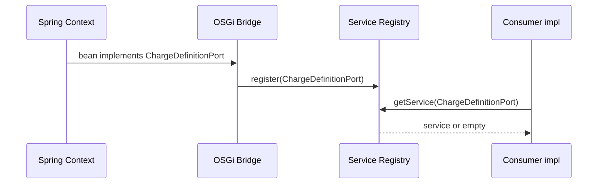

# 15. OSGi Bundle Refactoring (api / impl / test + Service Registry)

Stepwise refactoring of Gradle domain modules into **OSGi bundles**, with **OSGi services** as the only inter-bundle access path. Decision: [ADR-022](decisions/ADR-022-osgi-api-impl-test-bundles-services.md).

**Not in scope as integration technology:** Apache **Karaf Features** (or equivalent feature-install descriptors). Install sets may use Equinox layout/scripts only; they are not the module API.

---

## 15.1 Goals

| Goal | Meaning |
|------|---------|
| Subprojects are OSGi bundles | Each deployable unit has a proper manifest (`Bundle-SymbolicName`, versions, Import/Export) |
| api / impl / test split | Contracts, implementation, and tests are separate bundles/subprojects |
| Inter-bundle access via OSGi services | Service Registry under api interfaces; no foreign impl compile deps |
| Fragment-Host tests | Test fragments attach to the impl host |
| Keep Spring inside impl | Do **not** remove Spring before or as a prerequisite for this refactor |
| Stepwise | Pilot first; no big-bang rewrite of `fineract-provider` |

---

## 15.2 Target structure

```text
fineract-<name>/                    # optional parent / grouping
  fineract-<name>-api/              # OSGi interface bundle
  fineract-<name>-impl/             # OSGi implementation bundle
  fineract-<name>-test/             # OSGi fragment (tests)
```

Example (pilot candidates):

```text
fineract-charge-api/
fineract-charge-impl/
fineract-charge-test/

fineract-command/api/
fineract-command/impl/
fineract-command/test/              # Fragment-Host → command.impl (unit)
fineract-command-integrationtest/  # shared IT fixtures
```



---

## 15.3 Bundle responsibilities

### 15.3.1 Interface bundle (`-api`)

| Include | Exclude |
|---------|---------|
| Port interfaces (`..moduleapi..`) | JPA `@Entity`, repositories |
| Stable DTOs / value objects / IDs | Spring `@Configuration`, `@Service` |
| OSGi service interfaces (often same as ports) | REST resources (`..api..` historical HTTP) |
| Public contract exceptions | EclipseLink / Jersey / servlet types |

**OSGi:** `Export-Package` only these packages. Versioned carefully (semantic version of the contract).

### 15.3.2 Implementation bundle (`-impl`)

| Include | Notes |
|---------|--------|
| Domain, handlers, services | Module-internal |
| JPA / JDBC adapters | Driven adapters ([ADR-017](decisions/ADR-017-hexagonale-architektur.md)) |
| Spring Boot / Spring configuration | **Allowed** for local DI |
| Service registration | DS component or activator / bridge registers api interfaces |

**OSGi:** Import api packages; **do not** export internal packages for use by other domain modules. Other modules must use the Service Registry.

### 15.3.3 Test bundle (`-test`)

| Pattern | When |
|---------|------|
| **`Fragment-Host: <impl-bsn>`** | White-box tests needing host packages / Spring context of impl |
| Plain JUnit on `-api` | Pure contract tests with mocks only |

Manifest (illustrative):

```text
Bundle-SymbolicName: org.apache.fineract.charge.test
Fragment-Host: org.apache.fineract.charge.impl
```

Rules:

- One host per fragment (prefer impl).  
- Do not use fragments to smuggle production code.  
- Do not require exporting impl packages solely for tests.

---

## 15.4 Access rules (mandatory)

### Allowed between bundles

1. **OSGi services** – lookup of interfaces defined in `-api`  
2. **Exported api packages** – types of the public contract only  
3. **Domain / business events** – published language ([12 Event Catalog](12_event_catalog.md))  
4. **Shared kernel** – narrow types in `fineract-core` ([ADR-021](decisions/ADR-021-modul-kommunikation-nur-ueber-module-api.md))

### Forbidden between domain bundles

| Forbidden | Why |
|-----------|-----|
| Compile dependency on foreign `-impl` | Breaks replaceability and OSGi isolation |
| `@Autowired` of foreign impl types across modules | Spring is not the inter-bundle bus |
| Import of foreign `..domain..` entities | ADR-021 / ArchUnit |
| Call foreign REST resources as module API | Driving adapter ≠ port |
| **Karaf Features** as the contract between modules | Deploy packaging ≠ service contract ([ADR-022](decisions/ADR-022-osgi-api-impl-test-bundles-services.md)) |

### Spring placement

| Location | Spring? |
|----------|---------|
| `-api` | **No** |
| `-impl` (local wiring) | **Yes** |
| Cross-bundle | **No** — OSGi Service Registry |
| Composition root bridge | Yes (thin Spring↔OSGi adapter) |

**Do not remove Spring before OSGi.** Spring remains the DI foundation inside impl and provider ([ADR-003](decisions/ADR-003-spring-boot-gradle-module-als-kern-beibehalten.md)). Optional later shrink of Spring applies only to pure extension bundles, never as a global first step.

---

## 15.5 Spring↔OSGi bridge

Place a small bridge in the composition root (`fineract-provider` or dedicated `fineract-osgi-bridge`):

| Direction | Behavior |
|-----------|----------|
| Spring → OSGi | Register selected Spring beans under **api** interfaces in the Service Registry |
| OSGi → Spring | Optional beans / ObjectFactory that resolve services via tracker; missing → null / no-op policy |
| Lifecycle | Register on start; unregister on stop; no hard fail if optional extension missing |



---

## 15.6 Evolution stages

| Stage | Name | Deliverables | Exit criteria |
|-------|------|--------------|---------------|
| **B0** | Guardrails | `moduleapi` ports, ArchUnit freeze ([14](14_module_api_boundaries.md)) | New cross-module features only via Module API |
| **B1** | Bundle tooling | bnd (or equivalent), naming, Export-Package whitelist, Equinox install smoke | Pilot module builds as bundle JAR |
| **B2** | Pilot split | One module → `-api` / `-impl` / `-test` + Fragment-Host | Pilot tests green; no foreign impl deps for pilot consumers |
| **B3** | Bridge | Spring↔OSGi registration for pilot ports | Service visible in Equinox; optional unbind degrades cleanly |
| **B4** | OSGi-only consumers | Domain consumers use service (or bridge façade), not impl project | ArchUnit / Gradle checks block foreign `-impl` |
| **B5** | Rollout | Further modules by coupling (small → large) | Freeze store shrinks; more services registered |
| **B6** | Optional polish | DS-only for pure extensions; tighten exports | Core banking still Spring-in-impl |

### Suggested pilot order

1. **`fineract-command`** (clear interfaces / small surface) — **detailed plan (as-built under `fineract-command/{api,impl}`):** [15_osgi_bundle_refactoring_fineract-command.md](15_osgi_bundle_refactoring_fineract-command.md)  
2. rates, tax, validation / `fineract-charge`  
3. branch, document  
4. savings, accounting  
5. loan / progressive / working-capital (highest coupling)

Per module: complete **Module API ports first** ([14.6](14_module_api_boundaries.md)), then physical api/impl split.

---

## 15.7 Migration playbook (single module)

1. **Inventory** public types used by other modules; move or create ports in `moduleapi`.  
2. **Create** `-api` project; move interfaces + stable DTOs only.  
3. **Rename/split** remaining code into `-impl`; keep Spring config there.  
4. **Wire** Gradle: other domain modules depend on `-api` only; provider may runtime-include `-impl`.  
5. **Register** OSGi service(s) for each public port (DS or bridge).  
6. **Create** `-test` with `Fragment-Host` = impl; migrate unit tests.  
7. **Switch consumers** from direct types / Spring of foreign impl to port + service lookup (or bridge).  
8. **Shrink** ArchUnit freeze entries for that module.  
9. **Document** Bundle-SymbolicName and exported packages in module README if present.

---

## 15.8 Naming conventions (recommended)

| Item | Convention |
|------|------------|
| Gradle project | `fineract-<name>-api` / `-impl` / `-test` |
| Bundle-SymbolicName | `org.apache.fineract.<name>.api` / `.impl` / `.test` |
| Export packages | `org.apache.fineract…moduleapi` (+ explicit contract packages) |
| Service interface | Prefer the Module API port type itself |

Exact symbolic names may be refined in B1 tooling; keep them stable once published.

---

## 15.9 Relation to existing architecture

| Artifact | Relation |
|----------|----------|
| [ADR-002](decisions/ADR-002-osgi-equinox-fuer-laufzeitmodularitaet.md) | Equinox + optional services |
| [ADR-003](decisions/ADR-003-spring-boot-gradle-module-als-kern-beibehalten.md) | Spring stays in core / impl |
| [ADR-017](decisions/ADR-017-hexagonale-architektur.md) | OSGi = pluggable adapters; stage E4 |
| [ADR-021](decisions/ADR-021-modul-kommunikation-nur-ueber-module-api.md) | Module API = export surface |
| [ADR-022](decisions/ADR-022-osgi-api-impl-test-bundles-services.md) | This refactor’s decision |
| [06.7 OSGi](06_crosscutting_concepts.md) | Runtime mechanism |
| [04.4 Bundle lifecycle](04_runtime_view.md) | Start/stop/bind sequences |
| [`osgi/`](../../osgi/README.md) | Equinox scaffold |

---

## 15.10 Checklist (PR / module review)

- [ ] No new dependency on foreign `-impl` from a domain module  
- [ ] Public types live in `-api` / `moduleapi`  
- [ ] Impl registers OSGi service under api interface (or bridge does)  
- [ ] `-api` has no Spring / JPA / REST types  
- [ ] Tests: Fragment-Host on impl **or** pure api contract tests  
- [ ] Optional service missing → documented degradation path  
- [ ] No Karaf Feature descriptor introduced as module contract  
- [ ] ArchUnit freeze only shrinks or stays equal (no new frozen internal imports)

---

*Navigation:* [README](README.md) · [ADR-022](decisions/ADR-022-osgi-api-impl-test-bundles-services.md) · [14 Module API](14_module_api_boundaries.md)
