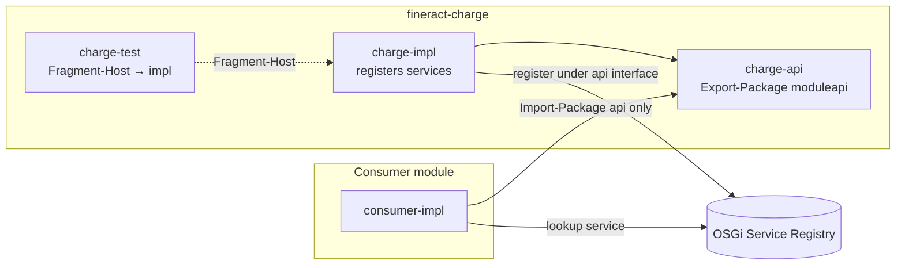
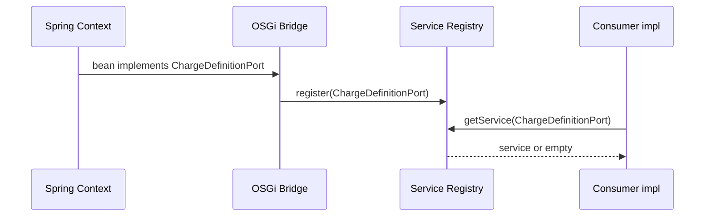

# 15. OSGi Bundle Refactoring (api / impl / test + Service Registry)

Stepwise refactoring of Gradle domain modules into **OSGi bundles**, with **OSGi services** as the only inter-bundle access path. Decision: [ADR-022](decisions/ADR-022-osgi-api-impl-test-bundles-services.md).

**Not in scope as integration technology:** Apache **Karaf Features** (or equivalent feature-install descriptors). Install sets may use Equinox layout/scripts only; they are not the module API.

---

## 15.1 Goals

| Goal | Meaning |
|------|---------|
| Subprojects are OSGi bundles | Each deployable unit has a proper manifest (`Bundle-SymbolicName`, versions, Import/Export) |
| api / impl / test split | Contracts, implementation, and tests are separate bundles/subprojects |
| Inter-bundle access via OSGi services | Service Registry under api interfaces; no foreign impl compile deps |
| Fragment-Host tests | Test fragments attach to the impl host |
| Keep Spring inside impl | Do **not** remove Spring before or as a prerequisite for this refactor |
| Stepwise | Pilot first; no big-bang rewrite of `fineract-provider` |

---

## 15.2 Target structure

```text
fineract-<name>/                    # optional parent / grouping
  fineract-<name>-api/              # OSGi interface bundle
  fineract-<name>-impl/             # OSGi implementation bundle
  fineract-<name>-test/             # OSGi fragment (tests)
```

Example (pilot candidates):

```text
fineract-charge-api/
fineract-charge-impl/
fineract-charge-test/

fineract-command/api/
fineract-command/impl/
fineract-command/test/              # Fragment-Host → command.impl (unit)
fineract-command-integrationtest/  # shared IT fixtures
```



---

## 15.3 Bundle responsibilities

### 15.3.1 Interface bundle (`-api`)

| Include | Exclude |
|---------|---------|
| Port interfaces (`..moduleapi..`) | JPA `@Entity`, repositories |
| Stable DTOs / value objects / IDs | Spring `@Configuration`, `@Service` |
| OSGi service interfaces (often same as ports) | REST resources (`..api..` historical HTTP) |
| Public contract exceptions | EclipseLink / Jersey / servlet types |

**OSGi:** `Export-Package` only these packages. Versioned carefully (semantic version of the contract).

### 15.3.2 Implementation bundle (`-impl`)

| Include | Notes |
|---------|--------|
| Domain, handlers, services | Module-internal |
| JPA / JDBC adapters | Driven adapters ([ADR-017](decisions/ADR-017-hexagonale-architektur.md)) |
| Spring Boot / Spring configuration | **Allowed** for local DI |
| Service registration | DS component or activator / bridge registers api interfaces |

**OSGi:** Import api packages; **do not** export internal packages for use by other domain modules. Other modules must use the Service Registry.

### 15.3.3 Test bundle (`-test`)

| Pattern | When |
|---------|------|
| **`Fragment-Host: <impl-bsn>`** | White-box tests needing host packages / Spring context of impl |
| Plain JUnit on `-api` | Pure contract tests with mocks only |

Manifest (illustrative):

```text
Bundle-SymbolicName: org.apache.fineract.charge.test
Fragment-Host: org.apache.fineract.charge.impl
```

Rules:

- One host per fragment (prefer impl).  
- Do not use fragments to smuggle production code.  
- Do not require exporting impl packages solely for tests.

---

## 15.4 Access rules (mandatory)

### Allowed between bundles

1. **OSGi services** – lookup of interfaces defined in `-api`  
2. **Exported api packages** – types of the public contract only  
3. **Domain / business events** – published language ([12 Event Catalog](12_event_catalog.md))  
4. **Shared kernel** – `fineract-core` as-is ([ADR-021](decisions/ADR-021-modul-kommunikation-nur-ueber-module-api.md), [core slices standing rule](15_osgi_bundle_refactoring_fineract-core-slices.md#standing-rule-fineract-core-is-the-shared-kernel))

### Forbidden between domain bundles

| Forbidden | Why |
|-----------|-----|
| Compile dependency on foreign `-impl` | Breaks replaceability and OSGi isolation |
| `@Autowired` of foreign impl types across modules | Spring is not the inter-bundle bus |
| Import of foreign `..domain..` entities | ADR-021 / ArchUnit |
| Call foreign REST resources as module API | Driving adapter ≠ port |
| **Karaf Features** as the contract between modules | Deploy packaging ≠ service contract ([ADR-022](decisions/ADR-022-osgi-api-impl-test-bundles-services.md)) |

### Spring placement

| Location | Spring? |
|----------|---------|
| `-api` | **No** |
| `-impl` (local wiring) | **Yes** |
| Cross-bundle | **No** — OSGi Service Registry |
| Composition root bridge | Yes (thin Spring↔OSGi adapter) |

**Do not remove Spring before OSGi.** Spring remains the DI foundation inside impl and provider ([ADR-003](decisions/ADR-003-spring-boot-gradle-module-als-kern-beibehalten.md)). Optional later shrink of Spring applies only to pure extension bundles, never as a global first step.

---

## 15.5 Spring↔OSGi bridge

Place a small bridge in the composition root (`fineract-provider` or dedicated `fineract-osgi-bridge`):

| Direction | Behavior |
|-----------|----------|
| Spring → OSGi | Register selected Spring beans under **api** interfaces in the Service Registry |
| OSGi → Spring | Optional beans / ObjectFactory that resolve services via tracker; missing → null / no-op policy |
| Lifecycle | Register on start; unregister on stop; no hard fail if optional extension missing |



---

## 15.6 Evolution stages

| Stage | Name | Deliverables | Exit criteria |
|-------|------|--------------|---------------|
| **B0** | Guardrails | `moduleapi` ports, ArchUnit freeze ([14](14_module_api_boundaries.md)) | New cross-module features only via Module API |
| **B1** | Bundle tooling | bnd (or equivalent), naming, Export-Package whitelist, Equinox install smoke | Pilot module builds as bundle JAR |
| **B2** | Pilot split | One module → `-api` / `-impl` / `-test` + Fragment-Host | Pilot tests green; no foreign impl deps for pilot consumers |
| **B3** | Bridge | Spring↔OSGi registration for pilot ports | Service visible in Equinox; optional unbind degrades cleanly |
| **B4** | OSGi-only consumers | Domain consumers use service (or bridge façade), not impl project | ArchUnit / Gradle checks block foreign `-impl` |
| **B5** | Rollout | Further modules by coupling (small → large) | Freeze store shrinks; more services registered |
| **B6** | Optional polish | DS-only for pure extensions; tighten exports | Core banking still Spring-in-impl |

### Suggested rollout order (post–command pilot)

**B2 pilot status:** `fineract-command` is the completed pilot (api / impl / test fragment + integrationtest fixtures). As-built plan: [15_osgi_bundle_refactoring_fineract-command.md](15_osgi_bundle_refactoring_fineract-command.md).

**Wave 1 status:** **complete** (charge, rates, tax).
- **charge** — **complete** (api/impl/test; façade removed; chargeId/port retargets; domain consumers **charge-api only**). Plan: [15_osgi_bundle_refactoring_fineract-charge.md](15_osgi_bundle_refactoring_fineract-charge.md).
- **rates** — **complete** (api/impl/test + `FloatingRatePort`; loan **rates-api only** via `floatingRateId`). Plan: [15_osgi_bundle_refactoring_fineract-rates.md](15_osgi_bundle_refactoring_fineract-rates.md).
- **tax** — **complete** (api/impl/test + ports; charge/loan/savings **tax-api only** via catalog ids). Plan: [15_osgi_bundle_refactoring_fineract-tax.md](15_osgi_bundle_refactoring_fineract-tax.md).

Further modules follow the same recipe, ordered by **port clarity**, **size**, **reverse dependency cost**, and **hexagonal value** (replaceable adapters as OSGi services). Metrics below are approximate main-source scale (order of magnitude); re-measure before a PR series.

#### Selection criteria

| Criterion | Why it matters |
|-----------|----------------|
| **Clear ports** | Interfaces / read-write services already exist → easy `-api` |
| **Small surface** | Prefer ≲ ~100 main classes for the next 1–2 modules |
| **Few JPA aggregates** | Less entity leakage into the contract |
| **Bounded reverse deps** | Consumers can switch to `-api` without a monorepo-wide rewrite |
| **Hexagonal fit** | Driven adapters already swappable (storage, messaging) |
| **Value of OSGi service** | Optional / replaceable impl is a real benefit |
| **Not composition root** | Leave `fineract-provider` and most of `fineract-core` last |

Per module: complete **Module API ports first** ([14.6](14_module_api_boundaries.md)), then physical api/impl/test split.

#### Wave 1 — complete (command-sized)

| Rank | Module | ~main scale | Status | Typical `-api` surface |
|------|--------|-------------|--------|------------------------|
| **1** | **`fineract-charge`** | ~40 | **Complete** — api/impl/test; chargeId/port retargets; façade **removed**; ArchUnit charge freeze green. [charge plan](15_osgi_bundle_refactoring_fineract-charge.md) | `ChargeDefinitionPort`; composition roots use api+impl |
| **2** | **`fineract-rates`** | ~20 | **Complete** — api/impl/test + `FloatingRatePort`; loan rates-api only. [rates plan](15_osgi_bundle_refactoring_fineract-rates.md) | `FloatingRatePort` + DTOs / service interfaces |
| **3** | **`fineract-tax`** | ~30 | **Complete** — api/impl/test + ports; charge/loan/savings tax-api only. [tax plan](15_osgi_bundle_refactoring_fineract-tax.md) | `TaxCatalogPort` + `ChargeTaxApplicationService` |

Suggested directory layout (mirror command):

```text
fineract-charge/
  api/   → :fineract-charge-api      BSN org.apache.fineract.charge.api
  impl/  → :fineract-charge-impl     BSN org.apache.fineract.charge.impl  (Spring stays here)
  test/  → :fineract-charge-test     Fragment-Host → charge.impl
```

Optional `fineract-<name>-integrationtest` only if several modules need shared fixtures (command needed it; charge may not).

#### Wave 2 — strong hexagonal, medium size

| Rank | Module | ~main scale | Why | Caveat |
|------|--------|-------------|-----|--------|
| **4** | **`fineract-document`** | ~85 | **Complete** — api/impl/test + `ContentStoreService` / `ContentStreamPort`; provider on ports. [document plan](15_osgi_bundle_refactoring_fineract-document.md) | Do not leak servlet/AWS types into `-api` |
| **5** | **`fineract-branch`** | ~50 | **Complete** — api/impl/test + teller ports + `CashierTxnValidationPort`; residual closed. [branch plan](15_osgi_bundle_refactoring_fineract-branch.md) | Less “optional extension” value than charge/document |
| **6** | **`fineract-loan-origination`** | ~60 | **Complete** — api/impl/test; `LoanOriginatorData` on api; loan/WC api-only. [loan-origination plan](15_osgi_bundle_refactoring_fineract-loan-origination.md) | Impl still couples to loan/WC entities for attach/detach |
| **7** | **`fineract-mix`** | ~35 | **Complete** — api/impl/test; provider composition root. [mix plan](15_osgi_bundle_refactoring_fineract-mix.md) | Niche XBRL; residual domain export for JDBC scan |

#### Wave 3 — full domain BCs (after Module API hardening)

| Rank | Module | ~main scale | Why wait |
|------|--------|-------------|----------|
| **8** | **`fineract-investor`** | ~100 | **Complete** — api/impl/test; pure ports + DTO residual journal. [investor plan](15_osgi_bundle_refactoring_fineract-investor.md) |
| **9** | **`fineract-accounting`** | ~150 | **Complete** — api/impl/test; entity residual for loan/journal consumers. [accounting plan](15_osgi_bundle_refactoring_fineract-accounting.md) |
| **10** | **`fineract-savings`** | ~180 | **Complete** — api/impl/test; provider entity residual. [savings plan](15_osgi_bundle_refactoring_fineract-savings.md) |

#### Wave 4 — last (high coupling / composition)

| Module | ~main scale | Verdict |
|--------|-------------|---------|
| **`fineract-loan`** | ~700 | **Complete** — api/impl/test; entity residual. [loan plan](15_osgi_bundle_refactoring_fineract-loan.md) |
| **`fineract-progressive-loan`** | ~95 | **Complete** — api/impl/test; schedule residual. [progressive plan](15_osgi_bundle_refactoring_fineract-progressive-loan.md) |
| **`fineract-working-capital-loan`** | ~340 | **Complete** — api/impl/test; entity residual. [WC plan](15_osgi_bundle_refactoring_fineract-working-capital-loan.md) |
| **`fineract-cob`** | ~65 | **Complete** — api/impl/test; entity-typed step residual. [cob plan](15_osgi_bundle_refactoring_fineract-cob.md) |
| **`fineract-security`** | ~70 | **Complete** — api/impl/test; Spring Security residual. [security plan](15_osgi_bundle_refactoring_fineract-security.md) |
| **`fineract-core`** | ~802 | **Shared kernel** — **do not** full api/impl; leftover peels 1–30 closed; remaining types stay ([core slices](15_osgi_bundle_refactoring_fineract-core-slices.md)) |
| **`fineract-provider`** | ~2500 | Composition root — hosts the Spring↔OSGi bridge; **never** the next pilot |

#### Explicit non-candidates (for OSGi BC split)

| Module | Reason |
|--------|--------|
| **`fineract-validation`** | Tiny utility / shared-kernel-ish — keep as library |
| **`fineract-architecture`** | ArchUnit rules only |
| **`fineract-report`** | Thin reporting glue |
| **command satellites** (jdbc / async / disruptor / audit) | Already modular; command Step 8 **closed** (no façade; consumers on api / api+impl) |

#### Quick decision matrix

```text
Wave 1 done             → charge, rates, tax     ★★★ complete
Wave 2 complete         → document, branch, loan-origination, mix  ★★★
Wave 3 complete         → investor, accounting, savings  ★★★
Wave 4 complete         → loan + progressive + WC + cob + security ★★★
Core slices complete    → businessdate, codes, organisation
                          (office/staff/holiday/workingdays/provisioning),
                          monetary admin, security residual  ★★★
Provider residual       → boot + ApiVerificationTest + resources only  ★★★
Shared kernel           → core, validation         don't force BC split
```

#### After waves + core slices — status

Domain peels (waves 1–4, core slices, and residual hardening of provider Java/tests) are **closed** for the composition root. Provider is no longer a domain dump; it is the Spring Boot entrypoint.

| Priority | Action |
|----------|--------|
| **Stabilize** | Keep ArchUnit freeze store shrinking; refresh module READMEs when manifests change |
| **Optional deferred domain work** | Not leftover provider Java. Not leftover core peels. `fineract-core` **is** the shared kernel ([standing rule](15_osgi_bundle_refactoring_fineract-core-slices.md#standing-rule-fineract-core-is-the-shared-kernel)). Leftover close-ins 1–30 closed. |
| **Composition-root floor (done)** | See [15.6.1](#1561-composition-root-floor-provider) |
| **Do not start** | full provider / whole-core api/impl; moving Liquibase master chain or boot classes “just because” |

##### 15.6.1 Composition-root floor (provider)

**Closed residual-hardening stream** (production peels + leftover tests/cucumber next to already-moved production). Historical peel ledger lived in this table cell and was replaced by the floor below after commit series through `4ae4b95ca6`.

| Kind | Remaining on `fineract-provider` | Peel? |
|------|----------------------------------|-------|
| **Production Java** | `ServerApplication`, `FineractWebApplicationConfiguration`, `FineractLiquibaseOnlyApplicationConfiguration` | **No** — Spring Boot composition root |
| **Tests** | `ApiVerificationTest` (ClassGraph scan of `@Path` types on the full composition-root classpath) + test `logback.xml` | **No** — inventory of the assembled app |
| **Resources** | Tenant Liquibase master chain (`db/changelog/**`), `application*.properties`, messages, ESAPI/validation, static legacy docs, sample SQL | **No** — not a cycle-safe api/impl/test peel |

**Leftover-test stream (closed):** unit tests and cucumber for already-moved production were relocated to dest `*-test` / core; Spring `TestConfiguration` / `AbstractSpringTest` / `TestSuite` harness removed from provider; command cucumber thinned to core; `ApiVerificationTest` thinned off Spring.

**Sensible follow-ons (not more provider Java peels):**

1. **Provider hygiene (done for cucumber)** — dead cucumber plugin/`check.dependsOn('cucumber')`, cucumber test deps, and leftover testcontainers/suite-only test deps removed; provider tests are ClassGraph inventory only.
2. **ArchUnit** — shrink freeze store entries for closed modules.
3. **OSGi hardening** — manifests, Fragment-Host, Equinox resolve for already-split api/impl/test modules. Catalog of BSN + registrar: [`osgi/README.md`](../../osgi/README.md).
4. **Core residual inventory (done)** — leftover close-ins 1–30 closed; remaining `~802` types **are** the shared kernel. See [core slices standing rule](15_osgi_bundle_refactoring_fineract-core-slices.md#standing-rule-fineract-core-is-the-shared-kernel). Do not peel further leftovers.


---

## 15.7 Migration playbook (single module)

1. **Inventory** public types used by other modules; move or create ports in `moduleapi`.  
2. **Create** `-api` project; move interfaces + stable DTOs only.  
3. **Rename/split** remaining code into `-impl`; keep Spring config there.  
4. **Wire** Gradle: other domain modules depend on `-api` only; provider may runtime-include `-impl`.  
5. **Register** OSGi service(s) for each public port (DS or bridge).  
6. **Create** `-test` with `Fragment-Host` = impl; migrate unit tests.  
7. **Switch consumers** from direct types / Spring of foreign impl to port + service lookup (or bridge).  
8. **Shrink** ArchUnit freeze entries for that module.  
9. **Document** Bundle-SymbolicName and exported packages in module README if present.

---

## 15.8 Naming conventions (recommended)

| Item | Convention |
|------|------------|
| Gradle project | `fineract-<name>-api` / `-impl` / `-test` |
| Bundle-SymbolicName | `org.apache.fineract.<name>.api` / `.impl` / `.test` |
| Export packages | `org.apache.fineract…moduleapi` (+ explicit contract packages) |
| Service interface | Prefer the Module API port type itself |

Exact symbolic names may be refined in B1 tooling; keep them stable once published.

---

## 15.9 Relation to existing architecture

| Artifact | Relation |
|----------|----------|
| [ADR-002](decisions/ADR-002-osgi-equinox-fuer-laufzeitmodularitaet.md) | Equinox + optional services |
| [ADR-003](decisions/ADR-003-spring-boot-gradle-module-als-kern-beibehalten.md) | Spring stays in core / impl |
| [ADR-017](decisions/ADR-017-hexagonale-architektur.md) | OSGi = pluggable adapters; stage E4 |
| [ADR-021](decisions/ADR-021-modul-kommunikation-nur-ueber-module-api.md) | Module API = export surface |
| [ADR-022](decisions/ADR-022-osgi-api-impl-test-bundles-services.md) | This refactor’s decision |
| [06.7 OSGi](06_crosscutting_concepts.md) | Runtime mechanism |
| [04.4 Bundle lifecycle](04_runtime_view.md) | Start/stop/bind sequences |
| [`osgi/`](../../osgi/README.md) | Equinox scaffold |

---

## 15.10 Checklist (PR / module review)

- [ ] No new dependency on foreign `-impl` from a domain module  
- [ ] Public types live in `-api` / `moduleapi`  
- [ ] Impl registers OSGi service under api interface (or bridge does)  
- [ ] `-api` has no Spring / JPA / REST types  
- [ ] Tests: Fragment-Host on impl **or** pure api contract tests  
- [ ] Optional service missing → documented degradation path  
- [ ] No Karaf Feature descriptor introduced as module contract  
- [ ] ArchUnit freeze only shrinks or stays equal (no new frozen internal imports)

---

*Navigation:* [README](README.md) · [ADR-022](decisions/ADR-022-osgi-api-impl-test-bundles-services.md) · [14 Module API](14_module_api_boundaries.md) · [command pilot](15_osgi_bundle_refactoring_fineract-command.md) · [charge plan](15_osgi_bundle_refactoring_fineract-charge.md)
