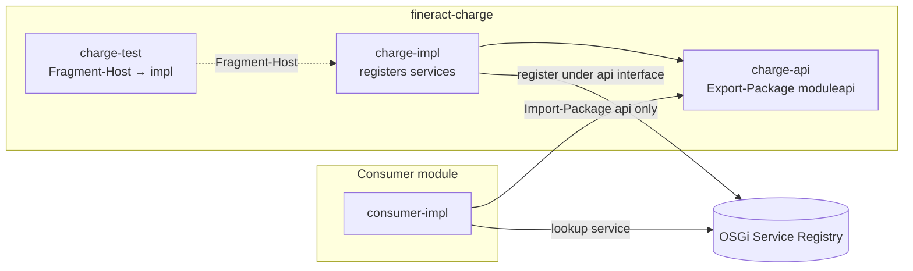
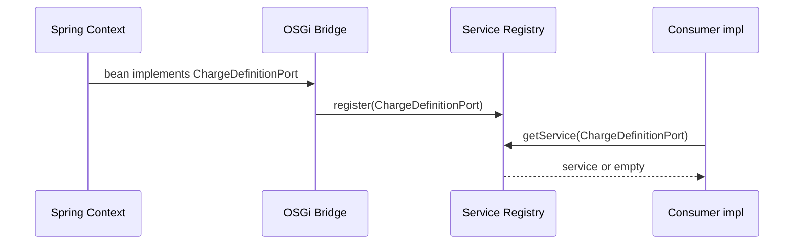

# 15. OSGi Bundle Refactoring (api / impl / test + Service Registry)

Stepwise refactoring of Gradle domain modules into **OSGi bundles**, with **OSGi services** as the only inter-bundle access path. Decision: [ADR-022](decisions/ADR-022-osgi-api-impl-test-bundles-services.md).

**Not in scope as integration technology:** Apache **Karaf Features** (or equivalent feature-install descriptors). Install sets may use Equinox layout/scripts only; they are not the module API.

---

## 15.1 Goals

| Goal | Meaning |
|------|---------|
| Subprojects are OSGi bundles | Each deployable unit has a proper manifest (`Bundle-SymbolicName`, versions, Import/Export) |
| api / impl / test split | Contracts, implementation, and tests are separate bundles/subprojects |
| Inter-bundle access via OSGi services | Service Registry under api interfaces; no foreign impl compile deps |
| Fragment-Host tests | Test fragments attach to the impl host |
| Keep Spring inside impl | Do **not** remove Spring before or as a prerequisite for this refactor |
| Stepwise | Pilot first; no big-bang rewrite of `fineract-provider` |

---

## 15.2 Target structure

```text
fineract-<name>/                    # optional parent / grouping
  fineract-<name>-api/              # OSGi interface bundle
  fineract-<name>-impl/             # OSGi implementation bundle
  fineract-<name>-test/             # OSGi fragment (tests)
```

Example (pilot candidates):

```text
fineract-charge-api/
fineract-charge-impl/
fineract-charge-test/

fineract-command/api/
fineract-command/impl/
fineract-command/test/              # Fragment-Host → command.impl (unit)
fineract-command-integrationtest/  # shared IT fixtures
```


```mermaid
flowchart LR
  subgraph Consumer["Consumer module"]
    CImpl[consumer-impl]
  end
  subgraph Charge["fineract-charge"]
    API[charge-api<br/>Export-Package moduleapi]
    IMPL[charge-impl<br/>registers services]
    TST[charge-test<br/>Fragment-Host → impl]
  end
  REG[(OSGi Service Registry)]

  CImpl -->|Import-Package api only| API
  IMPL --> API
  IMPL -->|register under api interface| REG
  CImpl -->|lookup service| REG
  TST -.->|Fragment-Host| IMPL
```

---

## 15.3 Bundle responsibilities

### 15.3.1 Interface bundle (`-api`)

| Include | Exclude |
|---------|---------|
| Port interfaces (`..moduleapi..`) | JPA `@Entity`, repositories |
| Stable DTOs / value objects / IDs | Spring `@Configuration`, `@Service` |
| OSGi service interfaces (often same as ports) | REST resources (`..api..` historical HTTP) |
| Public contract exceptions | EclipseLink / Jersey / servlet types |

**OSGi:** `Export-Package` only these packages. Versioned carefully (semantic version of the contract).

### 15.3.2 Implementation bundle (`-impl`)

| Include | Notes |
|---------|--------|
| Domain, handlers, services | Module-internal |
| JPA / JDBC adapters | Driven adapters ([ADR-017](decisions/ADR-017-hexagonale-architektur.md)) |
| Spring Boot / Spring configuration | **Allowed** for local DI |
| Service registration | DS component or activator / bridge registers api interfaces |

**OSGi:** Import api packages; **do not** export internal packages for use by other domain modules. Other modules must use the Service Registry.

### 15.3.3 Test bundle (`-test`)

| Pattern | When |
|---------|------|
| **`Fragment-Host: <impl-bsn>`** | White-box tests needing host packages / Spring context of impl |
| Plain JUnit on `-api` | Pure contract tests with mocks only |

Manifest (illustrative):

```text
Bundle-SymbolicName: org.apache.fineract.charge.test
Fragment-Host: org.apache.fineract.charge.impl
```

Rules:

- One host per fragment (prefer impl).  
- Do not use fragments to smuggle production code.  
- Do not require exporting impl packages solely for tests.

---

## 15.4 Access rules (mandatory)

### Allowed between bundles

1. **OSGi services** – lookup of interfaces defined in `-api`  
2. **Exported api packages** – types of the public contract only  
3. **Domain / business events** – published language ([12 Event Catalog](12_event_catalog.md))  
4. **Shared kernel** – `fineract-core` as-is ([ADR-021](decisions/ADR-021-modul-kommunikation-nur-ueber-module-api.md), [core slices standing rule](15_osgi_bundle_refactoring_fineract-core-slices.md#standing-rule-fineract-core-is-the-shared-kernel))

### Forbidden between domain bundles

| Forbidden | Why |
|-----------|-----|
| Compile dependency on foreign `-impl` | Breaks replaceability and OSGi isolation |
| `@Autowired` of foreign impl types across modules | Spring is not the inter-bundle bus |
| Import of foreign `..domain..` entities | ADR-021 / ArchUnit |
| Call foreign REST resources as module API | Driving adapter ≠ port |
| **Karaf Features** as the contract between modules | Deploy packaging ≠ service contract ([ADR-022](decisions/ADR-022-osgi-api-impl-test-bundles-services.md)) |

### Spring placement

| Location | Spring? |
|----------|---------|
| `-api` | **No** |
| `-impl` (local wiring) | **Yes** |
| Cross-bundle | **No** — OSGi Service Registry |
| Composition root bridge | Yes (thin Spring↔OSGi adapter) |

**Do not remove Spring before OSGi.** Spring remains the DI foundation inside impl and provider ([ADR-003](decisions/ADR-003-spring-boot-gradle-module-als-kern-beibehalten.md)). Optional later shrink of Spring applies only to pure extension bundles, never as a global first step.

---

## 15.5 Spring↔OSGi bridge

Place a small bridge in the composition root (`fineract-provider` or dedicated `fineract-osgi-bridge`):

| Direction | Behavior |
|-----------|----------|
| Spring → OSGi | Register selected Spring beans under **api** interfaces in the Service Registry |
| OSGi → Spring | Optional beans / ObjectFactory that resolve services via tracker; missing → null / no-op policy. `ChargeDefinitionPort`, `FloatingRatePort`, `TaxCatalogPort`, `ContentStoreService`, `ContentStreamPort`, `CashierTxnValidationPort`, `LoanOriginatorReadPlatformService`, `MixTaxonomyReadService`, `DelayedSettlementAttributeService`, `GLClosureReadPlatformService`, `SavingsDropdownReadPlatformService`, `LoanProductLookupReadPort`, `BuyDownFeeReadPlatformService`, `WorkingCapitalLoanPeriodPaymentRateChangeReadService`, `ConfigJobParameterService`, `AccessTokenGenerationService`, `BusinessDateReadPlatformService`, `CodeReadPlatformService`, `ProvisioningCategoryReadPlatformService`, `CurrencyWritePlatformService`, `PasswordValidationPolicyReadPlatformService`, `AdHocReadPlatformService`, `TemplateMergeService`, `UserNotificationService`, `ScorecardReadPlatformService`, `FundReadPlatformService`, `AccountNumberFormatReadPlatformService`, `ReadLikelihoodService`, `TransferWritePlatformService`, `PaymentTypeReadService`, `SearchReadService`, `CollectionSheetWritePlatformService`, `StandingInstructionWritePlatformService`, `ShareProductDropdownReadPlatformService`, `GroupLevelReadPlatformService`, `ClientIdentifierWritePlatformService`, `RepaymentWithPostDatedChecksWritePlatformService`, `ProductCommandsService`, `CacheWritePlatformService`, `FineractEntityAccessReadService`, `CalendarDropdownReadPlatformService`, `MeetingAttendanceDropdownReadService`, `FieldConfigurationReadPlatformService`, `CreditBureauReadPlatformService`, `CollateralWritePlatformService`, `CollateralManagementReadService`, `NoteReadPlatformService`, `HookReadPlatformService`, `SmsWritePlatformService`, `ReportMailingJobConfigurationReadPlatformService`, `SmsCampaignDropdownReadPlatformService`, `NotificationConfigurationReadService`, `ReportWritePlatformService`, `ExternalServicesReadPlatformService`, `StuckJobExecutorService`, `PropertyService`, `PaymentDetailWritePlatformService`, `CommandDispatcher`, `PortfolioNotificationEventPort`, `SmsCampaignTriggerEventPort`, `InteropService`, `BulkImportWorkbookService`, `BulkImportWorkbookPopulatorService`, `InstanceModePort`, `OpenApiPort`, and `S3ClientCustomizer` are `@Primary` lookup façades when Equinox is on |
| Lifecycle | Register on start; unregister on stop; no hard fail if optional extension missing |


```mermaid
sequenceDiagram
    participant Spring as Spring Context
    participant Bridge as OSGi Bridge
    participant Reg as Service Registry
    participant Cons as Consumer impl

    Spring->>Bridge: bean implements ChargeDefinitionPort
    Bridge->>Reg: register(ChargeDefinitionPort)
    Cons->>Reg: getService(ChargeDefinitionPort)
    Reg-->>Cons: service or empty
```

---

## 15.6 Evolution stages

| Stage | Name | Deliverables | Exit criteria |
|-------|------|--------------|---------------|
| **B0** | Guardrails | `moduleapi` ports, ArchUnit freeze ([14](14_module_api_boundaries.md)) | New cross-module features only via Module API |
| **B1** | Bundle tooling | bnd (or equivalent), naming, Export-Package whitelist, Equinox install smoke | Pilot module builds as bundle JAR |
| **B2** | Pilot split | One module → `-api` / `-impl` / `-test` + Fragment-Host | Pilot tests green; no foreign impl deps for pilot consumers |
| **B3** | Bridge | Spring↔OSGi registration for pilot ports | Service visible in Equinox; optional unbind degrades cleanly |
| **B4** | OSGi-only consumers | Domain consumers use service (or bridge façade), not impl project | **Done** — `./gradlew checkForeignImplDeps` blocks new foreign `-impl`; no leftover-JPA foreign `-impl` edges remain. Full OSGi lookup **complete** for Equinox-safe hosted PILOT_PORTs: `ChargeDefinitionPort`, `FloatingRatePort`, `TaxCatalogPort`, `ContentStoreService`, `ContentStreamPort`, `CashierTxnValidationPort`, `LoanOriginatorReadPlatformService`, `MixTaxonomyReadService`, `DelayedSettlementAttributeService`, `GLClosureReadPlatformService`, `SavingsDropdownReadPlatformService`, `LoanProductLookupReadPort`, `BuyDownFeeReadPlatformService`, `WorkingCapitalLoanPeriodPaymentRateChangeReadService`, `ConfigJobParameterService`, `AccessTokenGenerationService`, `BusinessDateReadPlatformService`, `CodeReadPlatformService`, `ProvisioningCategoryReadPlatformService`, `CurrencyWritePlatformService`, `PasswordValidationPolicyReadPlatformService`, `AdHocReadPlatformService`, `TemplateMergeService`, `UserNotificationService`, `ScorecardReadPlatformService`, `FundReadPlatformService`, `AccountNumberFormatReadPlatformService`, `ReadLikelihoodService`, `TransferWritePlatformService`, `PaymentTypeReadService`, `SearchReadService`, `CollectionSheetWritePlatformService`, `StandingInstructionWritePlatformService`, `ShareProductDropdownReadPlatformService`, `GroupLevelReadPlatformService`, `ClientIdentifierWritePlatformService`, `RepaymentWithPostDatedChecksWritePlatformService`, `ProductCommandsService`, `CacheWritePlatformService`, `FineractEntityAccessReadService`, `CalendarDropdownReadPlatformService`, `MeetingAttendanceDropdownReadService`, `FieldConfigurationReadPlatformService`, `CreditBureauReadPlatformService`, `CollateralWritePlatformService`, `CollateralManagementReadService`, `NoteReadPlatformService`, `HookReadPlatformService`, `SmsWritePlatformService`, `ReportMailingJobConfigurationReadPlatformService`, `SmsCampaignDropdownReadPlatformService`, `NotificationConfigurationReadService`, `ReportWritePlatformService`, `ExternalServicesReadPlatformService`, `StuckJobExecutorService`, `PropertyService`, `PaymentDetailWritePlatformService`, `CommandDispatcher`, `PortfolioNotificationEventPort`, `SmsCampaignTriggerEventPort`, `InteropService`, `BulkImportWorkbookService`, `BulkImportWorkbookPopulatorService`, `InstanceModePort`, `OpenApiPort`, and `S3ClientCustomizer` Boot consumers resolve via a `@Primary` Service Registry façade when Equinox is on |
| **B5** | Rollout | Further modules by coupling (small → large) | **Done** — ranked waves + leftover peels 1–30 closed; `./gradlew checkArchUnitFreeze` holds the leftover freeze-store budget. Freeze shrink **done** (0 leftover JPA/entity lines); leftover catalog enums closed onto `moduleapi`; WC journals use `WorkingCapitalLoanJournalPort`; savings journals use `SavingsJournalPort`; loan-transaction journals use `LoanJournalPort`; investor transfer status checks use `LoanDataForExternalTransfer.getLoanStatusName()`; transfer journals use `ExternalOwnerTransferJournalPort`; transfer data via `LoanDataForExternalTransferPort`; product existence via `LoanProductExistencePort`; sale deferred income via `LoanSaleDeferredIncomePort`; outstanding interest via `LoanOutstandingInterestPort`; transferability via `LoanTransferBalancePort`; transfer snapshots via `LoanTransferSnapshotPort`; ownership event data via `LoanOwnershipEventDataPort`; COB product id via `LoanTransferBalancePort`; transfer journal context via `LoanTransferJournalContextPort`; ownership loan ids via `LoanTransferBalancePort.loanId`; linked savings validation via `LinkedSavingsAccountPort`; client active checks via `ClientActivePort`; group active checks via `GroupActivePort`; WC/schedule office lookup via client/group `officeId` ports; savings/deposit JSON assemble and modify `isNotActive` via `ClientActivePort`/`GroupActivePort`; loan assembler office lookup via `officeId` ports and `Loan.getClientId()`; WC assembler client ids via JSON/`getClientId()`; loan transfer-date checks via `ClientActivePort.officeJoiningDate`; WC disbursement/undo/charge client-active checks via `ClientActivePort`; WC journals and loan/WC mappers via loan `officeId`/`clientId`; application office lookup via client/group `officeId` ports; loan-application client/group validation via `ClientActivePort`/`GroupActivePort.hasClientAsMember`; guarantor duplicate-name/existence via `ClientActivePort.displayName`; loan/WC mapper client labels via `ClientActivePort`; guarantor savings activation via `LinkedSavingsAccountPort`; client collateral lists by client id; inherited RD calendars via `ClientActivePort.groupIds`; linked-loan savings id/account-number reads via `AccountAssociations` helpers; guarantor linked-savings ids via `GuarantorFundingDetails.linkedSavingsAccountId`; client collateral data client id via JPQL; provisioning reserve currency via application currency; investor branch-closure checks via `acc_gl_closure` office id; investor owner mapping via in-flight journal credit flags; investor debit/credit journals via `ExternalOwnerTransferJournalPort`; investor linked/charge-off GL lookups via `ExternalOwnerTransferJournalPort`; investor owner-mapping journal loads via `ExternalOwnerTransferJournalPort`; investor helper/mapping journal signatures Object-typed; investor transfer journal posting Object loan; investor COB/service transfer helpers Object loan; investor ownership-transfer events Object loan and loan id; external-owner journal mapping via accounting `moduleapi`; investor accounting helpers without leftover mapping/journal/closure repos; loan-loss provisioning entries store product id (not leftover LoanProduct); external-owner journal mappings store journal entry id (not leftover JournalEntry); client collateral entities store client id (not leftover Client); deposit interest-incentive DTOs take Object client; savings application DTOs take Object client/group; loan linked-savings helpers take Object savings; guarantor on-hold helpers take Object on-hold transactions; guarantor funding transactions store on-hold transaction id (not leftover DepositAccountOnHoldTransaction); GLIM accounts store group id (not leftover Group); GSIM accounts store group id (not leftover Group); SMS message and email message entities store group id (not leftover Group); SMS message, email message, cashier, loan, and savings officer-assignment entities store staff id (not leftover Staff); SMS/email campaign, scorecard, and notification-mapper entities store user id (not leftover AppUser); loan, WC, and loan-reschedule-request entities store user id (not leftover AppUser); savings, FD/RD, and share-account entities store user id (not leftover AppUser); report-mailing-job, provisioning-entry, import-document, and two-factor access-token entities store user id (not leftover AppUser); loan, loan-product, WC, and WC-product entities store fund id (not leftover Fund); journal-entry, accounting-rule, financial-activity-account, product-to-GL mapping, and loan-product-provisioning-entry entities store GL account id (not leftover GLAccount); charge, teller, tax-component, and provisioning-criteria-definition entities store GL account id (not leftover GLAccount); product-to-GL mapping and accounting-tag-rule entities store code-value id (not leftover CodeValue); address and client-address entities store code-value id (not leftover CodeValue); loan-originator, loan-collateral, and entity-access entities store code-value id (not leftover CodeValue); loan, loan-transaction, guarantor, loan-reschedule-request, loan-reage-parameter, loan-reamortization-parameter, and WC-transaction entities store code-value id (not leftover CodeValue); charge and product-to-GL mapping entities store payment-type id (not leftover PaymentType); collateral-management entities store application-currency id (not leftover ApplicationCurrency); meeting entities store calendar-instance id (not leftover CalendarInstance); loan and loan-product entities store rate id (not leftover Rate); note entities store client id and group id (not leftover Client or Group); address write takes Object client (not leftover Client); note write uses ClientActivePort/GroupActivePort persistableById and officeId (not leftover Client or Group repositories); meeting attendance uses ClientActivePort/GroupActivePort (not leftover Client or Group repositories); scorecard write uses ClientActivePort.persistableById (not leftover ClientRepository); calendar write uses ClientActivePort/GroupActivePort (not leftover Client or Group repositories); SMS message assemble and pending persist use ClientActivePort/GroupActivePort/StaffPersistablePort (not leftover Client, Group, or Staff repositories); email message assemble uses ClientActivePort/GroupActivePort/StaffPersistablePort (not leftover Client, Group, or Staff repositories); hook SMS processors use ClientActivePort (not leftover Client repository); SMS campaign group lookups use GroupActivePort.clientMemberIds (not leftover Group repository); savings and deposit application group lookups use GroupActivePort (not leftover Group repository); share account create uses ClientActivePort.persistableById (not leftover Client repository); email campaign outbound uses ClientActivePort (not leftover Client repository); teller cashier allocation uses StaffPersistablePort (not leftover Staff repository); savings and deposit field-officer assignment uses StaffPersistablePort (not leftover Staff repository); client charge writes use ClientActivePort.assertActiveInUserScope (not leftover Client repository); SMS campaign client lookups use ClientActivePort (not leftover Client repository); email execute report parameters use ClientActivePort and StaffPersistablePort.officeId (not leftover Client); email execute report run-as user uses AppUserPersistablePort (not leftover AppUser); rate approver assignment uses AppUserPersistablePort (not leftover AppUser repository); notification mapper writes use AppUserPersistablePort (not leftover AppUser repository); working capital loan submitted-by names use AppUserPersistablePort (not leftover AppUser repository); SMS campaign office hierarchy checks use OfficePersistablePort (not leftover Office repository); working capital loan and product fund lookups use FundPersistablePort (not leftover Fund repository); working capital loan and product fund names use FundPersistablePort (not leftover Fund); working capital loan timeline and disbursement user names use AppUserPersistablePort (not leftover AppUser); working capital loan transaction classification uses CodeValuePersistablePort (not leftover CodeValue); loan transaction classification uses CodeValuePersistablePort (not leftover CodeValue); loan originator type and channel reads use CodeValuePersistablePort (not leftover CodeValue); loan collateral type reads use CodeValuePersistablePort (not leftover CodeValue); loan collateral type assignment uses CodeValuePersistablePort (not leftover CodeValue repository); loan application collateral types use CodeValuePersistablePort (not leftover CodeValue repository); loan originator type and channel assignment uses CodeValuePersistablePort (not leftover CodeValue repository); loan originator template options use CodeValueReadPlatformService (not leftover CodeValue repository); working capital loan classification lookups use CodeValuePersistablePort (not leftover CodeValue repository); product-to-GL mapping code value and payment type reads use CodeValuePersistablePort and PaymentTypePersistablePort (not leftover CodeValue or PaymentType); product-to-GL mapping GL account reads use GLAccountPersistablePort (not leftover GLAccount); tax component GL account reads use GLAccountPersistablePort (not leftover GLAccount); charge data reads use GLAccountPersistablePort and PaymentTypePersistablePort (not leftover GLAccount or PaymentType); journal entry GL account reads use GLAccountPersistablePort (not leftover GLAccount); journal entry payment detail reads use PaymentDetailPersistablePort (not leftover PaymentDetail); working capital loan transaction payment details use PaymentDetailPersistablePort (not leftover PaymentDetail); working capital loan accrual payment type ids use PaymentDetailPersistablePort (not leftover PaymentDetail); client transaction payment type ids use PaymentDetailPersistablePort (not leftover PaymentDetail); savings transaction payment type ids use PaymentDetailPersistablePort (not leftover PaymentDetail); loan accounting bridge payment type ids use PaymentDetailPersistablePort (not leftover PaymentDetail); loan transaction relation payment type names use PaymentDetailPersistablePort (not leftover PaymentDetail); savings transaction SMS receipt numbers use PaymentDetailPersistablePort (not leftover PaymentDetail); loan repayment SMS receipt numbers use PaymentDetailPersistablePort (not leftover PaymentDetail); savings interop transaction matches use PaymentDetailPersistablePort (not leftover PaymentDetail); loan transaction payment details use PaymentDetailPersistablePort (not leftover PaymentDetail); financial activity GL account type checks use GLAccountPersistablePort (not leftover GLAccount); savings interop payment detail creates use Object payment details (not leftover PaymentDetail); linked savings payment details use Object payment details (not leftover PaymentDetail); cashier journal GL accounts use Object GL accounts (not leftover GLAccount); external-owner transfer investor journals use Object office and GL accounts (not leftover Office or GLAccount); provisioning journals use Object GL accounts (not leftover GLAccount); accounting rule journal GL account checks use GLAccountPersistablePort (not leftover GLAccount); journal entry payment detail creates use Object payment details (not leftover PaymentDetail); savings account transaction payment detail creates use Object payment details (not leftover PaymentDetail); client charge payment detail creates use Object payment details (not leftover PaymentDetail); working capital loan payment detail creates use Object payment details (not leftover PaymentDetail); deposit account payment details use Object payment details (not leftover PaymentDetail); collection sheet payment details use Object payment details (not leftover PaymentDetail); loan interest payment waiver payment details use Object payment details (not leftover PaymentDetail); loan capitalized income payment details use Object payment details (not leftover PaymentDetail); loan buy down fee payment details use Object payment details (not leftover PaymentDetail); loan charge adjustment payment details use Object payment details (not leftover PaymentDetail); loan chargeback payment details use Object payment details (not leftover PaymentDetail); loan transaction adjustment payment details use Object payment details (not leftover PaymentDetail); loan credit balance refund payment details use Object payment details (not leftover PaymentDetail); loan merchant issued and payout refund payment details use Object payment details (not leftover PaymentDetail); loan manual interest refund payment details use Object payment details (not leftover PaymentDetail); loan active loan refund payment details use Object payment details (not leftover PaymentDetail); account transfer savings payment details use Object payment details (not leftover PaymentDetail); loan charge payment details use Object payment details (not leftover PaymentDetail); account transfer disbursement payment details use Object payment details (not leftover PaymentDetail); account transfer loan refund payment details use Object payment details (not leftover PaymentDetail); loan repayment payment details use Object payment details (not leftover PaymentDetail); loan disbursement payment details use Object payment details and PaymentDetailPersistablePort cash payment checks (not leftover PaymentDetail); savings account deposit and withdrawal payment details use Object payment details (not leftover PaymentDetail); loan foreclosure payment details use Object payment details (not leftover PaymentDetail); loan interest refund payment details use Object payment details (not leftover PaymentDetail); account transfer undo payment details use Object payment details (not leftover PaymentDetail); guarantor fund transfer payment details use Object payment details (not leftover PaymentDetail); working capital loan journal payment details use Object payment details (not leftover PaymentDetail); savings interop payment detail instances use PaymentDetailPersistablePort (not leftover PaymentDetail); loan account domain service payment details use Object payment details (not leftover PaymentDetail); payment detail assembler fetches use Object payment details (not leftover PaymentDetail); charge writes use PaymentTypePersistablePort.persistableById (not leftover PaymentType repository); product-to-GL payment channel mappings use PaymentTypePersistablePort.persistableById (not leftover PaymentType repository); payment detail assembler payment types use PaymentTypePersistablePort.persistableById (not leftover PaymentType repository); payment detail writes use PaymentTypePersistablePort.persistableById (not leftover PaymentType repository); savings interop non-cash payment types use PaymentTypePersistablePort.firstNonCash (not leftover PaymentType repository); charge writes use GLAccountPersistablePort.persistableById (not leftover GLAccount repository); product-to-GL mapped account lookups use GLAccountPersistablePort.persistableById (not leftover GLAccount repository); WC product-to-GL mapped account lookups use GLAccountPersistablePort.persistableById (not leftover GLAccount repository); product-to-GL optional mapped account lookups use GLAccountPersistablePort.persistableById (not leftover GLAccount repository); accounting rule debit and credit accounts use GLAccountPersistablePort.persistableById (not leftover GLAccount repository); financial activity account writes use GLAccountPersistablePort.persistableById (not leftover GLAccount repository); journal entry writes use GLAccountPersistablePort.persistableById (not leftover GLAccount repository); journal processor tax liability GL accounts use GLAccountPersistablePort.persistableById (not leftover GLAccount repository); journal processor savings charge income GL accounts use GLAccountPersistablePort.persistableById (not leftover GLAccount repository); journal processor savings and client charge GL accounts pass the account id (not leftover GLAccount repository); provisioning entry GL accounts use GLAccountPersistablePort.persistableById (not leftover GLAccount repository); tax component debit and credit accounts use GLAccountPersistablePort.persistableById (not leftover GLAccount repository); provisioning criteria GL accounts use GLAccountPersistablePort.persistableById (not leftover GLAccount repository); chart of accounts import GL accounts use GLAccountPersistablePort.persistableByGlCode (not leftover GLAccount repository); loan buy down fee classification uses CodeValuePersistablePort.findByCodeNameAndId (not leftover CodeValue repository); loan capitalized income classification uses CodeValuePersistablePort.findByCodeNameAndId (not leftover CodeValue repository); loan re-age reasons use CodeValuePersistablePort.findByCodeNameAndId (not leftover CodeValue repository); loan re-amortization reasons use CodeValuePersistablePort.findByCodeNameAndId (not leftover CodeValue repository); loan transaction classification validation uses CodeValuePersistablePort.findByCodeNameAndId (not leftover CodeValue repository); loan write-off and charge-off reasons use CodeValuePersistablePort.persistableByCodeNameAndId (not leftover CodeValue repository); loan reschedule reasons use CodeValuePersistablePort.persistableById (not leftover CodeValue repository); guarantor relationship types use CodeValuePersistablePort.persistableByCodeNameAndId (not leftover CodeValue repository); loan purpose lookups use CodeValuePersistablePort.persistableById (not leftover CodeValue repository); accounting rule debit and credit tags use CodeValuePersistablePort.persistableById (not leftover CodeValue repository); product-to-GL code value lookups use CodeValuePersistablePort (not leftover CodeValue repository); address state, country, and address type writes pass the code value id (not leftover CodeValue repository); entity access writes take Object access type (not leftover CodeValue); entity access util no longer injects leftover CodeValue repository; loan collateral assembler no longer injects leftover CodeValue repository; entity access office checks use OfficePersistablePort.persistableById (not leftover Office repository); accounting rule office checks use OfficePersistablePort.persistableById (not leftover Office repository); GL closure office checks use OfficePersistablePort.persistableById (not leftover Office repository); journal entry running-balance office checks use OfficePersistablePort.persistableById (not leftover Office repository); cashier journal office checks use OfficePersistablePort.persistableById (not leftover Office repository); journal entry writes use OfficePersistablePort.persistableById (not leftover Office repository); working capital loan journal office checks use OfficePersistablePort.persistableById (not leftover Office repository); provisioning entry office checks use OfficePersistablePort.persistableById and store the office id (not leftover Office repository); client transaction journal office checks pass the office id (not leftover Office repository); shares journal office checks pass the office id (not leftover Office repository); savings journal office checks pass the office id (not leftover Office repository); loan journal office checks pass the office id (not leftover Office repository); teller office checks use OfficePersistablePort.persistableById and teller privilege checks use OfficePersistablePort.doesNotHaveAnOfficeInHierarchyWithId (not leftover Office repository); account transfer detail office checks use OfficePersistablePort.persistableById (not leftover Office repository); OIDC user auto-create office lookup uses OfficePersistablePort.persistableById (not leftover Office repository); app user office checks use OfficePersistablePort.persistableById (not leftover Office repository); group and center create office checks use OfficePersistablePort.persistableById (not leftover Office repository); client create office checks use OfficePersistablePort.persistableById (not leftover Office repository); client transfer destination office checks use OfficePersistablePort.persistableById (not leftover Office repository); staff create and update office checks use OfficePersistablePort.persistableById (not leftover Office repository); holiday create and update office checks use OfficePersistablePort.persistableById (not leftover Office repository); loan assembler loan officer checks use StaffPersistablePort.persistableById (not leftover Staff repository); loan assembler fund checks use FundPersistablePort.persistableById (not leftover Fund repository); loan product fund checks use FundPersistablePort.persistableById (not leftover Fund repository); guarantor staff checks use StaffPersistablePort.persistableById (not leftover Staff repository); guarantor group checks use GroupActivePort.persistableById (not leftover Group repository); loan assembler group checks use GroupActivePort.persistableById (not leftover Group repository); loan application submitted-on group activation checks use GroupActivePort.isActivatedAfter and activationDate (not leftover Group repository); loan schedule assembler no longer injects leftover Group repository; client transfer group checks use GroupActivePort.persistableById (not leftover Group repository); group role checks use GroupActivePort.persistableById (not leftover Group repository); client create group checks use GroupActivePort.persistableById (not leftover Group repository); group role code values use CodeValuePersistablePort.persistableById (not leftover CodeValue repository); group role client checks use ClientActivePort.persistableById (not leftover Client repository); group and center client members use ClientActivePort.persistableById (not leftover Client repository); group and center closure reasons use CodeValuePersistablePort.persistableByCodeNameAndId (not leftover CodeValue repository); GL account tags use CodeValuePersistablePort.persistableByCodeNameAndId (not leftover CodeValue repository); client identifier document types use CodeValuePersistablePort.persistableById (not leftover CodeValue repository); client family member checks use ClientActivePort.persistableById (not leftover Client repository); internal client audit reads use ClientActivePort.persistableById (not leftover Client repository); client identifier client checks use ClientActivePort.persistableById (not leftover Client repository); account transfer client checks use ClientActivePort.persistableById (not leftover Client repository); group and center parent and child groups use GroupActivePort.persistableById (not leftover Group repository); client write code values use CodeValuePersistablePort.persistableByCodeNameAndId (not leftover CodeValue repository); user notification office filters use AppUserPersistablePort.persistableById (not leftover AppUser repository); office transaction offices use OfficePersistablePort.persistableById (not leftover Office repository); GL account parent checks use GLAccountPersistablePort.persistableById (not leftover GLAccount repository); rate assembly uses RatePersistablePort.persistableById (not leftover Rate repository); loan product rates use RatePersistablePort.persistableById (not leftover Rate repository); staff image id reads use StaffPersistablePort.persistableById (not leftover Staff repository); client image id reads use ClientActivePort.persistableById (not leftover Client repository); app user linked staff checks use StaffPersistablePort.persistableById (not leftover Staff repository); savings account transfer acceptance takes Object office and staff (not leftover Office or Staff); deposit account transfer acceptance takes Object office and staff (not leftover Office or Staff); loan transfer acceptance takes Object office and staff (not leftover Office or Staff); loan product assembly takes Object fund (not leftover Fund); loan account assembly takes Object fund (not leftover Fund); loan account officer lookup returns Object staff (not leftover Staff); loan application withdrawal takes Object user (not leftover AppUser); loan application rejection takes Object user (not leftover AppUser); loan approval assembly takes Object user (not leftover AppUser); savings account assembly takes Object user (not leftover AppUser); savings account client and group assembly takes Object user (not leftover AppUser); deposit account assembly takes Object user (not leftover AppUser); fixed deposit account closure takes Object user (not leftover AppUser); fixed deposit maturity closure takes Object user (not leftover AppUser); recurring deposit account closure takes Object user (not leftover AppUser); fixed deposit premature closure takes Object user (not leftover AppUser); recurring deposit premature closure takes Object user (not leftover AppUser); savings hold-amount validation takes Object user (not leftover AppUser); savings application DTO takes Object user (not leftover AppUser); savings account current-user lookup returns Object user (not leftover AppUser); loan application current-user lookup returns Object user (not leftover AppUser); loan write current-user lookup returns Object user (not leftover AppUser); loan disbursement takes Object user (not leftover AppUser); loan write-off takes Object user (not leftover AppUser); loan read office hierarchy uses Object user (not leftover AppUser); loan list office hierarchy uses Object user (not leftover AppUser); center paged list office hierarchy uses Object user (not leftover AppUser); center list office hierarchy uses Object user (not leftover AppUser); center dropdown office hierarchy uses Object user (not leftover AppUser); center single-record office hierarchy uses Object user (not leftover AppUser); center template default office uses Object user (not leftover AppUser); group paged list office hierarchy uses Object user (not leftover AppUser); group list office hierarchy uses Object user (not leftover AppUser); group single-record office hierarchy uses Object user (not leftover AppUser); group template default office uses Object user (not leftover AppUser); group and center create uses Object user (not leftover AppUser); group and center activation uses Object user (not leftover AppUser); group close uses Object user (not leftover AppUser); center close uses Object user (not leftover AppUser); client create uses Object user (not leftover AppUser); client activation uses Object user (not leftover AppUser); client close uses Object user (not leftover AppUser); client reject uses Object user (not leftover AppUser); client withdraw uses Object user (not leftover AppUser); client reactivate uses Object user (not leftover AppUser); client undo rejection uses Object user (not leftover AppUser); client undo withdrawal uses Object user (not leftover AppUser); loan reschedule approval uses Object user (not leftover AppUser); loan reschedule rejection uses Object user (not leftover AppUser); loan disbursement current user uses Object user (not leftover AppUser); loan schedule archive uses Object user (not leftover AppUser); client transfer uses Object user (not leftover AppUser); savings application submit uses Object user (not leftover AppUser); savings application approval uses Object user (not leftover AppUser); savings application rejection uses Object user (not leftover AppUser); savings application withdrawal uses Object user (not leftover AppUser); savings account activation uses Object user (not leftover AppUser); savings account closure uses Object user (not leftover AppUser); savings account hold uses Object user (not leftover AppUser); fixed deposit application submit uses Object user (not leftover AppUser); recurring deposit application submit uses Object user (not leftover AppUser); deposit application approval uses Object user (not leftover AppUser); deposit application rejection uses Object user (not leftover AppUser); deposit application withdrawal uses Object user (not leftover AppUser); fixed deposit account activation uses Object user (not leftover AppUser); recurring deposit account activation uses Object user (not leftover AppUser); fixed deposit account closure uses Object user (not leftover AppUser); recurring deposit account closure uses Object user (not leftover AppUser); fixed deposit premature closure uses Object user (not leftover AppUser); recurring deposit premature closure uses Object user (not leftover AppUser); fixed deposit maturity closure uses Object user (not leftover AppUser); savings account paged list office hierarchy uses Object user (not leftover AppUser); savings account template default office uses Object user (not leftover AppUser); deposit account template default office uses Object user (not leftover AppUser); share account create uses Object user (not leftover AppUser); share account approval uses Object user (not leftover AppUser); share account rejection uses Object user (not leftover AppUser); share account activation uses Object user (not leftover AppUser); share account closure uses Object user (not leftover AppUser); savings interest journal posting uses Object user (not leftover AppUser); savings interest posting uses Object user (not leftover AppUser); recurring deposit schedule generation uses Object user (not leftover AppUser); working capital loan approval uses Object user (not leftover AppUser); working capital loan rejection uses Object user (not leftover AppUser); working capital loan disbursement uses Object user (not leftover AppUser); user update uses Object user (not leftover AppUser); user list office hierarchy uses Object user (not leftover AppUser); user search template office hierarchy uses Object user (not leftover AppUser); entity access mapping list office hierarchy uses Object user (not leftover AppUser); client identifier list office hierarchy uses Object user (not leftover AppUser); client identifier read office hierarchy uses Object user (not leftover AppUser); office list office hierarchy uses Object user (not leftover AppUser); office dropdown office hierarchy uses Object user (not leftover AppUser); office transaction list office hierarchy uses Object user (not leftover AppUser); office create uses Object user (not leftover AppUser); office update uses Object user (not leftover AppUser); teller list office hierarchy uses Object user (not leftover AppUser); teller update uses Object user (not leftover AppUser); cashier allocation update uses Object user (not leftover AppUser); cashier allocation delete uses Object user (not leftover AppUser); cashier fund allocate and settle uses Object user (not leftover AppUser); email campaign create uses Object user (not leftover AppUser); email campaign activation uses Object user (not leftover AppUser); email campaign closure uses Object user (not leftover AppUser); email campaign reactivation uses Object user (not leftover AppUser); SMS campaign create uses Object user (not leftover AppUser); SMS campaign activation uses Object user (not leftover AppUser); SMS campaign closure uses Object user (not leftover AppUser); SMS campaign reactivation uses Object user (not leftover AppUser); group collection sheet office hierarchy uses Object user (not leftover AppUser); center collection sheet office hierarchy uses Object user (not leftover AppUser); individual collection sheet office hierarchy uses Object user (not leftover AppUser); audit paged list office hierarchy uses Object user (not leftover AppUser); audit list and makerchecker entries to be checked uses Object user (not leftover AppUser); audit entry office hierarchy uses Object user (not leftover AppUser); audit search template uses Object user (not leftover AppUser); datatable data scope office hierarchy uses Object user (not leftover AppUser); report SQL uses Object user (not leftover AppUser); report run permission uses Object user (not leftover AppUser); client members of group office hierarchy uses Object user (not leftover AppUser); active client members of group office hierarchy uses Object user (not leftover AppUser); active client members of center office hierarchy uses Object user (not leftover AppUser); accounting rule list uses Object user (not leftover AppUser); provisioning entry create uses Object user (not leftover AppUser); journal entry transaction id uses Object user (not leftover AppUser); entity datatable save uses Object user (not leftover AppUser); office product restriction uses Object user (not leftover AppUser); update NPA uses Object user (not leftover AppUser); report mailing job create uses Object user (not leftover AppUser); two factor delivery methods uses Object user (not leftover AppUser); two factor token request uses Object user (not leftover AppUser); two factor token validate uses Object user (not leftover AppUser); two factor access token invalidate uses Object user (not leftover AppUser); scorecard create uses Object user (not leftover AppUser); organization running balance uses Object user (not leftover AppUser); office running balance uses Object user (not leftover AppUser); teller default office uses Object user (not leftover AppUser); bulk import document uses Object user (not leftover AppUser); bulk import publish uses Object user (not leftover AppUser); client search office hierarchy uses Object user (not leftover AppUser); inline COB bypass user uses Object user (not leftover AppUser); datatable names uses Object user (not leftover AppUser); datatable read uses Object user (not leftover AppUser); interop account identifier uses Object user (not leftover AppUser); scheduler status update uses Object user (not leftover AppUser); scheduler job execute uses Object user (not leftover AppUser); loan and portfolio notification listeners uses Object user (not leftover AppUser); share product dividend notification uses Object user (not leftover AppUser); notification read status uses Object user (not leftover AppUser); all unread notifications uses Object user (not leftover AppUser); all notifications uses Object user (not leftover AppUser); staff dropdown office hierarchy uses Object user (not leftover AppUser); staff default office uses Object user (not leftover AppUser); staff read office hierarchy uses Object user (not leftover AppUser); staff list office hierarchy uses Object user (not leftover AppUser); client template default office uses Object user (not leftover AppUser); all surveys uses Object user (not leftover AppUser); survey read uses Object user (not leftover AppUser); survey names uses Object user (not leftover AppUser); product office filter uses Object user (not leftover AppUser); provisioning criteria create uses Object user (not leftover AppUser); loan reschedule create uses Object user (not leftover AppUser); user password change uses Object user (not leftover AppUser); GL closure list uses Object user (not leftover AppUser); GL closure read uses Object user (not leftover AppUser); financial activity account template uses Object user (not leftover AppUser); financial activity account list uses Object user (not leftover AppUser); financial activity account read uses Object user (not leftover AppUser); GL account template uses Object user (not leftover AppUser); GL account list uses Object user (not leftover AppUser); GL account read uses Object user (not leftover AppUser); journal entry list uses Object user (not leftover AppUser); journal entry read uses Object user (not leftover AppUser); journal entry opening balance uses Object user (not leftover AppUser); accounting rule template uses Object user (not leftover AppUser); accounting rule read uses Object user (not leftover AppUser); account number format template uses Object user (not leftover AppUser); account number format list uses Object user (not leftover AppUser); account number format read uses Object user (not leftover AppUser); account transfer template uses Object user (not leftover AppUser); account transfer list uses Object user (not leftover AppUser); account transfer read uses Object user (not leftover AppUser); account transfer refund template uses Object user (not leftover AppUser); standing instruction template uses Object user (not leftover AppUser); standing instruction list uses Object user (not leftover AppUser); standing instruction read uses Object user (not leftover AppUser); entity field configuration read uses Object user (not leftover AppUser); client address template uses Object user (not leftover AppUser); client address list uses Object user (not leftover AppUser); bulk import client workbook uses Object user (not leftover AppUser); bulk import center workbook uses Object user (not leftover AppUser); bulk import group workbook uses Object user (not leftover AppUser); bulk import loan workbook uses Object user (not leftover AppUser); bulk import loan repayment workbook uses Object user (not leftover AppUser); bulk import journal entries workbook uses Object user (not leftover AppUser); bulk import guarantor workbook uses Object user (not leftover AppUser); bulk import office workbook uses Object user (not leftover AppUser); bulk import chart of accounts workbook uses Object user (not leftover AppUser); bulk import staff workbook uses Object user (not leftover AppUser); bulk import shared accounts workbook uses Object user (not leftover AppUser); bulk import savings account workbook uses Object user (not leftover AppUser); bulk import savings transaction workbook uses Object user (not leftover AppUser); bulk import recurring deposit workbook uses Object user (not leftover AppUser); bulk import recurring deposit transaction workbook uses Object user (not leftover AppUser); bulk import fixed deposit workbook uses Object user (not leftover AppUser); bulk import user workbook uses Object user (not leftover AppUser); bulk import fixed deposit transactions workbook uses Object user (not leftover AppUser); calendar read uses Object user (not leftover AppUser); calendars by entity uses Object user (not leftover AppUser); calendar template uses Object user (not leftover AppUser); email list uses Object user (not leftover AppUser); pending email uses Object user (not leftover AppUser); sent email uses Object user (not leftover AppUser); email by status uses Object user (not leftover AppUser); failed email uses Object user (not leftover AppUser); email campaign read uses Object user (not leftover AppUser); email campaign list uses Object user (not leftover AppUser); email campaign preview uses Object user (not leftover AppUser); email campaign template uses Object user (not leftover AppUser); email campaign template detail uses Object user (not leftover AppUser); email configuration list uses Object user (not leftover AppUser); sms campaign template uses Object user (not leftover AppUser); sms campaign read uses Object user (not leftover AppUser); sms campaign list uses Object user (not leftover AppUser); sms campaign preview uses Object user (not leftover AppUser); charge list uses Object user (not leftover AppUser); charge read uses Object user (not leftover AppUser); charge template uses Object user (not leftover AppUser); client charges list uses Object user (not leftover AppUser); client charges template uses Object user (not leftover AppUser); client charges read uses Object user (not leftover AppUser); family member read uses Object user (not leftover AppUser); family member list uses Object user (not leftover AppUser); family member template uses Object user (not leftover AppUser); client identifiers list uses Object user (not leftover AppUser); client identifiers template uses Object user (not leftover AppUser); client identifiers read uses Object user (not leftover AppUser); client transactions list uses Object user (not leftover AppUser); client transactions read uses Object user (not leftover AppUser); client external id transactions list uses Object user (not leftover AppUser); client external id transactions read uses Object user (not leftover AppUser); client transaction external id read uses Object user (not leftover AppUser); client and transaction external id read uses Object user (not leftover AppUser); code values list uses Object user (not leftover AppUser); code values read uses Object user (not leftover AppUser); code name values list uses Object user (not leftover AppUser); code name value read uses Object user (not leftover AppUser); codes list uses Object user (not leftover AppUser); collateral template uses Object user (not leftover AppUser); collateral list uses Object user (not leftover AppUser); collateral read uses Object user (not leftover AppUser); collection sheet generate uses Object user (not leftover AppUser); audits list uses Object user (not leftover AppUser); audit entry read uses Object user (not leftover AppUser); audits search template uses Object user (not leftover AppUser); external services configuration read uses Object user (not leftover AppUser); global configuration list uses Object user (not leftover AppUser); global configuration read uses Object user (not leftover AppUser); global configuration name read uses Object user (not leftover AppUser); credit bureau list uses Object user (not leftover AppUser); credit bureau loan product mapping list uses Object user (not leftover AppUser); organisation credit bureaus list uses Object user (not leftover AppUser); credit bureau configuration list uses Object user (not leftover AppUser); credit bureau loan products list uses Object user (not leftover AppUser); credit bureau loan product mapping read uses Object user (not leftover AppUser); datatable values query uses Object user (not leftover AppUser); datatable entries read uses Object user (not leftover AppUser); datatable many entry read uses Object user (not leftover AppUser); reports list uses Object user (not leftover AppUser); report read uses Object user (not leftover AppUser); report template uses Object user (not leftover AppUser); datatable advanced query uses Object user (not leftover AppUser); leftover-retarget of leftover core JPA on domain *-impl is closed; remaining leftover JPA of those types is only in fineract-core; do not leftover-retarget leftover core JPA; Equinox-safe catalog ports hold; leftover persistable ports stay Spring-only; guarantor hold/release funds use `DepositAccountOnHoldPort`; guarantor on-hold persist uses `DepositAccountOnHoldPort`; guarantor hold-summary reconstruction uses `DepositAccountOnHoldPort`; loan linked-savings association writes use `LinkedSavingsAccountPort.persistableById`; GSIM child lookup for loan-linked savings uses `LinkedSavingsAccountPort.childAccountIdForGsimClient`; unused leftover loan savings-assembler/repo ctor siblings dropped together with leftover Client ctor siblings; unused leftover Client ctor siblings dropped from loan-schedule assembler and WC application validator; savings/deposit JSON assemble group-membership checks use `GroupActivePort.hasClientAsMember`; savings DTO assemble takes Object client/group and reads ids via `ClientActivePort.id` / `GroupActivePort.id`; savings/deposit application client association writes use `ClientActivePort.persistableById`; deposit interest-incentive Client attributes use `ClientActivePort.incentiveAttributes`; savings account client/group id, office id, and transaction-allowed checks use `ClientActivePort` / `GroupActivePort`; savings account activate/validate client and group dates use `ClientActivePort` / `GroupActivePort`; savings account office lookup uses `ClientActivePort.office` / `GroupActivePort.office`; loan client/group id and office lookup use `ClientActivePort` / `GroupActivePort`; WC loan client id and office lookup use `ClientActivePort`; Loan factory, constructor, and client/group updates take Object client/group; Savings/FD/RD factory and constructor take Object client/group; Savings account client/group updates take Object client/group; Loan assembler client association writes use `ClientActivePort.persistableById`; WC assembler client association writes use `ClientActivePort.persistableById`; Savings assembler client/group association writes use `ClientActivePort.persistableById` / `GroupActivePort.persistableById`; Deposit assembler client/group association writes use `ClientActivePort.persistableById` / `GroupActivePort.persistableById`; WC loan entities store client id (not leftover Client). Savings account entities store client id and group id (not leftover Client or Group). Loan entities store client id and group id (not leftover Client or Group). Client charge, client transaction, share account, teller transaction, SMS message, scorecard, email message, meeting attendance, client address, and account-transfer entities store client id (not leftover Client). Loan, savings, client, WC, and journal transaction entities store payment-detail id (not leftover PaymentDetail). Loan, savings, client, and journal transaction entities store office id (not leftover Office). GL closures, accounting rules, teller/cashier, provisioning-entry, account-transfer, and office-transaction entities store office id (not leftover Office). Investor COB execute uses `ExternalAssetOwnerTransferCobPort` (Object-typed); loan COB keeps `LoanCOBBusinessStep.execute(Loan)`) |
| **B6** | Optional polish | DS-only for Equinox-safe empty catalog ports; tighten exports | **Done** — every Equinox-safe empty catalog port and the command dispatcher graph register via `Service-Component` + staged Felix SCR, including loan / progressive-loan / WC-loan / COB / security / event / interoperation / bulkimport / instancemode / openapi / s3. Impl `Export-Package` is empty. No Bundle-Activator remains. Boot registrars stay Spring |

### Suggested rollout order (post–command pilot)

**B2 pilot status:** `fineract-command` is the completed pilot (api / impl / test fragment + integrationtest fixtures). As-built plan: [15_osgi_bundle_refactoring_fineract-command.md](15_osgi_bundle_refactoring_fineract-command.md).

**Wave 1 status:** **complete** (charge, rates, tax).
- **charge** — **complete** (api/impl/test; façade removed; chargeId/port retargets; domain consumers **charge-api only**). Plan: [15_osgi_bundle_refactoring_fineract-charge.md](15_osgi_bundle_refactoring_fineract-charge.md).
- **rates** — **complete** (api/impl/test + `FloatingRatePort`; loan **rates-api only** via `floatingRateId`). Plan: [15_osgi_bundle_refactoring_fineract-rates.md](15_osgi_bundle_refactoring_fineract-rates.md).
- **tax** — **complete** (api/impl/test + ports; charge/loan/savings **tax-api only** via catalog ids). Plan: [15_osgi_bundle_refactoring_fineract-tax.md](15_osgi_bundle_refactoring_fineract-tax.md).

Further modules follow the same recipe, ordered by **port clarity**, **size**, **reverse dependency cost**, and **hexagonal value** (replaceable adapters as OSGi services). Metrics below are approximate main-source scale (order of magnitude); re-measure before a PR series.

#### Selection criteria

| Criterion | Why it matters |
|-----------|----------------|
| **Clear ports** | Interfaces / read-write services already exist → easy `-api` |
| **Small surface** | Prefer ≲ ~100 main classes for the next 1–2 modules |
| **Few JPA aggregates** | Less entity leakage into the contract |
| **Bounded reverse deps** | Consumers can switch to `-api` without a monorepo-wide rewrite |
| **Hexagonal fit** | Driven adapters already swappable (storage, messaging) |
| **Value of OSGi service** | Optional / replaceable impl is a real benefit |
| **Not composition root** | Leave `fineract-provider` and most of `fineract-core` last |

Per module: complete **Module API ports first** ([14.6](14_module_api_boundaries.md)), then physical api/impl/test split.

#### Wave 1 — complete (command-sized)

| Rank | Module | ~main scale | Status | Typical `-api` surface |
|------|--------|-------------|--------|------------------------|
| **1** | **`fineract-charge`** | ~40 | **Complete** — api/impl/test; chargeId/port retargets; façade **removed**; ArchUnit charge freeze green. [charge plan](15_osgi_bundle_refactoring_fineract-charge.md) | `ChargeDefinitionPort`; composition roots use api+impl |
| **2** | **`fineract-rates`** | ~20 | **Complete** — api/impl/test + `FloatingRatePort`; loan rates-api only. [rates plan](15_osgi_bundle_refactoring_fineract-rates.md) | `FloatingRatePort` + DTOs / service interfaces |
| **3** | **`fineract-tax`** | ~30 | **Complete** — api/impl/test + ports; charge/loan/savings tax-api only. [tax plan](15_osgi_bundle_refactoring_fineract-tax.md) | `TaxCatalogPort` + `ChargeTaxApplicationService` |

Suggested directory layout (mirror command):

```text
fineract-charge/
  api/   → :fineract-charge-api      BSN org.apache.fineract.charge.api
  impl/  → :fineract-charge-impl     BSN org.apache.fineract.charge.impl  (Spring stays here)
  test/  → :fineract-charge-test     Fragment-Host → charge.impl
```

Optional `fineract-<name>-integrationtest` only if several modules need shared fixtures (command needed it; charge may not).

#### Wave 2 — strong hexagonal, medium size

| Rank | Module | ~main scale | Why | Caveat |
|------|--------|-------------|-----|--------|
| **4** | **`fineract-document`** | ~85 | **Complete** — api/impl/test + `ContentStoreService` / `ContentStreamPort`; provider on ports. [document plan](15_osgi_bundle_refactoring_fineract-document.md) | Do not leak servlet/AWS types into `-api` |
| **5** | **`fineract-branch`** | ~50 | **Complete** — api/impl/test + teller ports + `CashierTxnValidationPort`; residual closed. [branch plan](15_osgi_bundle_refactoring_fineract-branch.md) | Less “optional extension” value than charge/document |
| **6** | **`fineract-loan-origination`** | ~60 | **Complete** — api/impl/test; `LoanOriginatorData` on api; loan/WC api-only. [loan-origination plan](15_osgi_bundle_refactoring_fineract-loan-origination.md) | Impl still couples to loan/WC entities for attach/detach |
| **7** | **`fineract-mix`** | ~35 | **Complete** — api/impl/test; provider composition root. [mix plan](15_osgi_bundle_refactoring_fineract-mix.md) | Niche XBRL; residual domain export for JDBC scan |

#### Wave 3 — full domain BCs (after Module API hardening)

| Rank | Module | ~main scale | Why wait |
|------|--------|-------------|----------|
| **8** | **`fineract-investor`** | ~100 | **Complete** — api/impl/test; pure ports + DTO residual journal. [investor plan](15_osgi_bundle_refactoring_fineract-investor.md) |
| **9** | **`fineract-accounting`** | ~150 | **Complete** — api/impl/test; entity residual for loan/journal consumers. [accounting plan](15_osgi_bundle_refactoring_fineract-accounting.md) |
| **10** | **`fineract-savings`** | ~180 | **Complete** — api/impl/test; provider entity residual. [savings plan](15_osgi_bundle_refactoring_fineract-savings.md) |

#### Wave 4 — last (high coupling / composition)

| Module | ~main scale | Verdict |
|--------|-------------|---------|
| **`fineract-loan`** | ~700 | **Complete** — api/impl/test; entity residual. [loan plan](15_osgi_bundle_refactoring_fineract-loan.md) |
| **`fineract-progressive-loan`** | ~95 | **Complete** — api/impl/test; schedule residual. [progressive plan](15_osgi_bundle_refactoring_fineract-progressive-loan.md) |
| **`fineract-working-capital-loan`** | ~340 | **Complete** — api/impl/test; entity residual. [WC plan](15_osgi_bundle_refactoring_fineract-working-capital-loan.md) |
| **`fineract-cob`** | ~65 | **Complete** — api/impl/test; entity-typed step residual. [cob plan](15_osgi_bundle_refactoring_fineract-cob.md) |
| **`fineract-security`** | ~70 | **Complete** — api/impl/test; Spring Security residual. [security plan](15_osgi_bundle_refactoring_fineract-security.md) |
| **`fineract-core`** | ~802 | **Shared kernel** — **do not** full api/impl; leftover peels 1–30 closed; remaining types stay ([core slices](15_osgi_bundle_refactoring_fineract-core-slices.md)) |
| **`fineract-provider`** | ~2500 | Composition root — hosts the Spring↔OSGi bridge; **never** the next pilot |

#### Explicit non-candidates (for OSGi BC split)

| Module | Reason |
|--------|--------|
| **`fineract-validation`** | Tiny utility / shared-kernel-ish — keep as library |
| **`fineract-architecture`** | ArchUnit rules only |
| **`fineract-report`** | Thin reporting glue |
| **command satellites** (jdbc / async / disruptor / audit) | Already modular; command Step 8 **closed** (no façade; consumers on api / api+impl) |

#### Quick decision matrix

```text
Wave 1 done             → charge, rates, tax     ★★★ complete
Wave 2 complete         → document, branch, loan-origination, mix  ★★★
Wave 3 complete         → investor, accounting, savings  ★★★
Wave 4 complete         → loan + progressive + WC + cob + security ★★★
Core slices complete    → businessdate, codes, organisation
                          (office/staff/holiday/workingdays/provisioning),
                          monetary admin, security residual  ★★★
Provider residual       → boot + ApiVerificationTest + resources only  ★★★
Shared kernel           → core, validation         don't force BC split
```

#### After waves + core slices — status

Domain peels (waves 1–4, core slices, and residual hardening of provider Java/tests) are **closed** for the composition root. Provider is no longer a domain dump; it is the Spring Boot entrypoint.

| Priority | Action |
|----------|--------|
| **Stabilize** | Lower `osgi/archunit-freeze-budget.txt` when a residual fix shrinks the store; refresh module READMEs when manifests change |
| **Optional deferred domain work** | Not leftover provider Java. Not leftover core peels. `fineract-core` **is** the shared kernel ([standing rule](15_osgi_bundle_refactoring_fineract-core-slices.md#standing-rule-fineract-core-is-the-shared-kernel)). Leftover close-ins 1–30 closed. |
| **Composition-root floor (done)** | See [15.6.1](#1561-composition-root-floor-provider) |
| **Do not start** | full provider / whole-core api/impl; moving Liquibase master chain or boot classes “just because” |

##### 15.6.1 Composition-root floor (provider)

**Closed residual-hardening stream** (production peels + leftover tests/cucumber next to already-moved production). Historical peel ledger lived in this table cell and was replaced by the floor below after commit series through `4ae4b95ca6`.

| Kind | Remaining on `fineract-provider` | Peel? |
|------|----------------------------------|-------|
| **Production Java** | `ServerApplication`, `FineractWebApplicationConfiguration`, `FineractLiquibaseOnlyApplicationConfiguration` | **No** — Spring Boot composition root |
| **Tests** | `ApiVerificationTest` (ClassGraph scan of `@Path` types on the full composition-root classpath) + OSGi slice tests (`EquinoxFrameworkLifecycleTest`, `EquinoxBootEmbedIT`) + test `logback.xml` | **No** — inventory of the assembled app and Boot-embed ranking |
| **Resources** | Tenant Liquibase master chain (`db/changelog/**`), `application*.properties`, messages, ESAPI/validation, static legacy docs, sample SQL | **No** — not a cycle-safe api/impl/test peel |

**Leftover-test stream (closed):** unit tests and cucumber for already-moved production were relocated to dest `*-test` / core; Spring `TestConfiguration` / `AbstractSpringTest` / `TestSuite` harness removed from provider; command cucumber thinned to core; `ApiVerificationTest` thinned off Spring.

**Sensible follow-ons (not more provider Java peels):**

1. **Provider hygiene (done for cucumber)** — dead cucumber plugin/`check.dependsOn('cucumber')`, cucumber test deps, and leftover testcontainers/suite-only test deps removed; provider tests are ClassGraph inventory plus OSGi slice tests (`EquinoxFrameworkLifecycleTest`, `EquinoxBootEmbedIT`).
2. **ArchUnit (done for B5)** — leftover freeze-store lines are JPA/entity residuals; `./gradlew checkArchUnitFreeze` / `osgi/check-archunit-freeze.py` fails if the store grows or the budget is stale. Freeze shrink done (0 leftover JPA/entity lines). Do not peel `fineract-core` or the composition root to force a shrink.
3. **OSGi hardening** — impl bundles have no `Export-Package` (registrar / DS types stay private); `fineract-core` BSN is `org.apache.fineract.core` and exports unique kernel packages only; `osgi/check-manifests.py` / `./gradlew checkOsgiManifests` guards BSN, Fragment-Host, split packages, the core export list, and api `Import-Package` completeness (named exported `org.apache.fineract.*` packages the sources actually import; `*` is not `DynamicImport-Package`); `./gradlew osgiStageBundles` copies api/impl/core jars and writes `osgi/config/config.ini`; `./gradlew equinoxResolveSmoke` resolves the catalog; `./gradlew equinoxStartSmoke` starts it (no Spring) and fails if a PILOT_PORT is unpublished. Command, Wave-1 catalogs, Wave-2, Wave-3, Wave-4, core-slice, and later provider-peel ports are visible in Equinox via Declarative Services. Composition-root hosted ports: every Equinox-safe PILOT_PORT via `osgi/CompositionRootOsgiBridge` (`./gradlew equinoxSpringBridgeSmoke`). Optional Boot embed: `fineract.osgi.enabled=true` starts in-process Equinox and registers every Equinox-safe hosted Spring port via `SpringOsgiPortBridge`. `OsgiServiceLookup` resolves the highest-ranked Service Registry entry for Boot callers; missing Equinox or service is empty. When Boot has no bean for an Equinox-safe hosted port, `OsgiBackedPortFactory` supplies a lazy no-op proxy that delegates after Equinox starts. Those proxies are not published back to the Service Registry. `fineract.osgi.catalog-dir` optionally installs a staged catalog (`:osgiStageBundles`) before those Spring ports. Default off. `EquinoxBootEmbedIT` covers Boot embed: `fineract.osgi.enabled=true` injects the ChargeDefinitionPort façade and ranks Spring over the staged catalog. Remaining B3 work: none. B4: `./gradlew checkForeignImplDeps` / `osgi/check-foreign-impl-deps.py` forbids new domain `*-impl` → foreign `*-impl` edges and any `*-api` → `*-impl`; `osgi/foreign-impl-allowlist.txt` is empty — no leftover-JPA foreign `-impl` edges remain. Full OSGi lookup complete for Equinox-safe hosted PILOT_PORTs (`ChargeDefinitionPort`, `FloatingRatePort`, `TaxCatalogPort`, `ContentStoreService`, `ContentStreamPort`, `CashierTxnValidationPort`, `LoanOriginatorReadPlatformService`, `MixTaxonomyReadService`, `DelayedSettlementAttributeService`, `GLClosureReadPlatformService`, `SavingsDropdownReadPlatformService`, `LoanProductLookupReadPort`, `BuyDownFeeReadPlatformService`, `WorkingCapitalLoanPeriodPaymentRateChangeReadService`, `ConfigJobParameterService`, `AccessTokenGenerationService`, `BusinessDateReadPlatformService`, `CodeReadPlatformService`, `ProvisioningCategoryReadPlatformService`, `CurrencyWritePlatformService`, `PasswordValidationPolicyReadPlatformService`, `AdHocReadPlatformService`, `TemplateMergeService`, `UserNotificationService`, `ScorecardReadPlatformService`, `FundReadPlatformService`, `AccountNumberFormatReadPlatformService`, `ReadLikelihoodService`, `TransferWritePlatformService`, `PaymentTypeReadService`, `SearchReadService`, `CollectionSheetWritePlatformService`, `StandingInstructionWritePlatformService`, `ShareProductDropdownReadPlatformService`, `GroupLevelReadPlatformService`, `ClientIdentifierWritePlatformService`, `RepaymentWithPostDatedChecksWritePlatformService`, `ProductCommandsService`, `CacheWritePlatformService`, `FineractEntityAccessReadService`, `CalendarDropdownReadPlatformService`, `MeetingAttendanceDropdownReadService`, `FieldConfigurationReadPlatformService`, `CreditBureauReadPlatformService`, `CollateralWritePlatformService`, `CollateralManagementReadService`, `NoteReadPlatformService`, `HookReadPlatformService`, `SmsWritePlatformService`, `ReportMailingJobConfigurationReadPlatformService`, `SmsCampaignDropdownReadPlatformService`, `NotificationConfigurationReadService`, `ReportWritePlatformService`, `ExternalServicesReadPlatformService`, `StuckJobExecutorService`, `PropertyService`, `PaymentDetailWritePlatformService`, `CommandDispatcher`, `PortfolioNotificationEventPort`, and `SmsCampaignTriggerEventPort` `@Primary` façades when Equinox is on). B5: `./gradlew checkArchUnitFreeze` holds the leftover freeze-store budget. B6: Equinox-safe empty catalog ports and the command dispatcher graph are DS-only; Felix SCR stages at start level 1. `osgi/check-manifests.py` requires each DS `Service-Component` file, implementation class, and provide interface on `*-api` / `fineract-core` that is also a PILOT_PORT; DS impls `Require-Capability` `osgi.extender=osgi.component`; DS / no-port impls must not Import-Package `org.osgi.framework`. Equinox start path is DS or a no-port stem. No Bundle-Activator remains. Catalog: [`osgi/README.md`](../../osgi/README.md).
4. **Core residual inventory (done)** — leftover close-ins 1–30 closed; remaining `~802` types **are** the shared kernel. See [core slices standing rule](15_osgi_bundle_refactoring_fineract-core-slices.md#standing-rule-fineract-core-is-the-shared-kernel). Do not peel further leftovers.


---

## 15.7 Migration playbook (single module)

1. **Inventory** public types used by other modules; move or create ports in `moduleapi`.  
2. **Create** `-api` project; move interfaces + stable DTOs only.  
3. **Rename/split** remaining code into `-impl`; keep Spring config there.  
4. **Wire** Gradle: other domain modules depend on `-api` only; provider may runtime-include `-impl`.  
5. **Register** OSGi service(s) for each public port (DS or bridge).  
6. **Create** `-test` with `Fragment-Host` = impl; migrate unit tests.  
7. **Switch consumers** from direct types / Spring of foreign impl to port + service lookup (or bridge).  
8. **Shrink** ArchUnit freeze entries for that module.  
9. **Document** Bundle-SymbolicName and exported packages in module README if present.

---

## 15.8 Naming conventions (recommended)

| Item | Convention |
|------|------------|
| Gradle project | `fineract-<name>-api` / `-impl` / `-test` |
| Bundle-SymbolicName | `org.apache.fineract.<name>.api` / `.impl` / `.test` |
| Export packages | api: `org.apache.fineract…moduleapi` (+ explicit contract packages); impl: none |
| Service interface | Prefer the Module API port type itself |

Exact symbolic names may be refined in B1 tooling; keep them stable once published.

---

## 15.9 Relation to existing architecture

| Artifact | Relation |
|----------|----------|
| [ADR-002](decisions/ADR-002-osgi-equinox-fuer-laufzeitmodularitaet.md) | Equinox + optional services |
| [ADR-003](decisions/ADR-003-spring-boot-gradle-module-als-kern-beibehalten.md) | Spring stays in core / impl |
| [ADR-017](decisions/ADR-017-hexagonale-architektur.md) | OSGi = pluggable adapters; stage E4 |
| [ADR-021](decisions/ADR-021-modul-kommunikation-nur-ueber-module-api.md) | Module API = export surface |
| [ADR-022](decisions/ADR-022-osgi-api-impl-test-bundles-services.md) | This refactor’s decision |
| [06.7 OSGi](06_crosscutting_concepts.md) | Runtime mechanism |
| [04.4 Bundle lifecycle](04_runtime_view.md) | Start/stop/bind sequences |
| [`osgi/`](../../osgi/README.md) | Equinox scaffold |

---

## 15.10 Checklist (PR / module review)

- [ ] No new dependency on foreign `-impl` from a domain module  
- [ ] Public types live in `-api` / `moduleapi`  
- [ ] Impl registers OSGi service under api interface (or bridge does)  
- [ ] `-api` has no Spring / JPA / REST types  
- [ ] Tests: Fragment-Host on impl **or** pure api contract tests  
- [ ] Optional service missing → documented degradation path  
- [ ] No Karaf Feature descriptor introduced as module contract  
- [ ] ArchUnit freeze only shrinks or stays equal (no new frozen internal imports)

---

*Navigation:* [README](README.md) · [ADR-022](decisions/ADR-022-osgi-api-impl-test-bundles-services.md) · [14 Module API](14_module_api_boundaries.md) · [command pilot](15_osgi_bundle_refactoring_fineract-command.md) · [charge plan](15_osgi_bundle_refactoring_fineract-charge.md)
