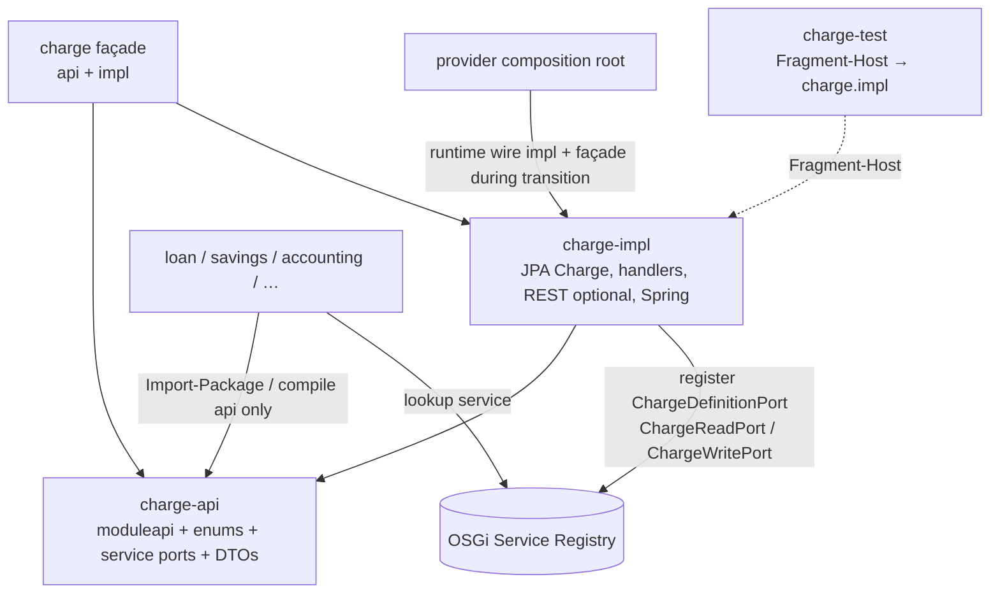

# fineract-charge – OSGi api / impl / test refactoring plan

Step-by-step plan to split **Charge Catalog** (fee *definitions*) into OSGi **api / impl / test** bundles, following the completed command pilot and the general playbook.

| | |
|--|--|
| **Status** | draft (not started) |
| **Decisions** | [ADR-022](decisions/ADR-022-osgi-api-impl-test-bundles-services.md), [ADR-021](decisions/ADR-021-modul-kommunikation-nur-ueber-module-api.md), [ADR-017](decisions/ADR-017-hexagonale-architektur.md) |
| **Playbook** | [15 OSGi Bundle Refactoring](15_osgi_bundle_refactoring.md) §15.6 Wave 1, §15.7 |
| **Reference pilot** | [15_osgi_bundle_refactoring_fineract-command.md](15_osgi_bundle_refactoring_fineract-command.md) (as-built) |
| **Context map** | Charge Catalog BC — [10 Domain Context Map](10_domain_context_map.md) |

**Inter-bundle access:** OSGi **Service Registry** only (api ports).  
**Not used:** Apache Karaf Features as a module contract.  
**Spring:** remains **inside** `charge-impl`; not removed before OSGi.  
**Module name:** capability border is **`fineract-charge`** (Gradle `:fineract-charge-api` / `-impl` / `-test`).

### Implementation status

| Step | Status | Notes |
|------|--------|-------|
| 0 Baseline & inventory | **pending** | Ports, foreign imports, provider/core drift |
| 1 Project shells | **pending** | `fineract-charge/{api,impl,test}` + `projectDir` |
| 2 Grow Module API ports | **pending** | Expand beyond `ChargeDefinitionPort` |
| 3 Extract api | **pending** | Pure contracts; no Spring/JPA/REST |
| 4 Move impl + façade | **pending** | Domain, services, handlers, OSGi registrar |
| 5 Bundle manifests | **pending** | BSN + Export/Import/Fragment-Host |
| 6 Fragment-Host test | **pending** | White-box tests on impl host |
| 7 Spring↔OSGi bridge | **pending** | Register ports when `BundleContext` present |
| 8 Consumer retarget | **pending** | loan/savings/accounting/… → api only |
| 9 Docs / acceptance | **pending** | READMEs, osgi table, ArchUnit freeze shrink |

**Not in this plan:** migrating *loan/savings account charges* (those are product BCs); full Equinox as primary process; removing Spring from charge.

---

## 1. Why charge is the next Wave‑1 module

| Signal | Charge today |
|--------|----------------|
| Bounded context | **Charge Catalog** — fee definitions, not account-level charges |
| Size | ~40 main Java types in `fineract-charge` (command-sized) |
| Existing Module API | `org.apache.fineract.portfolio.charge.moduleapi.ChargeDefinitionPort` (+ package-info ADR-021) |
| Reverse deps | loan, savings, accounting, investor, progressive/working-capital, provider, integration-tests |
| Hexagonal value | Catalog is a classic **published language** port; replaceable catalog impl is meaningful |
| Pilot pattern | Same recipe as command: api / impl / test fragment, façade for Boot |

Command proved the *mechanics*. Charge proves the pattern on a **real product BC** with many dependents and JPA.

---

## 2. Current structure (baseline inventory)

### 2.1 Gradle & layout (today)

```text
fineract-charge/                    # single project :fineract-charge
  build.gradle
  dependencies.gradle               # → fineract-core, fineract-tax, Spring, JPA/EclipseLink
  src/main/java/org/apache/fineract/portfolio/charge/
    moduleapi/                      # ChargeDefinitionPort (thin)
    domain/                         # Charge entity, enums, repository, converters
    service/                        # *interfaces* + some *Impl* (dropdown)
    handler/                        # CQRS command handlers
    api/                            # Jersey/Spring REST (ChargesApiResource)
    exception/
    serialization/
    request/
```

**Important split-brain (must be addressed in Steps 0–4):**

| Concern | Where it lives today |
|---------|----------------------|
| `ChargeWritePlatformService` / `ChargeReadPlatformService` **interfaces** | `fineract-charge` |
| **Implementations** (`*JpaRepositoryImpl`, `ChargeReadPlatformServiceImpl`) | **`fineract-provider`** |
| `ChargeData` DTO | **`fineract-core`** (`portfolio.charge.data`) |
| `ChargeTimeType` (+ some converters/exceptions) | **`fineract-core`** *and* overlapping types under charge |
| `Charge` JPA entity, most enums, repositories | `fineract-charge` |
| REST resource | `fineract-charge` |

This plan treats **consolidation of ownership** as part of the split, not a side quest.

### 2.2 Foreign usage (compile surface)

Approximate import pressure from **outside** `fineract-charge` (order of magnitude):

| Type / package | ~import sites | Risk for api split |
|----------------|---------------|--------------------|
| `charge.data.ChargeData` | high | Already in core — migrate or re-export carefully |
| `charge.domain.Charge` | high | **Must not** leave as cross-module entity; replace with ports/DTOs |
| `ChargeTimeType`, `ChargeCalculationType`, `ChargePaymentMode` | high | Value objects / enums → candidates for **api** (or shared kernel) |
| `ChargeRepositoryWrapper` | medium | Impl detail; consumers must use ports |
| `ChargeReadPlatformService` | medium | Interface → **api**; impl → **impl** |
| LoanCharge* / SavingsCharge* exceptions | low–medium | Misplaced in charge catalog; eventual move to loan/savings BCs |

`ChargeDefinitionPort` is **defined** but barely consumed yet — Step 2 grows real ports and Step 8 retires direct `Charge` usage.

### 2.3 Target structure (to-be)

```text
fineract-charge/
  README.md
  build.gradle                      # :fineract-charge  compatibility façade (api + impl)
  api/                              # :fineract-charge-api
  impl/                             # :fineract-charge-impl  (main only)
  test/                             # :fineract-charge-test   Fragment-Host → charge.impl
```

```gradle
// settings.gradle (target)
include ':fineract-charge-api'
project(':fineract-charge-api').projectDir = file('fineract-charge/api')
include ':fineract-charge-impl'
project(':fineract-charge-impl').projectDir = file('fineract-charge/impl')
include ':fineract-charge-test'
project(':fineract-charge-test').projectDir = file('fineract-charge/test')
include ':fineract-charge'   // façade
```

Optional: `fineract-charge-integrationtest` **only if** shared fixtures are needed by multiple modules (default: **not** required; loan/savings keep their own tests).

### 2.4 Bundle-SymbolicName (target)

| Project | Bundle-SymbolicName |
|---------|---------------------|
| `:fineract-charge-api` | `org.apache.fineract.charge.api` |
| `:fineract-charge-impl` | `org.apache.fineract.charge.impl` |
| `:fineract-charge-test` | `org.apache.fineract.charge.test` (`Fragment-Host: org.apache.fineract.charge.impl`) |
| `:fineract-charge` (façade) | not a long-term OSGi feature; Boot compatibility only |

### 2.5 Target runtime diagram



---

## 3. Contract vs implementation (what goes where)

### 3.1 `:fineract-charge-api` — pure contracts

**Include (Export-Package candidates):**

| Area | Examples | Notes |
|------|----------|--------|
| **moduleapi ports** | `ChargeDefinitionPort` (expand), catalog read/write ports | OSGi service interfaces |
| **Stable enums / VOs** | `ChargeAppliesTo`, `ChargeTimeType`, `ChargeCalculationType`, `ChargePaymentMode` | Today leaked as “domain”; treat as published language |
| **DTOs** | `ChargeData` (or slimmed catalog DTO) | Prefer move from core → charge-api over time |
| **Catalog exceptions** | `ChargeNotFoundException`, `ChargeIsNotActiveException`, apply/update/delete rules | Not loan-account charge lifecycle exceptions |

**Exclude from api:**

- JPA `@Entity` (`Charge`), repositories, converters wired to EclipseLink  
- Spring `@Service` / `@Configuration` / `@Component`  
- Jersey/Spring MVC REST resources  
- CQRS handlers, deserializers that depend on platform JSON plumbing (unless pure)  
- LoanCharge* / SavingsAccountCharge* types (loan/savings BC)

**Rules for api (same as command pilot):**

- No Spring Boot, no JPA, no servlet/Jersey types on the export surface  
- Depend only on shared kernel (`fineract-core` subset) where unavoidable; track and shrink  
- **Export-Package:** `…charge.moduleapi`, selected `…charge.data`, enum packages, catalog `exception` as needed  

**OSGi services (register from impl):**

| Service interface | Provider |
|-------------------|----------|
| `ChargeDefinitionPort` | charge-impl (exists; expand methods) |
| Catalog **read** port (new or `ChargeReadPlatformService` purged of platform leakage) | charge-impl |
| Catalog **write** port (new or cleaned `ChargeWritePlatformService`) | charge-impl |

Prefer **new moduleapi ports** that return DTOs/IDs over exporting legacy `*PlatformService` if those still require `JsonCommand` / infrastructure types. If `JsonCommand` must stay temporarily, document as **known debt** and keep write port behind an application service inside impl only (REST/handler in impl).

### 3.2 `:fineract-charge-impl` — domain + adapters + Spring

| Include | Notes |
|---------|--------|
| `domain.Charge` + repositories/wrappers | JPA aggregate root of the catalog |
| Service *implementations* | Move from provider into this module |
| Handlers, serialization, request mapping | Application layer |
| REST `ChargesApiResource` | Driven adapter (or later separate REST bundle) |
| Spring configuration / component scan | Allowed |
| `ChargeOsgiServiceRegistrar` (name TBD) | Reflection-based Service Registry bridge (command pattern) |

**Export-Package:** minimal (prefer **none** for domain packages). Other BCs must not compile against `Charge` entity.

### 3.3 `:fineract-charge-test` — Fragment-Host

- **Fragment-Host:** `org.apache.fineract.charge.impl`  
- White-box unit tests of catalog services/handlers  
- `testImplementation` of impl (+ core/test stack)  
- No production code in main  

### 3.4 Compatibility façade `:fineract-charge`

During migration, keep top-level/façade project that re-exports **api + impl** so existing `implementation project(':fineract-charge')` keeps compiling. Retire after Step 8.

---

## 4. Step-by-step plan (PRs)

Execute as **separate PRs**. Checkboxes start open; update when done.

### Step 0 — Baseline, inventory, Module API growth ⏳

1. [ ] Freeze baseline: `./gradlew :fineract-charge:test :fineract-loan:compileJava :fineract-savings:compileJava` (+ subset of charge-related ITs if needed)  
2. [ ] Document foreign imports of `Charge`, enums, services (refresh §2.2)  
3. [ ] List provider classes that implement charge interfaces — plan move into impl  
4. [ ] List charge types living in **core** — decide: move to charge-api, or keep as temporary shared kernel  
5. [ ] Expand **Module API** before physical split ([14.6](14_module_api_boundaries.md)):
   - Grow `ChargeDefinitionPort` (e.g. find by id → DTO, exists active, applies-to filters)  
   - Add read/query ports used by loan/savings product setup  
   - Prefer DTOs over `Charge` entity in new methods  
6. [ ] Optionally start **ArchUnit** rules: no new `import …charge.domain.Charge` from foreign modules (freeze store may allow existing)

**Exit:** Ports exist for the top foreign use-cases; inventory agreed.

### Step 1 — Introduce empty projects + settings ⏳

1. [ ] Create `fineract-charge/api`, `impl`, `test` shells (or rename after extract)  
2. [ ] `settings.gradle`: `:fineract-charge-api` / `-impl` / `-test` with `projectDir`  
3. [ ] api = `java-library`, no Spring Boot / JPA; impl = Spring + JPA + depends on api  
4. [ ] Keep `:fineract-charge` as façade depending on api+impl  
5. [ ] Register projects in root `build.gradle` lists (`fineractJavaProjects`, etc.)

**Exit:** Empty modules build; façade still points at current sources or empty impl.

### Step 2 — Extract api contracts ⏳

1. [ ] Move `moduleapi` + expanded ports into `charge/api`  
2. [ ] Move catalog enums / pure value types required by ports into api (or re-export from a single package)  
3. [ ] Move or duplicate-then-delete catalog exceptions that are part of the contract  
4. [ ] Plan `ChargeData`: either (a) move into charge-api, or (b) leave in core and depend on it from api with a ticket to reverse later  
5. [ ] Ensure **no** Spring/JPA/REST in api sources  
6. [ ] Export-Package whitelist on api jar manifest  

**Exit:** `:fineract-charge-api:jar` contains only pure contracts; consumers can depend on api (even if still also on façade).

### Step 3 — Move implementation into charge-impl ⏳

1. [ ] Move `domain`, handlers, service *impls*, serialization, REST into `charge/impl`  
2. [ ] **Move** `ChargeReadPlatformServiceImpl` / `ChargeWritePlatformServiceJpaRepositoryImpl` from **provider** into impl (update Spring component scan / configuration in provider)  
3. [ ] Façade re-exports api + impl for Boot  
4. [ ] Impl depends on api + tax/core as needed; **not** on loan/savings  

**Exit:** Provider no longer owns charge catalog service implementations; application boots with façade.

### Step 4 — Bundle metadata ⏳

| Header | api | impl | test |
|--------|-----|------|------|
| `Bundle-SymbolicName` | `org.apache.fineract.charge.api` | `org.apache.fineract.charge.impl` | `org.apache.fineract.charge.test` |
| `Export-Package` | moduleapi + contract packages | none (or starter only if required) | n/a |
| `Import-Package` | core/kernel as needed | api + Spring + JPA + … | host |
| `Fragment-Host` | — | — | `org.apache.fineract.charge.impl` |

Bootstrap with `jar { manifest { attributes … } }` (bnd optional later), same as command.

### Step 5 — Fragment-Host unit tests ⏳

1. [ ] Place white-box tests under `fineract-charge/test/src/test`  
2. [ ] Impl remains production **main only**  
3. [ ] `./gradlew :fineract-charge-test:test` green  
4. [ ] Do **not** create integrationtest unless a second module needs shared charge fixtures  

### Step 6 — Spring↔OSGi service registrar ⏳

1. [ ] Add `…charge.impl.osgi.ChargeOsgiServiceRegistrar` (reflection / optional BundleContext — command pattern)  
2. [ ] Register at least `ChargeDefinitionPort` + any new read ports  
3. [ ] Boot path without OSGi remains unchanged  
4. [ ] **No Karaf Features**

### Step 7 — Consumers compile against api (mechanical) ⏳

| Consumer | Target compile dep | Runtime |
|----------|-------------------|---------|
| loan, savings, accounting, investor, progressive, working-capital | `:fineract-charge-api` | provider brings impl |
| provider | façade or api+impl | composition root |
| integration-tests | runtimeElements of façade/impl as today | unchanged initially |

Gradle: replace `implementation project(':fineract-charge')` with **api** for domain modules; keep façade for provider until Step 8 done.

### Step 8 — Consumer retarget (semantic) ⏳

Hardest step — incremental PRs by consumer:

1. [ ] Replace `Charge` entity usage with ports/DTOs in **new** code paths first  
2. [ ] Loan product / loan charge setup: resolve catalog via port, map to loan-local types  
3. [ ] Savings / shares / accounting mappings: same  
4. [ ] Stop exporting / depending on `ChargeRepositoryWrapper` outside impl  
5. [ ] ArchUnit: forbid foreign `…charge.domain.Charge` (and shrink freeze)  
6. [ ] Deprecate façade `:fineract-charge` when domain modules no longer need it  

**Note:** Full elimination of `Charge` imports from loan may span multiple PRs; track residual freeze entries explicitly.

### Step 9 — Documentation & acceptance ⏳

1. [ ] Update this plan status table to **done** per step  
2. [ ] Module READMEs under `fineract-charge/{api,impl,test}`  
3. [ ] [osgi/README.md](../../osgi/README.md) pilot table row for charge  
4. [ ] [15.6 rollout](15_osgi_bundle_refactoring.md#suggested-rollout-order-postcommand-pilot) — mark charge as in progress/done  
5. [ ] Optional Gherkin `@adr-022` charge service present/absent  

**Acceptance criteria**

| # | Criterion | Status |
|---|-----------|--------|
| 1 | api, impl, test fragment artifacts build | pending |
| 2 | api has no Spring / JPA / REST | pending |
| 3 | Domain modules compile on **charge-api** only (provider exception) | pending |
| 4 | Ports registered in OSGi Service Registry (bridge present) | pending |
| 5 | No Karaf Feature descriptors | pending |
| 6 | Spring still wires impl under Boot | pending |
| 7 | Fragment-Host tests green | pending |
| 8 | Sources under `fineract-charge/{api,impl,test}` | pending |
| 9 | No *new* foreign uses of `Charge` entity; freeze only shrinks | pending |
| 10 | Provider no longer hosts charge catalog service impls | pending |

---

## 5. Suggested PR sequence

| PR | Title (suggested) | Steps |
|----|-------------------|--------|
| PR-0 | charge: inventory + expand ChargeDefinitionPort / moduleapi | 0 |
| PR-1 | charge: api/impl/test Gradle shells + façade | 1 |
| PR-2 | charge: extract charge-api contracts (ports, enums, DTO policy) | 2 |
| PR-3 | charge: move catalog stack into charge-impl; pull impls from provider | 3 |
| PR-4 | charge: OSGi manifests | 4 |
| PR-5 | charge: Fragment-Host unit tests | 5 |
| PR-6 | charge: OSGi service registrar | 6 |
| PR-7 | charge: domain modules depend on charge-api | 7 |
| PR-8+ | charge: retarget loan/savings/… off Charge entity | 8 |
| PR-final | charge: docs, freeze shrink, façade deprecate | 9 |

---

## 6. Risks and mitigations

| Risk | Mitigation |
|------|------------|
| Widespread `Charge` entity coupling | Expand ports first; freeze new imports; multi-PR retarget; temporary façade |
| Types split across **core** and charge | Explicit Step 0 decision; prefer charge-api ownership of catalog DTO/enums |
| Service impls still in **provider** | Step 3 move is mandatory; scan provider for leftover charge components |
| Enum duplication (core vs charge) | Single source of truth in api; delete duplicates |
| `JsonCommand` on write API | Keep write application service in impl; expose only high-level ports to other BCs |
| Tax dependency | impl may depend on tax-api later; until tax is split, depend on `fineract-tax` monolith |
| LoanCharge* exceptions in charge module | Do not put on charge-api export; migrate to loan in a follow-up |
| Nested `projectDir` breaks CI name lists | Keep Gradle names `fineract-charge-api` etc. stable |
| Equinox not in CI | Manifest + unit tests first; optional Equinox smoke |

---

## 7. Out of scope

- Full **loan charge** / **savings charge** aggregate redesign  
- Event-sourcing the charge catalog ([ADR-020](decisions/ADR-020-event-sourcing-writes-pflicht.md))  
- Karaf Features packaging  
- Removing Spring from charge-impl  
- Running full Fineract inside Equinox as the primary process  
- Splitting tax in the same PR series (coordinate only: charge-impl may keep depending on tax monolith until tax Wave 1)

---

## 8. Commands cheat sheet

```bash
# After shells exist
./gradlew :fineract-charge-api:jar \
  :fineract-charge-impl:jar \
  :fineract-charge-test:test \
  :fineract-charge:jar

# Consumer compile check (examples)
./gradlew :fineract-loan:compileJava \
  :fineract-savings:compileJava \
  :fineract-accounting:compileJava \
  :fineract-provider:compileJava

# Equinox experiment (optional)
# cp fineract-charge/api/build/libs/*.jar osgi/bundles/
# cp fineract-charge/impl/build/libs/*.jar osgi/bundles/
# cp fineract-charge/test/build/libs/*.jar osgi/bundles/   # Fragment-Host = charge.impl
```

---

## 9. Relation to architecture docs

| Artifact | Relation |
|----------|----------|
| [15](15_osgi_bundle_refactoring.md) §15.6 | Charge is Wave‑1 #1 after command |
| [15a command](15_osgi_bundle_refactoring_fineract-command.md) | Mechanical template (shells, façade, Fragment-Host, registrar) |
| [14 Module API](14_module_api_boundaries.md) | Ports before physical split |
| [10 Context map](10_domain_context_map.md) | Charge Catalog BC |
| [ADR-022](decisions/ADR-022-osgi-api-impl-test-bundles-services.md) | Bundle layout + Service Registry |
| [osgi/README](../../osgi/README.md) | Equinox scaffold |

---

*Navigation:* [15 playbook](15_osgi_bundle_refactoring.md) · [command pilot](15_osgi_bundle_refactoring_fineract-command.md) · [ADR-022](decisions/ADR-022-osgi-api-impl-test-bundles-services.md) · [14 Module API](14_module_api_boundaries.md)
