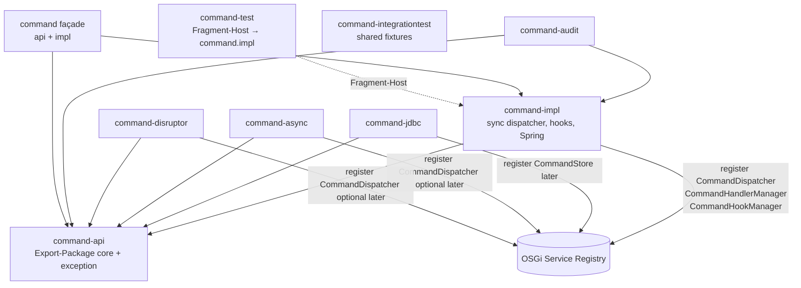

# fineract-command – OSGi api / impl / test refactoring plan

Step-by-step pilot for [ADR-022](decisions/ADR-022-osgi-api-impl-test-bundles-services.md), [ADR-023](decisions/ADR-023-fineract-command-module-naming.md), and the general playbook [15 OSGi Bundle Refactoring](15_osgi_bundle_refactoring.md).

**Inter-bundle access:** OSGi **Service Registry** only.  
**Not used:** Apache Karaf Features (or similar feature install descriptors as a module contract).  
**Spring:** remains **inside** implementation bundles; not removed before OSGi.  
**Module name:** capability border is **`fineract-command`** (not `…-command-core`) — [ADR-023](decisions/ADR-023-fineract-command-module-naming.md).

### Implementation status

| Step | Status | Notes |
|------|--------|-------|
| 0 Baseline | **done** | Command family tests green before split |
| 1 Project shells | **done** | Gradle projects + directory grouping under `fineract-command/` |
| 2 Extract api | **done** | Contracts in `fineract-command/api`; no Spring in api |
| 3 Move impl + façade | **done** | Impl in `fineract-command/impl`; façade was transitional only |
| 3b Directory layout | **done** | `fineract-command/{api,impl}` via `projectDir`; test fragment top-level |
| 3c Naming (ADR-023) | **done** | Dropped `fineract-command-core*`; BSN `command.api` / `command.impl` |
| 4 OSGi manifests | **done** | BSN + Export/Import/Fragment-Host on jars |
| 5 Fragment-Host test | **done** | `:fineract-command-test` under `fineract-command/test` (Fragment-Host); shared fixtures in `:fineract-command-integrationtest` |
| 6 Spring↔OSGi bridge | **done** | `CommandOsgiServiceRegistrar` (Spring path) + `CommandOsgiBundleActivator` (Equinox start; Spring-free empty registry) |
| 7 Satellites → api | **done** | jdbc/async/disruptor compile on api; audit on api+impl; tests may use impl |
| 8 Consumer retarget | **done** | Façade removed; core/mix/document-api only; provider api+impl; cob no dep |
| 9 Docs / acceptance | **done** | This plan + READMEs + ADR-023 + `osgi/README.md` |

**Not in this pilot:** packaging/running full Fineract inside Equinox as the primary process.

---

## 1. Why this pilot

The modern CQRS command stack ([ADR-004](decisions/ADR-004-cqrs-und-command-pipeline-beibehalten-modernisieren.md)) is interface-heavy with satellite modules (jdbc, async, disruptor, audit). That makes it a good **B2 pilot**: clear ports (`CommandDispatcher`, `CommandStore`, managers), multiple replaceable impls, limited domain coupling.

---

## 2. As-built structure (current)

### 2.1 Filesystem vs Gradle projects

Sources are grouped under `fineract-command/`; **Gradle project names** stay path-stable via `projectDir` mapping in `settings.gradle`:

```text
fineract-command/
  README.md
  api/          # Gradle :fineract-command-api
  impl/         # Gradle :fineract-command-impl  (main only)
  test/         # Gradle :fineract-command-test  (Fragment-Host unit tests of impl)

fineract-command-integrationtest/  # shared IT fixtures for all command modules
fineract-command-jdbc/
fineract-command-async/
fineract-command-disruptor/
fineract-command-audit/
```

```gradle
// settings.gradle (excerpt)
include ':fineract-command-api'
project(':fineract-command-api').projectDir = file('fineract-command/api')
include ':fineract-command-impl'
project(':fineract-command-impl').projectDir = file('fineract-command/impl')
include ':fineract-command-test'
project(':fineract-command-test').projectDir = file('fineract-command/test')
// No :fineract-command façade
include ':fineract-command-integrationtest'
// … satellites …
```

| Path | Gradle project | Role |
|------|----------------|------|
| `fineract-command/api` | `:fineract-command-api` | Contracts; **Export-Package**; no Spring |
| `fineract-command/impl` | `:fineract-command-impl` | Sync dispatcher, hooks, starter, OSGi bridge; Spring inside; **no unit-test sources** |
| `fineract-command/test` | `:fineract-command-test` | White-box unit tests of **impl**; **Fragment-Host** → `command.impl` |
| `fineract-command-integrationtest/` | `:fineract-command-integrationtest` | Shared IT fixtures/samples (`CommandBaseTest`, dummy sample) for **all** command modules |
| top-level | `:fineract-command-jdbc` / `-async` / `-disruptor` / `-audit` | Satellites (compile on api where possible) |

### 2.2 Bundle-SymbolicName

| Project | Bundle-SymbolicName |
|---------|---------------------|
| `:fineract-command-api` | `org.apache.fineract.command.api` |
| `:fineract-command-impl` | `org.apache.fineract.command.impl` |
| `:fineract-command-test` | `org.apache.fineract.command.test` (`Fragment-Host: org.apache.fineract.command.impl`) |
| `:fineract-command-integrationtest` | `org.apache.fineract.command.integrationtest` (no Fragment-Host) |
| satellites (later) | `org.apache.fineract.command.jdbc` / `.async` / `.disruptor` / `.audit` |

### 2.3 Package placement (as implemented)

| Package | Location | Slice |
|---------|----------|--------|
| `org.apache.fineract.command.core` | `fineract-command/api` | **api** — ports, `Command`, constants, state, store |
| `org.apache.fineract.command.core.exception` | `fineract-command/api` | **api** |
| `org.apache.fineract.command.implementation` | `fineract-command/impl` | **impl** — default managers + sync dispatcher |
| `org.apache.fineract.command.hook` | `fineract-command/impl` | **impl** |
| `org.apache.fineract.command.starter` | `fineract-command/impl` | **impl** — Boot auto-config |
| `org.apache.fineract.command.impl.config` | `fineract-command/impl` | **impl** — `CommandProperties` (Spring) |
| `org.apache.fineract.command.impl.osgi` | `fineract-command/impl` | **impl** — `CommandOsgiServiceRegistrar` |
| `org.apache.fineract.command.test.*` | `fineract-command-integrationtest` | **shared IT fixtures** (package name historical) |

### 2.4 Dependency rules (as implemented)

| Consumer | Depends on |
|----------|------------|
| jdbc / async / disruptor | **compile:** `:fineract-command-api`; **test:** may add impl + integrationtest |
| audit | **compile:** `:fineract-command-api` + `:fineract-command-impl` (`CommandProperties`) |
| `:fineract-command-test` | **test:** `:fineract-command-impl` + `:fineract-command-integrationtest` + test stack |
| `:fineract-command-integrationtest` | **main:** `:fineract-command-api` (+ Spring/testcontainers for samples/base) |
| core / mix / document-impl | **command-api only** |
| cob | none (legacy `commands.*`) |
| provider | **command-api + command-impl** (+ jdbc / audit satellites) |

### 2.5 Tests (as implemented)

| Location | Types |
|----------|--------|
| `fineract-command-integrationtest/src/main` | `CommandBaseTest` + sample REST/handlers/services (`org.apache.fineract.command.test.*`) |
| `fineract-command/test/src/test` | `CommandDispatcherTest`, `DefaultCommandHandlerManagerTest`, `CommandSampleApiTest` (impl white-box) |
| satellite modules | Own `TestConfiguration` + IT; `testImplementation` `:fineract-command-integrationtest` for fixtures |

### 2.6 Runtime wiring diagram



---

## 3. Historical inventory (before the pilot)

Before the split, a single top-level `fineract-command` module held contracts, default impl, hooks, starter, and tests together. Satellites depended on `project(':fineract-command')`. That state is fully replaced by §2 for the core stack; satellites remain separate modules.

---

## 4. Contract vs implementation (what goes where)

### 4.1 `:fineract-command-api` (`fineract-command/api`)

**Pure Java** contracts:

- `Command`, `CommandState`, `CommandConstants`
- `CommandDispatcher`
- `CommandHandler`
- `CommandHandlerManager`
- `CommandHookBefore`, `CommandHookAfter`, `CommandHookError`, `CommandHookManager`
- `CommandStore`
- All `core.exception.*`

**Rules for api:**

- No Spring stereotypes, no Boot auto-config, no `@ConfigurationProperties`
- Prefer no servlet / web types
- Guava `TypeToken` on `CommandHandler` is acceptable for this pilot (known debt)
- **Export-Package:** `org.apache.fineract.command.core`, `org.apache.fineract.command.core.exception`

**OSGi services (registered from impl / satellites):**

| Service interface | Primary provider |
|-------------------|------------------|
| `CommandDispatcher` | `command-core-impl` (sync default); optional async/disruptor |
| `CommandHandlerManager` | `command-core-impl` |
| `CommandHookManager` | `command-core-impl` |
| `CommandStore` | `command-jdbc` (optional until store required) |

Handlers and individual hooks stay Spring-scanned inside the process for the pilot.

### 4.2 `:fineract-command-impl` (`fineract-command/impl`)

- `implementation.*` (default managers + sync dispatcher)
- `hook.*` (built-in hooks)
- `starter.*` + Boot `AutoConfiguration.imports`
- `impl.config.CommandProperties` (`@ConfigurationProperties`)
- `impl.osgi.CommandOsgiServiceRegistrar` (Service Registry bridge)

Spring stays here: `@Component`, `@Configuration`, `@ConditionalOnMissingBean`, component scan.

### 4.3 `:fineract-command-test` (`fineract-command/test` fragment)

- **Fragment** of command-impl for white-box/unit tests of the host only
- Manifest: `Fragment-Host: org.apache.fineract.command.impl`
- `src/test` — JUnit/Spring Boot tests of the host (packaged into the fragment JAR for Equinox)
- Depends on `:fineract-command-integrationtest` for sample fixtures
- Gradle: `./gradlew :fineract-command-test:test`

### 4.4 `:fineract-command-integrationtest` (shared IT support)

- Test-support library for **all** command modules (jdbc/async/disruptor/audit + command-test)
- `src/main` — `CommandBaseTest`, dummy sample domain (`org.apache.fineract.command.test.*`)
- **Not** Fragment-Host of impl; not a production dependency
- Satellites: `testImplementation project(':fineract-command-integrationtest')`

---

## 5. Step-by-step plan (PRs)

Execute as **separate PRs** so each step stays reviewable and green. Checkboxes below reflect **current** progress.

### Step 0 — Preconditions (docs & guardrails) ✅

- [x] Confirm pilot = `fineract-command` ([ADR-022](decisions/ADR-022-osgi-api-impl-test-bundles-services.md) B2)
- [x] Read this plan + [15](15_osgi_bundle_refactoring.md)
- [x] Baseline green for command family tests

### Step 1 — Introduce empty projects + settings ✅

1. [x] Add projects `:fineract-command-api`, `:fineract-command-impl`
2. [x] Register in `settings.gradle`
3. [x] api = `java-library`, no Spring Boot; impl = Spring deps + depends on api
4. [x] Keep `:fineract-command` as compatibility façade

### Step 2 — Move api types into core-api ✅

1. [x] Move contracts to api (package names kept under `org.apache.fineract.command.core`)
2. [x] Leave implementation/hook/starter/`CommandProperties` out of api
3. [x] Satellites compile against api where possible

### Step 3 — Move default implementation into core-impl ✅

1. [x] Move `implementation`, `hook`, `starter`, `CommandProperties` → impl
2. [x] Move Boot `AutoConfiguration.imports` → impl
3. [x] Façade option A: thin module re-exporting api + impl
4. [x] Root `build.gradle` project lists updated

### Step 3b — Directory layout under `fineract-command/` ✅

**Goal:** Physical grouping without renaming Gradle project coordinates.

1. [x] Move api sources to `fineract-command/api`
2. [x] Move impl sources to `fineract-command/impl`
3. [x] Map via `project(…).projectDir = file('fineract-command/…')`
4. [x] Keep project names `:fineract-command-api` / `:fineract-command-impl` (stable for deps / CI)
5. [x] Split unit fragment (`fineract-command/test`) from shared IT fixtures (`fineract-command-integrationtest`)

### Step 4 — Bundle metadata ✅

| Header | api | impl |
|--------|-----|------|
| `Bundle-SymbolicName` | `org.apache.fineract.command.api` | `org.apache.fineract.command.impl` |
| `Bundle-Version` | project version | project version |
| `Export-Package` | `core` + `core.exception` | none |
| `Import-Package` | minimal | api packages + Spring + … |

Implemented with `jar { manifest { attributes … } }` bootstrap (bnd optional later).

### Step 5 — Convert `fineract-command-test` to Fragment-Host ✅

1. [x] Fragment-Host → `org.apache.fineract.command.impl`
2. [x] White-box tests in `fineract-command/test/src/test`; shared fixtures in `fineract-command-integrationtest/src/main`
3. [x] `:fineract-command-impl` is production **main only** (no unit-test source set content)
4. [x] `:fineract-command-test:test` uses `testImplementation` of impl + integrationtest

### Step 6 — Spring↔OSGi bridge ✅

- [x] `CommandOsgiServiceRegistrar` in `impl.osgi`
- Registers (when OSGi `BundleContext` present): `CommandDispatcher`, `CommandHandlerManager`, `CommandHookManager`
- Reflection-based so plain Spring Boot has no hard OSGi dependency
- **No Karaf Features**

### Step 7 — Satellite modules depend on api ✅ (compile scope)

| Module | Compile deps | OSGi service registration |
|--------|--------------|---------------------------|
| `fineract-command-jdbc` | api | later (`CommandStore`) |
| `fineract-command-async` | api | later (optional dispatcher) |
| `fineract-command-disruptor` | api | later (optional dispatcher) |
| `fineract-command-audit` | api + impl | hooks still Spring-only for now |

### Step 8 — Consumer retarget & compatibility cleanup ✅

1. [x] Retarget consumers off façade:
   | Consumer | Edge |
   |----------|------|
   | core, mix, document-impl | **command-api only** |
   | cob | **no** command dep (legacy `commands.*` only) |
   | provider | **command-api + command-impl** (+ jdbc/audit satellites) |
2. [x] Removed façade project `:fineract-command` (no aggregator JAR)
3. [x] Root project lists: api / impl / test / satellites only
4. [x] Domain modules do not depend on `fineract-command-impl` (provider composition root does)

### Step 9 — Documentation & acceptance ✅

- [x] Plan updated with as-built layout (this document)
- [x] `fineract-command` README (no façade)
- [x] `osgi/README.md` pilot table
- [ ] Optional Gherkin `@adr-022` for command service present/absent

**Acceptance criteria**

| # | Criterion | Status |
|---|-----------|--------|
| 1 | api, impl, test fragment artifacts | done |
| 2 | api has no Spring / Boot / starter classes | done |
| 3 | Satellites compile on api (audit exception for `CommandProperties`) | done |
| 4 | Cross-bundle ports via **OSGi Service Registry** (bridge present) | done |
| 5 | No Karaf Feature descriptors | done |
| 6 | Spring still wires impl under Boot | done |
| 7 | Fragment-Host tests green | done |
| 8 | Sources under `fineract-command/{api,impl,test}` + integrationtest fixtures | done |
| 9 | Full consumer retarget off façade | **done** |

---

## 6. Suggested PR sequence (summary)

| PR | Title (suggested) | Steps | Status |
|----|-------------------|--------|--------|
| PR-1 | command: core-api / core-impl shells | 1 | done |
| PR-2 | command: extract core-api contracts | 2 | done |
| PR-3 | command: move default stack to core-impl + façade | 3 | done |
| PR-3b | command: group sources under fineract-command/{api,impl} | 3b | done |
| PR-4 | command: OSGi bundle manifests | 4 | done |
| PR-5 | command: Fragment-Host test bundle | 5 | done |
| PR-6 | command: Spring↔OSGi service registrar | 6 | done |
| PR-7 | command satellites depend on api | 7 | done |
| PR-final | command: drop façade; consumer retarget | 8–9 | **done** |

---

## 7. Risks and mitigations

| Risk | Mitigation |
|------|------------|
| Package split breaks Boot auto-config | `AutoConfiguration.imports` on impl; façade re-exports |
| Multiple `CommandDispatcher` beans | `@ConditionalOnMissingBean` + OSGi service ranking |
| `CommandProperties` on api by mistake | Lives in `impl.config` only |
| Nested dirs break Gradle `it.name` lists | Keep project names `fineract-command-api` / `-impl` with `projectDir` |
| Equinox not embedded in CI | Manifest + unit tests first; Equinox smoke optional |
| Dual role of former command-test | Split: unit fragment vs shared integrationtest fixtures |

---

## 8. Out of scope for this pilot

- Migrating legacy `SynchronousCommandProcessingService` / portfolio handlers
- Full domain modules (loan, savings) to api/impl
- Karaf Features packaging
- Removing Spring from command-impl
- Running full Fineract inside Equinox as the primary process
- Event-sourcing command store redesign ([ADR-020](decisions/ADR-020-event-sourcing-writes-pflicht.md)) except existing `CommandStore` port

---

## 9. Commands cheat sheet

```bash
# Core command stack
./gradlew :fineract-command-api:build \
  :fineract-command-impl:jar \
  :fineract-command-integrationtest:jar \
  :fineract-command-test:test \
  :fineract-command:jar \
  :fineract-command-jdbc:test \
  :fineract-command-async:test \
  :fineract-command-disruptor:test \
  :fineract-command-audit:test

# Install pilot jars for Equinox experiments
# cp fineract-command/api/build/libs/*.jar osgi/bundles/
# cp fineract-command/impl/build/libs/*.jar osgi/bundles/
# cp fineract-command/test/build/libs/*.jar osgi/bundles/   # fragment host = command.impl
```

---

## 10. References

| Doc | Use |
|-----|-----|
| [ADR-022](decisions/ADR-022-osgi-api-impl-test-bundles-services.md) | Decision: services, api/impl/test, Spring stays |
| [ADR-023](decisions/ADR-023-fineract-command-module-naming.md) | Capability name `fineract-command`; drop `…-core` |
| [15 OSGi Bundle Refactoring](15_osgi_bundle_refactoring.md) | General stages B0–B6 |
| [ADR-003](decisions/ADR-003-spring-boot-gradle-module-als-kern-beibehalten.md) | Spring Boot retained |
| [ADR-004](decisions/ADR-004-cqrs-und-command-pipeline-beibehalten-modernisieren.md) | New command stack |
| [ADR-002](decisions/ADR-002-osgi-equinox-fuer-laufzeitmodularitaet.md) | Equinox |
| [`fineract-command/README.md`](../../fineract-command/README.md) | Stack motivation + layout table |
| [`osgi/README.md`](../../osgi/README.md) | Equinox scaffold + pilot BSN table |

---

*Navigation:* [15 general playbook](15_osgi_bundle_refactoring.md) · [ADR-022](decisions/ADR-022-osgi-api-impl-test-bundles-services.md) · [ADR-023](decisions/ADR-023-fineract-command-module-naming.md) · [arc42 README](README.md)
