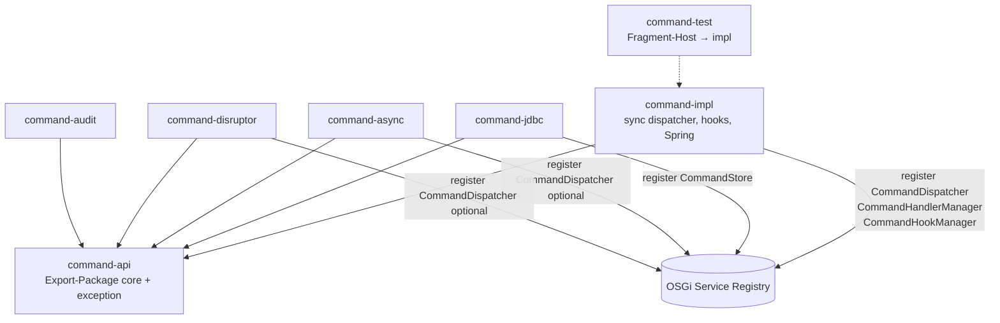

# fineract-command – OSGi api / impl / test refactoring plan

Step-by-step pilot for [ADR-022](decisions/ADR-022-osgi-api-impl-test-bundles-services.md) and the general playbook [15 OSGi Bundle Refactoring](15_osgi_bundle_refactoring.md).

**Inter-bundle access:** OSGi **Service Registry** only.  
**Not used:** Apache Karaf Features (or similar feature install descriptors as a module contract).  
**Spring:** remains **inside** implementation bundles; not removed before OSGi.

### Implementation status

| Step | Status | Notes |
|------|--------|-------|
| 0 Baseline | done | Command family tests green before split |
| 1 Project shells | done | `fineract-command-api`, `fineract-command-impl` in `settings.gradle` |
| 2 Extract api | done | `core` + `exception` contracts; no Spring in api |
| 3 Move impl + façade | done | `fineract-command-core` re-exports api+impl; `CommandProperties` → `impl.config` |
| 4 OSGi manifests | done | BSN + Export/Import/Fragment-Host on jars |
| 5 Fragment-Host test | done | `fineract-command-test` Fragment-Host → `org.apache.fineract.command.impl` |
| 6 Spring↔OSGi bridge | done | `CommandOsgiServiceRegistrar` (reflection; no hard OSGi runtime dep) |
| 7 Satellites → api | done | jdbc/async/disruptor compile on api; audit on api+impl; tests may use impl |
| 8 Consumer retarget | partial | core/provider/cob/document/mix still use façade (compatible) |
| 9 Docs / acceptance | done | This table + `fineract-command-core/README.md` |

**Not in this pilot:** packaging/running full Fineract inside Equinox as the primary process.

---

## 1. Why this pilot

`fineract-command-core` is the modern CQRS command stack ([ADR-004](decisions/ADR-004-cqrs-und-command-pipeline-beibehalten-modernisieren.md)). It is already small, interface-heavy, and has satellite modules:

| Gradle project | Role today |
|----------------|------------|
| `fineract-command-core` | Core contracts + default sync dispatcher + hooks + Spring starter |
| `fineract-command-jdbc` | `CommandStore` JDBC adapter |
| `fineract-command-async` | Async `CommandDispatcher` impl |
| `fineract-command-disruptor` | Disruptor `CommandDispatcher` impl |
| `fineract-command-audit` | Audit hooks |
| `fineract-command-test` | Shared sample API/handlers for tests (not an OSGi fragment yet) |

That makes it a good **B2 pilot**: clear ports (`CommandDispatcher`, `CommandStore`, managers), multiple replaceable impls, limited domain coupling.

---

## 2. Current inventory (as-is)

### 2.1 Packages in `fineract-command-core`

| Package | Contents | Target slice |
|---------|----------|--------------|
| `org.apache.fineract.command.core` | `Command`, `CommandDispatcher`, `CommandHandler`, `CommandHandlerManager`, `CommandHook*`, `CommandStore`, `CommandState`, `CommandConstants`, exceptions | **api** (mostly) |
| `org.apache.fineract.command.core.exception` | Handler/policy exceptions | **api** |
| `org.apache.fineract.command.implementation` | `SynchronousCommandDispatcher`, `DefaultCommandHandlerManager`, `DefaultCommandHookManager` | **impl** |
| `org.apache.fineract.command.hook` | Servlet/username/timestamp hooks | **impl** (or later optional hook bundles) |
| `org.apache.fineract.command.starter` | `CommandConfiguration`, `CommandAutoConfiguration` | **impl** |
| `CommandProperties` (in `core` today) | `@ConfigurationProperties` | **impl** (Spring-specific; keep out of pure api export if possible) |

### 2.2 Downstream consumers of `project(':fineract-command-core')`

- `fineract-command-jdbc`, `-async`, `-disruptor`, `-audit`, `-test`
- `fineract-mix` (and any provider wiring via Boot auto-config)

After the split, these must compile against **`fineract-command-api` only** (plus their own impl), not against default dispatcher classes.

### 2.3 Existing tests

| Location | Types |
|----------|--------|
| `fineract-command-impl/src/test` (formerly under façade) | `CommandDispatcherTest`, `DefaultCommandHandlerManagerTest`, `CommandSampleApiTest` |
| `fineract-command-test` | Sample REST/handlers/services used by those tests |
| satellite modules | Own `TestConfiguration` + optional IT |

---

## 3. Target structure

```text
fineract-command-api/          # OSGi interface bundle
fineract-command-impl/         # OSGi implementation bundle (default sync + hooks + Spring)
fineract-command-test/         # OSGi fragment host = command-impl (repurpose existing project)

# Satellites (later steps; same pattern when touched)
fineract-command-jdbc/         # impl bundle of CommandStore (depends on api)
fineract-command-async/         # impl bundle of CommandDispatcher
fineract-command-disruptor/     # impl bundle of CommandDispatcher
fineract-command-audit/         # impl bundle of hooks
```

Recommended Bundle-SymbolicNames:

| Project | Bundle-SymbolicName |
|---------|---------------------|
| `fineract-command-api` | `org.apache.fineract.command.api` |
| `fineract-command-impl` | `org.apache.fineract.command.impl` |
| `fineract-command-test` | `org.apache.fineract.command.test` (`Fragment-Host: org.apache.fineract.command.impl`) |
| `fineract-command-jdbc` | `org.apache.fineract.command.jdbc` |
| `fineract-command-async` | `org.apache.fineract.command.async` |
| `fineract-command-disruptor` | `org.apache.fineract.command.disruptor` |
| `fineract-command-audit` | `org.apache.fineract.command.audit` |



---

## 4. Contract vs implementation (what goes where)

### 4.1 `fineract-command-api` (Export-Package)

Move / keep as **pure Java** contracts:

- `Command`, `CommandState`, `CommandConstants`
- `CommandDispatcher`
- `CommandHandler`
- `CommandHandlerManager`
- `CommandHookBefore`, `CommandHookAfter`, `CommandHookError`, `CommandHookManager`
- `CommandStore`
- All `core.exception.*`

**Rules for api:**

- No Spring stereotypes, no Boot auto-config, no `@ConfigurationProperties`
- Prefer no servlet / web types
- Guava `TypeToken` on `CommandHandler` is acceptable for this pilot (third-party type on contract); document as known debt — optional later: replace with pure Java type token if desired
- **Export-Package:** `org.apache.fineract.command.core`, `org.apache.fineract.command.core.exception` (versioned)

**OSGi services to register later (from impl / satellites):**

| Service interface | Primary provider |
|-------------------|------------------|
| `CommandDispatcher` | `command-impl` (sync default); optional async/disruptor |
| `CommandHandlerManager` | `command-impl` |
| `CommandHookManager` | `command-impl` |
| `CommandStore` | `command-jdbc` (optional until store required) |

Handlers and individual hooks are typically **not** cross-module OSGi services for the pilot; they stay Spring-scanned inside the process. Promote to OSGi services only when external bundles must contribute handlers without Spring scan.

### 4.2 `fineract-command-impl`

- `implementation.*` (default managers + sync dispatcher)
- `hook.*` (built-in hooks)
- `starter.*` + Boot `AutoConfiguration.imports`
- `CommandProperties` (Spring config) — move package to e.g. `org.apache.fineract.command.impl.config` or keep under impl scan path

Spring stays here: `@Component`, `@Configuration`, `@ConditionalOnMissingBean`, component scan.

### 4.3 `fineract-command-test` (fragment)

- Convert role from “library module used via testImplementation” to:
  1. **Fragment** of `command-impl` for white-box/unit tests of managers/dispatcher, **and/or**
  2. Keep sample fixtures as fragment content so they share impl classloader when needed
- Manifest: `Fragment-Host: org.apache.fineract.command.impl`
- Pure contract tests (mock `CommandDispatcher` only) can live on api as plain JUnit without fragment

---

## 5. Step-by-step plan (PRs)

Execute as **separate PRs** so each step stays reviewable and green.

### Step 0 — Preconditions (docs & guardrails)

**Goal:** Align team on scope; no code move yet.

- [ ] Confirm pilot = `fineract-command-core` ([ADR-022](decisions/ADR-022-osgi-api-impl-test-bundles-services.md) B2)
- [ ] Read this plan + [15](15_osgi_bundle_refactoring.md)
- [ ] Baseline green:  
  `./gradlew :fineract-command-core:test :fineract-command-jdbc:test :fineract-command-async:test :fineract-command-disruptor:test :fineract-command-audit:test`
- [ ] List all `implementation project(':fineract-command-core')` edges (settings / dependencies)

**Exit:** Baseline green; owners agreed.

---

### Step 1 — Introduce empty projects + settings

**Goal:** Gradle skeleton without moving sources.

1. Add projects:
   - `fineract-command-api`
   - `fineract-command-impl`
2. Register in `settings.gradle`
3. Copy/adapt `build.gradle` / `dependencies.gradle` stubs:
   - **api:** `java-library`, minimal deps (Guava if `CommandHandler` stays; **no** Spring Boot)
   - **impl:** depends on `api` + current Spring deps from today`s `fineract-command-core`
4. Keep existing `:fineract-command-core` as **facade** temporarily (see Step 3) **or** rename in place later — recommended temporary facade:

```text
fineract-command-core  →  aggregator that re-exports api + impl for one release
fineract-command-api
fineract-command-impl
```

**Exit:** Empty projects compile; existing modules still use `:fineract-command-core`.

---

### Step 2 — Move api types into `fineract-command-api`

**Goal:** Physical split of contracts.

1. Move interfaces, `Command`, exceptions, constants, enums from `core` to `fineract-command-api` (same Java package names preferred to avoid mass import churn).
2. **Do not** move:
   - `implementation.*`
   - `hook.*`
   - `starter.*`
   - `CommandProperties` if it carries Spring annotations → move to impl package
3. Fix `fineract-command-core` (legacy project or impl) to `api project(':fineract-command-api')`
4. Point satellites (`jdbc`, `async`, `disruptor`, `audit`, `test`) at **`fineract-command-api`** instead of full command module for compile scope; runtime still needs impl where required.

**Package note:** Keeping `org.apache.fineract.command.core` package name in the api JAR is intentional (binary-friendly). OSGi Export-Package is that package, not a rename to `moduleapi` in this pilot. Optional later alias package `…command.moduleapi` is out of scope.

**Exit:**

```bash
./gradlew :fineract-command-api:compileJava \
  :fineract-command-core:test \
  :fineract-command-jdbc:test \
  :fineract-command-async:test \
  :fineract-command-disruptor:test \
  :fineract-command-audit:test
```

All green; api JAR contains **no** Spring types.

---

### Step 3 — Move default implementation into `fineract-command-impl`

**Goal:** Default sync stack lives only in impl.

1. Move `implementation`, `hook`, `starter`, `CommandProperties` → `fineract-command-impl`
2. Move `META-INF/spring/….AutoConfiguration.imports` → impl
3. Make `fineract-command-core` either:
   - **A (recommended):** thin compatibility module depending on `api` + `impl` (for Boot apps that still use `project(':fineract-command-core')`), or  
   - **B:** delete and retarget all consumers to `api` + `impl` in the same PR (larger blast radius)
4. Update `build.gradle` root lists / spotless / jacoco includes if they name `fineract-command-core` only
5. Eclipse `sourceSets` paths (env=eclipse) → update to new project dirs

**Exit:** Runtime behaviour unchanged under Spring Boot auto-config; unit tests still pass via Spring test context.

---

### Step 4 — Bundle metadata (bnd / jar manifests)

**Goal:** Real OSGi bundle identity (still may run under plain classpath in CI).

For **api** and **impl** (and later satellites):

| Header | api | impl |
|--------|-----|------|
| `Bundle-SymbolicName` | `org.apache.fineract.command.api` | `org.apache.fineract.command.impl` |
| `Bundle-Version` | project version | project version |
| `Export-Package` | `core` + `core.exception` | *(none for domain consumers)* |
| `Import-Package` | minimal | api packages + Spring + … |

Tooling options (pick one in this step):

- `biz.aQute.bnd.builder` Gradle plugin, or  
- `jar { manifest { attributes … } }` minimal bootstrap  

Install pilot JARs under `osgi/bundles/` and smoke-start Equinox (`osgi/start-equinox.sh` / `equinoxStart`) to verify resolve (no service registration yet).

**Exit:** `Bundle-SymbolicName` visible; api exports packages; impl resolves against api on Equinox.

---

### Step 5 — Convert `fineract-command-test` to Fragment-Host

**Goal:** Test attachment model per ADR-022.

1. Add OSGi fragment manifest to `fineract-command-test`:
   - `Fragment-Host: org.apache.fineract.command.impl`
   - `Bundle-SymbolicName: org.apache.fineract.command.test`
2. Move white-box tests from `fineract-command-impl/src/test` (formerly under façade) (or keep running as Gradle tests that put fragment + host on classpath)
3. Gradle test classpath for `:fineract-command-impl:test`:
   - `testImplementation project(':fineract-command-test')`  
   - plus test runtime of sample fixtures
4. Document: fragment is for **tests**, not production install

**Exit:**

```bash
./gradlew :fineract-command-impl:test :fineract-command-test:jar
```

Tests green; fragment host header present.

---

### Step 6 — Spring↔OSGi bridge for command services

**Goal:** Publish default services to the **Service Registry** without removing Spring.

Place bridge code in one of:

- `fineract-command-impl` (preferred for pilot if Equinox is co-located), or  
- future `fineract-osgi-bridge` next to provider  

Register when Spring context is ready:

| Bean | OSGi service interface |
|------|------------------------|
| `SynchronousCommandDispatcher` (or active dispatcher) | `CommandDispatcher` |
| `DefaultCommandHandlerManager` | `CommandHandlerManager` |
| `DefaultCommandHookManager` | `CommandHookManager` |

Rules:

- Register **api interfaces only**
- Unregister on context/bundle stop
- If multiple `CommandDispatcher` impls exist (async/disruptor), use service **ranking** / properties (`dispatcher=sync|async|disruptor`) — do not register conflicting services without selection policy
- **No Karaf Features**

Optional consumer helper: `OsgiCommandDispatcher` façade for non-Spring callers (lookup + optional).

**Exit:** Equinox console / test shows services registered; unbind leaves optional consumers degraded (core Spring path still works via local beans).

---

### Step 7 — Satellite modules depend on api; register their services

Do **one satellite per PR** after core is stable.

| Order | Module | Registers | Depends on |
|-------|--------|-----------|------------|
| 7a | `fineract-command-jdbc` | `CommandStore` | api only (compile) |
| 7b | `fineract-command-audit` | hooks (or remains Spring-only initially) | api |
| 7c | `fineract-command-async` | optional `CommandDispatcher` | api |
| 7d | `fineract-command-disruptor` | optional `CommandDispatcher` | api |

For each:

1. Replace `implementation project(':fineract-command-core')` with `api project(':fineract-command-api')` (+ runtime `impl` only if tests need defaults)
2. Add bundle manifest
3. Register OSGi service if the type is a public port
4. Keep Spring auto-config for Boot path

**Exit:** No satellite compiles against `command-impl` types (except tests/fragments).

---

### Step 8 — Consumer retarget & compatibility cleanup

**Goal:** Remove temporary façade if used.

1. Retarget `fineract-mix` / provider / any remaining `project(':fineract-command-core')` → `fineract-command-api` + runtime `fineract-command-impl` (and jdbc as needed)
2. Deprecate or remove empty aggregator `fineract-command-core` project
3. Update root `build.gradle` project lists, docs, README links
4. Add ArchUnit or Gradle check: domain modules must not depend on `fineract-command-impl` (allow provider + tests)

**Exit:** `./gradlew test` green for command family + provider compile; no forbidden impl deps.

---

### Step 9 — Documentation & acceptance

- [ ] Update [15](15_osgi_bundle_refactoring.md) pilot status (B2 done for command)
- [ ] Update `fineract-command-core` README (or new api/impl READMEs): BSN, exports, services
- [ ] Note in [osgi/README.md](../../osgi/README.md) how to install command api+impl
- [ ] Gherkin: optional scenario tag `@adr-022` for command service present/absent if useful
- [ ] Checklist from [15.10](15_osgi_bundle_refactoring.md#1510-checklist-pr--module-review) all green

**Acceptance criteria (done)**

| # | Criterion |
|---|-----------|
| 1 | Three artifacts: api, impl, test fragment |
| 2 | api has no Spring / Boot / starter classes |
| 3 | Inter-module compile deps only on api |
| 4 | Cross-bundle runtime ports via **OSGi Service Registry** |
| 5 | No Karaf Feature descriptors introduced |
| 6 | Spring still wires impl under Boot |
| 7 | Fragment-Host tests green |
| 8 | Satellites build against api |

---

## 6. Suggested PR sequence (summary)

| PR | Title (suggested) | Steps |
|----|-------------------|--------|
| PR-1 | `command: add command-api and command-impl project shells` | 1 |
| PR-2 | `command: extract fineract-command-api contracts` | 2 |
| PR-3 | `command: move default stack to fineract-command-impl` | 3 |
| PR-4 | `command: OSGi bundle manifests for api/impl` | 4 |
| PR-5 | `command: Fragment-Host test bundle` | 5 |
| PR-6 | `command: register OSGi services from Spring bridge` | 6 |
| PR-7… | `command-jdbc/async/… depend on api + optional services` | 7 |
| PR-final | `command: drop compatibility façade; consumer retarget` | 8–9 |

---

## 7. Risks and mitigations

| Risk | Mitigation |
|------|------------|
| Package split breaks Boot auto-config | Keep `AutoConfiguration.imports` on impl; temporary façade in PR-3 |
| Multiple `CommandDispatcher` beans | Existing `@ConditionalOnMissingBean` + OSGi service ranking |
| `CommandProperties` on api by mistake | Move Spring properties class to impl only |
| Equinox not embedded in CI yet | Manifest + unit tests first; Equinox smoke optional until bridge step |
| `fineract-command-test` dual role | Document: fixtures + fragment; avoid production dependency |
| Wide rename of packages | Prefer keep `org.apache.fineract.command.core` on api |

---

## 8. Out of scope for this pilot

- Migrating legacy `SynchronousCommandProcessingService` / portfolio handlers
- Full domain modules (loan, savings) to api/impl
- Karaf Features packaging
- Removing Spring from command-impl
- Event-sourcing command store redesign ([ADR-020](decisions/ADR-020-event-sourcing-writes-pflicht.md)) except existing `CommandStore` port

---

## 9. Commands cheat sheet

```bash
# Baseline / after each step
./gradlew :fineract-command-api:build \
  :fineract-command-impl:test \
  :fineract-command-jdbc:test \
  :fineract-command-async:test \
  :fineract-command-disruptor:test \
  :fineract-command-audit:test

# After facade removed, use new project names throughout CI lists
```

---

## 10. References

| Doc | Use |
|-----|-----|
| [ADR-022](decisions/ADR-022-osgi-api-impl-test-bundles-services.md) | Decision: services, api/impl/test, Spring stays |
| [15 OSGi Bundle Refactoring](15_osgi_bundle_refactoring.md) | General stages B0–B6 |
| [ADR-003](decisions/ADR-003-spring-boot-gradle-module-als-kern-beibehalten.md) | Spring Boot retained |
| [ADR-004](decisions/ADR-004-cqrs-und-command-pipeline-beibehalten-modernisieren.md) | New command stack |
| [ADR-002](decisions/ADR-002-osgi-equinox-fuer-laufzeitmodularitaet.md) | Equinox |
| [`fineract-command-core/README.md`](../../fineract-command-core/README.md) | Product motivation of new command stack |
| [`osgi/README.md`](../../osgi/README.md) | Equinox scaffold |

---

*Navigation:* [15 general playbook](15_osgi_bundle_refactoring.md) · [ADR-022](decisions/ADR-022-osgi-api-impl-test-bundles-services.md) · [arc42 README](README.md)
