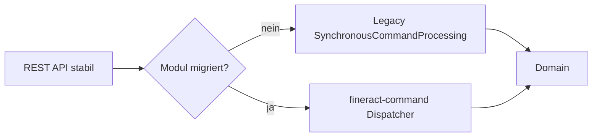

# ADR-004 – Keep & modernize CQRS and the command pipeline

| | |
|--|--|
| **Status** | accepted |
| **Qualities** | Correctness, Maintainability, Performance, Compatibility |

### Context

Writes run via CQRS (`SynchronousCommandProcessingService`). Historically: JSON strings, magic keys, high test and refactoring cost (`fineract-command/README.md`). At the same time, audit, maker-checker, and idempotency are valuable and remain required.

### Decision

1. **Keep CQRS** (reads vs. writes).  
2. Leave the **legacy pipeline running in parallel**, untouched.  
3. Introduce the new stack **`fineract-command`**:  
   - type-safe `Command<REQ>`  
   - Jakarta Validation  
   - pluggable `CommandDispatcher` (sync mandatory; async/Disruptor optional)  
   - hooks for cross-cutting concerns  
4. Migration **module by module**, REST contract **100% backward compatible**.  
5. Storage-layer cleanup is a **non-goal** of this decision.

### Alternatives

| Option | Assessment |
|--------|------------|
| Big-bang replacement of the legacy pipeline | Too risky for a banking core |
| Event-sourced rewrite | Functionally/operationally a different system type |
| Apache Camel as the only bus from day one | Optional later; not a blocker for typing |
| Drop CQRS for classical service calls | Loss of centralized audit/idempotency |

### Consequences

- **+** Type safety, better DX, measurable pipeline  
- **+** Rollback to sync dispatcher possible  
- **−** Two command worlds during migration  
- **−** Discipline needed not to further inflate legacy  

### Related

- Runtime [4.3](../04_runtime_view.md), Crosscutting [6.4](../06_crosscutting_concepts.md), FINERACT-2169 and others.

---

*Back to overview:* [08 Design Decisions](../08_design_decisions.md)
