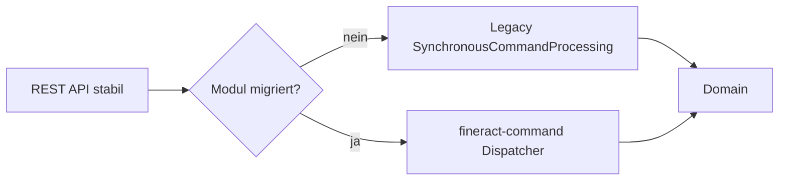

# ADR-004 – CQRS und Command-Pipeline beibehalten & modernisieren

| | |
|--|--|
| **Status** | accepted |
| **Qualitäten** | Korrektheit, Maintainability, Performance, Compatibility |

### Kontext

Writes laufen über CQRS (`SynchronousCommandProcessingService`). Historisch: JSON-Strings, Magic Keys, schwere Test- und Refactoring-Kosten (`fineract-command/README.md`). Gleichzeitig sind Audit, Maker-Checker und Idempotenz wertvoll und bleiben nötig.

### Entscheidung

1. **CQRS beibehalten** (Reads vs. Writes).  
2. **Legacy-Pipeline unangetastet parallel** weiterlaufen lassen.  
3. Neuen Stack **`fineract-command`** einführen:  
   - typsichere `Command<REQ>`  
   - Jakarta Validation  
   - austauschbare `CommandDispatcher` (sync Pflicht; async/Disruptor optional)  
   - Hooks für Cross-Cutting  
4. Migration **modulweise**, REST-Vertrag **100 % abwärtskompatibel**.  
5. Storage-Layer-Cleanup ist **Non-Goal** dieser Entscheidung.

### Alternativen

| Option | Bewertung |
|--------|-----------|
| Big-Bang Ersatz der Legacy-Pipeline | Zu riskant für Banking-Core |
| Event-Sourced Rewrite | Fachlich/operativ anderer Systemtyp |
| Direkt Apache Camel als einziger Bus | Optional später; nicht als Blocker für Typisierung |
| CQRS aufgeben, klassische Service-Calls | Verlust Audit/Idempotency-Zentralisierung |

### Konsequenzen

- **+** Typsicherheit, bessere DX, messbare Pipeline  
- **+** Rollback auf sync Dispatcher möglich  
- **−** Zwei Command-Welten während der Migration  
- **−** Disziplin nötig, Legacy nicht weiter aufzublähen  

### Bezug

- Runtime [4.3](../04_runtime_view.md), Crosscutting [6.4](../06_crosscutting_concepts.md), FINERACT-2169 u. a.

---

*Zurück zur Übersicht:* [08 Design Decisions](../08_design_decisions.md)
