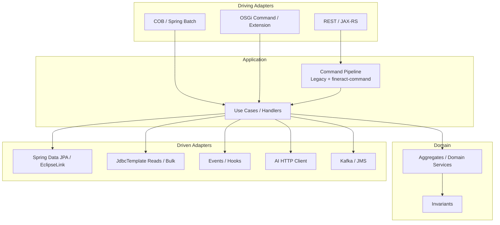

# ADR-017 – Hexagonal Architecture (Ports & Adapters)

| | |
|--|--|
| **Status** | accepted |
| **Qualities** | Maintainability, Extensibility, Testability, Compatibility |

### Context

fineract-osgi is a **modular monolith** (Spring Boot + Gradle modules, optional OSGi bundles) with **CQRS** (command pipeline, ReadPlatformServices) and clear integration edges (REST, JDBC/JPA, events, AI, messaging).

Historically a **layered/module structure** dominates (Resource → Command → WritePlatformService → Repository/JDBC), not a pure hexagon with explicit port interfaces in every package. At the same time, requirements grow for:

- swappable **driven** technology (EclipseLink/JPA vs. JDBC, Kafka vs. Spring Events, external AI),
- **driving** entry points (REST, batch/COB, future OSGi commands),
- testable domain without Tomcat/DB,
- OSGi feature bundles without core fork ([ADR-002](ADR-002-osgi-equinox-fuer-laufzeitmodularitaet.md)).

Without a shared vocabulary, ad-hoc layers and “everything may import everything” risk proliferating.

### Decision

**Hexagonal architecture (ports & adapters) as the guiding model and evolution direction** for fineract-osgi – **pragmatically mapped onto the existing stack**, no big-bang rewrite into a package structure named `hexagon/`.

#### Core principles

1. **Domain at the centre** – invariants, aggregates, domain services; no JAX-RS, servlet, or broker APIs in the domain.  
2. **Application / use-case ring** – orchestration of a use case (command handler, application services); knows ports, not concrete adapters.  
3. **Driving adapters (inbound)** – trigger use cases: REST resources, COB/job steps, OSGi commands, (future) message consumers.  
4. **Driven adapters (outbound)** – implement technology: JPA/JDBC, hooks, Kafka/JMS, file storage, AI HTTP client.  
5. **Ports** – domain-named interfaces (Java interfaces or stable module APIs); adapters are swappable.

#### Mapping onto fineract-osgi (as-is → hexagon)

| Hexagon | fineract-osgi (today / target) |
|---------|--------------------------------|
| **Driving: REST** | `*ApiResource`, Spring MVC/JAX-RS in `fineract-provider` and domain modules |
| **Driving: Batch** | Spring Batch COB manager/worker, job tasklets |
| **Application** | `NewCommandSourceHandler` / `CommandHandler`, WritePlatformServices, prefill/validation |
| **Domain** | Entities, domain services, business rules in `fineract-loan`, `fineract-savings`, … |
| **Driven: persistence write** | Spring Data JPA + EclipseLink ([ADR-016](ADR-016-jpa-ausbau-read-write-persistenz.md)) |
| **Driven: persistence read** | JdbcTemplate ReadPlatformServices; future projection at ports |
| **Driven: integration** | Hooks, external events, Kafka/JMS, document store |
| **Driven: AI** | OSGi/module adapters on xAI Grok ([ADR-005](ADR-005-externe-ki-xai-grok-statt-embedded-ml.md)/[006](ADR-006-ki-default-asynchron-fail-open.md)) |
| **Port examples** | Repository interfaces, `CommandDispatcher`, `BusinessEventNotifier`, `FineractGsonTypeAdapterRegistrar`, `EntityManagerFactoryCustomizer`, content-store APIs |

CQRS ([ADR-004](ADR-004-cqrs-und-command-pipeline-beibehalten-modernisieren.md)) **sits in the application ring**: commands = write use cases; queries = read use cases with their own driven adapters (often JDBC).

#### Rules for new / migrated code paths

| Rule | Meaning |
|------|---------|
| **Dependency rule** | Domain does not depend on REST, Jersey, Kafka, or EclipseLink API |
| **Thin adapters** | Resources map HTTP ↔ command/DTO; no business logic in resources |
| **Ports at module boundaries** | Public interfaces in stable packages; impl in adapter/infra packages |
| **OSGi = pluggable adapters** | Feature bundles supply driven or optional driving adapters via the service registry |
| **Tests** | Domain/application with fake ports; adapters with IT (DB, broker) |
| **No pseudo-ports** | Interfaces only where real swappability/test seam is needed |

#### Evolution stages (no big-bang)

| Stage | Content |
|-------|---------|
| **E1 – Vocabulary & docs** | This ADR; mapping in building block / crosscutting |
| **E2 – New features** | New modules/commands hexagon-conformant (resource → handler → domain → port) |
| **E3 – Targeted extraction** | Ports for persistence/events/AI at hotspots; decouple legacy stepwise |
| **E4 – OSGi** | Bundles as adapter deployables behind the same ports |

### Alternatives

| Option | Assessment |
|--------|------------|
| Keep pure layered model (no hexagon vocabulary) | Insufficient for OSGi/AI/test seams |
| Strict clean architecture (use-case-per-class, full package move) | Too expensive; parallel to command migration |
| Microservices per domain | Rejected/deferred ([08](../08_design_decisions.md) major options); hexagon scales in the monolith |
| Force a framework “hexagon” library | Overhead; Fineract patterns suffice |

### Consequences

- **+** Shared language for reviews, OSGi, and AI edges  
- **+** Fits CQRS, command modernization, and persistence hybrid (ADR-016)  
- **+** Testability: domain without HTTP/DB adapters  
- **−** Existing code is not hexagon-pure everywhere; migration incremental  
- **−** Risk of “interface theatre” – ports only with clear benefit  
- **−** Teams must enforce dependency direction in reviews  

### Non-Goals

- Immediate rename of all packages to `domain` / `application` / `adapter`  
- Replacing the legacy command pipeline in one step  
- Mandate for hexagon frameworks or DI containers beyond Spring/OSGi  

### Related

- [ADR-002](ADR-002-osgi-equinox-fuer-laufzeitmodularitaet.md) OSGi  
- [ADR-003](ADR-003-spring-boot-gradle-module-als-kern-beibehalten.md) Spring Boot core  
- [ADR-004](ADR-004-cqrs-und-command-pipeline-beibehalten-modernisieren.md) CQRS  
- [ADR-005](ADR-005-externe-ki-xai-grok-statt-embedded-ml.md) / [ADR-006](ADR-006-ki-default-asynchron-fail-open.md) AI as driven adapter  
- [ADR-016](ADR-016-jpa-ausbau-read-write-persistenz.md) Persistence ports (JPA vs. JDBC)  
- Building blocks [03](../03_building_block_view.md) · Runtime [04](../04_runtime_view.md) · Crosscutting [06](../06_crosscutting_concepts.md)

---

*Back to overview:* [08 Design Decisions](../08_design_decisions.md)
