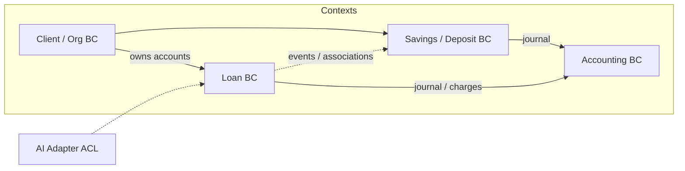

# ADR-019 – Domain-Driven Design (DDD)

| | |
|--|--|
| **Status** | accepted |
| **Qualities** | Maintainability, Correctness, Extensibility, Compatibility |

### Context

fineract-osgi models **core banking**: loans, savings/deposits, accounting, clients, COB, multi-tenancy. Domain language and module boundaries (Gradle: `fineract-loan`, `fineract-savings`, `fineract-accounting`, …) already roughly match **bounded contexts**, without DDD having been documented explicitly as a guiding model until now.

At the same time the following apply:

- **CQRS** and command pipelines ([ADR-004](ADR-004-cqrs-und-command-pipeline-beibehalten-modernisieren.md)),
- **hexagonal** guiding model ([ADR-017](ADR-017-hexagonale-architektur.md)),
- **JPA writes / JDBC reads** ([ADR-016](ADR-016-jpa-ausbau-read-write-persistenz.md)),
- **Clean Code** ([ADR-018](ADR-018-clean-code.md)).

Without DDD vocabulary, aggregate boundaries, ubiquitous language, and context maps remain implicit – reviews and migrations become inconsistent.

### Decision

**Domain-Driven Design** (tactical + strategic, pragmatic) is the guiding model for **domain modelling** in fineract-osgi. It complements hexagon (dependency structure) and CQRS (write/read paths) – **not** a big-bang event sourcing and no forced “pure” DDD package layout.

#### Strategic DDD

| Concept | fineract-osgi |
|---------|----------------|
| **Bounded context** | Gradle/domain modules and clear API surfaces: Loan, Savings/Deposit, Accounting, Client/Organisation, COB, Security/Tenant, Command |
| **Ubiquitous language** | Domain terms in code, commands, Gherkin, arc42 (Loan Application, Disbursement, Journal Entry, Maturity, Tenant, …) |
| **Context map** | Canonically documented in [10 Domain Context Map](../10_domain_context_map.md); integration via commands, domain/business events, hooks, GL mappings, account associations – not free entity sharing across module boundaries |
| **Anti-corruption layer** | Adapters to external AI, payment/interop, import/bulk, legacy JSON (`JsonCommand`) → type-safe commands/DTOs |
| **Shared kernel (narrow)** | `fineract-core` infrastructure + few truly shared concepts (Money/Currency, Office, Permissions) – keep deliberately small |

Full context map, subdomain classification, and migration order: **[Chapter 10 – Domain Context Map](../10_domain_context_map.md)** (D1).

#### Tactical DDD

| Building block | Meaning in fineract-osgi | Examples |
|----------------|--------------------------|----------|
| **Entity** | Identity over lifecycle | `Loan`, `SavingsAccount`, `Client`, `GLAccount` |
| **Value object** | Equality by values; often immutable | Money/Currency, enums with converter, date periods |
| **Aggregate** | Consistency boundary; write via root | Loan (+ transactions/charges in the use case), SavingsAccount, Client |
| **Repository** | Persistence port of the aggregate | Spring Data `*Repository` / wrapper ([ADR-016](ADR-016-jpa-ausbau-read-write-persistenz.md)) |
| **Domain service** | Domain logic across multiple entities without a natural root home | Interest calculation, accounting processor, transfer domain |
| **Application service** | Use-case orchestration, TX boundary | Command handler, WritePlatformService |
| **Domain / business event** | Fact after successful change | Loan created, account activated; hooks / external events |
| **Factory** | Complex creation of aggregates | Application submit, product instantiation |

#### Mapping hexagon ↔ DDD

| Hexagon | DDD |
|---------|-----|
| Domain ring | Entities, VOs, aggregates, domain services, domain events |
| Application ring | Application services, command handlers, use cases |
| Ports | Repository interfaces, event publisher, external policy ports |
| Driving adapters | REST, COB/batch, OSGi entry points |
| Driven adapters | JPA, JDBC reads, Kafka/JMS, AI HTTP, document store |

#### Rules for new / touched code

1. **Respect aggregate boundary** – writes change one aggregate per transaction where possible; cross-cuts via domain services + clear order (e.g. loan then accounting).  
2. **Align language** – class names, commands, Gherkin, and API docs share the same domain language.  
3. **No anemic mandate** – behaviour on aggregates/domain services, not only setter entities + god service (evolution, Boy Scout).  
4. **Context boundaries** – no wild importing of loan entities into foreign modules; integration via IDs, events, application APIs.  
5. **Read models** – queries must not inflate the write aggregate (CQRS); ReadPlatform / projections are separate models.  
6. **Legacy** – `JsonCommand` and anemic spots: improve when touched, do not big-bang remodel.

#### Evolution stages

| Stage | Content |
|-------|---------|
| **D1** | Vocabulary + this ADR; context map in docs → **[10 Domain Context Map](../10_domain_context_map.md)** |
| **D2** | New features with clear aggregate/command/event |
| **D3** | Sharpen aggregate boundaries and domain services at hotspots (Loan, Savings, Accounting) – canvas: [11](../11_aggregate_canvas.md) |
| **D4** | Standardize ACL for interop/AI/import; continuously refine context map |

### Alternatives

| Option | Assessment |
|--------|------------|
| Technical layers only without DDD | Domain boundaries remain implicit |
| Microservices per bounded context immediately | Too expensive; hexagon/modules suffice first |
| Strict DDD framework (e.g. forced base classes) | Overhead; Fineract patterns suffice |

### Consequences

- **+** Shared domain and modelling language for teams and agents  
- **+** Fits CQRS, hexagon, Clean Code; write model eventually event-sourced ([ADR-020](ADR-020-event-sourcing-writes-pflicht.md))  
- **+** Better review questions: “Which aggregate? Which context? Which events?”  
- **−** Existing often anemic / service-heavy – migration incremental  
- **−** Risk of over-modelled aggregates – keep pragmatism and performance (COB) in mind  

### Non-Goals

- Renaming all packages to `domain`/`application` in one step  
- One aggregate for “the whole portfolio”  
- Replacing accounting double-entry with domain events **without** journal projection (journal remains, see [ADR-020](ADR-020-event-sourcing-writes-pflicht.md))  

### Related

- [ADR-004](ADR-004-cqrs-und-command-pipeline-beibehalten-modernisieren.md) CQRS  
- [ADR-016](ADR-016-jpa-ausbau-read-write-persistenz.md) Persistence  
- [ADR-017](ADR-017-hexagonale-architektur.md) Hexagon  
- [ADR-018](ADR-018-clean-code.md) Clean Code / ubiquitous language  
- [ADR-020](ADR-020-event-sourcing-writes-pflicht.md) Event sourcing for writes (mandatory)  
- Building blocks [03](../03_building_block_view.md) · Domain context map [10](../10_domain_context_map.md) · Aggregate canvas [11](../11_aggregate_canvas.md) · Event catalog [12](../12_event_catalog.md) · Runtime [04](../04_runtime_view.md) · Crosscutting [06](../06_crosscutting_concepts.md)

---

*Back to overview:* [08 Design Decisions](../08_design_decisions.md)
