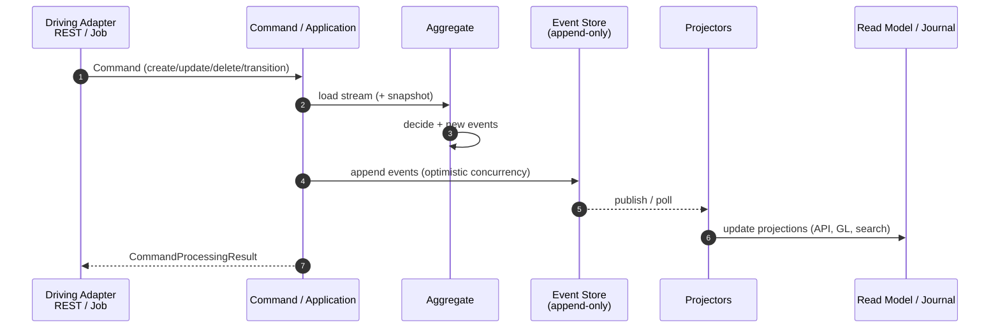

# ADR-020 – Event Sourcing for Write / Update / Delete as Mandatory

| | |
|--|--|
| **Status** | accepted |
| **Qualities** | Correctness, Reliability, Maintainability, Extensibility, Compatibility |
| **Supersedes (partially)** | Rejection of “event sourcing as ledger” in older decision notes; non-goal in [ADR-019](ADR-019-domain-driven-design.md) regarding mandatory event sourcing |

### Context

Write operations (create / update / delete or domain state transitions) today run through:

- command pipeline ([ADR-004](ADR-004-cqrs-und-command-pipeline-beibehalten-modernisieren.md)),
- **state storage** in relational tables via Spring Data JPA / EclipseLink ([ADR-016](ADR-016-jpa-ausbau-read-write-persistenz.md)),
- optional **business/external events** after commit (side effect, not source of truth).

This hinders:

- complete **audit history** of aggregate state (only command audit + current row),
- **temporal reconstruction** and debugging (“why was the balance like that?”),
- uniform integration (downstream often only “current state”),
- clear separation of write model vs. read model in the CQRS sense.

fineract-osgi already has CQRS traits (commands vs. ReadPlatform), DDD aggregates ([ADR-019](ADR-019-domain-driven-design.md)), and hexagon ports ([ADR-017](ADR-017-hexagonale-architektur.md)). Event sourcing makes the **write path** event-centric.

### Decision

**Event sourcing is mandatory** for all **write, update, and delete operations** (including domain lifecycle transitions) on **domain aggregates** in the target picture of fineract-osgi.

#### What “mandatory” means

| Applies to | Meaning |
|------------|---------|
| **Create / update / delete / transition** | Every state-changing domain operation appends **domain events** to an **append-only event store** (per aggregate stream). |
| **Source of truth (write)** | The **event stream** is the authoritative history of the aggregate; current state is derived from it (in-memory fold or materialized snapshot projection). |
| **Commands** | Commands validate and decide; result is events, not “only” a `repo.save(entity)`. |
| **Deletes** | Soft/hard domain deletes as events (`…Deleted`, `…Closed`, `…Cancelled`) – no silent physical delete as sole truth. |

#### What the event store is **not**

| Topic | Rule |
|-------|------|
| **Double-entry / journal** | Remains **relational and bookkeeping-correct** (ledger). Journal entries are **projections / side models**, derived from domain events (or explicit accounting events) – not replaced by “event = booking”. |
| **Read/query APIs** | Continue as **read models** (JDBC, projections, tables) – CQRS. No mandatory replay per GET. |
| **Technical tables** | Idempotency keys, jobs, sessions, config: not necessarily event-sourced. |
| **Import/bulk staging** | Staging may be tabular; commit into the domain is event-sourced. |

#### Target architecture (write)

#### Technical guardrails

1. **Stream per aggregate** (e.g. `Loan-{id}`, `SavingsAccount-{id}`) with version/sequence optimistic concurrency.  
2. **Idempotent commands** remain mandatory (client key + event dedup).  
3. **Snapshots** allowed/recommended for long streams (performance), derived from events.  
4. **Projectors** update read models and accounting asynchronously or in the same TX only where strictly needed (document consistency vs. latency trade-off per context).  
5. **Tenant isolation**: event store tenant-capable (schema/DB per tenant or mandatory tenant attribute + RLS equivalent).  
6. **Schema evolution** of events (upcasters / versioning) from day 1.  
7. **Hexagon**: event store and projectors = **driven adapters**; aggregate decision logic = domain.

#### Migration strategy (strangler)

| Phase | Content |
|-------|---------|
| **ES0 – Mandate & standards** | This ADR; event metamodel, store API port, concurrency, tenant |
| **ES1 – Greenfield** | New aggregates / new bounded contexts **only** event-sourced |
| **ES2 – Pilot** | One existing aggregate end-to-end (e.g. a slim subdomain aggregate or interop identifier) |
| **ES3 – Portfolio core** | Loan / Savings stepwise: dual-write or catch-up replay, then cutover stream = SoT |
| **ES4 – Completion** | Remaining domain writes; state tables only as projection |

Until cutover of an aggregate: legacy JPA write is **tolerated**, but **no** new state-changing feature on pure state-only write without an event plan.

#### Relation to earlier ADRs

| ADR | Adjustment |
|-----|------------|
| [ADR-004](ADR-004-cqrs-und-command-pipeline-beibehalten-modernisieren.md) | Commands produce events; result still at API |
| [ADR-016](ADR-016-jpa-ausbau-read-write-persistenz.md) | JPA/JDBC primarily for **read models / snapshots / journal**, no longer sole write SoT |
| [ADR-019](ADR-019-domain-driven-design.md) | Aggregates decide events; non-goal “ES mandate” is **lifted** |
| [ADR-017](ADR-017-hexagonale-architektur.md) | Event store = driven port/adapter |

### Alternatives

| Option | Why not |
|--------|---------|
| Audit log only in addition to state | No true reconstruction, inconsistent |
| Event sourcing only optional | Never becomes standard; fragmented models |
| Event = sole ledger (no journal) | Violates double-entry / supervisory practice |
| Immediate big-bang of all aggregates | Operational and correctness risk unacceptable |

### Consequences

- **+** Full write history, better auditability and debugging  
- **+** Natural integration (projectors, external events from domain events)  
- **+** Fits CQRS, DDD aggregates, hexagon  
- **−** High migration and training effort  
- **−** Complexity: upcasting, replay, projector lag, snapshot strategy  
- **−** COB/performance must be designed event- and projection-aware  
- **−** Until ES3/ES4 two write paradigms coexist (strangler discipline needed)  

### Non-Goals

- Event sourcing for pure **query** paths  
- Replacing the **accounting journal** by the event store alone  
- Immediate shutdown of JPA  
- Blockchain / immutable distributed ledger as store  

### Related

- [ADR-004](ADR-004-cqrs-und-command-pipeline-beibehalten-modernisieren.md) · [ADR-016](ADR-016-jpa-ausbau-read-write-persistenz.md) · [ADR-017](ADR-017-hexagonale-architektur.md) · [ADR-019](ADR-019-domain-driven-design.md)  
- Event inventory as-is→ES: [12 Event Catalog](../12_event_catalog.md)  
- Runtime commands [04.3](../04_runtime_view.md) · Crosscutting events [06.6](../06_crosscutting_concepts.md) · Quality correctness [07](../07_quality_attributes.md)

---

*Back to overview:* [08 Design Decisions](../08_design_decisions.md)
