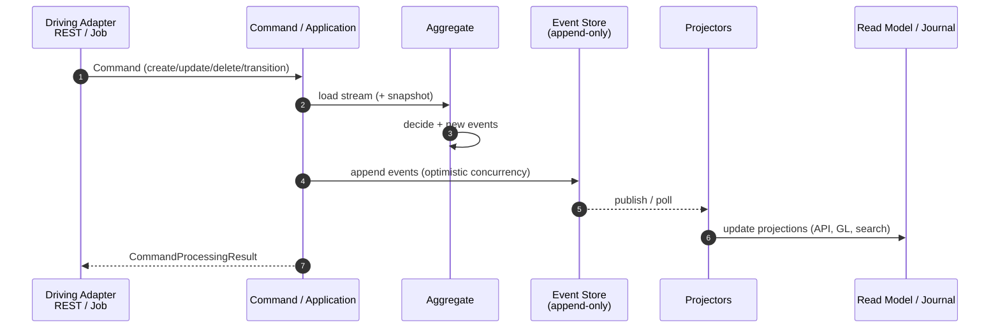

# ADR-020 – Event Sourcing für Write / Update / Delete als Pflicht

| | |
|--|--|
| **Status** | accepted |
| **Qualitäten** | Correctness, Reliability, Maintainability, Extensibility, Compatibility |
| **Supersedes (teilweise)** | Ablehnung „Event Sourcing als Ledger“ in älteren Entscheidungsnotizen; Non-Goal in [ADR-019](ADR-019-domain-driven-design.md) bzgl. Event-Sourcing-Pflicht |

### Kontext

Schreibende Operationen (Create / Update / Delete bzw. fachliche State-Transitions) laufen heute über:

- Command-Pipeline ([ADR-004](ADR-004-cqrs-und-command-pipeline-beibehalten-modernisieren.md)),
- **Zustandsspeicherung** in relationalen Tabellen via Spring Data JPA / EclipseLink ([ADR-016](ADR-016-jpa-ausbau-read-write-persistenz.md)),
- optionale **Business/External Events** nach dem Commit (Nebenwirkung, nicht Source of Truth).

Das erschwert:

- vollständige **Audit-Historie** des Aggregat-Zustands (nur Command-Audit + aktuelle Zeile),
- **zeitliche Rekonstruktion** und Debugging („warum war der Saldo so?“),
- einheitliche Integration (Downstream oft nur „aktueller Stand“),
- klare Trennung Write-Model vs. Read-Model im Sinne von CQRS.

fineract-osgi hat bereits CQRS-Anklänge (Commands vs. ReadPlatform), DDD-Aggregates ([ADR-019](ADR-019-domain-driven-design.md)) und Hexagon-Ports ([ADR-017](ADR-017-hexagonale-architektur.md)). Event Sourcing macht den **Write-Pfad** event-zentrisch.

### Entscheidung

**Event Sourcing ist Pflicht** für alle **Write-, Update- und Delete-Operationen** (inkl. fachlicher Lifecycle-Transitions) an **Domain-Aggregates** im Zielbild von fineract-osgi.

#### Was „Pflicht“ bedeutet

| Gilt für | Bedeutung |
|----------|-----------|
| **Create / Update / Delete / Transition** | Jede zustandsändernde Domain-Operation appendet **Domain Events** in einen **append-only Event Store** (pro Aggregat-Stream). |
| **Source of Truth (Write)** | Der **Event-Stream** ist die autoritative Historie des Aggregates; der aktuelle Zustand wird daraus abgeleitet (Memory-Fold oder materialisierte Snapshot-Projektion). |
| **Commands** | Commands validieren und entscheiden; Ergebnis sind Events, nicht „nur“ ein `repo.save(entity)`. |
| **Deletes** | Soft/Hard fachlich als Events (`…Deleted`, `…Closed`, `…Cancelled`) – kein stilles physisches Löschen als alleinige Wahrheit. |

#### Was **nicht** der Event Store ist

| Thema | Regelung |
|-------|----------|
| **Double-Entry / Journal** | Bleibt **relational und buchhalterisch korrekt** (Ledger). Journal Entries sind **Projektionen / Nebenmodelle**, abgeleitet aus Domain Events (oder expliziten Accounting-Events) – nicht ersetzt durch „Event = Buchung“. |
| **Read/Query-APIs** | Weiterhin **Read Models** (JDBC, Projections, Tabellen) – CQRS. Kein Pflicht-Replay pro GET. |
| **Technische Tabellen** | Idempotency Keys, Jobs, Sessions, Config: nicht zwingend event-sourced. |
| **Import/Bulk-Staging** | Staging darf tabellarisch sein; Commit in die Domain erfolgt event-sourced. |

#### Ziel-Architektur (Write)

#### Technische Leitplanken

1. **Stream pro Aggregat** (z. B. `Loan-{id}`, `SavingsAccount-{id}`) mit Versions-/Sequence-Optimistic-Concurrency.  
2. **Idempotente Commands** bleiben Pflicht (Client-Key + Event-Dedup).  
3. **Snapshots** erlaubt/empfohlen für lange Streams (Performance), abgeleitet aus Events.  
4. **Projectors** aktualisieren Read Models und Accounting asynchron oder in derselben TX nur wo streng nötig (Trade-off Konsistenz vs. Latenz dokumentieren pro Context).  
5. **Tenant-Isolation**: Event Store tenant-fähig (Schema/DB pro Tenant oder zwingendes Tenant-Attribut + RLS-äquivalent).  
6. **Schema-Evolution** der Events (Upcasters / Versionierung) von Tag 1.  
7. **Hexagon**: Event Store und Projectors = **Driven Adapters**; Aggregate-Entscheidungslogik = Domain.

#### Migrationsstrategie (Strangler)

| Phase | Inhalt |
|-------|--------|
| **ES0 – Pflicht & Standards** | Dieses ADR; Event-Metamodell, Store-API-Port, Concurrency, Tenant |
| **ES1 – Greenfield** | Neue Aggregates / neue Bounded Contexts **nur** event-sourced |
| **ES2 – Pilot** | Ein bestehendes Aggregat end-to-end (z. B. ein schlankes Subdomain-Aggregat oder Interop-Identifier) |
| **ES3 – Portfolio-Kern** | Loan / Savings schrittweise: Dual-Write oder Catch-up-Replay, dann Cutover Stream = SoT |
| **ES4 – Abschluss** | Restliche Domain-Writes; Zustandstabellen nur noch als Projection |

Bis Cutover eines Aggregates gilt: Legacy-JPA-Write **geduldet**, aber **kein** neues zustandsänderndes Feature auf reinem State-only-Write ohne Event-Plan.

#### Bezug zu früheren ADRs

| ADR | Anpassung |
|-----|-----------|
| [ADR-004](ADR-004-cqrs-und-command-pipeline-beibehalten-modernisieren.md) | Commands erzeugen Events; Result weiterhin an API |
| [ADR-016](ADR-016-jpa-ausbau-read-write-persistenz.md) | JPA/JDBC primär für **Read Models / Snapshots / Journal**, nicht mehr alleinige Write-SoT |
| [ADR-019](ADR-019-domain-driven-design.md) | Aggregates entscheiden Events; Non-Goal „ES-Pflicht“ ist **aufgehoben** |
| [ADR-017](ADR-017-hexagonale-architektur.md) | Event Store = Driven Port/Adapter |

### Alternativen

| Option | Warum nicht |
|--------|-------------|
| Nur Audit-Log zusätzlich zum State | Keine echte Rekonstruktion, inkonsistent |
| Event Sourcing nur optional | Wird nie Standard; fragmentierte Modelle |
| Event = einziges Ledger (kein Journal) | Verletzt Double-Entry / Aufsichtspraxis |
| Sofort Big-Bang aller Aggregates | Betriebs- und Korrektheitsrisiko inakzeptabel |

### Konsequenzen

- **+** Vollständige Write-Historie, bessere Auditierbarkeit und Debugging  
- **+** Natürliche Integration (Projectors, External Events aus Domain Events)  
- **+** Passt zu CQRS, DDD Aggregates, Hexagon  
- **−** Hoher Migrations- und Schulungsaufwand  
- **−** Komplexität: Upcasting, Replay, Projector-Lag, Snapshot-Strategie  
- **−** COB/Performance muss event- und projection-bewusst designt werden  
- **−** Bis ES3/ES4 koexistieren zwei Write-Paradigmen (Strangler-Disziplin nötig)  

### Non-Goals

- Event Sourcing für reine **Query**-Pfade  
- Ersetzen des **Accounting-Journals** durch Event Store allein  
- Sofortige Abschaltung von JPA  
- Blockchain / immutable distributed ledger als Store  

### Bezug

- [ADR-004](ADR-004-cqrs-und-command-pipeline-beibehalten-modernisieren.md) · [ADR-016](ADR-016-jpa-ausbau-read-write-persistenz.md) · [ADR-017](ADR-017-hexagonale-architektur.md) · [ADR-019](ADR-019-domain-driven-design.md)  
- Runtime Commands [04.3](../04_runtime_view.md) · Crosscutting Events [06.6](../06_crosscutting_concepts.md) · Quality Correctness [07](../07_quality_attributes.md)

---

*Zurück zur Übersicht:* [08 Design Decisions](../08_design_decisions.md)
